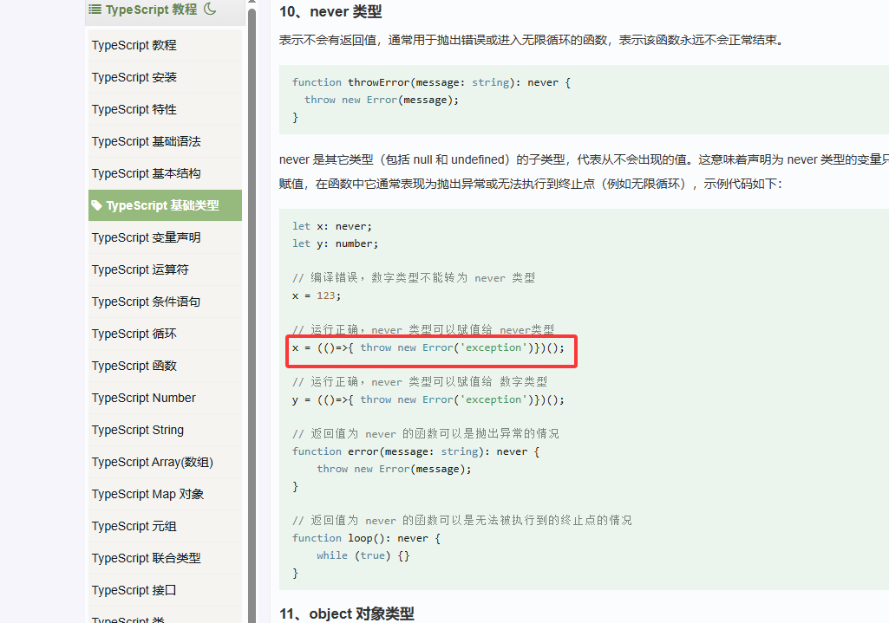
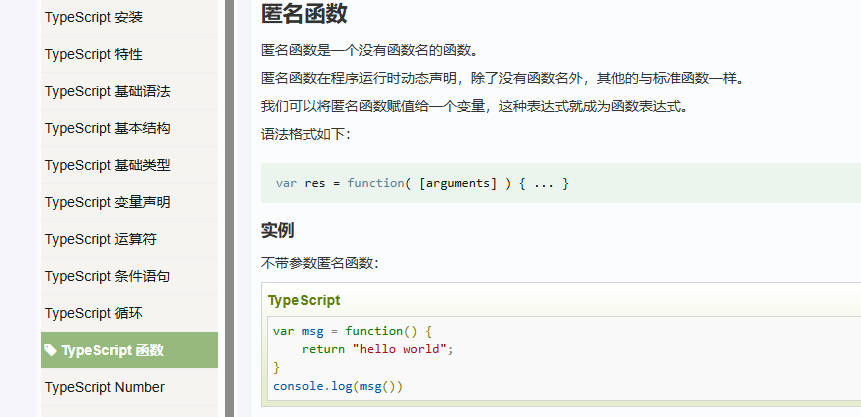
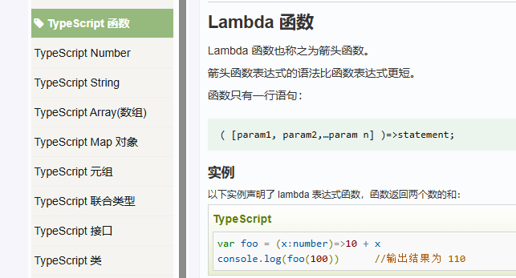
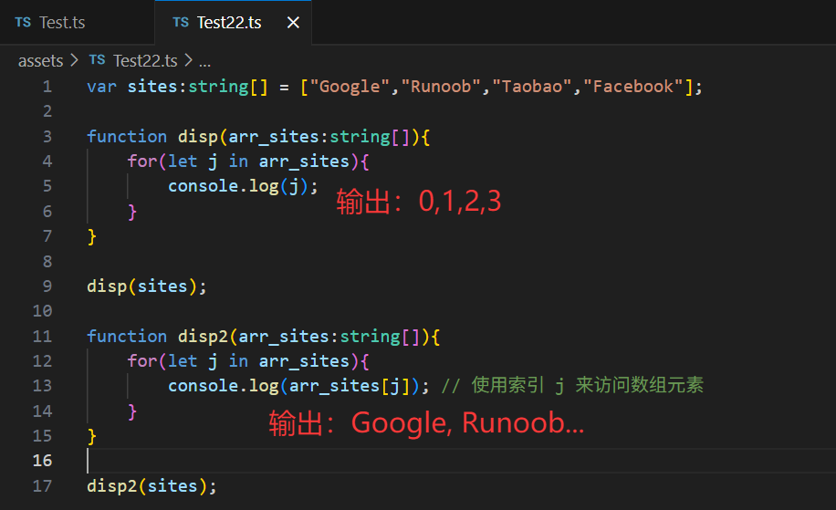
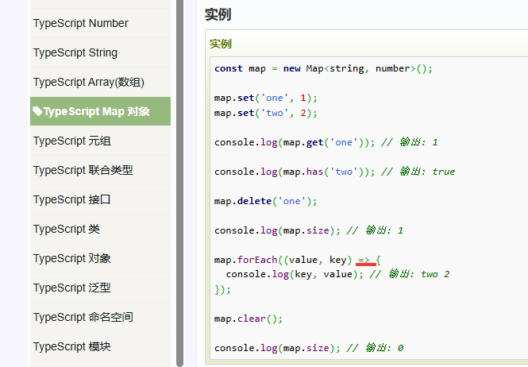
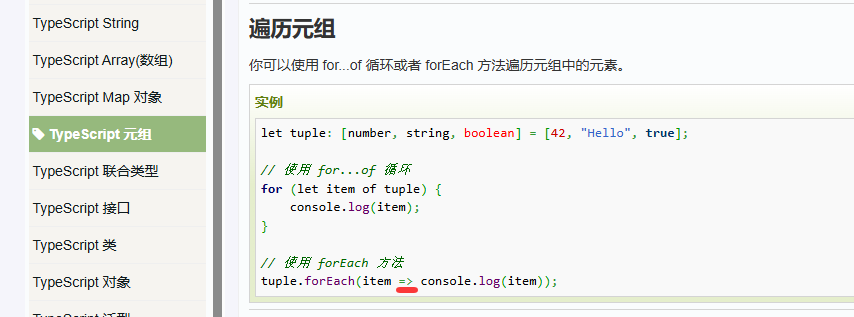
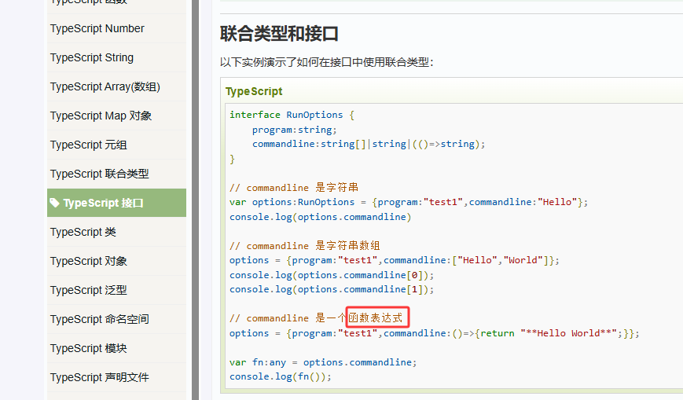
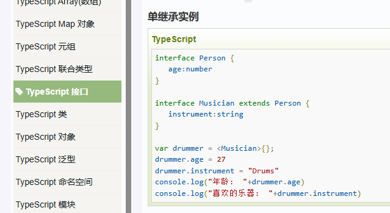
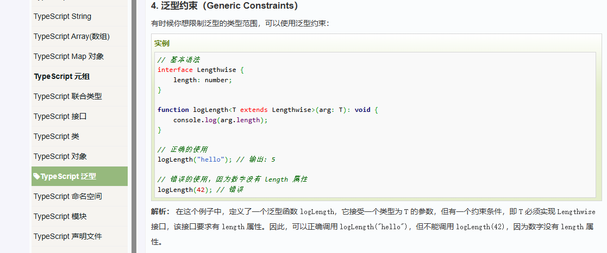

## TS_不会的_待查

1 .  
  

2 . https://zhuanlan.zhihu.com/p/471293903  
```ts
interface Named {
  name: string;
}

interface Named2 {
  name: string;
  location: string;
}
let y: Named2 = { name: 'Alice', location: 'Seattle' };

interface Named3 {
  name: string;
  location3: string;
}
let x: Named3 = y as Named as Named3;
```
子类型1 转化成 子类型2 应该怎么做？   
用父类型做中转:   
相当于：  
```ts
let x: Named3 = <Named3><Named>y;
```
那两个类型间转化，每次都要找个父类型
如果两个类型间没有明确的父类型，还要新建个父类型？这样太麻烦了  
unknow 是所有类型的父类型:
```ts
A as unknow as B
```

3 .  
  
  

4 .  
  

5 .  
  

  

  

5 .  
  

6 .  
  
