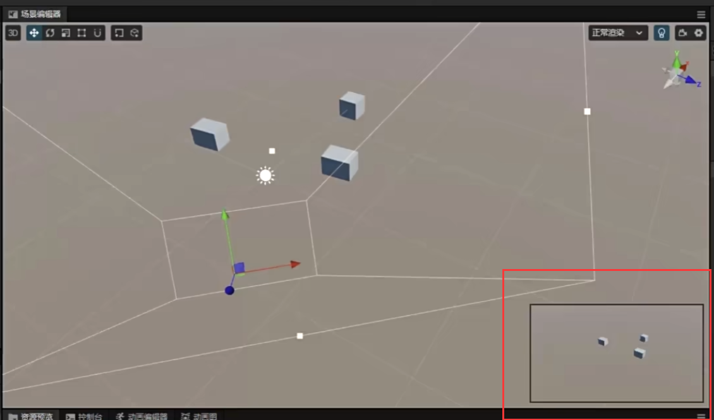

## COCOS_siki
BV18m421L7Ac
### 一 . 前提讲解 
1 .  
下载editor的默认位置修改：  
  

2 . hello world  
https://docs.cocos.com/creator/3.8/manual/zh/getting-started/helloworld/

3 .   
  
  
.meta文件用记事本打开发现是json文件的文本。cocos为每一个资源创建爱你一个meta文件，meta文件相当于是它的个人信息或者身份证，里面会存储每个资源的id，因为在cocos里面资源之间互相引用互相调用。

4 . cocos的组成：
Cocos-多个场景-Node-Component  

5 .    
（1）可以设置漫游或者滚轮的速度：  
  

（2）按住物体后alt鼠标拖动可以对准焦点旋转。  鼠标滚轮也可以更聚焦。

6 . 相机长宽比：  
  
  
  

7 . 
脚本编辑器，浏览器的配置。  
File - Preferences  ：  
  

### 二 . 打砖块  
1 . 关于Prefab预制体的使用   
prefab在hiearchy中的孩子如果哪里（某个属性）先动了，预制体即使这个属性后动，这个孩子的这个属性也不会跟着预制体动。  

2 . 刚体组件（重力），碰撞器组件（边缘碰撞检测）   
- 要下落的方块挂（刚体组件 和 碰撞器组件）
- 地面挂（碰撞器组件）

3 . scene场景图标不显示：  
  
  

4 . 怎么检测触摸事件-onTouchStart  
  

-----
  

TOUCH_START : 按下鼠标的瞬间；    
TOUCH_END: 抬起鼠标的瞬间；  
TOUCH_MOVE：每一帧只要移动就会调用  
--event.getDelta 相对于上一帧移动的像素偏移量  

5 . 脚本中的属性-property-基本类型和CC类类型  
  

6 . 为了更好地编译调试可以不选在 “浏览器中预览”选择“编辑器中预览”。  
  

点击这个可以让屏幕和窗口保持一致。  
  

7 . 
(1)情况1：   
墙-collider  
球-rigidbody, collider  
球撞墙会停住，但是墙没有任何变化  

(2)情况2：   
墙-rigidbody,collider  
球-rigidbody, collider  
球撞墙会停住，但是墙有变化  

直接给墙加上rigidbody之后，还没放进去球也会这样不固定乱飞：  
  

```
解决方法【弹幕】：  
我的墙体一生成 还没打就倒了

墙会倒把刚体组件里面的Linear Damping还有Angular Damping调到1就行了。实际上会倒的原因应该就是阻力太小了（用户手册上面看来的）
```

### 三 . ROLL A BALL  
1 . 学习键盘事件的调用  
  

键盘从按下到抬起的调用：
KEY_DOWN(一次)--->KEY_PRESSING(只要你还按着就疯狂调用)--->KEY_UP(一次)  

`event.keycode`输出键盘的对应的ascii。  

几种情况：  
（情况1）当`A`和`B`的键盘同时按下，KEY_PRESSING只会输出其中某一个按键的码。  
（情况2）当先按住`A`一段时间再按住`B`，那么KEY_PRESSING输出的码一直是`A`的，然后不再输出`A`的，转而输出`B`的。  

2 . 通过onKeyPressing事件控制小球前后移动（比较僵硬，当按下两个按键只会对一个按键进行相应。）  
  
  
update()里面可以获取deltatime帧时间，但是onKeyPressing里面获取不到所以我们手动改写速度是0.2

3 . 碰撞事件 触发事件  
碰撞事件：两方物体都要有collider，其中一个物体要有刚体。  

【碰撞事件】小球撞到食物会发生停顿，食物影响小球的运动。别的节点不可以进入它的体内。
【触发事件】食物不影响小球的运动，别的节点可以进入它的体内。(食物的isTrigger要勾选)

### 三 . 方块
【cocos官方文档有这个案例】 
https://docs.cocos.com/creator/3.8/manual/zh/getting-started/first-game-2d/    
1 .   
图片在这里修改：  
  

2 .   
  
Allign Canvas With Screen 不取消勾选的话它就会控制Camera只去渲染Canvas的范围。就算camera位置发生变化，canvas和camera的位置也保持恒定。  
  
Camera放在Player下方，Camera就会随着Player发生运动。  

3 . 方块移动的几种形式    
（形式1）直接移动  
  

（形式2）控制方块缓慢移动    
【这种代码可能移动不到40（一个格子的宽度）】
```js
import { _decorator, Component, EventMouse, Input, input, Node } from 'cc';
const { ccclass, property } = _decorator;

@ccclass('PlayerController')
export class PlayerController extends Component {

    private _startJump = false;
    private _jumpTime = 0.2;
    private _curJumpTime = 0;
    private _jumpSpeed = 0;

    start() {
        input.on(Input.EventType.MOUSE_DOWN,this.onMouseDown,this);
    }

    onMouseDown(event:EventMouse){
        if(event.getButton()==0){
            this.jumpByStep(1);
        }else if(event.getButton()==2){
            this.jumpByStep(2);
        }
        //event.getButton()==0代表鼠标左键，==1代表鼠标中键，==2代表鼠标右键
    }

    jumpByStep(step:number){
        this._startJump = true;
        this._curJumpTime = 0;
        this._jumpSpeed = step*40/this._jumpTime;  // v = S/t
    }

    protected onDestroy(): void {
        input.off(Input.EventType.MOUSE_DOWN,this.onMouseDown,this);
    }

    protected update(dt: number): void {
        //因为dt的时间不固定，所以有时不能移动40
        if(this._startJump){
            this._curJumpTime+=dt;
            if(this._curJumpTime>this._jumpTime){
                this._startJump = false;
            }else{
                const curPos = this.node.position;
                this.node.setPosition(curPos.x+this._jumpSpeed*dt, curPos.y, curPos.z);
            }
        }
    }
}
```

4 . 添加跳跃动画  
  
  
  

组件要引用cc后面的：  
  

5 . 新建动画资源  
  

6 . slice代表九宫格  
  
  

7 . widget控制锚点在左上角  
  

8 . 因为有两个canvas两个camera。  
（1）游戏层  
  
  
  

（2）UI层  
  
  

cocos的layer属性两个相机的话，编辑器内的预览和浏览器的预览还不一样。  