### cocos_官方教程_飞机射击
1 . gizmo  
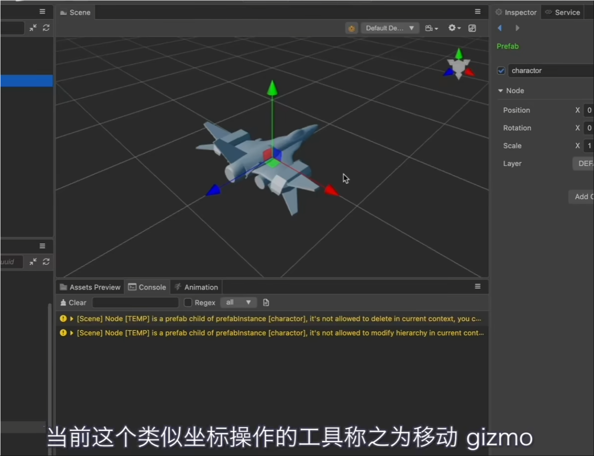  

2 .材质： builtin standard接受光照，builtin unlit不接受光照，当然这两个不止这点区别：  
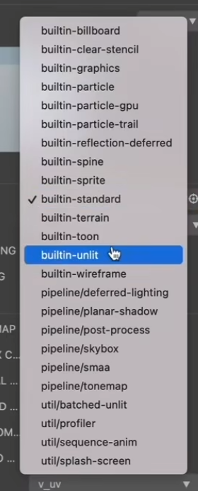  

材质关联贴图：  
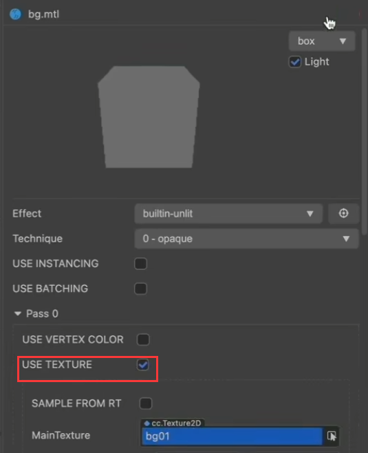  

3 . 这里可以添加自定义设备宽度：  
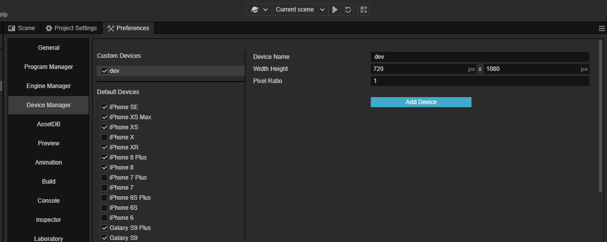    

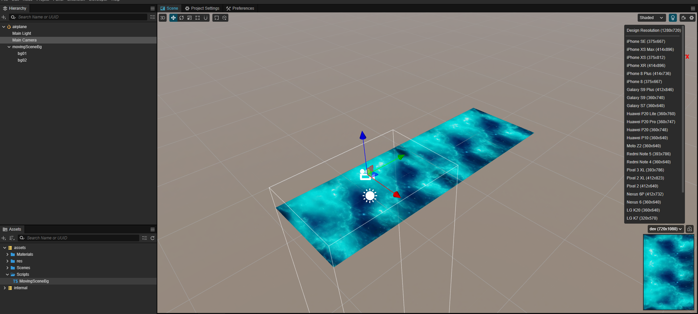  

4 . 相机的projection是ORTHO  
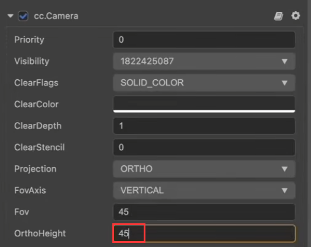  

5 .  
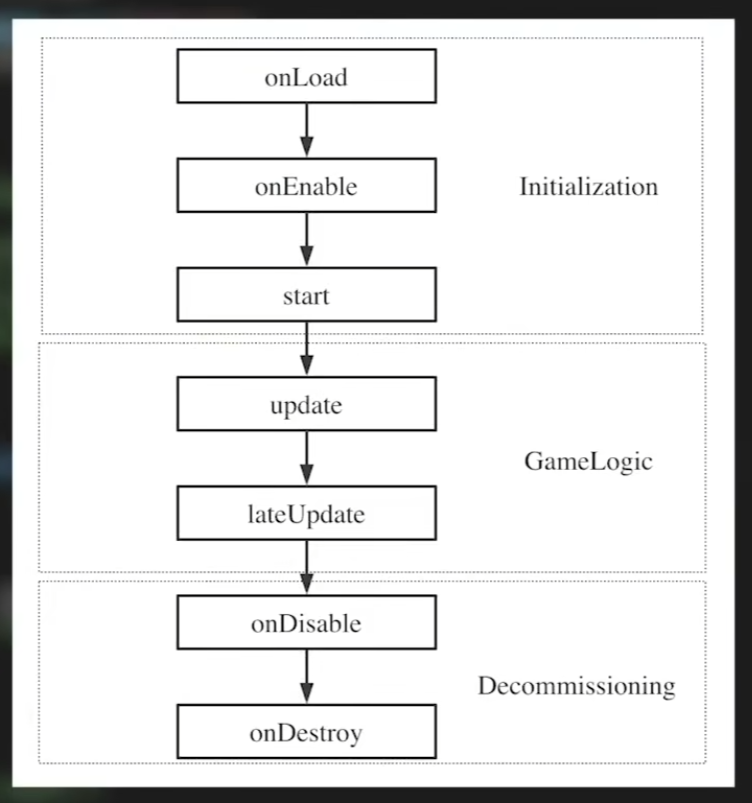  

6 .  
默认情况下组件是不会在编辑器下运行的，我要让它在编辑器下运行的话需要加：  
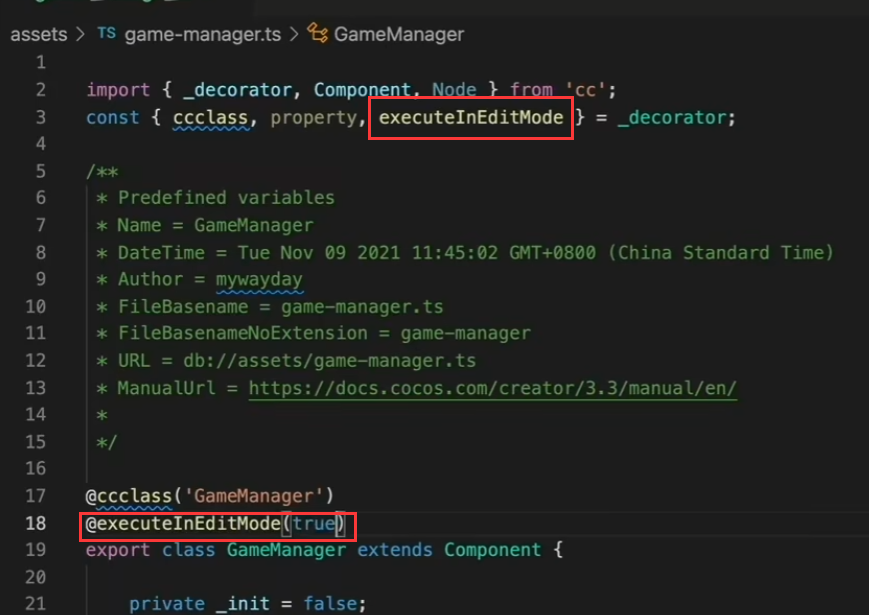  
这其实是一个装饰器的写法，装饰器大多数提供的是一个描述信息给编辑器，让编辑器提供相对应的功能。
因为脚本默认情况下是在运行时才会执行的。

按住ctrl键将鼠标移动到第二行的`_decorator`上，点击跳转到装饰器提供的API。  

7 . 敌机出现逻辑  
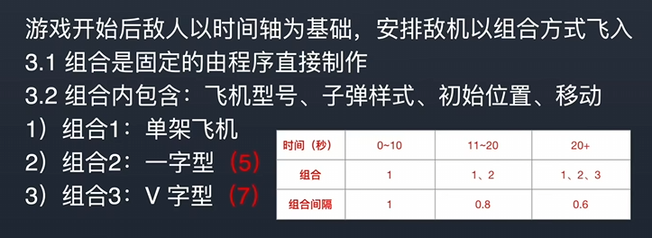  

8 . 碰撞矩阵，掩码：  
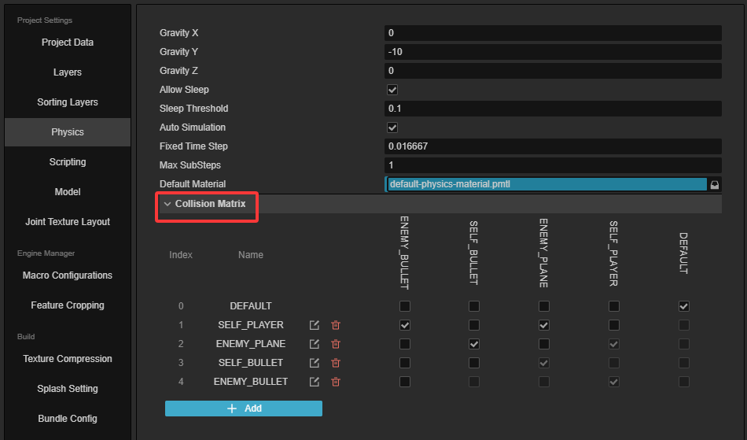  

9 . 2D根节点有两个：  
大多数情况下使用的都是Canvas节点，另一个则需要创建空节点，然后在它身上添加RenderRoot2D组件。所有的2D节点都必须在这两个节点下才可以被Creator识别为2D对象。  

10 . 下方的物体inputEvents就会被挡住。  
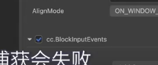  

11 . 对象池  
整个项目有用到instantiate的地方去替换。  
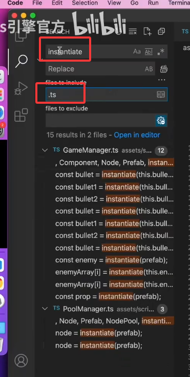  

因为PoolManager不是个组件所以没有地方去实例它。因此这边定义一个静态的方法去做实例化。