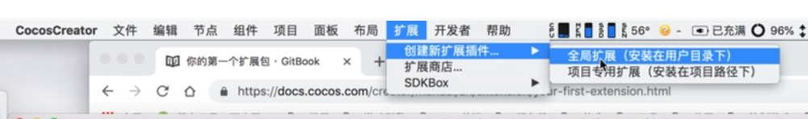
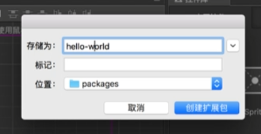
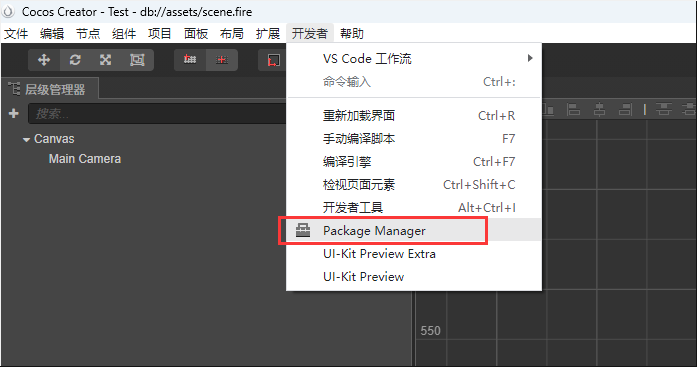
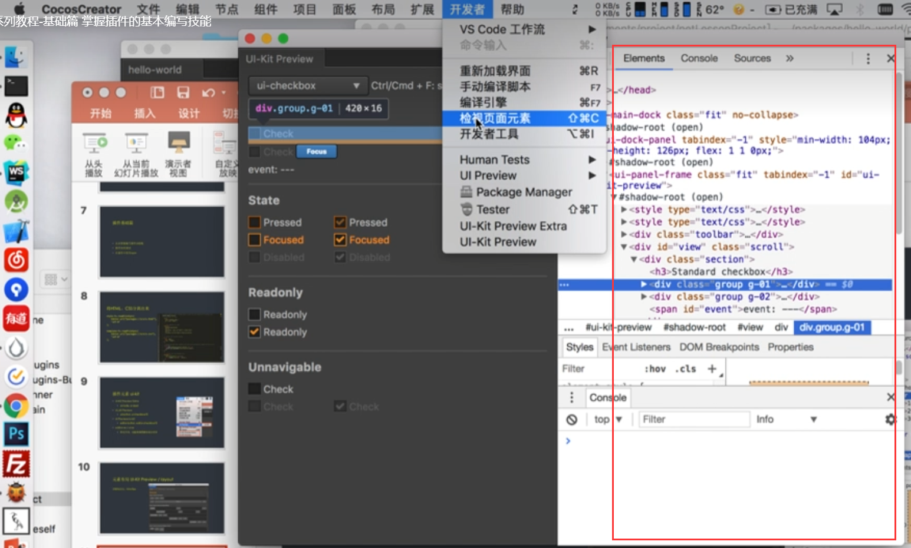
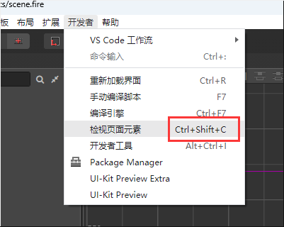
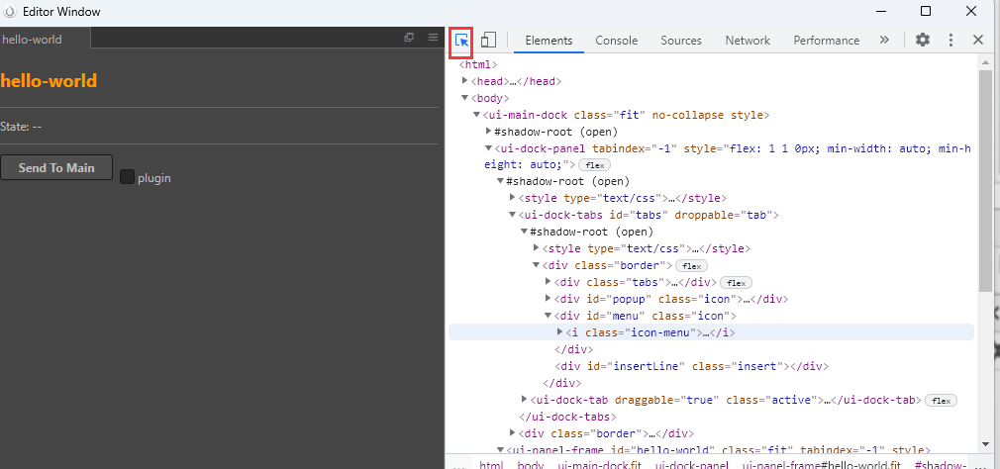

### 插件
官方文档： https://docs.cocos.com/creator/2.4/manual/zh/extension/your-first-extension.html  

1 .   
  

  
命名可以分隔符但是不能大写。

  
修改完记得  
  
刷新一下，就不用关了编辑器再打开。  

激活panel，点击检查页面元素  
  
windows端可以对准panel用快捷键：  
  

点这个再去选择元素：  
  
