### git教程笔记
#### mentor带着时的笔记
1 . 看这个文件夹里有没有ssh  
`C:\Users\DragonPlus\.ssh`

在git bash cd定位到这个文件夹  
再用这条口令生成ssh   
ssh-keygen -t rsa -C "xxxxx@mail.com"  

再在github里添加public的那个key。 

然后在cmd里：  
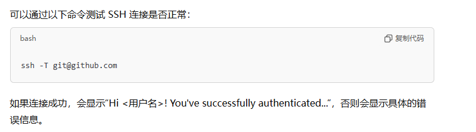  

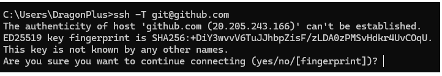  
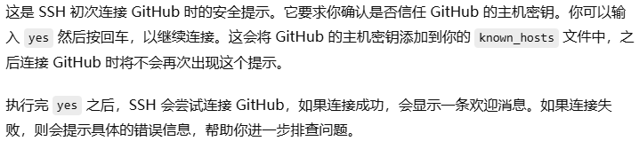  
SSH 免密登陆以及中间人攻击  
https://zhuanlan.zhihu.com/p/634497921  
那一串乱七八糟的字符串应该是github的公钥指纹。


2 . smart git的这里的设置默认和我们用的不同，要调整一下。  
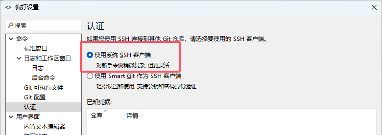  
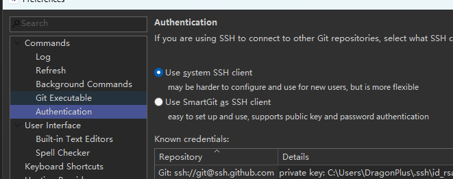  


3 . https://www.youtube.com/watch?v=Aj-sZ2JWnj4&t=75s  
Version Controlling with SmartGit and Github!  
（1）  
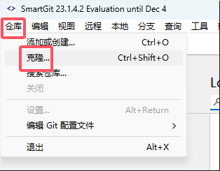  
复制的是github上SSH的那个地址。  
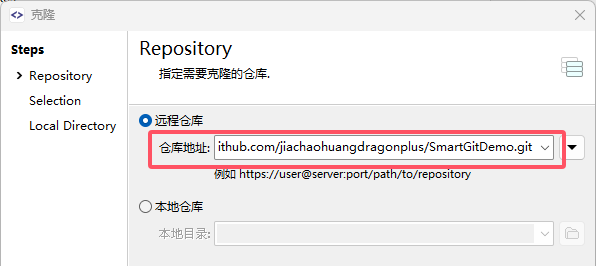  

在文件夹里添加文件：  
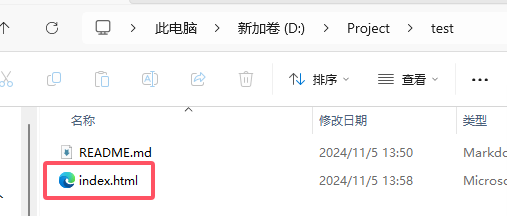  
```html
<!DOCTYPE html>
<html>
<head>
	<title>Hello World</title>
</head>
<body>

</body>
</html>
```

4 .   
先点击暂存  
再点击commit  
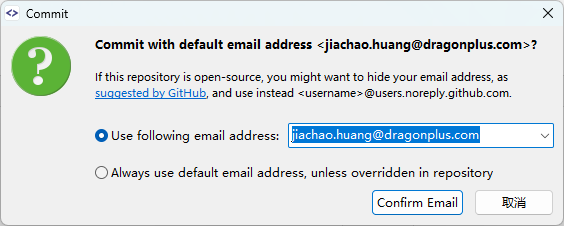  
在仓库->设置里可以修改。  
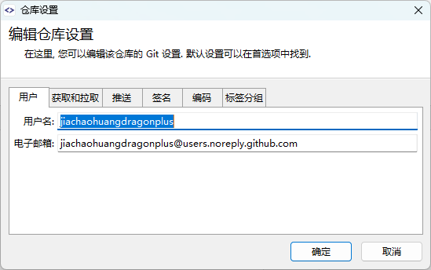  

选中  
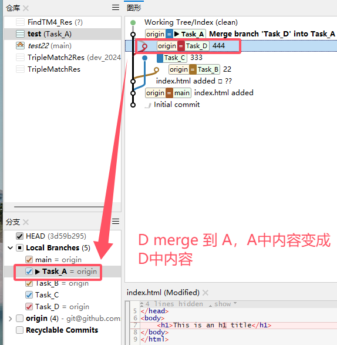  

5 . 
第一次拉取要点击这里    
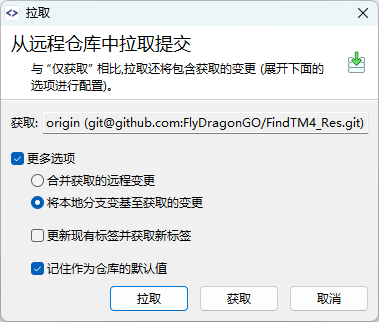 

6 . 一开始FindTM4项目默认是main分支只有一个README.md在本地仓库中，在smart git中切换到dev分支后，就有了其他文件夹。  
把这个打开可以显示这个文件夹。  
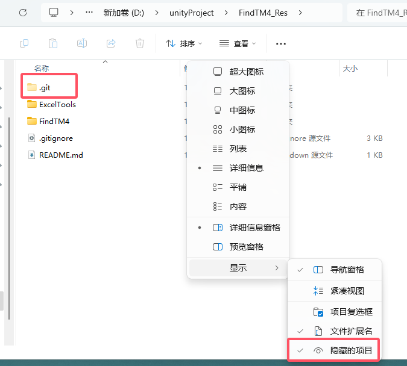  

#### Git入门图文教程(1.5W字40图)🔥🔥--深入浅出、图文并茂【的笔记】
https://www.cnblogs.com/anding/p/16987769.html  
1 .   
头（HEAD）	HEAD类似一个“指针”，指向当前活动 分支 的 最新版本。   

HEAD：指向本地分支的指针，可以想象为当前分支的别名.分区本地和远程HEAD，本地在.git/HEAD，远程在.git/refs/remotes/origin/HEAD    

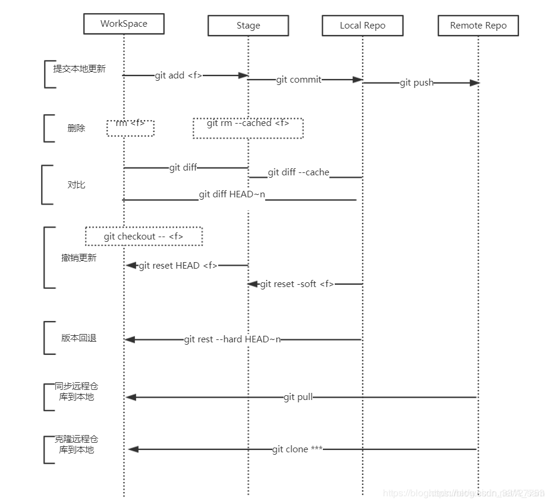  


2 .  
- 项目根目录下隐藏的`.git`目录就是Git本地仓库目录了，存放了所有Git管理的信息。  
- `index`文件就是存放的暂存区内容。  
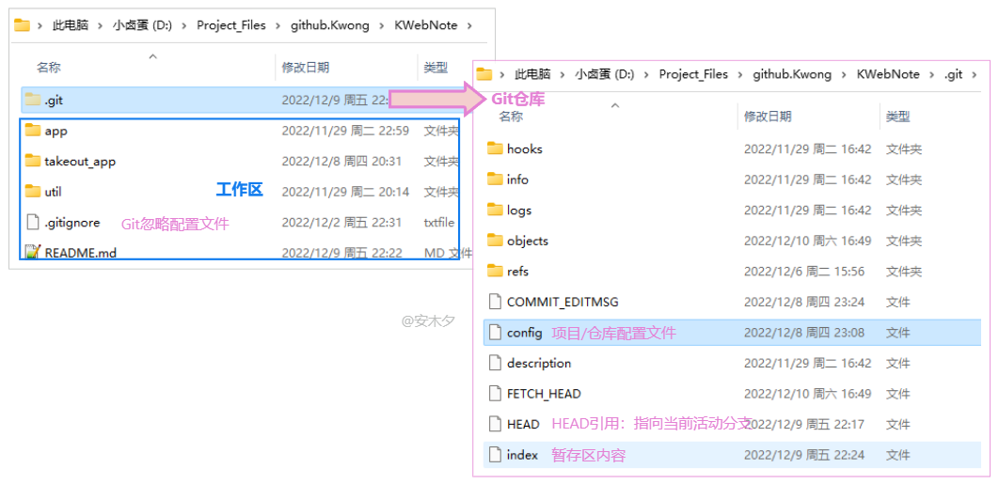  

3 .   
`git checkout .`、`git checkout [file]` 会清除**工作区**中未添加到暂存区的修改，用暂存区内容替换工作区。  

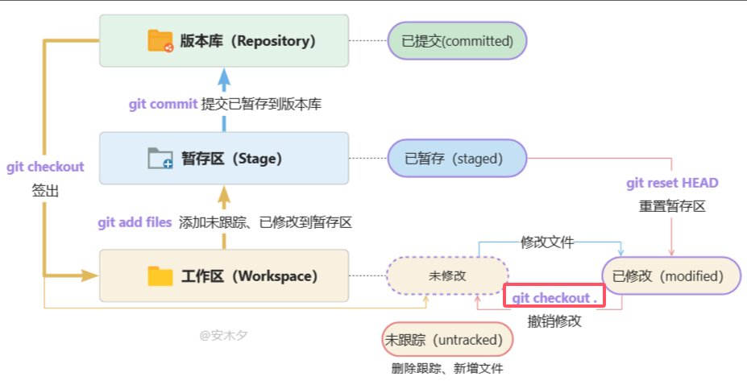  


`git checkout HEAD .`、`git checkout HEAD [file]` 会清除工作区、暂存区的修改，用HEAD指向的当前分支最新版本替换暂存区、工作区。

4 .   
在 Git 中，文件的状态通常分为三个阶段：已修改（modified）、已暂存（staged）和已提交（committed）。

以下是对这三个状态的简要说明：

- 已修改（modified）：
指的是自上次提交以来已对文件进行了更改，但尚未将这些更改添加到暂存区域。这些文件在 `git status` 命令的输出中将显示为 “modified”。
- 已暂存（staged）：
指的是已经通过 `git add` 命令将文件的内容放入暂存区域，准备下一次提交。这些文件在 `git status` 命令的输出中将显示为 “staged”。
- 已提交（committed）：
指的是已经通过 `git commit` 命令将暂存区的更改永久保存在仓库的历史记录中。这些文件在 `git status` 命令的输出中将不再出现，因为它们已经是历史记录的一部分。

`git diff` 命令可以用来查看已暂存和已修改的文件之间的差异。即查看暂存区和工作区的差异。  
如下图：可以比较不同的分支和区域。  
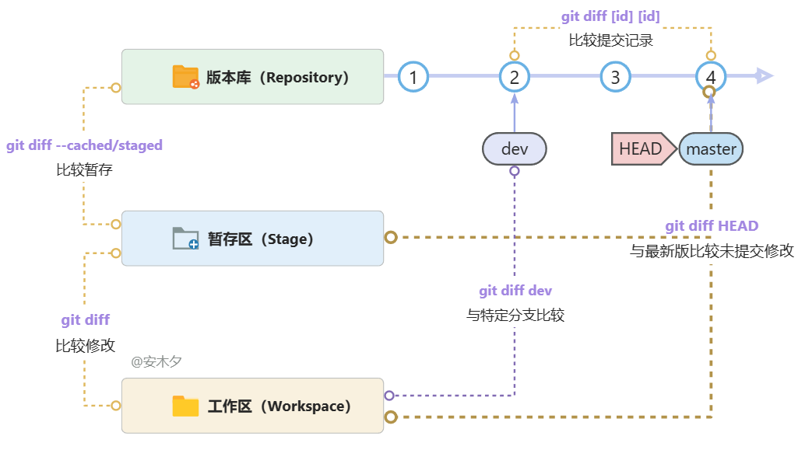  


5 .   
提交commit记录：  
每一次提交（commit）就会产生一条记录：id + 描述 + 快照内容。  
**快照**：就是完整的版本文件，以对象树的结构存在仓库下`\.git\objects`目录里。   

多个提交就形成了一条时间线，每次提交完，会移动当前分支`master`、`HEAD`的“指针”位置。  
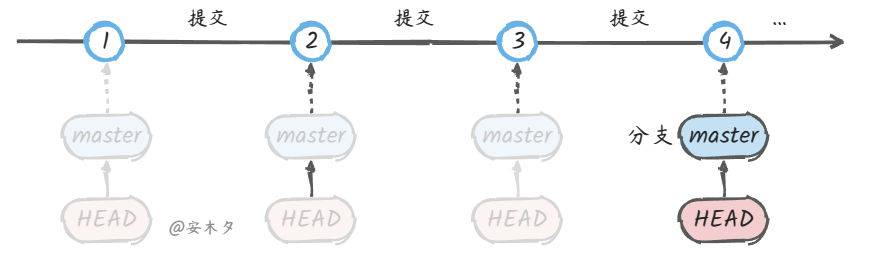  

`git commit --amend -m`	使用一次新的commit，替代上一次提交，会修改commit的hash值（id）  

6 .   
Git中最重要的就是**提交记录**了，其他如标签、分支、HEAD 都对提交记录的“指针”引用，指向这些提交记录，理解这一点很重要。   
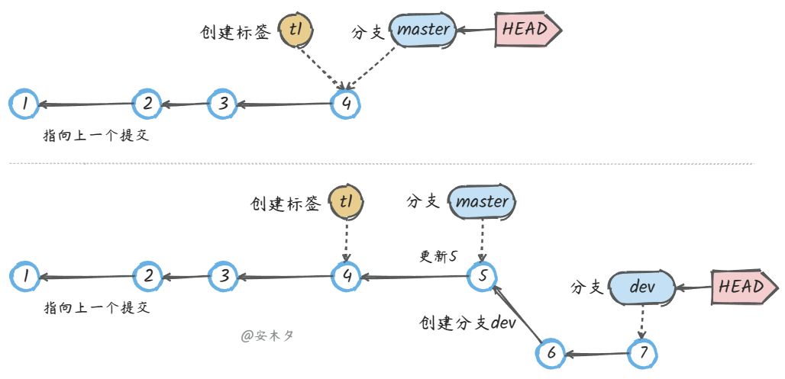  

上图中：

- HEAD始终指向当前活动分支，多个分支只能有一个处于活动状态。
- 标签t1在某一个提交上创建后，就不会变了。而分支、HEAD的位置会改变。  


```
# HEAD指向当前活动分支
$ cat .git/HEAD
ref: refs/heads/main
 
# 切换到dev分支，HEAD指向了dev
$ git switch dev
Switched to branch 'dev'
$ cat .git/HEAD
ref: refs/heads/dev
```

7 . 远程用户登录    
Git服务器一般提供两种登录验证方式：

- HTTS：基于HTTPS连接，使用用户名、密码身份验证。
	- 每次都要输入用户名、密码，当然可以记住。
	- 地址形式：https://github.com/kwonganding/KWebNote.git
- SSL：采用SSL通信协议，基于公私钥进行身份验证，所以需要额外配置公私秘钥。
	- 不用每次输入用户名、密码，比较推荐的方法。
	- 地址形式：git@github.com:kwonganding/KWebNote.git

8 . fetch与pull有什么不同？  
两者都是从服务端获取更新，主要区别是`fetch`不会自动合并，不会影响当前工作区内容。

```
`git pull` = `git fetch` + `git merge`
```
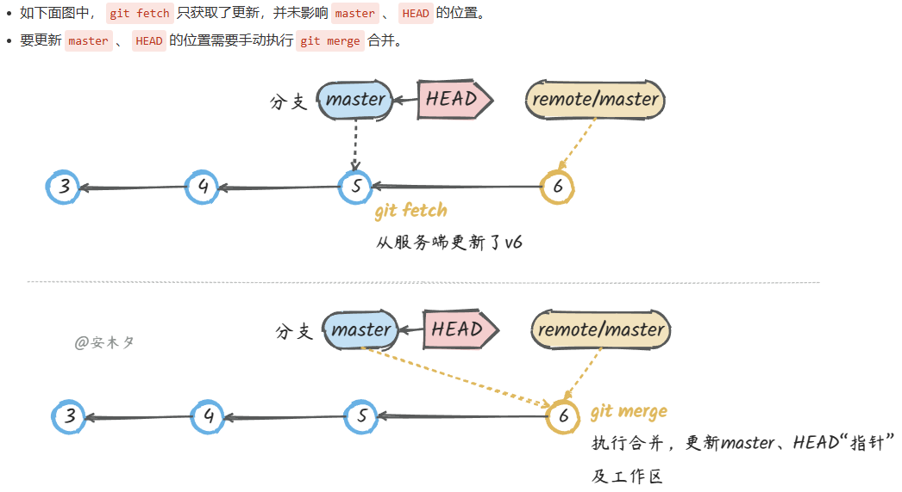  

9 . Branch  
新建的分支对应的是你的commit（蓝色部分）  
而不是当前工作区（红色框框）  
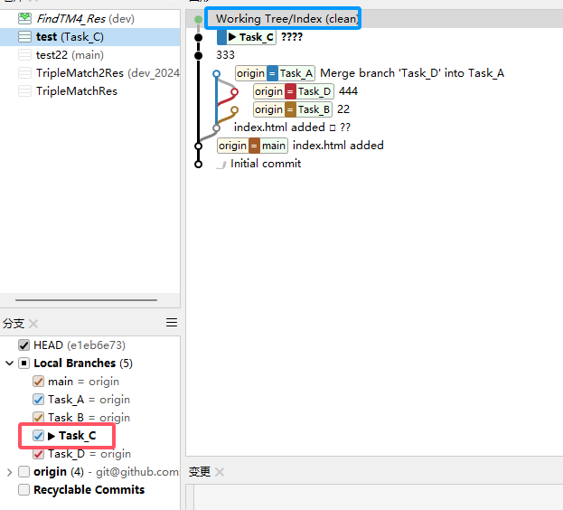  

使用 git checkout dev切换分支时，干了两件事：

①、HEAD指向dev：修改HEAD的“指针”引用，指向dev分支。  
②、还原工作空间：把dev分支内容还原到工作空间。  

合并dev到master，注意要先切换到master分支，然后执行`git merge dev`，把dev合并到当前分支。  

标签总是和某个commit挂钩。**如果这个commit既出现在master分支，又出现在dev分支**，那么在这两个分支上都可以看到这个标签。  

10 . 工作中的Git实践  
其他开发分支：dev-xxx，开发人员可以针对模块自己创建本地分支，开发完成后合并到dev开发分支，**然后删除本地分支**。  