### 2.5D_godot_spine_工作流探索
#### 1 . 解决方案的选择  
main ref：https://github.com/EsotericSoftware/spine-runtimes/issues/2135#issuecomment-1736450408  

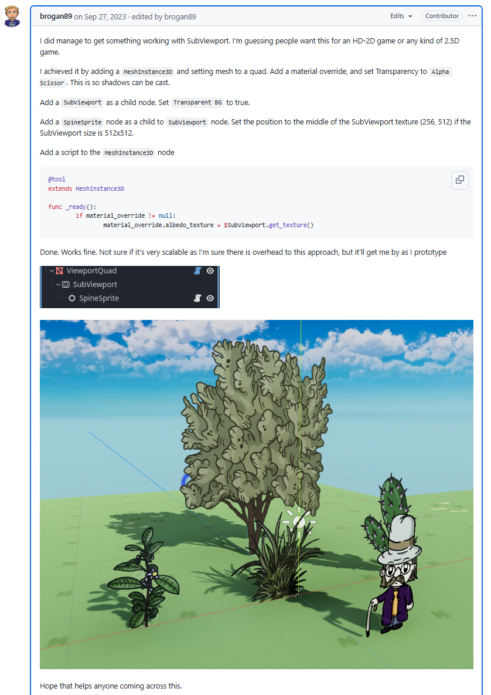  

上面的英文具体操作如下：  
（1）在MeshInstance3D节点弄成quad的mesh。  
并且加上geometry（注意！！） matarial，并且设置alpha scissor。  
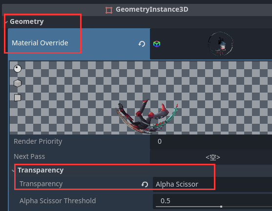  

MeshInstance3D节点要加代码见上图。  

（2）subviewport设置为子节点  
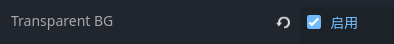  
（3）spinesprite的位置也可以改一下让其居中。  

（4）老鸦的节点划分。  
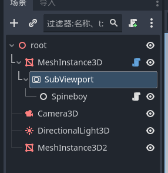  

#### 2 . 老鸦在遇到此问题如何搜索加解决  
（1）配置spine环境。  
【1】在油管搜索官方视频，查看官方教程如何配环境的。 
视频里的方式对应这一种方法：  
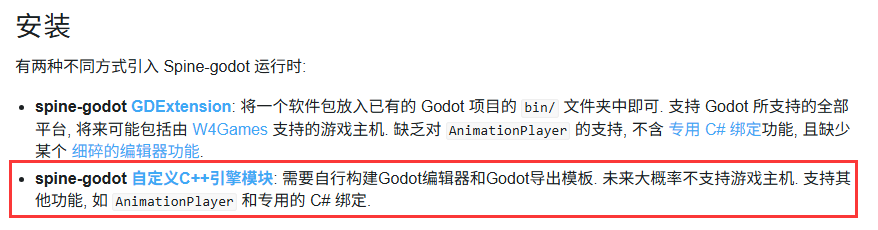  

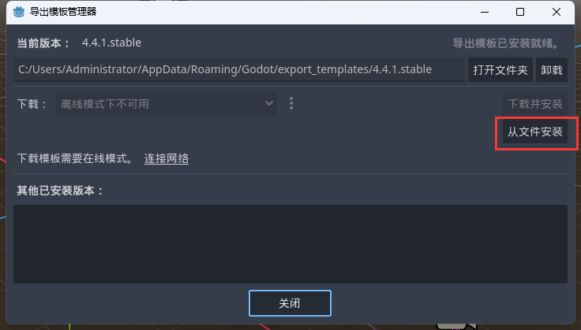  

这种方法怎么看成没成功：  
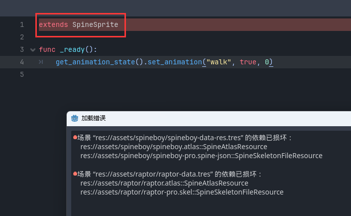  
extends不了就是没成功。  

【2】由于我试了好几次都没成功，为了赶时间，去试了extension那种方式（也就是第一种）。  
但是没看懂，没找到bin文件夹啊怎么弄啊？   
于是老鸦用英文在google搜索：  
  
找到这个网页：  
https://www.reddit.com/r/godot/comments/1ingp0x/how_do_i_add_a_gdextension_ive_made_to_new/  
看到这句话：  
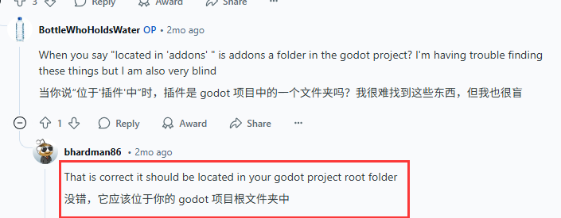  
好的那么直接把下好了extension里的bin文件夹放到该项目的根目录就好了，不用去找bin文件夹。  

【3】然后再import打开名字里有extension的这个example。  
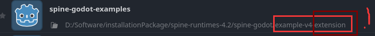  

（2）探索2Dspine导入3D场景   
【1】在实施（1）中提到的ref中操作遇到问题：  
怎么在godot中3d物品加material，加哪个material。然后油管搜索：godot 3d material。  
挑选合适的视频，快进，鼠标点时间节点不全看视频，发现都用standard material，那我也用。  
【2】但是运行界面一直看不到spine动画，咋办？  
- 试试其他3d object比如cube，加上material在相机里看得到么？其他material也试了。还是没找出原因。
- 那么我现在来看看代码：  
  从代码那里找原因。  
  在代码这里加一行，在console里看过这个if检测了么。  
  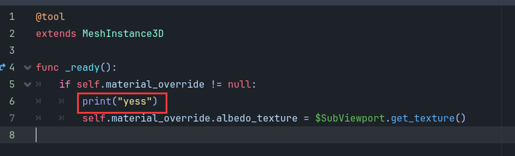  
草，没过啊。  
那再这样加呢？  
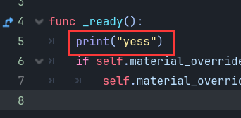  
那这样呢？  
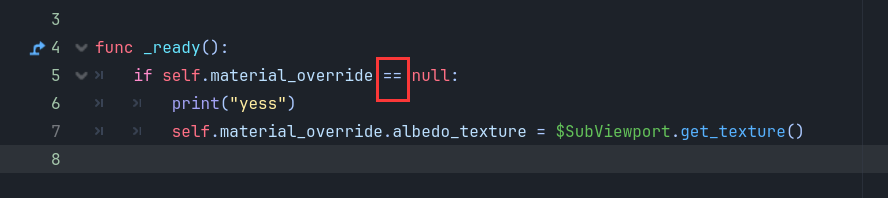  
得知是material_override为null，所以没法给它赋值。  
然后google搜索：  
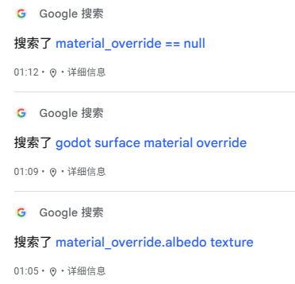  
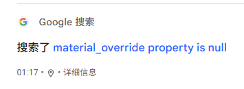  
找到这个网页：  
https://forum.godotengine.org/t/why-does-this-work-project-from-godot-asset-library/94595/4  
跟我的报错一样：  
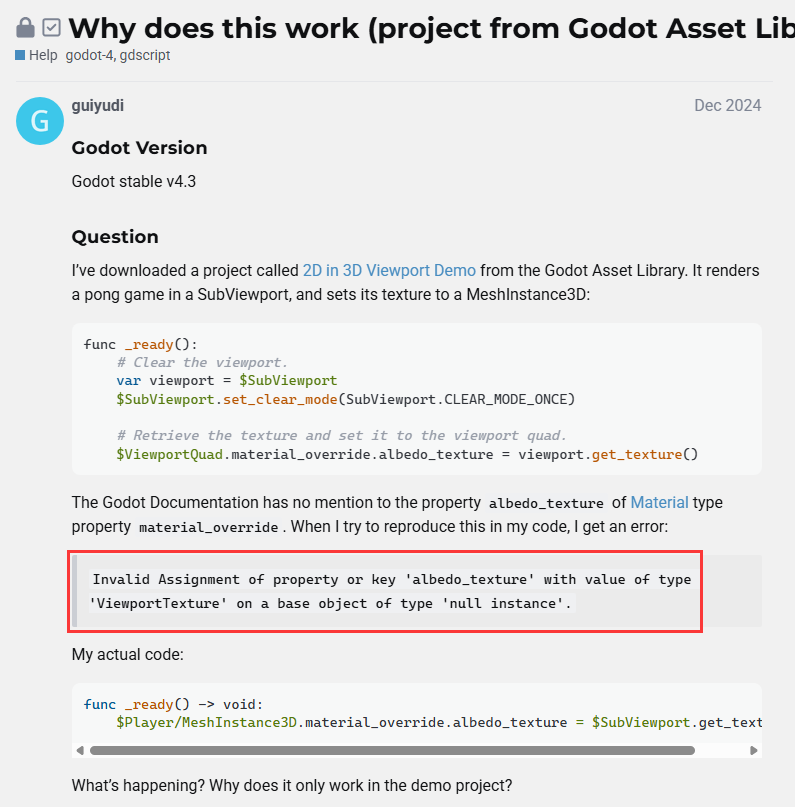  
他的解决方案：  
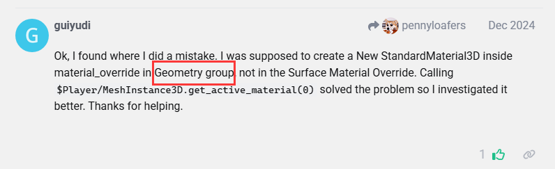  
material要加在geometry那里。  

#### 3 . 未来工作流的思考。  
重启项目发现，以前是白色的quad变成了spine的样子。方便对齐人物位置。  
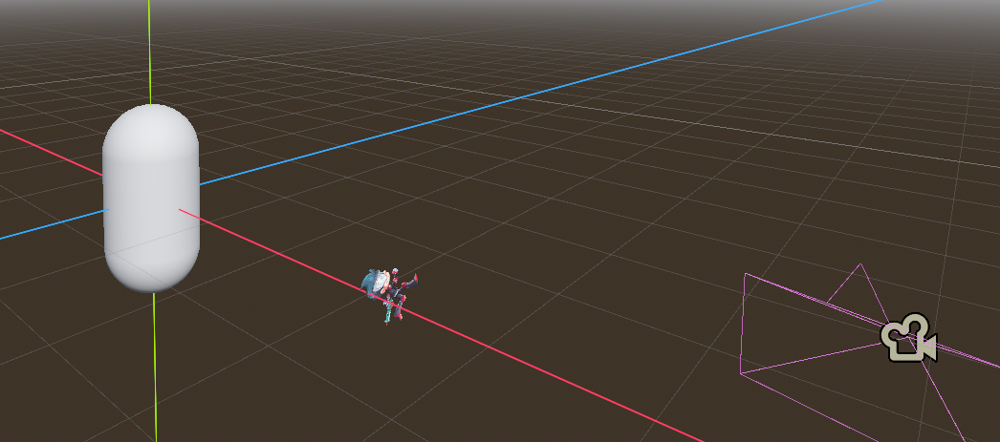  
昨天录视频中在引擎中还是个白片，只有运行才能看到spine：  
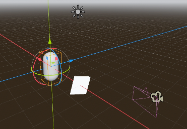  
所以可能重启项目在引擎中也加载到了吧。  