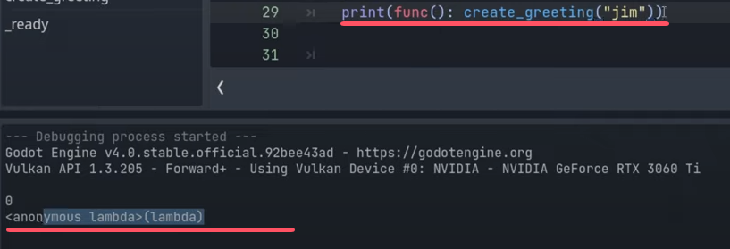
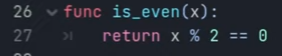

## GDScript Callables & Lambdas
### 视频一：GDScript Callables & Lambdas Deep Dive | Godot 4 Tutorial
https://www.youtube.com/watch?v=56I72m5wDj4   
 
#### 0 . 视频大致内容
1 . GDScript / Godot 4 "Callables"（AKA First Class functions）  
2 . Lambda functions (AKA anonymous functions)  
3 . Practical scenarios (signals and more!)  

#### 1 . “函数名字”是callable
  
“函数名字”是callable。  
What we're printing out here is not a string, but the callable. If we were to call the function, call the callable.  
  
输出：  
```
true  
```

#### 2 . callable是object可以被赋值给variable  
Callables in Godot are just like any other object in Godot. e.g. Vector3 , Node3D. You'll notice that it's highlighting these green, just like a highlights, callable green.  
That's because the Callable is an object in Godot.  
  
That's what the term first-class functions means is that: Functions are just objects in Godot just like anything else, just like a vector3, or a string, or a node.  

所以我们可以assign our functions to variables.   
  

#### 3 . syntactic sugar
The way that 'Callables' work in Godot is that : normally, if you want to call a callable, you actually have to call this `call` function.  
  
Godot has some kind of helper **syntactic sugar** to make this look like regular function. 但是这样也行：  
  

#### 4 . 让func作为参数传给func
But where callables really come in handy is with functions that take other functions as arguments .   
  
【输出】：  
```
2575
```

#### 5 . 当callable有参数时用func(): ,匿名函数 
  
We've got this glaring problem here which is that we only can pass in functions that don't take any arguments.   
  
这样就行了：  
  

但是这样很麻烦，this is where **lambda functions** come in .  
Instead of `create_jim_greeting`, creating this an argument, we're going to type `func()`:  
  
一开始不是说callable后面不能加括号？  
但是我们没有calling the function. We're defining a new function . 

`func(): create_greeting("jim")` 等价于 `create_jim_greeting` 。It's the exact same thing. It's just anonymous. It doesn't have a name.   
  

代码：  
  
输出：  
```
hello jim!
```

  

#### 6 . callables in conjunction with signals
How we use callables in conjunction with signals .   
例子1：  
代码：    
  
  
输出：  
每隔1s蹦一个输出。  
  

例子2：包装成function  
代码：  
  
  
  

例子3：包装成script  
new一个script  
  
  
  
像unity的invokeRepeating()  

#### 7 . Using callables to basically modify arrays.  
  

例子1：  
代码：  
  
  
  
输出：  
  

例子2：  
  
  

例子3：  
  
  
  

### 视频二：Greatly Improve Workflow With Lambda Functions | Godot Tutorial
https://www.youtube.com/watch?v=slinXW6qzm0&t=1374s

#### 0. 目录  
  

#### 1 . What are lambda functions?
Lambda functions are functions but they aren't functions that are declared in the global class scope.  
In other words, it's like a oneline method that maybe needed at a certain spot within the script.  
  

But the real magic of Lambda functions are when we make them into reusable undefined functions. This is done through callable since lambdas are used to create callables.   

Creating a variable which basically just stores a function . We can then easily call this and use this function all throughout the script.  
  

But we can then take this a step further. So maybe you have a calculate function which could call for different operations. Those different operations can be stored within callables and easily pass through to the calculate function by just passing that callable variable.  
  

#### 2 . Why do we use lambda functions?  
（1）  
  

【1】 it's much quicker to create a lambda function for a specific need than an entire function  
【2】 it also saves clutter in our script and in the class's scene tree as the Lambda functions won't exist at the class level like other functions.  
【3】 The big one. It'll help make our script more modular

（2）lambda functions are also really going to help you to keep your scripts organized and keep different methods and information in one place as we will learn about creating `local lambdas` .  

#### 3 .  Basics of Callables/Lambdas  
  
【鸦提示】：.call的括号里也能写参数。第一个教程没有提到。  
  

#### 4 . Lambda Functions Tutorial - Within Parameters 
  

wrap挺多次的，感觉是两次 

#### 5 . Lambda Functions Tutorial - Using With Other Functions 

We think of lambda functions as one line.  
I hope that you're not thinking of it just as being one line . 
Because whenever it's done within a callable here, it can actually be as long as you want it to be.  

  

它这的逻辑有点复杂了：    
  
可以直接改成：  
```py
if player_health + amount > player_max_health
```
#### 6 . Lambda Functions Tutorial - Local Lambdas

  

Local Lambdas就是在function内部定义的lambda。  