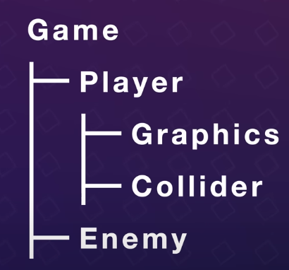
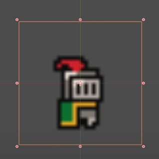
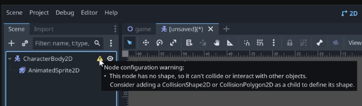
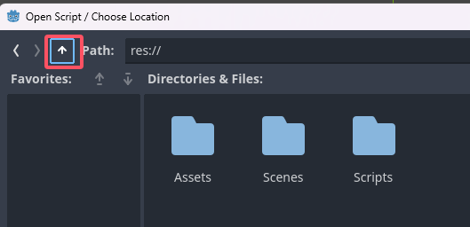
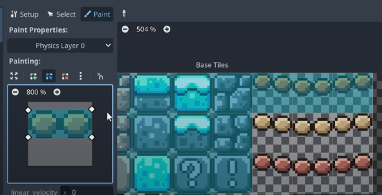

### Godot Beginner Tutorial(一)
视频标题：How to make a Video Game - Godot Beginner Tutorial --Brackeys  

#### 1 .   
As for programming, Godot uses its own scripting language called GD script. It's pretty fast and easy to use but still quite powerful.  

Assets:  
sprites, models, textures, sounds   

Importing Assets into Godot is extremely simple.  

#### 2 . 
To make anything in godot we use nodes.    
If you want to make a player character, we do so by putting together a bunch of node.  
Nodes come in many types, some display an image, others play a sound or add physics.  
We can even extend existing nodes to build more powerful ones.  
In its essence, making a game in Godot is combining and extending nodes to get the result we're looking for.  

But building everything in one big world with nodes for the player, enemies, UI and a bunch of levels all in one place would quickly become completely unmanageable and confusing.  Instead, we use scenes, scenes allow us to bundle together nodes into **reusable** packages.  
  

A scene can be a character, a weapon, a menu. They can be as small as a single collectible coin or an entire level.  
  

Scenes make it really easy to focus on building one part of our game at a time and slowly combining them to make our game larger and larger. This because we can put scenes inside of other scenes which is called nesting 

#### 3 . 
As you can see, all the nodes and scenes on our game start to resemble a tree like structure, called the SCENE TREE.  
  
We call the node at the very beginning of the tree, the root.    

#### 4 . 
【一】Game Scene  
（1）因为是个2D游戏，所以我们选择2D Scene。    
  
（2）然后rename它变成Game。  
  
（3）
现在有三个文件夹Assets，Scenes，Scripts。  
然后把现在的场景保存在Scenes文件夹。  

【二】Player Scene  
（1）新建一个场景。然后添加节点，并且搜索：CharacterBody2D   
（2）添加该节点后，选中该节点并ctrl+a，快捷方式添加节点。  
  

（3）Add animation to player  
  

  

  

（4）Sprite sheet is a very efficient way of working with lots of Sprites such as when doing animation, otherwise we would have to create an image for each single frame which would quickly become an unmanageable amount of files.   

Now, to start adding these frames in, we first need to configure the grid here. Currently it's set to 4x4.  
  
然后把它改成8x8，就可以看到白色方格线变密集。  
  

（5）选中这4个frame。  
  
然后点击【Add Frames】按钮。  

（6）选中游戏物体，按住f键可以center our character。  
(鸦猜：可能是focus这个单词)    

#### 5 .  
(1)  
  
Our character looks weirdly blurry, that's because we're working with pixel art, which requires really hard edges. By default Godot is going to try to do some texture smoothing to make textures look better, but applied to pixel art, that is definitely not the case, so let's simply disable this.   

所以：  
Project--> Project Settings --> Rendering --> Textures  
  

(2)  
  

(3) 然后把character移动到粉线之上。  
  

#### 6 .   
（1）把鼠标放在这个黄色的警示标签之上。会看到这样的提示。    
  
This is because a character body 2D is a physics node and whenever we're working with physics , we need to define a shape that the physics engine can work with. So let's add a new node.  
  

  
把它碰撞体调整到这个大小和这个位置：  
  
解释： Colliders rarely need to be very precise and it's a good rule of thumb to make them a bit smaller than the graphics if you need to. Having colliders that are too large is simply going to be frustrating when playing.  

(4) 把这个scene的top node 改名为Player。并ctrl+s保存这个scene。  

（5）切换到Game scene，把Player scene 拽到这个界面。  
  

#### 7 .  
(1)Game Scene下新加节点：  
  

（2）原来的太大了：  
  
让我们改成4x4：  
  
再把camera拽到正好focus on the player。  

（3）然后让我们运行一下：  
  

#### 8 .  
We need to add a script that allows us to move around.  

(1)按这个按钮   
  
  
  

（2）切换回2D场景添加地面。  
   
  
  
The world boundary is a type of collider, that is perfect for stuff like world boundaries, because it's going to extend infinitely on the horizontal axis here.  
  
如果旋转成这样就会在垂直方向无线延伸。  

可以移动它的位置：  
  

（3）改一下这两个数值。  
  

#### 9 . Worldbuilding 1.0  
（1）把这个删了，让我们来建真正的地面。  
  

添加这个：   
  

（2）The most common way to create in 2d is by using tiles. In other words, we build our game World by drawing different tiles onto a grid.  
The tile assets we used to paint are normally packed together into one big image, just like our player was. This is called the tileset.  

So the tile set is a collection of tiles that we can use to paint from and the **tilemap** that we just created is the node we use to paint these tiles into our world.  
  

（3）  
  

在最底下的视窗可以看到两个tab。  
  

  

  
选yes。  

用橡皮擦擦掉这一块：  
  
  
按住shift键把它画成一整个：  
  

（4）选中这个开始画。  
  

可以选中多个，一起画：  
  
  

select mode可以选中国一整块，将一整块移动。  
  

  

（5）为了让角色不会掉出去。  
  

底部切换到：  
  
We need to choose what tiles belong to the physics layer, because we don't want to collide with everything in our tilemap. The trees and bushes we just want to pass right through.  
  

这里可以清除添加的物理。  
  

  
回归画笔模式。  
  

（6）
There are also some tiles that we do want physics on, but where we need the collider to only be on part of the tile such as our bridge here.  

  
We can even add and remove points by clicking and right clicking.   

  
上一个的范围会直接覆盖到下一个的范围。所以不要瞎点。  

（7）Making it (Camera2D) a child of the player means that it will just automatically follow the player node.  
  

We can even turn on position smoothing to really smooth out our camera follow.  
  
