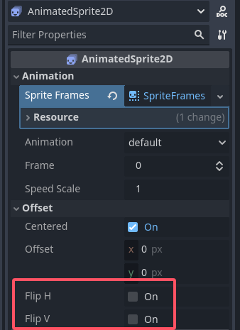
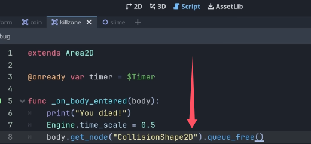
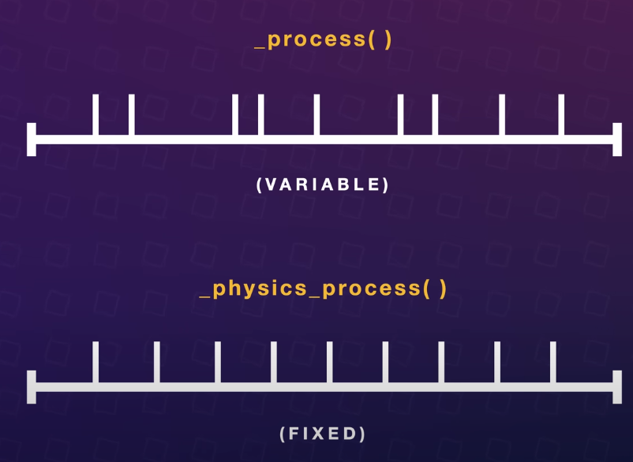

### Godot Beginner Tutorial(三)
#### 1. Enemy  
（1）since this enemy doesn't need to collide with anything, we can just go ahead and use a Node2D as the base. Let's also add an animatedSprite2D.   
  
  
第一行：the enemy kind of waking up  
第二行：an aggressive idle animation  
第三行：enemy takes damage  
  

(2)挪到这里  
  
  

（3）Because we made our Killzone into a reusable scene, we can simply use it for our enemy as well.   
  
  
  

  
hold "alt" to scale uniformly.  

  
改名并保存。   
  

(4)Let's make our enemy move back and forth.   
We could of course do this using an animation player just we did for our platforms.   
However, I think it would be cooler to make a script that moves our enemy to the right until we get close to a wall in which it changes direction and starts moving left. This way we can simply drag and drop the enemy between any two walls in our game and our script will do the rest.  

So let's start by making our enemy move to the right.  

【基础知识】  
delta is the amount of time that has gone by since the last frame. If we are drawning many frames per second, delta gets really small.    
  

If we lag out a bit and are not drawing as many frames, delta becomes bigger.  
  
Because of this we can use Delta to compensate for variations in frame rate.   

If we have a high frame rate, we want to only move our enemy a little each frame, and if we have a low frame rate we want to move it a lot.   

In other words we can multiply our movement by delta to make it independent of the frame rate.  

所以这样，this speed won't change from system to system.  

```py
extends Node2D

const SPEED = 60

# Called every frame. 'delta' is the elapsed time since the previous frame.
func _process(delta: float) -> void:
	position.x += SPEED * delta # moving 60 pixels per second
```

(5) Check if the enemy gets close to a wall. For this we'll use a new type of node, the raycast node. Raycasts are invisible rays that we can shoot out to detect collisions. 

所以在Slime下新建node：RayCast2D。  
  

In our script, we can reference these nodes just like we did with our timer. we simply select them both, click and drag and hold down Ctrl while releasing. As you can see, this creates two vaiables.   
  

slime.gd 代码：  
```py
extends Node2D

const SPEED = 60

var direction = 1

@onready var ray_cast_left: RayCast2D = $RayCastLeft
@onready var ray_cast_right: RayCast2D = $RayCastRight

# Called every frame. 'delta' is the elapsed time since the previous frame.
func _process(delta: float) -> void:
	# every frame, before we move our slime, 
	# we will go ahead and check if we're currently colliding
	# to the right or the the left.   
	if ray_cast_right.is_colliding():
		direction = -1
	if ray_cast_left.is_colliding():
		direction = 1
	position.x += direction * SPEED * delta # moving 60 pixels per second
```
(6) Luckily, if we go inspect our animated Sprite here. Under offset, we have this flip property which will simply flip the Sprite.   

不要勾选：   
  

AnimatedSprite2D把它拽到代码中(ctrl的情况下)  
slime.gd代码：  
```py
extends Node2D

const SPEED = 60

var direction = 1

@onready var ray_cast_left: RayCast2D = $RayCastLeft
@onready var ray_cast_right: RayCast2D = $RayCastRight
@onready var animated_sprite: AnimatedSprite2D = $AnimatedSprite2D

# Called every frame. 'delta' is the elapsed time since the previous frame.
func _process(delta: float) -> void:
	# every frame, before we move our slime, 
	# we will go ahead and check if we're currently colliding
	# to the right or the the left.   
	if ray_cast_right.is_colliding():
		direction = -1
		animated_sprite.flip_h = true
	elif ray_cast_left.is_colliding():
		direction = 1
		animated_sprite.flip_h = false
		
	position.x += direction * SPEED * delta # moving 60 pixels per second
```

#### 2 . Dying 2.0  
(1) Let's start by adding a slow motion effect when we die. We can do this by changing the time scale of the entire game.  

So, inside of our Kill Zone, we'll open up the script here.  

killzone.gd代码：  
```py
extends Area2D

@onready var timer: Timer = $Timer

func _on_body_entered(body: Node2D) -> void:
	print("You died!")
	Engine.time_scale = 0.5  # go at half speed
	timer.start()


func _on_timer_timeout() -> void:
	# then when our timer runs out, let's set this back to default. 
	# because otherwise we will actually still be slowed down when our scene reloads
	Engine.time_scale = 1.0
	get_tree().reload_current_scene()
```

(2)Notice that it also twice as long before the game restarts, because everything in our game slows down including our timer. But I think it could be even cooler if we remove the player's collider to make him simply fall off map.  

To do this, we need a reference to the player, we actually already have this here.  

这个`body` refers to the body that entered the area, and since the only thing that enters the kill zone is our player. `body` is our player.  
  

#### 3 . Player 2.0  
（1）  
So far we've been using the character movement template pretty much as is.  
We need to modify it in order to add animation to our player as well as change the key bindings that we use to move. 

  
There's also a variable here that defines the gravity based on our project settings. By default this is a value of 980.  

`_physics_process()` is very similar to the `_process()` function we used for our enemy. However while process is great for a lot of things. There is one part of the game engine that really struggles with not knowing how many times per second it is going to be run, that is the physics engine. Physics in general need to update at fixed intervals to avoid janky behaviour. Luckily `_physics_process()` solves this problem, because it runs at a fixed rate, 60 times per second by default. This is independent of your game's actual frame rate and helps physics run smoothly. We use it for anything that involves the physics engine like moving something that should collide with its environment such as a player character.  
  

(2)  
解释player.gd代码：  
```py
extends CharacterBody2D

const SPEED = 130.0
const JUMP_VELOCITY = -300.0

func _physics_process(delta: float) -> void:
	# Add the gravity.
	if not is_on_floor():
		velocity += get_gravity() * delta
# yaya: this means: if the player is not standing on a surface, we add gravity

	# Handle jump.
	if Input.is_action_just_pressed("ui_accept") and is_on_floor():
		velocity.y = JUMP_VELOCITY
# yaya: this means: if we press the space bar, and, the player is on the surface,
# we jump.

	# Get the input direction and handle the movement/deceleration.
	# As good practice, you should replace UI actions with custom gameplay actions.
	var direction := Input.get_axis("ui_left", "ui_right")
	if direction:
		velocity.x = direction * SPEED
	else:
		velocity.x = move_toward(velocity.x, 0, SPEED)

	move_and_slide()

# yaya: this means:  And then we get the direction we need to move in based on what arrow keys are pressed 
# and move accordingly.  
```

(3) Let's start by rebinding some input keys. For this godot uses an Action system. We create actions for anything we want to do in the game.   
jump is an action.  
so it's move_left or move_right.  
We can then bind keys to these actions.  
  
  
回车键相当于按"+ Add"键。  
  

By default, godot uses some built-in actions that are meant for navigating UI. This is why it says things like `ui_accept` here. Let's replace these with our own actions instead.  
  
  

（4）The next thing we need to do is to update our player Graphics to face the direction we are moving and to play the right animation.  

Let's start by flipping our Sprite based on direction.  

【1】边按ctrl 边在player.gd代码中 拽入 AnimatedSprite2D组件。  

【2】  
  
  

jump只添加这一帧。  
  

player.gd代码：  
```py
extends CharacterBody2D

const SPEED = 130.0
const JUMP_VELOCITY = -300.0

@onready var animated_sprite: AnimatedSprite2D = $AnimatedSprite2D

func _physics_process(delta: float) -> void:
	# Add the gravity.
	if not is_on_floor():
		velocity += get_gravity() * delta
# yaya: this means: if the player is not standing on a surface, we add gravity

	# Handle jump.
	if Input.is_action_just_pressed("jump") and is_on_floor():
		velocity.y = JUMP_VELOCITY
# yaya: this means: if we press the space bar, and, the player is on the surface,
# we jump.

	# Get the input direction and handle the movement/deceleration.
	# As good practice, you should replace UI actions with custom gameplay actions.
	var direction := Input.get_axis("move_left", "move_right")
	# yaya: if we don't press any buttons, direction will be zero, 
	# if we press move_right,direction will be one
	# if we press move_left, direction becomes minus one.  
	
	# Flip the Sprite
	if direction > 0:
		animated_sprite.flip_h = false
	elif direction < 0:
		animated_sprite.flip_h = true
	
	# Play animations
	if is_on_floor():
		if direction == 0:
			animated_sprite.play("idle")
		else:
			animated_sprite.play("run")
	else:
		animated_sprite.play("jump")
	
	# Apply movement
	if direction:
		velocity.x = direction * SPEED
	else:
		velocity.x = move_toward(velocity.x, 0, SPEED)
#yaya said: this line probably means: slow down until stop
	move_and_slide()

# yaya: this means:  And then we get the direction we need to move in based on what arrow keys are pressed 
# and move accordingly.  
```

#### 4 . Text
There are multiple ways of working with text in godot. As part of a larger Ui or as an integrated part of the game world. For this game I decided to try making the text part of our world.  

In Godot, a text node is called a label. So let's add one.   

As you can see, the text looks really blurry. That's because since we're using pixel art, we actually zoomed in really really far, which makes the otherwise smooth text appear blurry.   
  

原因：可能是摄像头的靠近：  
  

其他补充：  
  
  

So we can fix this by using a pixelated font with hard edges to match our style.   
  


  
Note that we have to use multiples of eight in order for the text to appear crisp, so you can see if I change this to nine, it becomes blurry again.  
16, 24, 32 and so on都可以。  
【鸦补充】：可能原始字体就是以8为基础分辨率的。  
  


也可以给字体改一下颜色。  

新建一个node，把那些label都放在底下。  
  
  

Just like with Sprites, because the player character has a greater Z-index. It will draw on top.  

#### 5 . Score  
To create a score or coin counter for our game, we need two things.   
A script that keeps track of our current score,  
and a label to display it.   

(1) 新加一个节点。  
  
  
然后把它改名成GameManager。  
The reason why we are using a regular node and not a node 2D is because we don't need our game manager to have a transform. In other words, a position, rotation and scale.  

为节点添加脚本。脚本名字不要用大写字母。  
  

（2）  
So far in our code we've only used the build-in functions of Godot and some that we made with signals. In this case here, we want to create our own function that adds a point to our score and displace it.   

game_manager.gd脚本：  
```py
extends Node

var score = 0

func add_point():
	score += 1
	print(score)
```
(3)对coin脚本引用GameManager：  
  
if we just click and drag while holding down ctrl. We get this really weird-looking path. `"../../GameManager"`  

Because the GameManager is higher up in the tree than the coins and it's generally bad practice to use paths like this that try to access nodes at the same level or higher in the tree.  
  

Luckily because our GameManager is one-of a kind and we are sure that there will always be only one GameManager, we can solve this by marking it as unique.  
  

现在再拽就是这样的：  
  

（4）新加个label。  
  
  
autoWrap是自动换行的意思。  

把它的字体替换成这个：  
  
  
  

（5）把这个label重命名，并拽到GameManager底下。  
  

（5）coin.gd的代码这样写会报错。  
  
coin.gd正确的版本：  
```py
extends Node

var score = 0
@onready var score_label: Label = $ScoreLabel

func add_point():
	score += 1
	score_label.text = "You collected " + str(score) + " coins."
```