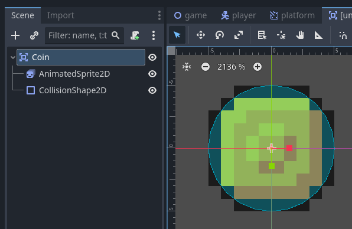
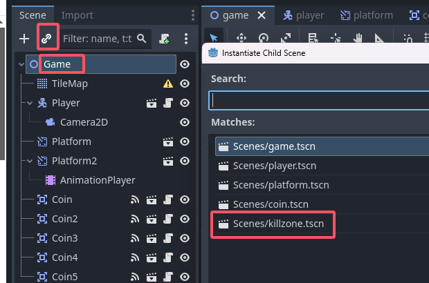
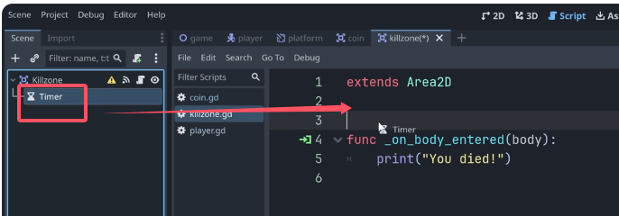

### Godot Beginner Tutorial(二)
#### 1 . Platforms
（Some that move, and some that don't）  
(1) So whenever we are creating a new element of our game, we begin by making a new scene. And for the root node here, I'm going to hit 'add' and search for the AnimatableBody2D. This is a physics body that we use whenever we want to animate a node and still have it collide properly with other nodes in its path which is perfect for moving platforms that should still collide properly with our player.  

(2)  
  
  
  

(3)  
  
  
  
  

(4)但是现在我们不能jump onto the platform from underneath.  
To fix this we turn it into a one-way platform.  
  

(5)但是现在 the player is currently passing behind the platform, this is because the platform is currently after the player in the tree. This means that each frame the player is drawn first and then the platform is drawn on top. We could just move the player in the tree, but I don't want to depend on that. Instead, we fix the draw order by changing the Z-index of the player.  
  
By default, all visible nodes have a Z-index of zero. Because they all have the same index, they are drawn according to their order in the tree.   

(6)   
【1】We might want some platforms to move around to increase difficulty, so let's use animation to do that.   
  
【2】  
  
【3】  
  
  

按住shift按照一个axis把它移动到这里。  
  
  
  

【4】如同ping pong一样来回摆动。  
  

【5】如果觉得时间太短，可以改这里的数值。  
  
再把last key frame拽过来。  
  

【6】  
  

#### 2 . Pickups  
（1）新建一个scene，添加根节点Area2D。  
This is a type of node that we use whenever we don't want to collide with other objects. But instead we just want to define an area in which we can detect collisions. So we simply use this to detect if another body enters, such as the player character.   
  
  
  
  
  

  

（2）You can always use ctrl+D to duplicate.  
  
(3)  
  

(4)Script  
  
- **pass** keyword which means do nothing.  
- the ready function is called right when our node enters the scene tree, which is just at the start of the game. So we can put code here that we want to happen immediately.  

We only want to do something once our player enters the coin area.  
and for this we use a signal,  
Signals allow us to trigger code based on events that happen in our game.  
Godot has many built-in signals we can use.  

If we select our Area2D node(名字：Coin)，and go to the node tab.   

We can see all the signals on this node. We want to use the body_entered signal, which is triggered whenever a physics body enters the area.  

To connect it, we simply double click it and hit connet.  

  
This green arrow shows that this is triggered by a signal, so let's here try writing a print function.  
  

（5）但是这样做，如果当其他游戏物体，比如平台碰到金币时，也会触发这个print函数。  

To change this we can either use code to check what body enters the area, or we can simply put our player on a separate physics layer.   

把player的layer从1改成2。  
  

In our coin, we can also go under Collision, we can actually have the coin itself stay on layer1, we don't need a separate layer for that yet, but we want to make sure that it only detects colliders in layer2. For this we use the mask. The mask defines what layers a node collides with.   
  

```py
extends Area2D

func _on_body_entered(body: Node2D) -> void:
	print("+1 coin!")
	
	#remove the entire coin scene from our game
	queue_free()
```
#### 3 . Dying 1.0
（1）  
So we happily move along in our world until suddenly we miss a jump and fall into the abyss and then, nothing happens.  

The first thing we want to do is limit our camera, so that it doen't follow our player when we fall down.  

We simply select our camera under the player, go under limit and we can set a position limit for the left top right and bottom part of our camera. In our case we need to set a limit for the bottom position. To do this, we can use the ruler tool here at the top or simply press R. and measure from this baseline here to where we would like the limit of our camera to be.  
  
  

量完之后回到select mode。  
  
  

（2）next we need to detect that our player has entered a dangerous area and restart the game, In other words we need to create a Kill Zone.   
I'll show you a really cool way to do this, that allows us to reuse the same Kill Zone for more than just falling off the map. Such as for spike traps, enemies, all kinds of elements of danger.  

所以我们新建一个scene。  
  
  
为了只感应player。  

We want add a collision shape here, that's because we want to be able to reuse this for all kinds of elements that might have different shapes.  
（鸦补充：他这话没说明白，应该是：我们不能在Killzone的scene加collision，应该在Game scene底下拽入Killzone，然后再在该killzone节点里面加collision节点。  

把该scene改名为Killzone并保存

（3）  
  
  
  
用这个按钮移动到这里，  
  

（4）对Killzone的scene建立脚本。  
并用body_entered的signal。  
  


instead of immediately restarting the game,   
let's add a small delay.    
We do this by using another node called the timer node.  
  

  
Let's also make it a one shot to make sure that it doesn't loop. 

We can then start this timer in our code, to do that however we first need a reference to it. Luckily that's as simple as going to the top of our code clicking and dragging the timer and **holding down contrl** while releasing.  
This creates a variable called timer that automatibally finds the node using this path.  
  
  

`$Timer`这个是path。  

Path specify a way to get from one node to another in the tree. 

举例：  
  
To get from the game node to the camera, the path looks like this, it goes through the player and ends with the camera.  
  

In our case where we just want to get from the Kill Zone to the timer right underneath, we don't have to go through any other nodes, so the path is simply `$Timer`.  

We now need to trigger some code when our timer runs out, and again we can use a signal(timeout()) for this.  

killzone.gd代码：  
```py
extends Area2D

@onready var timer: Timer = $Timer

func _on_body_entered(body: Node2D) -> void:
	print("You died!")
	timer.start()


func _on_timer_timeout() -> void:
	get_tree().reload_current_scene()

```

#### 4 . World building 2.0  
（1）catergorize nodes：  
【1】game scene新建一个base node。  
  
【2】rename成Coins  
  
【3】再把所有的coins都拽到下面去。  
  
【4】同样的操作把Platforms也整理一下

（2）然后再tile map再新增加一些东西：  
  

（3）画背景   
【1】   
把当前的layer改名Mid,  
新加一个layer名叫Background。  
把Background 的位置 move to the top, make sure that it's **drawn first.**  
  
  

【2】  
  

【3】  
A nice trick here is to use the rectangle to paint in a lot of tiles at once.    
  
  
