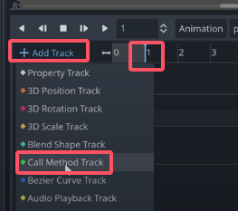
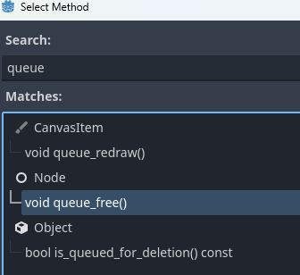
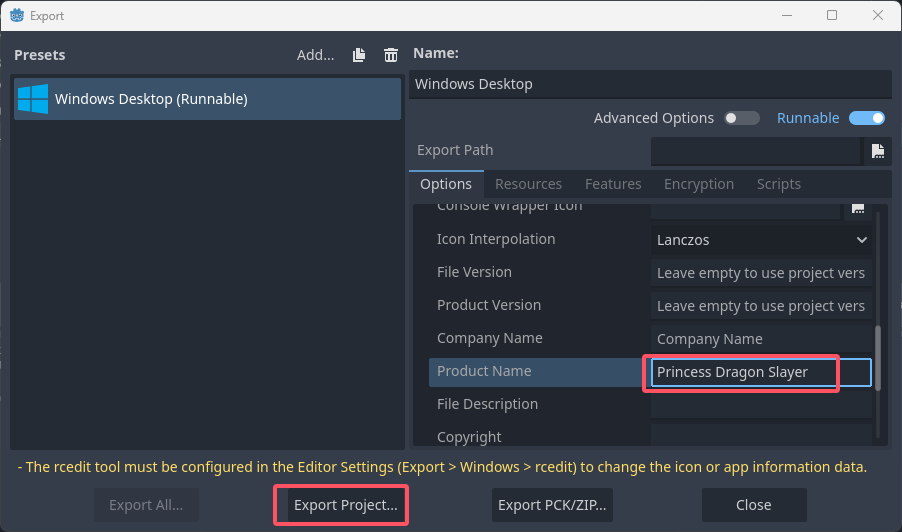

### Godot Beginner Tutorial(四)
#### 1 . Audio
（1）To play these, we need a new type of node.  
  
然后重命名这个节点为Music。  

拽过来。  
  
  
勾选enable。  
再点击reimport。  

（2）降低音量的办法：  
方法1：  
  

方法2：  
  
We can use the audio tab here at the bottom. This is actually a fully functioning audio mixer and we can add different buses to control our audio.  

Let's add two : one for our music, one for sound effects.  
  

把music节点的这里修改一下：  
  

把它改成-12.0 dB。  
  

（3）Unfortunately it's going to restart whenever our scene is reloaded. A quick fix for this is to take our music node and make it into a scene.   
  

and then we can add this scene as an autoload. Autoloads are global scenes and scripts that we want to persist throughout our entire game, no matter which scene is currently loaded.   

【1】我们把这个节点删除：  
  

【2】  
  

(4)SFX     
【1】  
  

  

but since we're removing the coin immediately by calling the `queue_free()` function, the sound won't actually get chance to play. We can of course fix this by adding code that waits until the sound has finished playing. But then we might get weird functionality where we try to pick up the coin multiple times while it's playing and it will still be visible until the sound is finished.  

So let me show you a really cool trick to get around tricky timing things like this without writing any code. That is using an AnimationPlayer.  

And the first thing that we want to do when we pick up the coin is to hide the coin Sprite.  

So I'll go into the AnimatedSprite2D节点.  
  
  
Godot is automatically going to create another animation track called RESET that will simply reset this value to its default state.  
  

【2】  
  

And after 1 second here, we want to remove our coin. And this is a really cool part about the animation system is that we can actually add another track here that is used to calling functions.  
  
  

  
  

【3】coin.gd的代码：  
```py
extends Area2D

@onready var game_manager: Node = %GameManager
@onready var animation_player: AnimationPlayer = $AnimationPlayer

func _on_body_entered(body: Node2D) -> void:
	game_manager.add_point()
	
	#remove the entire coin scene from our game
	animation_player.play("pickup")
```

#### 4 . Export
(1) The first time we are exporting our game, we need to download the export templates.  
  
  

(2)  
  
  
  

- `Embed PCK` will export it into a single file

  

  

