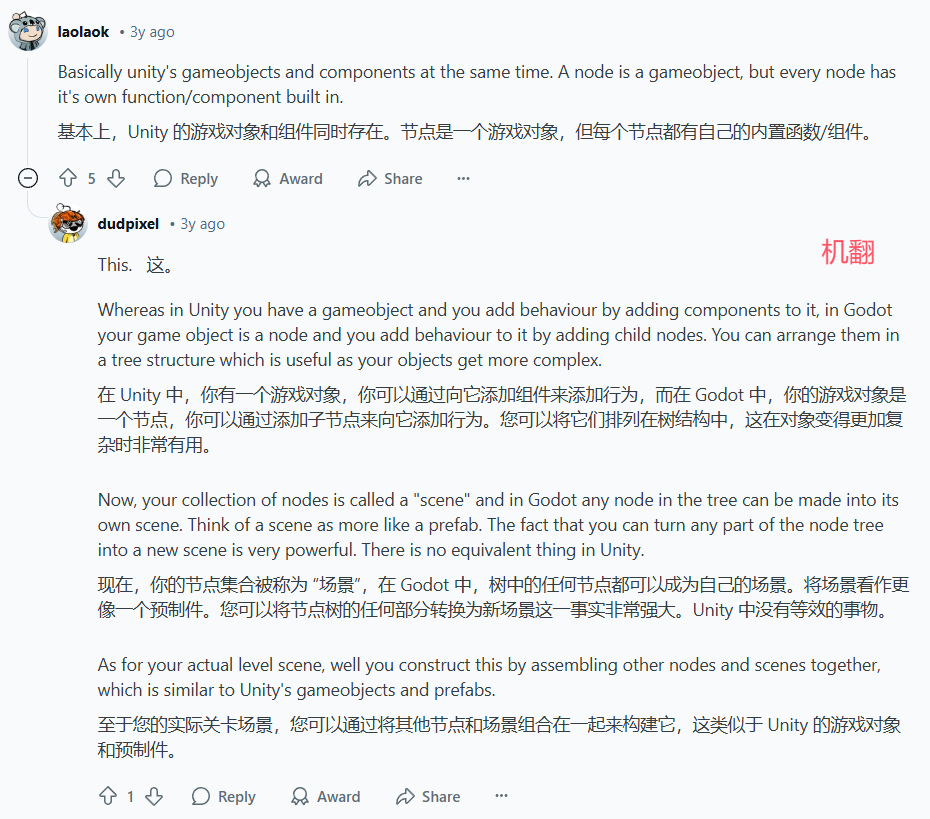
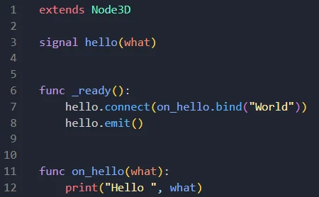
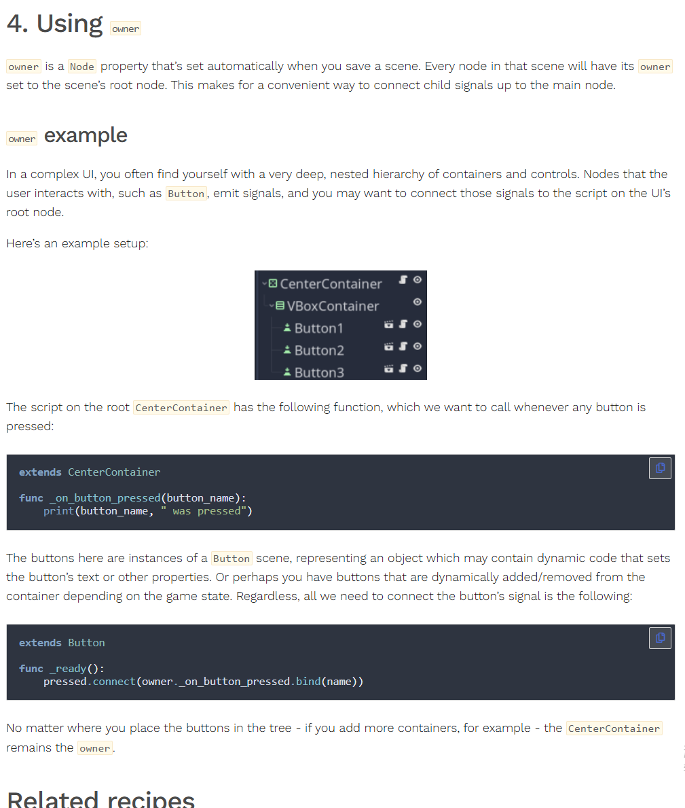
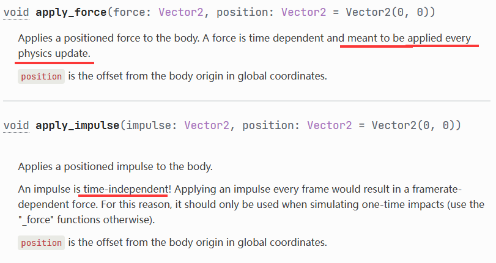
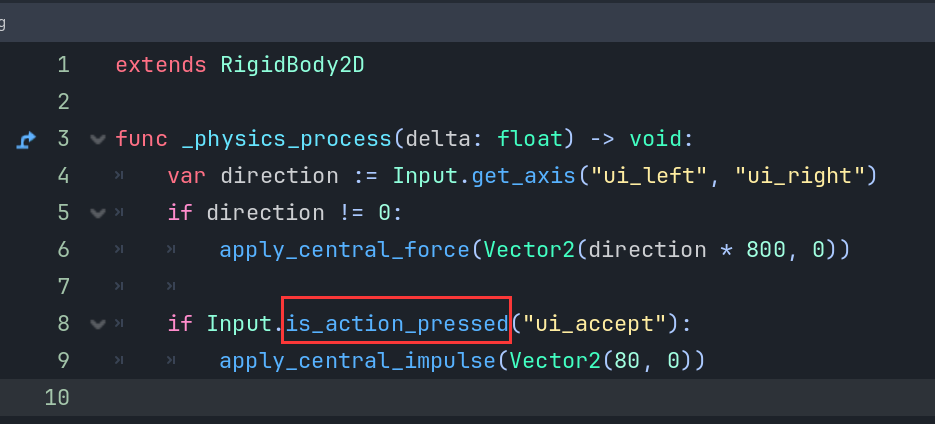

### Godot杂七杂八记事本
#### 一. AnimatableBody2D vs CharacterBody2D vs StaticBody2D vs RigidBody2D vs Area2D

参考：https://godotforums.org/d/41128-how-to-choose-the-proper-node-for-my-entities/13  
注：不用看Jesusemora的，他逻辑太乱了，光看xyz大神的发言就好。  

1 . 回答问题   
（1）**RigidBody2D, StaticBody2D, AnimatiableBody2D**  - are all rigid bodies. 

To be **animated by engine**'s physics simulation. 

**You** typically **don't animate their** motion (position/velocity) directly. 

Instead, **you apply** directional and rotational **forces** (hence "dynamic") to affect the simulation.   

(2) **CharacterBody2D**  
to be animated by your scripts.   

(3) **Area2D**  
is just a passive collider. A geometric shape that can detect if other geometric shapes overlap with it.  
Brackeys: This is a type of node that we use whenever we don't want to collide with other objects. But instead we just want to define an area in which we can detect collisions.   

2 . 补充  
(1) There are two parts to every collision: detection and response. Detection algorithms are the same for all objects that inherit `CollisionObjectXD`, be it areas, kinematic or rigid bodies. However the response is different for different types of bodies. Should you choose to disable the response for a body of any type, it can be made to behave just like a plain area - doing only the detection   

（2）There's no rigid body or static body or kinematic body native classes in engine source. Strictly speaking it's all rigid body simulation but for some "types of bodies" some functionality aspects are constrained or disabled.  
 
Static body is a rigid body that doesn't move. And kinematic body is a rigid body that's not affected by forces. 

3 . 不清楚的地方  
（1）are all rigid bodies. (aka **dynamic bodies**).   
（2）They certainly didn't have the **luxury** of running rigid body simulations on **1970s** hardware  
（3）The simulation runs all bodies inside a particular physics space at once   
（4）You can think of them as rigid bodies that have infinite mass. --`them`指代`static body`  
 (5) 怎么看source code  

4 . 鸦瞎总结：  
有可能godot里名字里含`body`就是rigidbody在底层。   
detection and response这个东西蛮重要感觉！（扶眼镜）   

#### 二 . Difference between choosing "Node" vs "Node2D" as parent?
https://www.reddit.com/r/godot/comments/9xkax8/difference_between_choosing_node_vs_node2d_as/?rdt=51144  

回答：  
A script that extends `Node` can be attached to any node. A script that extends `Node2D` can only be attached to nodes that themselves extend `Node2D`.

It's good practice to use the most generic base class as possible. This way, your script can be used in more contexts. So if your script does not depend on any 2D functionality, then you might as well inherit it from `Node` instead of `Node2D`.

Edit: I just realized what you meant by "parent"; not the parent class (superclass) but the root node of the scene. In this case, I would advise to have the entire ancestor(祖先) chain of `Node2D`-derived nodes also be `Node2D` subclasses. Otherwise, functions like `get_global_transform()` are going to give you errors, because any intermediate `Node` that isn't a `Node2D` does not have a 2D transform.

(辩证地看，这个人其他的话有点问题。)  

#### 三 . What's a node?  
https://www.reddit.com/r/godot/comments/woky1n/new_to_godot_whats_a_node/  
  

#### 四 . velocity & move_and_slide()  
As a short explanation, in Godot 4, the velocity is built-in parameter of Characterbody2D so you did not need to define it. You did not need to change position, just set the velocity and use the code move_and_slide to move. And if you are doing this by docs, then make sure you are watching the latest version docs.

Here is an example that shows how to move a character:  

```py
func _physics_process(delta):
    var direction = Input.get_vector("go_left", "go_right", "go_up", "go_down")
    velocity = direction * speed
    move_and_slide()
```

This is the correct version of your movement codes.  

#### 五 . AnimatableBody2D为什么也会被碰撞？
https://www.reddit.com/r/godot/comments/16ig905/animatablebody2d_and_characterbody2d_are_affected/  

The docs for AnimatableBody2D state: A 2D physics body that **can't be moved** by external forces. When moved manually, it affects other bodies in its path .  

但是提问者项目中的  
玩家球拍是：AnimatableBody2D  
球是：RigidBody2D  
两者碰撞，AnimatableBody2D看起来像是移动了一小点。  

回答1：  
Your character moves to 0,0, finds that it is now overlapping a body, and thus moves out of the way so that it is not overlapping anymore. **It has not "moved"**, but it also was prevented from entering an illegal state.

回答2：  
Set up the **collision layers** so that the ball collides with the paddle, but **the paddle does not collide with the ball.** Paddle doesnt check if its overlapping the ball and therefore it doesnt try to unstick itself.  

#### 六 . bind arguments
https://www.reddit.com/r/godot/comments/191w2v0/just_learned_that_you_can_bind_arguments_to/  
Just learned that you can bind arguments to signals (or callables in general)    
  

或者：  
https://kidscancode.org/godot_recipes/4.x/basics/node_communication/  
（brackeys教程中Call down, signal up章节提到的）  
  

#### 七 .apply_force, apply_impulse  
  
force是最好每帧都给的，impulse是瞬时的。  
https://www.reddit.com/r/godot/comments/16thi7d/understanding_physics_forceimpulse_and_apply/  

  
上面这段代码force就没有每帧给，而是在按下按钮的情况下才给。  
impulse也可以持续给，用pressed就行，just_pressed才是瞬时给。  

What is the difference between input.is_key_pressed and input.is_action_just_pressed?  

Just pressed will trigger once, on button down, is pressed will continually return true as long as it is pressed.  
https://www.reddit.com/r/godot/comments/drwqcr/what_is_the_difference_between_inputis_key/  