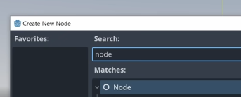
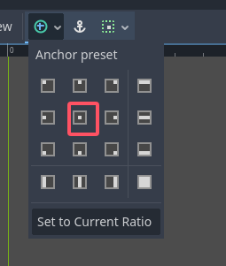
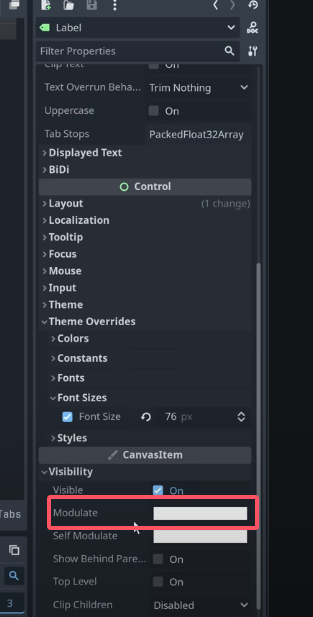
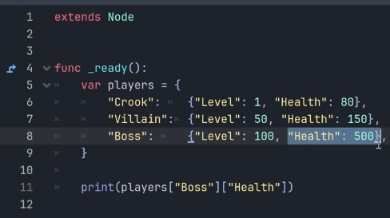
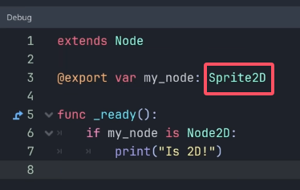
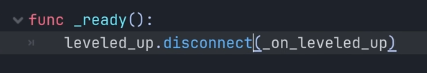
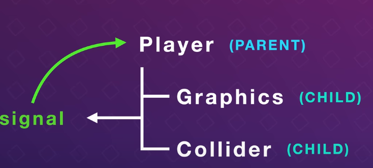

### How to program in Godot - GDScript Tutorial
[TOC]  

reference mannual：  
  

#### 1 . 创建项目
Let's begin by making a script and adding some code to print a message .  
To do that, we need a test scene, so add in a node, rename it to Main.  
  
然后ctrl+s把它保存成scene。  
再创建一个脚本。  
  

#### 2 . Syntax
（1）  
GD script similar to a language like python uses indentation to determine the structure of your code. This means that you use tabs to tell GD script where your code belongs.  
  
In our example here, I'm using a tab to tell godot that our print line belongs to the ready function.  
  
If I delete this TAB, I get an error.  

（2）Also GD script is case sensitive, so if I write 'print' with a capital P, I will also get an error.   
  

#### 3 . Modifying nodes 1.0
(1)  
【1】add a new node:  


【2】  
调整anchor，center on the screen：  
  

按住**alt键**调整大小：  
  

【3】输入文字居中  
  
  

【4】Change the text property  
Now to edit the text of this label through script, we need two things. We need a reference to the label and we need to access the property in this label that we want to change. In this case, the text.  
If we hover over text, we can see the name of the property through script, which is text with a non capital T.   
  

不加ctrl直接拽。  
  

  

【5】Change the color of the text  
In fact there's a property called **modulate** which allows us to tint Sprites and UI elements.  
  

  

  

#### 4 . Input  
(1)  
Let's say we want to turn this label red, when we press the space bar.  
To do this, we first need to set up an input action.  

Project -> Project Settings -> Input Map  
Here we can add actions. Actions allow us to bind keys to something that we want to happen.   
  

`_input()` just like `_ready()`, this is one of the built-in functions of godot, but instead of being called at the start of the game, it runs every time the game receives any input. Such as when we press a button. `event` is what we call the information about what triggered the function. Was it a movement of the mouse or the Press of a key?  

We need to check if the event that triggered the input was our action being pressed.

main.gd代码：  
```py
extends Node

# Called when the node enters the scene tree for the first time.
func _ready() -> void:
	$Label.text = "Hello, world!"
	$Label.modulate = Color.GREEN
	
func _input(event):
	if event.is_action_pressed("my_action"):
		$Label.modulate = Color.RED
		
	if event.is_action_released("my_action"):
		$Label.modulate = Color.GREEN
```

#### 5 . Variables 1.0  
  

#### 6 .  If-statements

```py
if x==y and y>z: 
    # code here

if x==y or y>z:
    #code here
```

#### 7 . comments
  
  

just remember that you can't have a completely empty function, we need to add the **pass** keyword to avoid an error.   

#### 8 . Variables 2.0  
Some parts of our game will expect a specific type of data and we will get an error if we try to use another type without converting.  
Converting from one type to another is called `casting` .  
代码：  
```py
extends Node

# Called when the node enters the scene tree for the first time.
func _ready() -> void:
	var number = 42
	var text = "Meaning of life: " + str(number) 
	print(text)
	
	var pi = 3.14
	print(int(pi))
	
	var position = Vector3( 3, -10, 5)
	position.x += 2
	print(position)
```
输出：  
```
Meaning of life: 42
3
(5, -10, 5)
```
Now by default gdscript is what we called dynamically typed. This means we don't define what type of data a variable can hold when we declare it.    
This makes it fast to create variables and flexible, because we can reassign data of another type at will.  
However it is also more prone to error and less performant than static typing.   
  

Luckily GD script allows us to statically type any variables we want. We can pick and choose totally based on preference .   

To statically type a variable, we simply add the type when declaring it.    

```py
extends Node

# so now this variable will always stay integer
var damage: int = 15

# We can even have godot automatically determine the data type.
# This is called invert typing and the result is exactly the same.
# damage2 is a static int.  
# this also means that the variable cannot change to another type.
var damage2 := 15

# will allow us to set it using the inspector
@export var damage3 := 15
	
const GRAVITY = -9.81
```

#### 9 . Functions  
  
So far we've been using some of godot's built-in functions like `_ready()` and `_input()`. Notice how these are prefixed with an underscore. This is to show that they are not activated or called by us. But by the engine itself.  

  
输入输出都规定类型。  

#### 10 . Random numbers
  
  
randi-->random integer  
randf-->random float   

#### 11 . Documentation
选中方法，边按ctrl边点击方法。  
  
也可以用于class。  

#### 12 . Arrays  

```py
extends Node

func _ready():
	var items = ["Potion", 3, 6]
	
	var items2: Array[String] = ["Potion", "Feather", "Stolen harp"]

```

  

#### 13 . Loops  
  

  

  

#### 14 . Dictionaries
  

  

#### 15 . Enums
  

有用的用法：  
  

What is actually happening behind the scenes here is that Godot is creating a constant for each state in our enum.  

#### 16 . Match
Match is the Godot equivalent of the switch statement from other languages and allows us to execute different code depending on the value of a variable. In this case, here we use a match statement to add some code for the different values of our enum .   
  

#### 17 . Modifying nodes 2.0
(1)  
  
直接拽的话，create a path。  
  
Hold down ctrl键 while releasing . This automatically creates a variable with the name of the node and the correct path.  

As you can see, it uses the `onready` keyword, this is because godot has a very strict order in which nodes are created.  

If we open the game and try to find the weapon node before it exists, we will get an error. `onready` simply make sure that godot waits until all child nodes have been created. So we don't get any issues.  

A quick note: the dollar sign here is actually just shorthand for using the `get_node` function.  
  

(2) You might have noticed that the path is relative. Our script is on the main node, so it starts right after that node. We can print the absolute path through script.  

  
  

Now paths are great for many things, but sometimes they can be a bit inflexible. They break if we rename any of the nodes in the path. And it's best to only use paths when the node we want to access is a child of the node we're working on.  

Luckily we can also use the export keyword to reference other nodes.  
  
  
也可以直接拽。  
  

  
这样就规定了类型只能是Sprite2D。
Sprite2D inherits form node2D.  

#### 18 . Signals 
Signals are messages that nodes can send to each other, we use them to notify that a certain event occurred.   

(1)    
点击绿色按钮：  
  
会看到：  
  

We can connect as many functions as we want to a signal, they will all be called when it gets emitted.  
This is really cool, because it allows us to link together nodes in a way where they don't have to be aware of each other.    

Button has no idea which functions are connected to the signal. It just tells it to emit. This makes signals great for seperating different parts of our game or decoupling.  

(2)  
Say we're playing a character that can level up by getting enough XP. Whenever we level up. There are probably many game systems that need to update. The UI, our player stats, perhaps we have spells or achievements that unlock. Updating all of these from player can quickly become a mess. Instead we create a leveled up signal that all these systems can connect to. Then all we need to do is have the palyer emit the signal when we level up.   
  

  
Set it to AutoStart, this will count down from one and when it reaches zero. It emits a signal called `timeout` .   
   

  
  

We can also connect signals through code. I'll disconect the signal in the editor.  
  
  
  

可以写入parameter  
  

#### 19 . Get / set
getters and setters allow us to add code for when a variable is changed. This means that we can do things like clamp a value within a certain range or emit a signal letting other parts of our code know that the variable changed.   
  

  
  

#### 20 . Classes 
GD script is an object oriented programming language. This means we generally structure our code inside of contained objects that interact with each other.   

We primarily do this using classes. For now, try to think of a classes as a blueprint.   

All the built-in nodes in godot are classes.   

If we add a Sprite node. We're instancing the Sprite class.   
  
  
在这个节点之上加一个脚本。  

Now to make it more clear that our script is a class that defines a character. Let's set the class name to `Character` .  
  
  

  


  

#### 21 . Inner classes  
These are classes that exist inside of another class, you mostly use these for bundling together variables and maybe add a function or two. They can be a good alternative to dictionaries, because they are sometimes a bit more safe to use.   
  
This is called being type safe.   

#### 22 . Inheritance
  
Notice how our script `extends Node`  
So our script derives from the Node class, this means that all the functions and variables of the Node class are also available in our class.   
Godot actually has a very nice way of visualizing this. When adding a new node, we can see all the nodes available to us.  
  
But some of these are organized under other nodes. That's because these nodes inherit from the top ones. For example both AnimatedSprite2D and Camera2D inherit form Node2D.   
  
This is because Node2D is a base class for all things that exist in 2D space. So since both a camera and a sprite needs a position in our world, they both inherit from it. And even cooler we can actually find our character class on this list as well.    
  
That's because when we create a character class, we're essentially defining a new node type.   

#### 23 . Composition 
Even though godot uses inheritance for its nodes. There are often better ways to structure your code. Godot actually leans itself really well to another way called `composition`.    
看这个视频：  
  

#### 24 . Call down, signal up
When writing GD script, there are of course many best practices that we can choose to adhere to. One that is particularly important is call down and signal up. Which we use as a rule of thumb when communicating between nodes.  
Every scene in Godot is a tree of nodes, and the beginning of the tree is called the root node, which is the highest in the hierarchy . When looking at two nodes, where one is right above the other, we say that they have a parent child relationship. And the child might also have a child and so on.  

Call down , signal up means that nodes are fine to call functions on the nodes below them in the hierarchy but not vice versa.   

Instead, nodes below should use signals to communicate that something has happened.  
  
The nodes above can then connect to these signals as they choose and act accordingly.  
Think of it like real life, parents are allowed to tell their children what to do, but children shouldn't directly command their parents to do things, instead, children signal their needs to the parents and the parents decide the next step.   

But what if we need to communicate between two nodes that are on the same level. You guess that these are called siblings. well here the common parent is in charge of connecting the signal from one sibling to the function on the other. This is most often done in the ready function right at the beginning.   
  

详细可以看这篇文章：  
https://kidscancode.org/godot_recipes/4.x/basics/node_communication/  

#### 25 . Style 
During this video, I've tried my best to adhere to the official GD script style guide. These are the conventions we use for naming and order to keep our code elegant and readable for others.  
链接：  
https://docs.godotengine.org/en/stable/tutorials/scripting/gdscript/gdscript_styleguide.html