### What is a node? Inheritance and Composition in Godot 4 
https://www.youtube.com/watch?v=w7eSSpiJv2U  

#### 1 . HIGH LEVEL
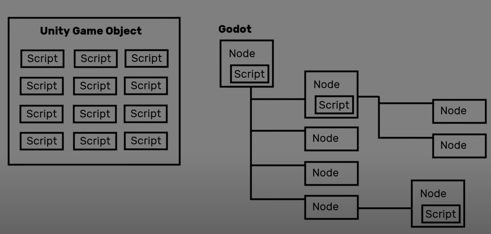  

In Unity, you have gameObjects which one game object can have a whole bunch of scripts.  

And in godot, you're going tp have nodes which only get one script per node.  

I've heard people use the phrase a composition versus inheritance . Idon't think that's very accurate, tho. Because I think Godot and Unity both have concepts they just implement them differently.  

Maybe this is a dumb analogy, Unity is kind of like a MOBA, you have these game objects that are large and powerful, they have a whole bunch of scripts attached and they do a large portion of work. Godot on the other hand is kind of like a real-time strategy, you don't have these super powerful nodes with a whole bunch of scripts attached, but you do have these formations of nodes that you put together and these do a lot of the work for you.   

#### 2 . 把节点删了，脚本还在
（1）  
这个节点（改名为Player）需要一个脚本  
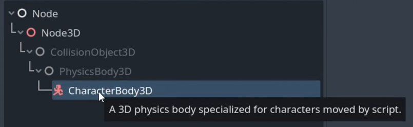  
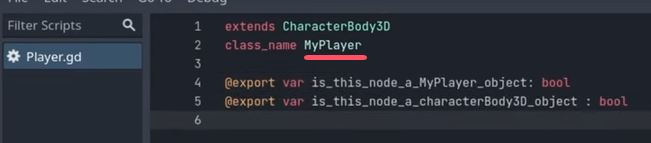  
创建好脚本后，把node删除。  
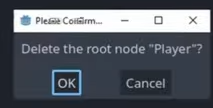  

（2）  
这时你想新建一个节点，输入myPlayer
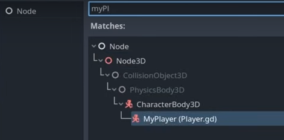  
You will notice that there is this class I just created. But not only does this class exist here, but everything leading up to it.  

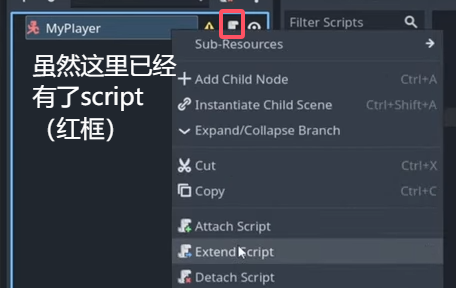  
But I can actually extend the script and make a new one.   
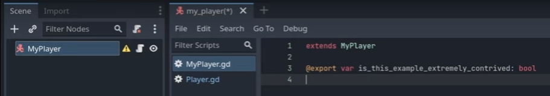  

【注意：  
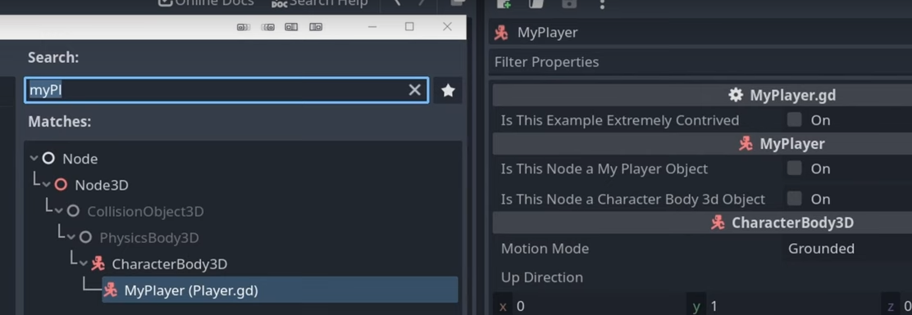  
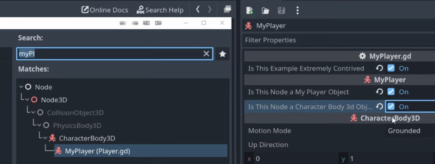  
】  

#### 3 . 可以改变节点的type
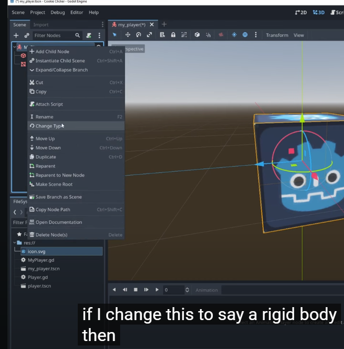  

#### 4 . node分类
I ended up separating this into four categories : Node2D, Node3D, Control node, and everything else that doesn't fall into the other three . 
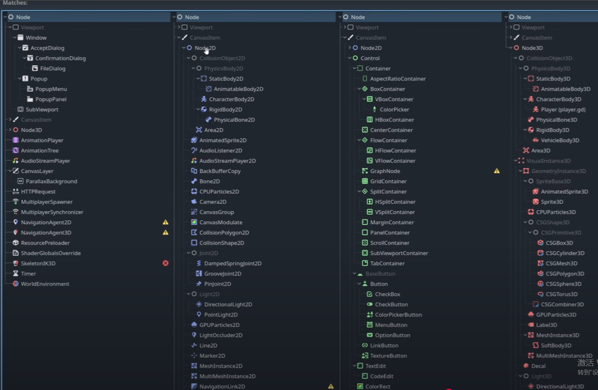  

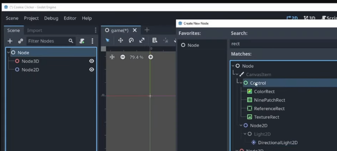  

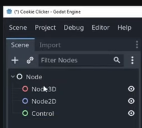  
Let's talk about the three base nodes and how they work and how they interact.  
Control node specifically are used for menus whereas node2D and node3D aren't .  

#### 5 . node2D下面也可能可以放control node。  
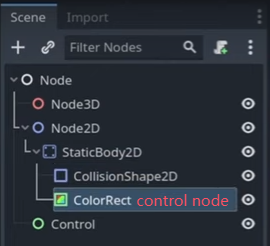  
How is this neing moved around, if the control node is not derived from a node2D.  
You are able to use 2D nodes with control nodes, 但是缩放那些可能会有点奇怪.  
缩放node2D或是staticBody2D或是colorRect都是不太相同的。  