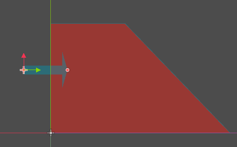
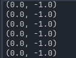

## slope slide
  
为什么斜坡对独立游戏开发很麻烦。  

### 零 . the three major issues with slopes
ref: https://www.youtube.com/watch?v=rHMJccb5IOM  
名称：Why Slopes are Shockingly Difficult for Indie Game Devs  

1 . PHYSICS  
2 . ART  
3 . LEVEL DESIGN    

### 一. physics  
1 . 斜坡跳跃问题  
game engines despise slopes.  
游戏有重力, it pulls the player towards the floor。  
在平地上重力方便。  
  

鸦说：在斜坡上想立住，也会由于重力往下移动（我没用slide这个词）。  
  

This is actually not that big of a deal. Most modern game engines have some kind of support for it.  
GODOT: turn on the features that **snap the player to the floor**. So that when you're standing on the floor and it can detect a slope as the floor. Once you're standing on the floor, you will not get pulled down. 

However now that she's stuck to the floor, **she can't jump**. Because the game engine is pulling her onto the floor.  

Fix this by : If you try to enter the jump state, you turn off the "snapping to the slope". This does have a little bit weirdness where you slide down a little bit more than you shold, when you transition from an aerial State into the grounded State on the slope.  

（鸦翻译加总结：为了让角色在斜坡上不受重力影响往下滑，在引擎中设置属性：“只要是地面就吸住角色”。但这会引起问题：在斜坡上无法跳跃。   
问题解决：按“跳跃”键，关闭该属性。在平面上没问题，斜面上会导致角色跳跃时会往下滑一点点。）    

2 . 下坡比上坡快  
Another issue: player has a horizontal move speed. When you're moving on a flat floor, the horizontal move speed is very consistent, that's how fast you're going. When you're going down a slope, you're also being pulled down by gravity, so you're moving faster. Similarly you're moving slower when you go up.  

解决方案：We can measure the normal Vector of the slope, and determine the angle that the slope is at, and then if you're moving up a slope, we can apply a boost that is equivalent to the offset from the angle of the slope.   

（鸦翻译加总结：问题：水平速度分量导致角色下坡比上坡快。因为下坡有重力。   
问题解决：通过法向量判断上坡还是下坡，上坡时给一个boost。）    

3 . 敌人AI不下坡  
敌人walk to the top of a slope but not walk down it, that's weird. What's going on with that?    
  
原因：  
  
The raycasts that are trying to detect ground collision to see there's still ground for them to walk on or if it's a ledge and they need to turn around, those aren't long enough to actually touch the slope. If the slope is steep enough. So some slopes they'll get to it. They'll see what they think is a hole in the ground, they won't walk down the slope.   
解决方案：either extending the raycast for the ground collision, that could potentially see a tile that they would walk off a ledge onto another tile.  
  
(图：extending)

so instead we have a secondary raycast that we can use to check is there a slope there. Because if we don't see any ground but we see a slope we know that we can continue walking.  

（鸦翻译加总结：问题：有时候坡度太斜，敌人角色会觉得是悬崖的“平台边缘”不会往下走。你可以加长raycast，但是太长又会在检测 悬崖（鸦瞎起的名字）直接触底。    
问题解决：加第二个 raycast。俺的理解见下图：）  
  
补充：我上图的分析有点错误，就是短的那根不要去测normal，直接测碰撞上了没，节省性能。而且最后两张图的raycast的x轴重叠最好。  

俺的实验：  
  

```py
extends RayCast2D

func _process(delta:float) -> void:
	print(self.get_collision_normal())
```

  
  
  
  
  
  
  
  

4 . 敌人AI不上坡  
The enemies are walking up to the bottom of a slope, but won't walk up it.   
  
So what's going on with that? We have a ray cast that shoots out in front of the enemy to see if they see a wall and if they see a wall they turn around. The problem is that the slope is deep enough, they will see there is collision in the way and turn around.  

解决方案：When we shoot out that raycast to see if there's a wall, we get the normal Vector of whatever we collide with and check and make sure that it's 90° or it's like close to it some offset, some value that determians what gradation of slope we're okay with walking up.  
We check that normal value make sure it's acceptable.   

（鸦翻译加总结：问题：如果坡度深，为了检测前方有悬崖向前发射的raycast会碰到碰撞体，然后转身离开而不上坡。 
问题解决：检测normal前方碰撞体的斜度。见3.中的实验） 

5 . 上面这些还没考虑projectile（炮弹） physics.  

### 二 . ART  
1 .   
  
idle状态和在斜坡上走的状态需要单独做动画么？  

standing attack斜坡上的也要单独做么？  
  

当角色横向特别宽的时候，在斜坡上就更奇怪了：  
  
  

The core issue here is that there isn't any perspective to these tiles so it doesn't look right. So the solution is to use perspective.   

2 . perspective   
  
hollow knight 没有persective tile。    
mega man x4用了persective tile， you get to see an extended view of it into Z-axis.  
  
hollow knight属于jutting floor.     
mega man x4属于perspective和fake perspective.    
mega man x4 does which is use a perspective view but the angles are directle straight into the z-axis.     

### 三 . level design  
  
ledge garding:    
There's a ledge. There's an enemy on the ledge. You have to jump to get up onto that ledge. You can't just like be there now.  That means the enemy on the ledge has a lot power over you. You can't just recklessly go up there. You have to engage form below. Being below the enemy, especially if that projectiles or other ways to guard the ledge, puts you at a huge disadvantage. It allows for some interesting game design. Slopes eliminate that.  

Hollow knight就没斜坡。  
  
