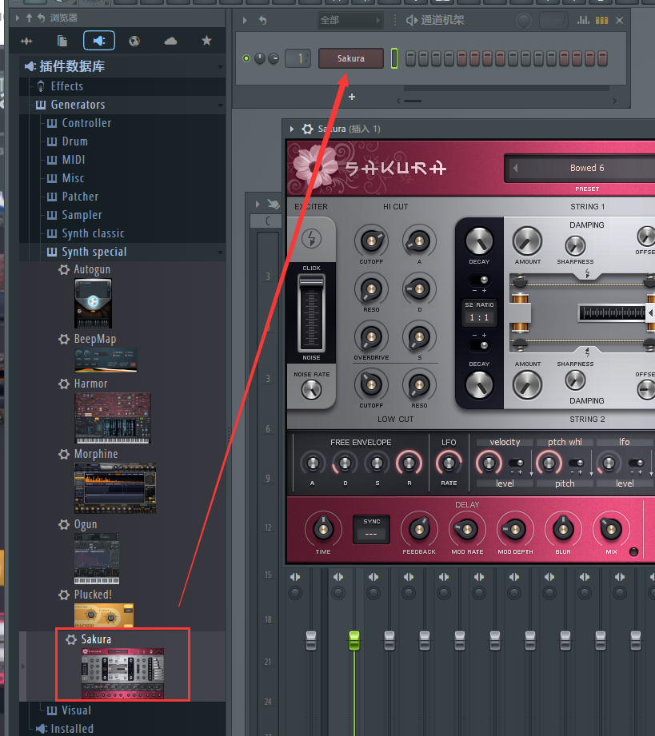
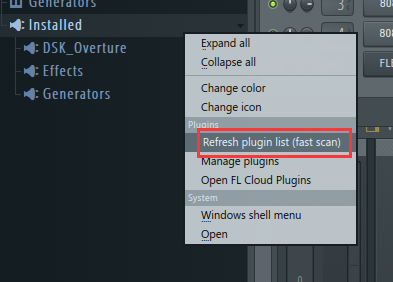
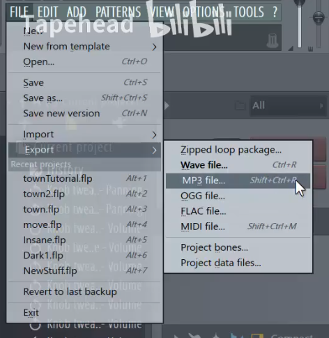

## Make Music For Games From Scratch
### 013 Quick Tour of FL Studio Interface  
1 .  
  
视图-通道机架  
左键选中，右键delete。  
  

2 . 浏览器-browser，文件在的位置  
  

3 . mixer-混音器  
  

4 . project picker （项目选择器）  
simply let you choose your projects patterns, get out of that, just press 'ESCAPE'键。  

5 .   
  

6 . 上面那几个功能对应这几个面板图标：  
  

### 014 How to input notes using only your computer  
1 .  
  
右键可以删除不需要的。  

2 . 插件数据库  
  

拽过去  
  

  
input: left click  
delete: right click  

  
the note that are appear after is the same length of your previous note  

3 . 加新的乐器  
  

这里用来选择不同的乐器。  
  

  

对这个按钮右键可以决定key note。  
  

layout那里默认是layout piano  
这个会导致有些键盘按钮没有音，这是因为它按照真正钢琴那样分布，有些是半音。  
所以你也可以选择major 或minor harmonic 或 major chord map（each key trigger a chord）或japanese insen（日本风味）  

  

### 015 How to Input Notes Using a MIDI keyboard  

  

OPTIONS -> midi setting   
  

### 016 How to install vst plugins on windows  

  

  

  

  

### 020 Music Theory 1 Notes, Chords and Scales  
1 .   
  

### 021 Write Our Harp Part  
1 .  
  

  

2 .   
rename:  
  

  

  

  

3 .   
rename:  
  

  

打开节拍器再听听，调一下tempo和位置。  
  

还可以再粘贴：  
  

the first beat should usually have stronger accent to it
  

### 022 Write our Flute Part  
1 .  
  

  

2 . 这里改成这个就可以看时间了。  
  

这个拉到这里就可以看时间了。  
  

3 . 调midi键盘出的声音  
  
确保上面选中，底下的右键。   

  

4 . 新建flute pattern  
  
  

  

### 023 Mix and Export   
1 . 这个叫panning。  
  

panning is positioning the instruments . You had your headphone left ear and right ear. Some instruments sound louder in left ear, and some in the right ear.   

because flute is the melody。 想让它更靠近中心，更加大声。  
  

de-select：快捷键：ctrl+d  

2 . export  
  

  
  
选择导出整个song还是单独的pattern。  