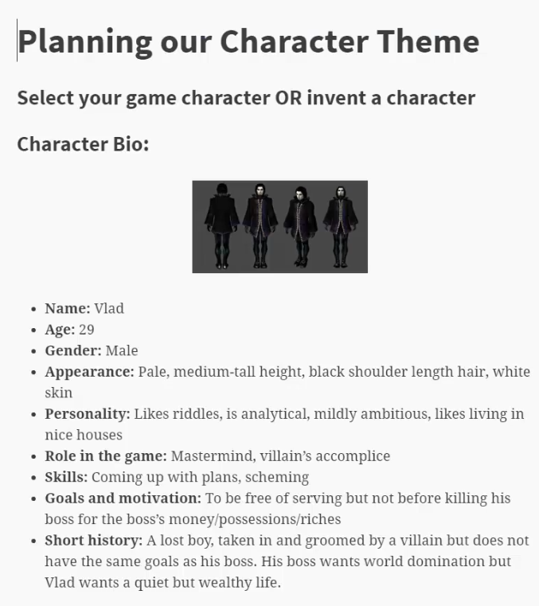
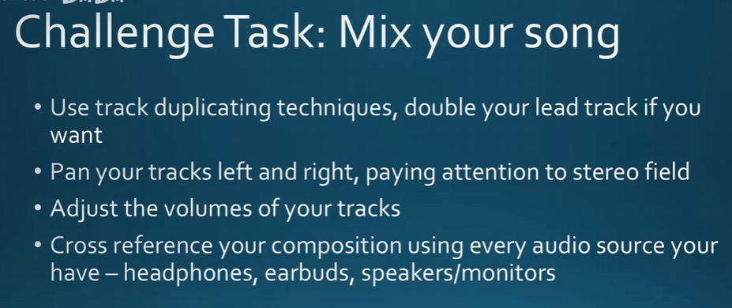

## Make Music （二）
### 28 How to Choose Instruments that sound good together  

  

What do I mean by go well together? It just means that they don't clash , the instruments won't fighting each other for dominance.  

And this all has to do with frequencies.  
  

For our composition, we want to choose instruments that cover the frequency range in a balanced way. So we don't want all that instruments in the Bass area. And we don't want all that instruments to just be in the Midrange or High Mids.  

If you imagine a song has no bass, just has someone singing, guita, and it's rock band. Than that might sound not very good. Cuz it's not has bass drum, bass guita. It's nothing driving in the bottom end. So you want your instruments to fill out the frequency from low to high. Quite balanced. Quite nicely.   

  

e.g. Harmor syth  
  

the vocals and guitar are in the same range. At first you might think they will clash, they are in same range. However the sound itself of both instruments are so different that they complement each other more than clash. 

However if you have a electric guitar play a lead part or play the guitar solo and you have the vocal on the same time. That wont work very well.  

because : 1 . they both playing melody  
　　　　2 . their frequencis are very close together

usually the guitar is little bit lower than the vocals in the frequency range. Which is why they don't clash together too badly. 

"Instruments of different frequencies contrast each other BUT there are exceptions"  
e.g. Guitar and Bass Guitar, they will go nice together. They are not going to fight for the same frequencies of sound. 

"BUT there are exceptions" basically meant that : you can use different frequency to support each other. It can play the exactly the same part（感觉指same notes） it will still sound nice.  So different frequencis doesn't necessarily mean that they have to play different notes. But even if they did play different notes, it will still sound good together.  
 
"lnstruments of similar families go well together" This nothing to do with the frequencies as much . It's to do with the different word--temper - which is the characteristic of an instrument sound. So violin,viola, cello, the double bass are the same family because they have the samiliar sound, but they are all from across different frequencies.

  

Also think of the characteristic of the sounds. If they are significantly different, even they are in same frequencies, they probably wont clash too much, like a guitar and vocals

【老鸦总结】：  
  

### 029 - Music Theory 2 Keys, Major and Minor  

  

What key is , is a specific group of pitches that follow a scale.  

A song can in different keys. A common thing for pop songs to do in the past is to start off of one key and in final chorus they will change to in a another key, just a bit of higher than the previous key.  

In composition, the most famous minor scale to use is the C harmonic scale.  
So what we want to do, is to use the C harmonic minor scale. Not the C natural minor.  

It's different for jazz, blues and rock. They use natural minor. But in classic composition, and in for our game and stuff. We should be use the C harmonic scale.   

  

Whole step and half step are also called tones and semi-tones in different contries.  

### 030/031/032 - Writing The Melody For Your Chosen Key  
#### Part One  
  

  

#### 补充027节的内容：  
  
  
或许稍微修改一下需要的乐器：  
  

这里可以切换音色：  
  

有个网站可以选免费插件：  
https://plugins4free.com/  
但是没有很多预览音色的视频，需要你自己手动拖到软件里去实验。  

所以可以直接查看网页：https://routenote.com/blog/10-of-the-top-free-drum-vst-plugins/  
  
这个网页have previews。  

  
SimSynth(软件自带) going to be the lead, playing the melody, sorta of in the mid-high frequency range.  UFO_ZED is going to play my bass. And the drum is going all over the place.   

  

### Part two  
  

第一个图形  
  

第四个图形  
  

  

### Part three  
用G-minor  
  

now if you using Gminor key. The 7th note here is F# . Every time I use F#, I should go to G, because the F# just wants to G.  
  

  
LeadPart1：intro  
LeadPart2：main melody  
  

### 033-Editing Our Melody For Time Quantizing, Snapping, Beats, Bars and Steps  

这里的数字代表一个bar。  
  
in each bar, you have four beats.   
  
粗线是main beat. 上图那条是：beat one of bar 2。  

一个beat之间还有更细的格子。  
  

The reason you need to know that, is because you want to determine how sensitively your snapping to the grid lines there. To what beats, to what half beats you want to snap them to.   

To control the quantize using snapping.   

**snap**：  
In a `Bar`, you have four `Beat`. In a Beat, you have four `Step`.  
**quantize**：
- Quick quantize：quantize three things：（1）the note's duration （3）the note start time （3）the note end time
- Quick quantize start times： will only quantize the start time。  
- Quantize（advanced tool）  
    
  
I think for quantize duration, it's probably very common for really fast notes that need to be short and snappy（精练的;简洁的;）. Or even a beat or drums or some hits that need to be very short .  

不同的情况对应的结果：  
(1) snap: bar; quick quantize  
  
  
  

(2) snap: bar; Quick quantize start times  
  

(3) snap: beat；Quick quantize start times   
  

(4) snap: 1/2 beat；Quick quantize start times   
  
视频作者用了第（4）种，你可以再听一遍，然后在之上做变动更符合你的听感。  

按住alt键调整某个note的duration不会被snap。  

  

### 034 - Editing Our Melody For Feeling Note Velocity  
  

全部进行调增可以：  
先按住ctrl选中这些notes。然后再双击这些note。    
  

### 035 - How to Add Bassline and Chords to a Melody
  
Depending on the scale you chosen for this project. My scale is G-minor. 所以我bassline要从G开始。

Basslines can leap more -- 因为Bassline 不是melody。

### 036 - Simple Trick in FL Studio to Help You

This is a good trick if you can't remember what notes in your scale. 

1 . 随便加个instrument  
  
rename it to 'scale'  
  

按了这个把这个变灰，让它mute。  
  

2 .   
  

  

  

3 .   
  
选择你用的那种scale。  

然后一点就会出现：  
拉到你合适的位置。也可以直接点到合适的位置。  
  

把它们尽量拉长：  
  

然后再复制，把不同8度的都整上。  
  

4 .   
  
  
确定ghost channels勾选了的。  
  

### 037 How to Write a Good Bassline for Your Melody
1 . I routed the bass instruments to the mixer, because it's way to loud.   
其他的也弄上：  
  
If you want to be able to inprovise well, you have to what your melody is doing. It changes in note. If it's sounds like entering a new section , entering a new bar, a new idea. Whatever your melody is doing, you want your bassline to support that. So you can change your bassline when your melody is changing. Don't move your bassline around too much like what I was doing, it doesn't sound very good.   

It just basically what I did just having some long notes, and just changing only when it's necessiary. I don't need to change a lot. I feel like there's not many chords change going on. I can hear that the melody kindof repeat certain ideas.   

尽管按照G minor scale应该从绿色（E flat）到 红色（F sarhp）。  
但实际听起来还是绿色（E flat）到 绿色（F natrual）好听。  
因为前者有个massive gap.  

  
It depends on context what you doing at that time which dictate whether you use F# or normal F.   

  

弄完可以删了scale，更清晰。bass可以分两个pattern: basslineIntro，basslineMain   

### 038 How to Build Chords from Our New Bassline
1 .   
加入插件   
  
换一种乐器  
  

2 . 从bass的pattern复制到chord的pattern作为一种guideGhost    
  

放置引导线：  
  
scale短一点点不要挡住bass，  
  
这样就看得见了：  
  

3 . 要paste到这里才能实际听得到chords。  
  

4 .  
stack chords  
  
bronken chords  
  
  
You can add a little bit rythm to your chords，有些可以长有些可以短. 有些段落比如结尾可以没有chords。  

  

### 039 Finish the Composition and Add Drums
  

There are different heights of drums.     
K1 K2 : kick drums。base drums。They form the backbone of your beat. They need to be consistent. You can change them in every section of your piece. But you can't have them random in every single bar.     

S1, S2：snare drums。They are the heart of a drum kit.   

HH1，HH2：high hats。They like every half beat or so. Just consistent hits.   

CL: clap。You canreplace a snare.   

HIT1 HIT2：tom-toms。They are on top of base drums. They use fullfills which is at the end of section of piece of music or just before a chorus or something that will accentuate what will coming next in your song.   

CY：crush symbol. 因为比较吵，所以少用。

主要用：HH，K，S

可以用电脑键盘输入  
  
选择layout piano  
也可以用鼠标点。  
老师是用midi输入的。  

### 到目前位置实操遇到的问题
【问题：】是这样的，我明明暂停的时候点亮了绿色小圆点。但是，一旦播放一会，UFOZED的绿色小圆点就灭了。
https://www.reddit.com/r/FL_Studio/comments/lp06vb/channel_rack_issues_why_is_it_doing_this/

【注意】record everything 可能把静音这个操作也record进去了。  
一些解决办法：  
（1）  
  
或直接暴力：
（2）  
因为上面的（1）不管用啊  
  
  
强制从0s开始发声。  

### 040 - Mixing 1 Duplicating Tracks Technique
Panning is panning left and right. My Lead is my melody , I want it to be pretty strong. I think I'm gonna use a technique, duplicating the Lead, having one Lead come from the left, having one Lead come from the right. The bass will come from the middle. And the drum will scatter all over，老师用的插件已经in-built不同乐器摆放在不同位置了，但我们用的是FPC。

If you remember stereo field it's like semi circle.  Imaging you watching an orchestra, you sitting in the middle. You have sounds coming from different sides. 

（1）CLONE一份LEAD  
  

（2）  
右键绑定：  
  

（3）要新建lead2Patern1 lead2Patern1并且放到playlist，才会有声音。  
  

（4）调节成左边右边，然后也可以改变一下音量。  
  

  

### 041 - Mixing 2 How to Tweak Plugin Parameters
1 .   

The bass isn't sound nice to me. It sounds like it's going out of tune a lot or detuning itself too much from my liking. 

插件的这些按钮，you can't reset. 所以改之前记得保存。  

I think it's under effect. I wanted to sound more flat. So it doesn't go out of tune that much.    

  

"Reverb" is the echo, the bouncing of sound waves around the room. If you're in a big concert hall / cave, it's gonna sound different if you're in a small little bedroom, dry environment, soundproof little booth. 

"Delay": how many milliseconds you sound is basically lagging by. 

"Chorus":   
Increasing the “Rate”: it kind of waves a lot up and down.   
decreasing the “Depth”:  sounds more flat.  
  

改了之后记得听听音乐，调调velocity，因为修改插件也会影响听感。   

2 .    
对lead的波形修改也会有其他音色的感觉  
  

  

### 042 - Mixing 3 How to use Equalisation to EQ your instruments
EQing：tweaking the sound of your track by manipulating its frequencies or the level of its frequencies. 

Bass is the instrument you should really be EQing the most. Bass has a lot of sub-bass in it. Sub-bass is that rumble, it's not even something you can hear. It's below the lowest frequencies.   

this pink line up here is the frequency response of the human ear. We hear sounds at 4k the strongest. And we hear sounds at mid-range the best. 

All the high freqs are almost inaudible for us. All the sub bass down here is completely inaudible for us. We would sense that through rumble like in a earthquake or something. 

（1）    
Routing from the mixer, there are instruments, to an effect or processing the effect. 

选中bass  
点这里：  
  

（2）  
I want to cut out the lowest and highest frequencies.   
  
  
选中这个点可以移动：  
  

（3）再在bass上加一个这个  
  
this time I'm gonna shape the sound of my bass.    
How strong you want certain frequencies to sound.   
e.g. you increase the intensity of those sounds.   
When you EQ, less is more.   

因为后面的升了，所以黄色圈（整体）这里要降一点。

（4）也想EQ drums。  
The bass drum is what I want to EQ. I wanna to not sound too loud. Especially in the bass range. Usually when I mix, I find the bass is always too loud. If I export straight away, it doesn't sound very good when I trying to play it on different source. As the bass always drowns out （淹没，压过） everything. 

So what I'm doing for the drums, actually when I play it, I see the pink lines appear. Those are the hits, the main drums taking place. This 粉色的2号是where the bass drum is , I want to give the bass drum a bit more of punch to it. And decrese the 紫色1号 sub-bass. 

pink line - 一种instrument

青色6号可能是clap. It sounds very loud, so I have to decrease the volume of that. 

蓝色7号是high hat, they are too high up, sound way too loud. 

四号五号是snare drums. 

  

  

### 043- Mastering Basics Learn the final phase of Music Production
Conposing is one thing, mixing is another thing, mastering the last thing. The difference between mixing and mastering is that mixing is tweaking the individual instruments one by one. Mastering is looking at the whole track itself, and mastering the entire track as a whole.  

#### Mastering 做法1：  
可以直接选中master 在这里的slot添加mixer.  
  

  

Everytime you make a piece of music and then you export it. You should not matter what slap a limiter on top of that.The reason is that you don't want your song to go above a certain decibel.（dB 表示音频信号的音量大小或电平。）That will cause cliping and it will sound very terrible when you actually export your song and share with the world.   
  
I'm not gonna teach you about compression or limiting at the stage. 
  

If you have a rock song, usually you EQ your track to have heavy bass and heavy Mids（中频）. If you have a song that's more soft, you want to keep the color of your track mutrual, or you want to increase the mids and highs, but you don't increase your bass, that's true also for classic music. 

老师后来又加了：  
  
第一个slot：  
  

第二个slot:  
what compressor does is it adjust certain bands of your track, so the low frequencies have been compressed more, because they will bit more louder.   
  
  
  
  
第三个slot：
后面凸一点，因为after you compress sth. it changes the sound（有些音有点flat）, i want to make the color come back. 
  
All the mids which were compressed before have been brought back to life . It's the bass I actually want to compress.   

第7个slot：  
The limiter determines the final loudness of your music. 
  
  
so the looudness will never be over -0.1dB.  

#### Mastering 做法2：  
The more profesional way to do is to export as wave file and bring that back to fl studio. And master directly on the track. And the reason for that is that you are not tempt to tweak the indivisual instruments after that anymore. You just focus on the track as a whole. color, EQ the track as whole, add compressor and limiter. 
  

### 044 - Best Audio File Formats for Game Engines and Game Soundtracks
mp3, they are compressed audio files, probably the worst audio format to use when you are tring to export high quality audio. 

WAV is used on windows. AIFF is used on mac. FLAC is for both. 

mp3 has meta data（unity）attached to it. and sometimes it delayed the starting time. If you want to loop over with mp3, sometimes you may find that there is a gap between the loops. So when it reaches the end, thers 's bit of gap before it stop. 

FLAC is smaller than wav and aiff. FLAC does use a format of compression, it's just basically condensing the file itself for the information in the file itself. 质量和aiff和wav相同。
  

  
  

放在游戏引擎里的版本不用在palylist 里 extend，因为引擎会帮你loop。但是ost里的需要。 

1 .   
怎么extend:  
  
全选 ctrl+c ctrl+v  

2 .     
mp3最少需要：  
  

256kbps也行，320kbps the best. 

3 .   
FLAC level 5就行：  
  
