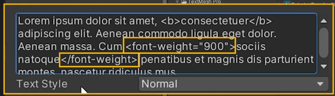

## TextMeshPro教程_01
https://www.youtube.com/watch?v=gVialGm65Yw&list=PLg0yr4zozmZX0dJZ-XNa4v0i_kAVx2sfY  

### 一 . Quickstart to TextMeshPro Basics - and how to level up
#### 1. 怎样import字体  
（1）导入字体  
（2）对字体右键-->Create-->Text Mesh Pro-->Font Asset.  
（3）然后把它拽过来。  
  

#### 2 . 脚本可以这样写  
```C#
using UnityEngine;
using TMPro;

public class SetText : MonoBehaviour
{
    [SerializeField] private TMP_Text textbox;
    [SerializeField] private string textToDisplay;

    public void SetTextboxText() {
        textbox.text = textToDisplay;
        textbox.color = Color.white;
        textbox.fontSize = 20;
    }
}
```

#### 3 . The Text Mesh Pro Default Settings 
You can find Text Mesh Pro's settings under :   
Edit -->  Project Settings --> Text Mesh Pro    
  


#### 4 . Setting parts of your text bold or recolor 
For example, you mignt want to display some parts of your text in bold - but clicking this button sets your whole text to bold instead.  
  
To get your desired result, you need to know about tags.  
Tags are small things you add to your string to mark certain parts in a way Text mesh Pro can understand.  
  
例子：  
   
  
These tags are part of the so called "rich text" capabilities and there are dozens of styles you can use. 
  
cheet sheet:  
[cheet sheet链接](./cheetSheet.pdf)

TMP的doc里也有关于rich text tags的内容：  
https://docs.unity3d.com/Packages/com.unity.textmeshpro@3.2/manual/RichTextSupportedTags.html  

#### 5 . 字体动画
If you enjoy cool text effects like shivering or jumping, maybe the paid asset called Text Animator, created by Febucci, is someting you might enjoy.  
  
在这个视频有教：  
  

### 二 . TextMeshPro Text Styles make working with Texts in Unity so much easier!
#### 1 . 
All of these Text Styles can be found in Text Mesh Pro's Style folder,  
  
in the aptly named "Default Style Sheet"  

  


  

If you have ever worked with CSS before, you will probably understand what's going on here at first glance.  

#### 2 .   
改变字体大小：  
  
  
BTW "em" refers to the typographic size of roughly one uppercase latter M in your chosen font.    
Thus, 1em means the size of the font will stay the same as set, while a size of 2em doubles it.  
  

在styles里的字体要放在这个文件夹下面：  
Edit -->  Project Settings --> Text Mesh Pro  
  

  
还可以把星星*删了  

#### 3 . 
通过这个按钮可以删去自己不想要的style ：  
  

使用Style可以改一个而变全部。 
  
  

#### 4 . `<style = "Bold">`
新建一个Bold  
  
  

You can use the style tag inside of stylesheets, too, so you can even further tweak how the results should look like!    
  

### 三 . How to correctly use font weight and font styles in Unity TextMeshPro   
font family:  
  

#### 1 . 问题
 
These different styles are important, because if your font doesn't have a dedicated Bold weight, for example, your system will try to be helpful and make one for you. The results can be quite hideous, tho. Also, this happens all the time while working with TextMeshPro, for example.  

用这个是因为可能出现下面的问题：  
  

I am setting the font in my text field to bold via the button, so it becomes clear when the switch form faux to true happens. You can try it with italic, too.   
点击这个字体就可以看到这个界面：  
  

#### 2 . 解决办法  
When I started out, I created a Font Asset for every style and dropped it in by hand into every text field and saving them as prefabs.  
  

  

主要是调整不同效果的意大利形和非意大利形的区分。  
从100到900的尺寸分别对应不同的名称。  
比如100就是Thin。  
200是Extra-Light。  

可以通过这里来访问font weight。  
  

也可以通过这里：  
CSS语言是这样子使用font-weight。      
  
也可以把这些加在tag里面。  

### 四 . Generate TextMesh Pro Style Tags with a click - let's build a tool!

Amazing as they are, if you are not used to writing tags, they can be a bit daunting to get correct and looking good.  
Let's build a tiny tool that will automate this process for us.   
At the end of this tutorial, we will have build this here: a script you can throw on a Gameobject that has a TMP Text component attached and it will generate the tags based on your choices.  
You'll just have to copy-paste them, since there's currently no way to automate that particular part.  
The neat thing is, you only need ths script rarely - thus I'm fine with it. Living its life as a monobehaviour instead of building a dedicated etitor tool.  
不经常用的功能可以做成monobehaviour的script而不是编辑器工具。  

Set your style up once, copy, paste and remove the component afterwards.  

#### 1. 
新建脚本 TMPStyleSheetCreatorPROTOTYPE.cs  

#### 2.  
As you can see, when you created a font asset in TMP, this part gets added.  
  
But if we want to use it as a font name for our font-tag, we need to get rid of it, since it doesn't work if we keep it.  
  
Thus, we will replace it with emptyness.  

代码：  
```C#
using JetBrains.Annotations;
using System.Collections;
using System.Collections.Generic;
using System.Globalization;
using System.Text;
using TMPro;
using UnityEngine;

public class TMPStyleSheetCreatorPROTOTYPE : MonoBehaviour
{
    public TMP_Text Textbox;
    public string OpeningTags;
    public string ClosingTags;

    public TextWeight textWeight;

    [ContextMenu("Read Values from TMP")]
    public void ReadValuesFromTMP()
    {
        StringBuilder openSB = new StringBuilder();
        StringBuilder closeSB = new StringBuilder();

        if ((Textbox.fontStyle & FontStyles.Bold) != 0)
        {
            //First, have it check if I am using a font style and if that style is Bold. 
            openSB.Append("<b>");
            closeSB.Append("</b>");
        }

        if ((Textbox.fontStyle & FontStyles.Italic) != 0)
        {
            openSB.Append("<i>");
            closeSB.Append("</i>");
        }
        if ((Textbox.fontStyle & FontStyles.UpperCase) != 0)
        {
            openSB.Append("<uppercase>");
            closeSB.Append("</uppercase>");
        }
        if ((Textbox.fontStyle & FontStyles.LowerCase) != 0)
        {
            openSB.Append("<lowercase>");
            closeSB.Append("</lowercase>");
        }

        string fontAsset = Textbox.font.ToString();
        fontAsset = fontAsset.Replace("(TMPro.TMP_FontAsset)", string.Empty);

        openSB.Append($"<font=\"{fontAsset}\">");
        closeSB.Append("</font>");

        float textSize = Textbox.fontSize;
        openSB.Append($"<size={textSize}pt>");
        closeSB.Append("</size>");

        Color textColor = Textbox.color;
        string textColorRGB = ColorUtility.ToHtmlStringRGB(textColor);
        openSB.Append($"<color=#{textColorRGB}>");
        closeSB.Append("</color>");
        //Color on the other hand is less intuitive.
        //First, we need to read the value, then convert it to an RGB color that works with TMP's tags.
        //finally, add it to our string builders like this.  

        float characterSpacing = Textbox.characterSpacing;
        characterSpacing /= 100;
        string cSpacing = characterSpacing.ToString("N3", CultureInfo.InvariantCulture);

        if (characterSpacing != 0)
        {
            openSB.Append($"<cspace={cSpacing}em>");
            closeSB.Append("</cspace>");
        }

        float lineSpacing = Textbox.lineSpacing;
        lineSpacing /= 100;
        string lSpacing = lineSpacing.ToString("N3", CultureInfo.InvariantCulture);

        if (lineSpacing != 0)
        {
            openSB.Append($"<line-height={lSpacing}em>");
            closeSB.Append("</line-height>");
        }
        //The author is on a German system, so when I had the code devide the spacing by 100 (which we need,
        //because of the way TMP uses these values), I get a comma value.  
        //Trouble is: TMP doesn't like comma values in its tags. 
        //That's why I need to add this part here: CultureInfo .InvariantCulture turns the comma into a dot,
        //while N3 tells the string to only have three decimal values.  
        //without this line : 0,50000001
        //with this line: 0.500  

        if (textWeight == TextWeight.Black)
        {
            openSB.Append($"<font-weight={"900"}>");
            closeSB.Append("</font-weight>");
        }
        if (textWeight == TextWeight.Thin)
        {
            openSB.Append($"<font-weight={"100"}>");
            closeSB.Append("</font-weight>");
        }

        OpeningTags = openSB.ToString();
        ClosingTags = closeSB.ToString();

        }

        public enum TextWeight {
            Regular,
            Thin,
            Black
        }
    
}

```
这里记得拽过来：  
  

使用：  
对脚本点击右键：  
  
这里可以调整font weight  
  

### 五 . Sprites inside your text boxes! How to use sprites in Unity Text Mesh Pro
导入这张图片：  
  

  
  

我们要reset your pivot points.  
原来的样子：  
  

if you keep your pivot point in the center of the graphic, it will actually be set to this position.  
  
So, you'll need to figure out where your Pivot needs to be set to. Every sprite you have will be treated like a letter. Thus, your pivot's x value should be the leftmost side of your sprite(or rightmost, if your writing system works like that)

and it's y value should correspond to where your text's base line is.   

You'll need to reset every sprites Pivot point, so if you have many of different shapes, this might take a moment.  
  

#### 1 . 
右键创建Sprite Asset。  
  

Project setting的text mesh pro那里：    
  

  

这里可以改名字：  
  

#### 2 . 
```
I'll need you to find me some Camomile <sprite name="Camomile"> , a few hands full of Poppy <sprite name="Poppy"> flowers and a few strands of Agapanthus <sprite name="Agapanthus">  , please.
```

注意`<sprite name="Camomile">`里面不能有空格，不然没有效果。`<sprite name="Camomile">`前后需要有空格。  
  

可以看出Poppy flower的图标有点太高了。  

选中这个，调整这里：  
  

BX moves the sprite on its X axis, BY on Y and AD gives it a little bit more spacing to the right of it.  

可以改这些参数：  
  

#### 3 . 
可以用上style，这样就不用每次都写一大串了。  
  

  

### 六 . Let's automate writing Style Tags into your strings for TextMesh Pro!

We will build a small system to automatically tag our texts for us - for example inside a dialogue or tooltip system.  

这样可以把text display出来。

  
---
上面这段代码不用加在工程里，只是个样例。

#### 1 . 
Dialogue.cs脚本：  
```C#
using System.Collections;
using System.Collections.Generic;
using TMPro;
using UnityEngine;

public class Dialogue : MonoBehaviour
{
    [SerializeField] private List<string> dialogueLines;
    [SerializeField] private TMP_Text textBox;

    private int _lineOfDialogue;

    private void Start()
    {
        textBox.text = dialogueLines[_lineOfDialogue];
    }

    public void NextLine() {
        _lineOfDialogue++;

        if (_lineOfDialogue < dialogueLines.Count)
            textBox.text = dialogueLines[_lineOfDialogue];
        else {
            _lineOfDialogue = 0;
            textBox.text = dialogueLines[_lineOfDialogue];
        }
    }
}
```
KeywordsToTag.cs脚本：  
```C#
using System.Collections;
using System.Collections.Generic;
using UnityEngine;

[CreateAssetMenu(fileName = "Keywords", menuName = "Keywords", order = 0)]
public class KeywordsToTag : ScriptableObject
{
    public List<string> Keywords; 
}
```

#### 2 . 
  
把keywords创建出来。  
  

#### 3 . 
写AutoTag.cs脚本  
```C#
using System.Collections;
using System.Collections.Generic;
using TMPro;
using UnityEngine;

public class AutoTagSystem : MonoBehaviour
{
    [SerializeField] private TMP_StyleSheet styleSheet;
    [SerializeField] private KeywordsToTag keywordsToTag;

    public string SetAutoTags(string textboxtext) {
        foreach (var keyword in keywordsToTag.Keywords) {
            if (styleSheet.GetStyle(keyword) == null)
                Debug.Log($"Text style needed for keyword {keyword}");

            if (textboxtext.Contains(keyword)) {
                return textboxtext.Replace($"{keyword}", $"<style=\"{keyword}\">{keyword}</style>");
            }

            string lowerKeyword = keyword.ToLower(); //小写也能识别
            if (textboxtext.Contains(lowerKeyword))
            {
                return textboxtext.Replace($"{lowerKeyword}", $"<style=\"{keyword}\">{keyword}</style>");
            }
        }
        return textboxtext;
    }
}
```
新建空物体，把这个脚本放上去:   
  

给它加上Tag：  
  

修改Dialogue.cs脚本：  
```C#
using System.Collections;
using System.Collections.Generic;
using TMPro;
using UnityEngine;

public class Dialogue : MonoBehaviour
{
    [SerializeField] private List<string> dialogueLines;
    [SerializeField] private TMP_Text textBox;

    private AutoTagSystem _autoTagSystem;
    private int _lineOfDialogue;

    private void Awake()
    {
        _autoTagSystem = GameObject.FindWithTag("AutoTagSystem").GetComponent<AutoTagSystem>();
    }

    private void Start()
    {
        textBox.text = _autoTagSystem.SetAutoTags(dialogueLines[_lineOfDialogue]);
    }

    public void NextLine() {
        _lineOfDialogue++;

        if (_lineOfDialogue < dialogueLines.Count)
            textBox.text = _autoTagSystem.SetAutoTags(dialogueLines[_lineOfDialogue]);
        else {
            _lineOfDialogue = 0;
            textBox.text = _autoTagSystem.SetAutoTags(dialogueLines[_lineOfDialogue]);
        }
    }
}
```
#### 4 . 
  

怎么解决plural的问题

  
