## TextmeshPro教程_02
### 七 . Display button prompts with sprites in TextMesh Pro
In this tutorial, I will show you how you can add button prompts to your text boxes based on your input system.  
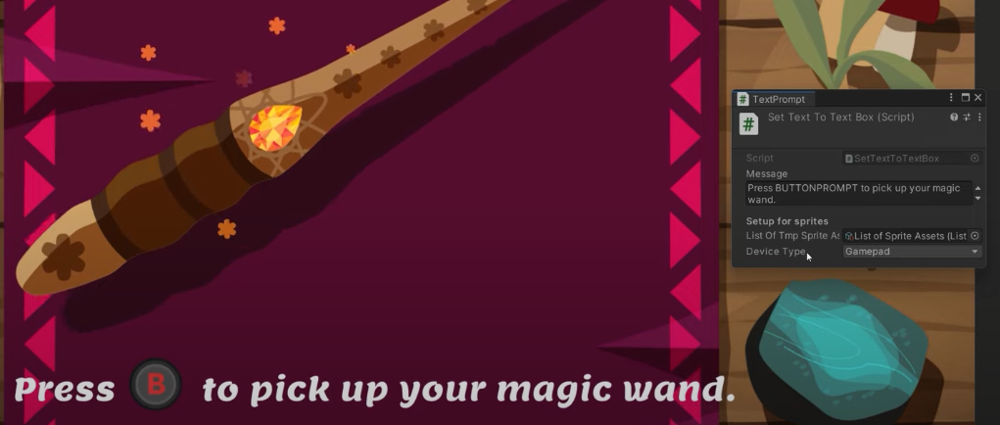  

#### 1 . 做成spritesheet
对于这个网址：https://codeshack.io/images-sprite-sheet-generator/  
把图片拽过来：  
点击这个生成sprite sheet：  
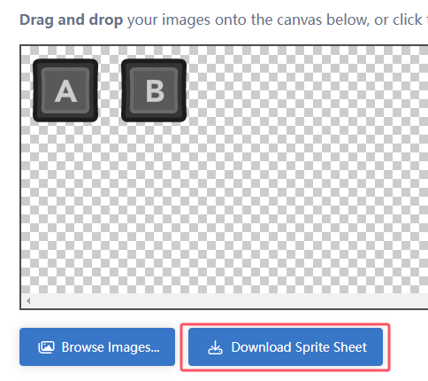  
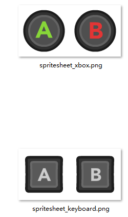  

#### 2 . 处理图片  
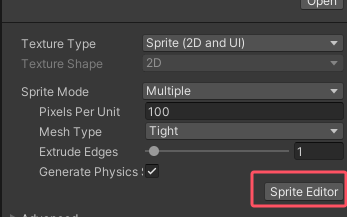  
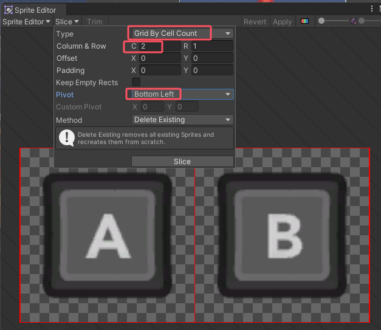  

再生成sprite asset  
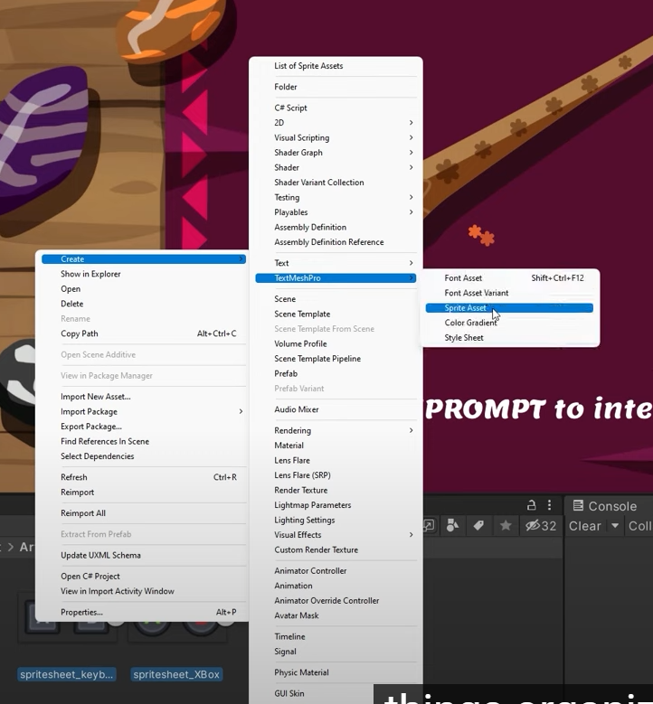  

在sprite asset里面改名字：  
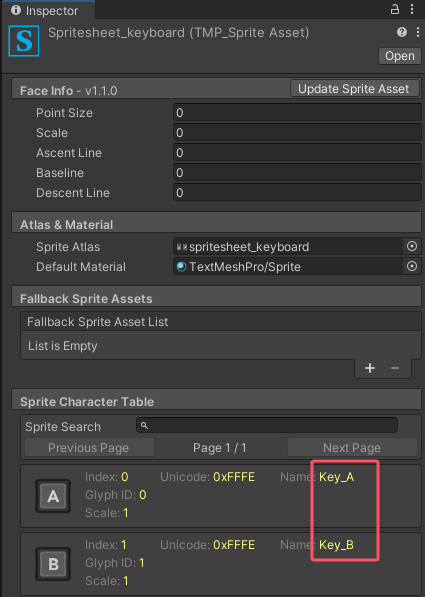  

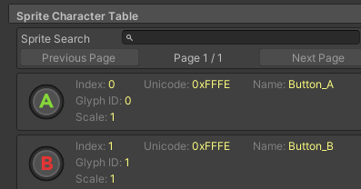  

把它们两个移动到tmp的sprite assets文件夹中：  
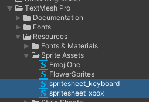  

#### 3 .   
First,let's see how to achieve it with the old and static input system.  
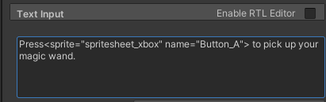  
```
Press<sprite="spritesheet_xbox" name="Button_A"> to pick up your magic wand.  
```
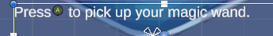  

时间轴2:44有讲input system的事情：  
她推荐的input system视频：  
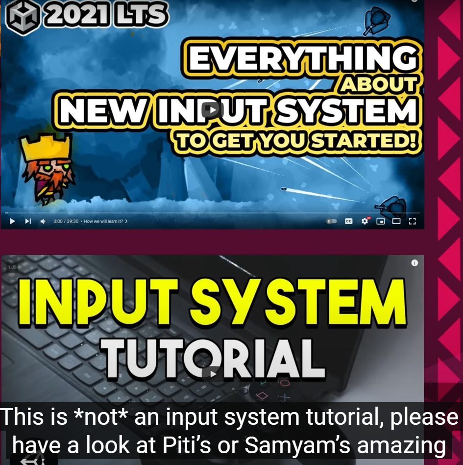  
