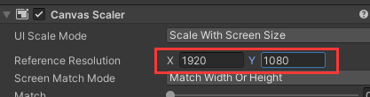

# Create ELDEN RING in Unity ► EP. 1 Netcode For Gameobjects

版本
  
新建一个：empty urp template作为project。
SRP means scriptable render pipeline. SRP allows users to customize the rendering engine for unity. 
如果想后期转pipeline可以在google搜“Converting a Project from the Built-in Renderer to the High Definition Render Pipeline”
好奇How to go between the built-in renderer and the scriptable render piplelines，搜索“Installing the Universal Render Pipeline into an existiong Project”
- URP Roadmap:https://portal.productboard.com/unity/1-unity-platform-rendering-visual-effects/tabs/3-universal-render-pipeline
- URP Docs:https://docs.unity3d.com/Packages/com.unity.render-pipelines.universal@10.8/manual/index.html

1 . 
（1）添加netcode   
去package manager  
  

change to **unity registry** in **packages in project**  
   

再搜"netcode"
  

(2)导入parrelSync link   
parrelSync is a unity editor extension that allows users to test multiplayer gameplay without building the project by having another unity editor window opened and mirror the changes from the original project.   
【1】
PackageManager ->  
左上角 + 号 ->  
Add package from git URL ->   
  
youtube描述区下的网址：
https://github.com/VeriorPies/ParrelSync?path=%2FParrelSync   
但这个直接填在里面是不行的，要加上git：  
如下：https://github.com/VeriorPies/ParrelSync.git?path=%2FParrelSync  
%2F好像就是/来着  
    
注意：  
电脑系统里要有GIT,且不连vpn。【注意看报错】  
【2】然后这里就有了：    
  
【3】把clone manager拽到inspector面板旁边  
  

2 .   
(1) create an empty gameObject called "Network Manager".  

(2) We're going to use a script from Netcode for gameObjects called “NetworkManager”. 
Just think of this like the thing that takes in all the information for the network between you and other players.   

(3)在networkmanager的script里 The only thing you need to change on this is the transport. 现在用Unity Transport, 未来用Facepunch.Steamworks。  
  
(4)单纯介绍：A host acts as a server and a client meaning a player and the server itself. A server will be something if you had something like in the cloud that just processes the information and a client is just a game client that connects to a server.  

3 . 
（1）在assets底下新建一个文件夹叫Art,  
在Art底下新建一个文件夹叫Models，把教程视频description section 里的【LOW POLY MAN】拽到【Models】文件夹下面。  
    
（2）新建一个文件夹叫【Data】,在其之内创建【Prefabs】文件夹。  
（3）把lowpoly小人模型拽到scene面板，把其名改为【Player】再把这个Player拽到新建的Prefabs文件夹之下，提示框选择“Original Prefab”  
（4）然后再把secene面板中的Player的gameObject给删了。  
（5）把这个【Player】的prefab拽到Network Manager的“Player Prefab”这一栏里  
  
 (6)【Player】的Prefab里Add Component: NetworkObject  
 解释：you're going to be adding this to basically every character in your project that is going to have some network data 之类的操作。e.g. all players, probably all of your AI  

4 .   
（1）在scene里创建image（UI）作为title screen menu.  
（2）取消勾选此image的Raycast Target，因为它不需要被鼠标点击事件track,勾上这个只是浪费内存。  
  
（3）在canvas的UI Scale Mode里选择Scale With Screen Size。  
（4）canvas的这里改成1920x1080  
  
（5）image改成黑色，image的anchor那里按住alt点击最右下角的那个按钮让image伸展到全屏幕。  
再把image的名字改为Title Screen Background

5 . 
（1）把canvas改个名
  
（2）给Background下新建Text子物体并改名“Title Screen Banner”  
（3）调整text的anchor到上端  
  
（4）在Background底下加个button叫“Press Start Button”并调整anchor到底下。然后uncheck raycast target.    
（5）改button的这两个颜色  
  

6 .   
(1)在“Title Screen Canvas”下新建script起名“TitleScreenManager”
输入代码
```C#
using System.Collections;
using System.Collections.Generic;
using UnityEngine;
using Unity.Netcode;

namespace SG
{
    public class TitleScreenManager : MonoBehaviour
    {
        public void startNetworkAsHost() {
            NetworkManager.Singleton.StartHost(); //start network as host
        }
    }
}
```
这个函数的作用是相当于点这个按钮。  
  
(2)然后把这个事件拽到button上。  
(3) 解释：the host is kind of like the server and a client at the same time.  
It is both a player and the server authority.   
A client is just a game client connecting to another host or a server.   
(4)event system的first selected把这个拽过去  
  
解释：this makes it when you start your game and automatically selects the press start button which is good if you're using a controller.  

7 .   
（1）把pressStartButton复制一份改个名字newgameStartButton，再把pressStartButton disable一下。把newgameStartButton的onclick事件删了。    
   
（2）在原本的pressStartButton下添加onclick事件  
  
(3)在“Ttile Screen Background”下建立empty gameObject改名“Title Screen Main Menu”，  
按住alt把它anchor和position调整到最右下角那个全屏。    
（4）再让new game start button是它的子物体。  
  
（5）在pressStartButton下继续添加onclick事件  
  
 绿圈解释：so if you press startButton, it will automatically select NewGameStartButton.  
 (6)然后把Main Menu disable了，把PressStartButton enable了。  
     
（7）记得把steam关了。

8 .  
（1）另存为Scene_Main_Menu_01这个scene，把sampleScene给删了。  
（2）新建一个scene，改名“Scene_World_01”。  
（3）在File->build setting里把这两个scene通过“add open scene”添加进去。  
  
（4）  
（5）在之下添加WorldSaveGameManager的script
```C#
using System.Collections;
using System.Collections.Generic;
using UnityEngine;
using UnityEngine.SceneManagement;

namespace SG
{
    public class WorldSaveGameManager : MonoBehaviour
    {
        public static WorldSaveGameManager instance;
        //this is going to be Singleton.
        //So this allows the script to be accessed from anywhere in the project at any time
        //and there's only one in the project at any given time.
        //you might want to use a getter and setter so you can't accidentally override that.

        [SerializeField] int worldSceneIndex = 1;

        private void Awake()
        {
            //THERE CAN ONLY BE ONE INSTANCE OF THIS SCRIPT AT ONE TIME, IF ANOTHER EXISTS, DESTROY IT.
            //means: On awake, we want to check to see if this variable has been filled.
            //If instance is not null for some reason, it means there's two of these scene at one time. there should never be . 
            if (instance == null)
                {
                    instance = this;
                }
                else {
                    Destroy(gameObject);
            }
        }

        private void Start()
        {
            DontDestroyOnLoad(gameObject);
            //meaning this stays with us through every scene that we load into
        }

        public IEnumerator LoadNewGame() {
            AsyncOperation loadOperation = SceneManager.LoadSceneAsync(worldSceneIndex);
            yield return null;
        }
    }
}
```
(6)TitleScreenManager的代码这里添加一个方法。  
  

（7）在New Game Start Button下添加onclick事件。  
  

8 .  
(1)our player model does not survive the scene change. So we need to make it so when our player model spawns, when the network starts, he survives the scenes changing  
所以在palyer的prefab里添加脚本：  
```C#
using System.Collections;
using System.Collections.Generic;
using UnityEngine;

namespace SG
{
    public class CharacterManager : MonoBehaviour
    {
        private void Awake()
        {
            DontDestroyOnLoad(this);
        }
    }
}
```
(2)创建物体并添加脚本  
  
```C#
using System.Collections;
using System.Collections.Generic;
using UnityEngine;
using Unity.Netcode;

namespace SG
{
    public class PlayerUIManager : MonoBehaviour
    {
        public static PlayerUIManager instance;

        [Header("NETWOEK JOIN")]
        [SerializeField] bool startGameAsClient;

        private void Awake()
        {
            if (instance == null)
            {
                instance = this;
            }
            else {
                Destroy(gameObject);
            }               
        }

        private void Start()
        {
            DontDestroyOnLoad(gameObject);
        }

        private void Update()
        {
            if (startGameAsClient) {
                startGameAsClient = false;
                // WE MUST FIRST SHUT DOWN, BECAUSE WE HAVE STARTED AS A HOST DURING THE TITLE SCREEN
                NetworkManager.Singleton.Shutdown();
                // WE THEN RESTART, AS A CLIENT
                NetworkManager.Singleton.StartClient();
            }
        }

    }
}
```

(3)在Prefabs下新建文件夹，把这些都拽过去。  
  
(4)Clones Manager -> start new clone -> open in new editor  
(5)点两下client editor里的这个  
  
(6)host editor的player模型变成两个了。