# Dual-Grid system
标题：Draw fewer tiles - by using a Dual-Grid system!   
作者：jess::codes  
https://www.youtube.com/watch?v=jEWFSv3ivTg

## 1 .  3x3 tile有256种组合形式。   
假设一个tile有8个邻居。  
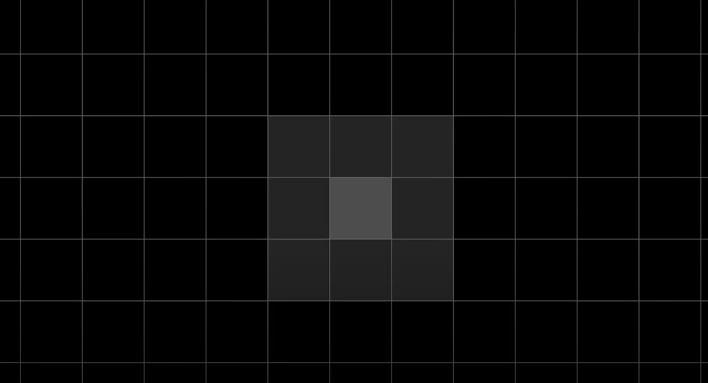  
Having a unique tile for each possible combination of neighbours would require 256 tiles!    
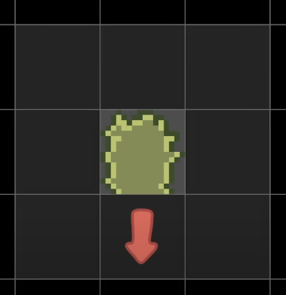  
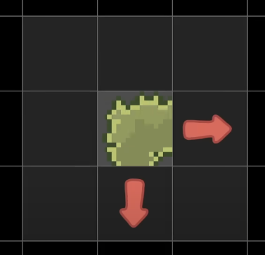  
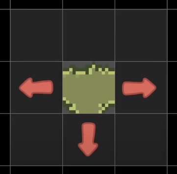  
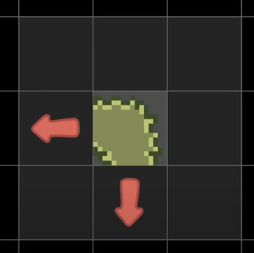  
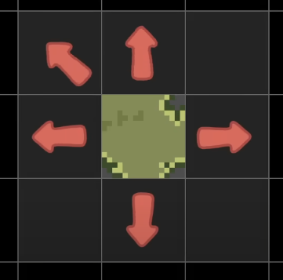  
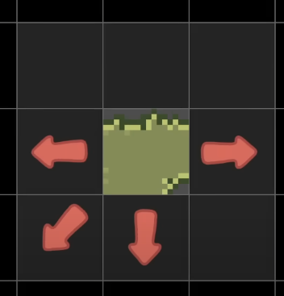  
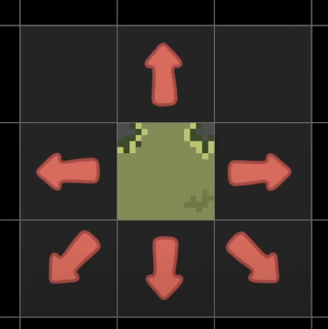  
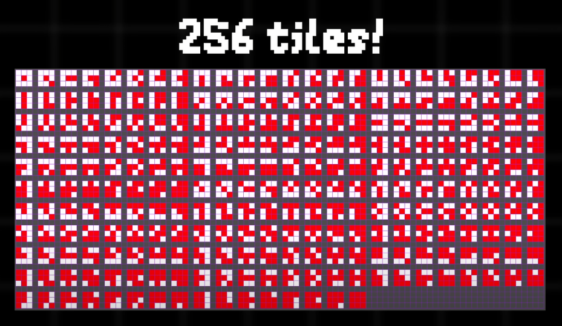  

## 2 . 
Today let's compare 3 commonly used tilesets, and then I'd like to show you a really cool alternative called the dual-grid system.  
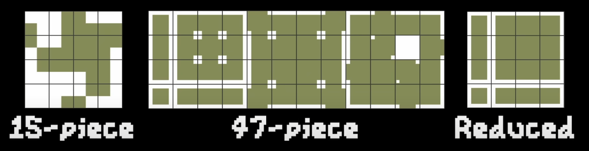  
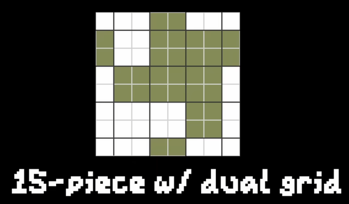  
### 2.1 15-piece tileset
Let's start with the classic 15-piece tileset. Although it does not contain many tiles, it has one major problem. Because the edges are drawn through the middle of each tile,   
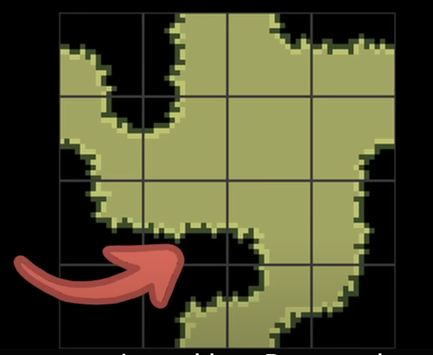  
by default they don't align with the world grid. This results in ambiguous tiles.  