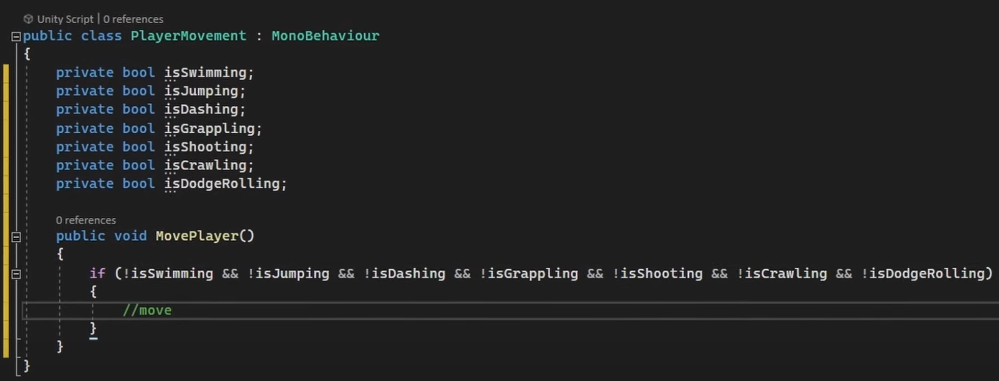
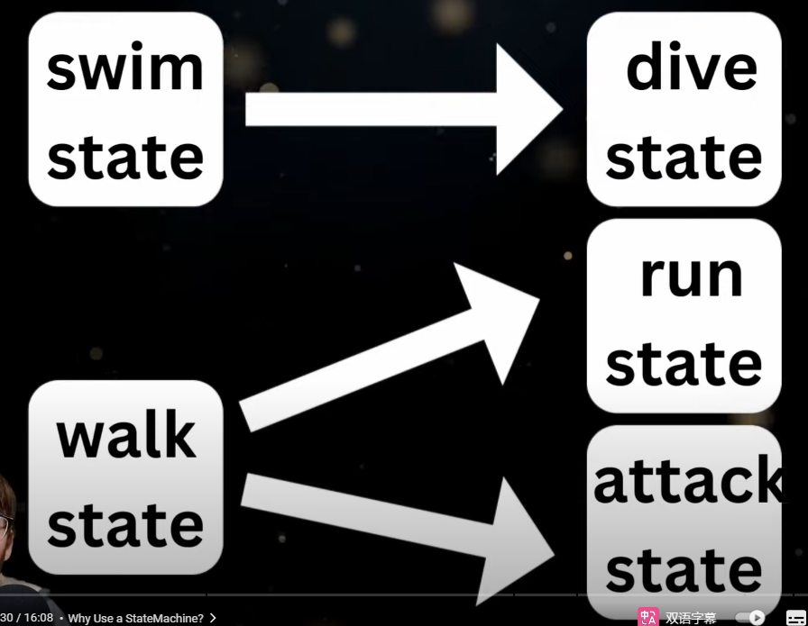
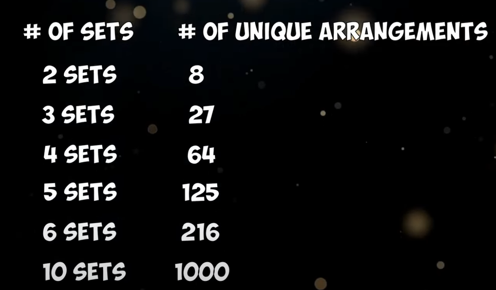

###  Finite State Machine  Tutorial
A Better Way to Code Your Characters in Unity | Finite State Machine | Tutorial  
https://www.youtube.com/watch?v=RQd44qSaqww  

I use State Machines for the player character in every game that I make and I do that so that I can avoid a mess of a bunch of checks like this：  
  

#### 1 .   
With a state machine, each state is self-contained, which means that you're left with smaller, more manageable scripts, with direct control of what states can switch to what states.
  
This youtuber wanted to have a high amount of enemy variety but he wanted to create a way to make it as easy as possible to creat a high variety.

在这个视频我们会设置3个states：  
（1）idle  
（2）chase  
（3）attack  

unique combinations：  
  
