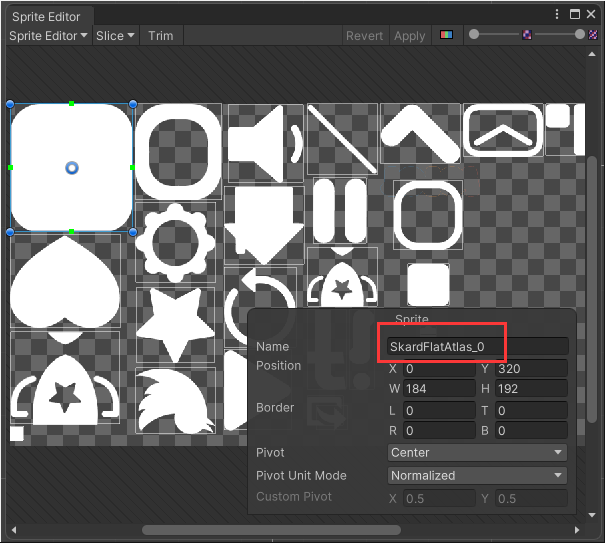
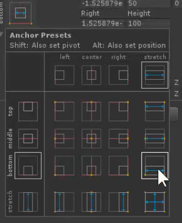
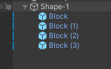
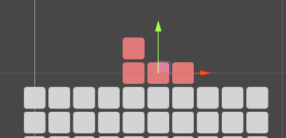
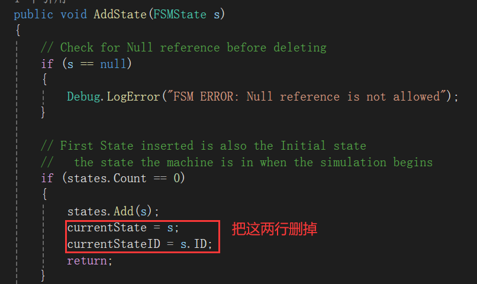
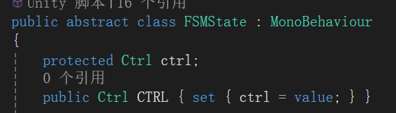
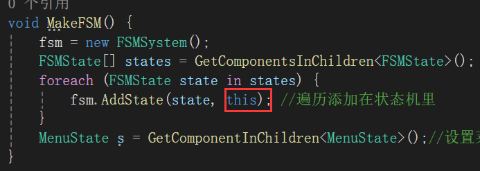
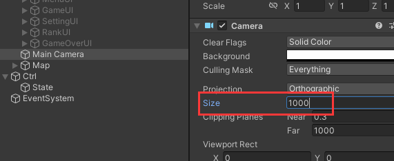

### MVC俄罗斯方块(上)
#### 1 . 什么是MVC架构
对于游戏来说它是没有一个统一的架构去开发这个游戏的。

MVC这三层：  
Model（模型）：用来存取数据 e.g.分数，地图的数据（这些数据一般会发生变化）e.g.人物的等级血量游戏物品  
View（视图）：玩家可以看到的部分，交互的界面  
Controller（控制器）：控制游戏逻辑  

分层的好处：将来如果2D改成3D外观

pureMvc现成的框架，学习起来比较困难

#### 2 . 创建工程，导入素材
（0）选用7：10的比例  
  
（1）  
这个是配色方案：  
  
(2)选中sprite，点击sprite editor  
   
为每一项更改名字：  
  
  

  
所以这个是62像素是不到1米。   
  

#### 4 . 创建MVC的架构脚本、分好层
Ctrl层是一个桥梁，连接着Model层和View层。  
Model层跟View层是不交互的  
（1）创建3个empty gameObject，分别叫：  
Model  
View  
Ctrl  
(2)在Scripts的文件夹下新建三个文件夹：  
  
  
再把这些脚本挂到对应的游戏物体上  
（3）为游戏物体添加标签，标签加到对应游戏物体上：  
  
（4）再Ctrl脚本写入代码：  
```C#
public class Ctrl : MonoBehaviour
{
    [HideInInspector]
    public Model model;
    [HideInInspector]
    public View view;

    public void Awake()
    {
        model = GameObject.FindGameObjectWithTag("Model").GetComponent<Model>();//FindGameObject后面没有s
        view = GameObject.FindGameObjectWithTag("View").GetComponent <View>();
    }
}
```

#### 5 . 创建菜单界面UI中的按钮
（1）中文字体TMP（BV1uM41177zn）  
【1】对着中文字体右键creat -> TMP -> Font Asset  
  
【2】复制一个属性设置为dynamic  
把第一个字体设置为static  
然后把复制的那个拽进这里  
  
里面推荐看的视频：  
BV1Kr4y1T7XB

（2）按住alt可以等比例缩放  
  
（3）把colorStyle拖到UI底下然后用吸色工具吸色。  
  
上面这一串是界面颜色  
下面这一串是方块的颜色   

（3）把Main Camera的背景设置为白色

（4）在Canvas底下新建子物体：emptyGameObject并改名为MenuUI。  
对齐下方并拉伸：  
  

（5）在sprite editor里将绿线拉到这里可以，是为了有关拉伸的操作。   
  

（6）在BUTTON(尺寸100x100)下新建Image，  
Image Type选择simple。  
并且居中拉伸，然后上下左右间隔都弄20。   
  
  
再把这个Button做成Prefab复制3个：  
  
  
改名，RankButton的图片的sacale的y设置成-1可图片上下翻转。
把Prefab里Button的子物体Image的raycast Target取消勾选  
  

#### 6 . 设计菜单的UI的布局和颜色
（1）通过取色更改一下颜色    
  
（2）自动布局  
【1】在MenuUI下添加Horizontal Layout Group组件  
  
  

#### 7 . 设计游戏中的UI界面  
（1）在Canvas创建空游戏物体，改名GameUI，然后按住alt选择这个，居上左右拉伸。  
  
（2）把pause button的大小和里面图标的间距调小。  
  
  

把pause button的anchor放在右上角。  
  
  

(3)“分数”二字是父物体ScoreLabel，“100020”是子物体score。两者的raycast target可以取消。    
  
100020的字体是eurof。   

（4）修改一下颜色和文本  
  

(5) 把Canvas移动到View地下：  
  

#### 8 . 开发设置的UI界面
（1）在canvas下添加image改名SettingUI，并按住alt键拉伸到全屏幕：  
  

把这个image透明度调低：  
  

（2）添加这些，并把Background的raycast target给取消勾选。  
  
  

（3）为audio button添加斜杠图像，并改名mute。  
  

#### 9 . 开发分数和游戏记录显示的UI界面
（1）复制SettingUI改名RankUI并修改里面的内容：  
  
  

#### 10 . 设计游戏结束的时候GameOver界面。  
（1）复制RankUI改名GameOverUI并修改里面的内容：  
  
  

#### 11 . 设计俄罗斯方块的背景地图
（1）  
把Tetris Assets里的sprites的block拖到Hierarchy并把它设置成prefab。

这个block长宽大概是0.9米。  
地图坐标Position是从0,0开始。这样它的Position坐标就可以正好转换为二维坐标系的索引。二维数组的索引。  

ctrl+d复制以后，按住ctrl移动，可以1米1米的移动。   
（2）10个Block为1row。做20个row放到map空物体中。  
  
  

（3）调一下main camera的位置和size
  
并把canvas，main camera, map都拽到view底下。  

#### 12 . 设计下落的基本图形
（1）在prefabs文件夹下面新建Shapes文件夹  

（2）把block的prefab拖到画面中，新建空物体作为它的子物体改名为Shape-1，把Shape-1的位置reset，再让Shape-1作为block的父物体，这样可以让两者位置一致。  

（3）再做出其他的Block
  
  
把block的prefab设置标签为“Block”  
  

（4）添加旋转中心  
   
设置旋转中心时保证旋转后还在地图的方格上，不能有偏移了。

（5）把Shape-1拽到prefabs的文件夹下的Shape文件夹下：  
  

（6）Shape-2 是I形。  
  
  
直接把shape-2从hierarchy拖到prefabs里。  

Shape-3  
  
绿红箭头在的地方是旋转中心

Shape-4  
  
绿红箭头在的地方是旋转中心

Shape-5  
  
绿红箭头在的地方是旋转中心  

Shape-6  
  
绿红箭头在的地方是旋转中心 

Shape-7  
  
绿红箭头在的地方是旋转中心   

  

#### 13 . 导入游戏有限状态机FSM和分析游戏状态

（1）  
有限状态机在siki学院的这几节课里面讲了。  
  

https://web.archive.org/web/20210420233819/http://wiki.unity3d.com/index.php/Main_Page
搜"state"

  

但是上面这个网站已经过期了，我把代码里的注释打上去在谷歌搜到这个：
https://discussions.unity.com/t/finite-state-machine-project/416733

有限状态机管理游戏状态，  
游戏状态分为这几个状态：  
开始状态-开始状态也是我们的菜单状态  

游戏状态-游戏中的状态  

暂停状态  

游戏结束状态-失败   

（2）在scripts文件夹里新建文件夹FSM   
新建FSMSystem类把网络上的代码烤过去。

（3）FSMSystem这个类不需要继承自monobehaviour类，因为这个类不需要挂在游戏物体身上。

这里面一共有两个类：FSMState，FSMSystem。

FSMState我们需要把它挂在游戏物体上，所以我们需要FSMState继承自Monobehaviour。  
  

我们将在Ctrl层创建含有四个状态的脚本。

（4）在代码中添加这4种状态：  
  

#### 14 . 创建四个游戏状态类和状态机，设置默认状态
（1）新建脚本  
  
这几个脚本都继承自FSMSatate。   
（2）
start()和update()方法暂时不用。  
  
重写抽象类：  
  

这个Act()和Reason()方法在我们的State这边并不总是需要的，所以可以把Act()和Reason()方法改成虚函数，这样我们不一定去实现了。 
  

performtransition里的foreach的完整版：  
```C#
        foreach (FSMState state in states)
        {

            if (state.ID == currentStateID)
            {
                // Do the post processing of the state before setting the new one
                currentState.DoBeforeLeaving();

                currentState = state;

                // Reset the state to its desired condition before it can reason or act
                currentState.DoBeforeEnterting();
                break;
            }
        }
```

改成这个样子：  
  

这样重写的方法就可以删除掉了：  
  

（3）把其他3个state也改成继承自FSMState  

(4)hierarchy的ctrl空物体下创建名为“State”的空物体。上面放置我们的四个状态。再把四个脚本拉过去：  
  
为什么把state做成游戏物体放在这里呢，因为后面有些事件需要状态来去监听，不同状态下一些按钮的点击事件，所以我们放在这里可以通过拖拽来监听一些事件。  

（5）接下来我们在Ctrl脚本构建有限状态机。  

原来FSMSystem是按照第一个调用的AddState的作为默认状态，没有设置默认状态的方法，我们需要自己写一个。  
这个s.ID我们还没设置，一会我们要去设置每个状态的id。  
在FSMSystem类里添加：  
```C#
    public void SetCurrentState(FSMState s) {
        currentState = s;
        currentStateID = s.ID;
    }
```
  

Ctrl脚本代码：  
```C#
using System.Collections;
using System.Collections.Generic;
using UnityEngine;

public class Ctrl : MonoBehaviour
{
    [HideInInspector]
    public Model model;
    [HideInInspector]
    public View view;

    private FSMSystem fsm;

    public void Awake()
    {
        model = GameObject.FindGameObjectWithTag("Model").GetComponent<Model>();//FindGameObject后面没有s
        view = GameObject.FindGameObjectWithTag("View").GetComponent <View>();
    }

    void MakeFSM() {
        fsm = new FSMSystem();
        FSMState[] states = GetComponentsInChildren<FSMState>(); //获取子物体，子物体是State空物体挂了4个state的脚本
        foreach (FSMState state in states) {
            fsm.AddState(state); //遍历添加在状态机里
        }
        MenuState s = GetComponentInChildren<MenuState>();//设置菜单状态是默认状态
    }
}

```

#### 15 . 给状态添加ID，导入DOTween插件
（1）  

这个stateId有什么作用：用来控制状态转换的时候，通过stateId来区分  

在四个State脚本中：
```C#
public class Playstate : FSMState
{
    private void Awake()
    {
        stateID = StateID.Play;
    }
}

public class PauseState : FSMState
{
    private void Awake()
    {
        stateID = StateID.Pause;
    }
}

public class GameOverState : FSMState
{
    private void Awake()
    {
        stateID = StateID.GameOver;
    }
}

public class MenuState : FSMState
{
    private void Awake()
    {
        stateID = StateID.Menu;
    }
}
```
（2）  
在四个状态脚本里面可能会去处理一些事件，有可能需要进行状态的切换，要通过Ctrl脚本的FSMSystem fsm的Performtransition。  
在FSMState类中添加这两行让外界可以访问：  
   
  
这样Ctrl脚本就可以访问FSMSystem fsm。

（3）在这里点击这个来设置dotween。  
  
  

#### 16 . 开发菜单MenuUI的显示动画
（1）  
在View脚本添加代码：  
  

（2）  
在view脚本中添加头文件`using DG.Tweening;`

不同UI的Anchor是不一样的。  

把LogoName的anchor设置为上边：   
这一步要先设置不然PosY的值会变。   
 

默认LogoName的UI和MenuUI是在画面外面的，然后运动进来。  
复制这里的值：  
   

  

然后把它拖拽到默认位置的外面：  
   

LogoName默认是隐藏的。

对menuUI也做同样处理。  

View脚本：  
```C#
    public void ShowMenu() {
        logoName.gameObject.SetActive(true);
        logoName.DOAnchorPosY(-73.0f,0.5f);//时间暂时设置为0.5s

        menuUI.gameObject.SetActive(true);
        menuUI.DOAnchorPosY(101.97f, 0.5f);
    }
```
#### 17 . 进入菜单界面，调用菜单显示
(1)  
View脚本可以通过Ctrl脚本访问，所以我们可以通过MenuState访问Ctrl脚本，Ctrl脚本访问View脚本。  
修改FSMSystem脚本：   
  
  
修改Ctrl脚本：  
  

这样MenuState类就可以调用view类里面的方法。  
```C#
public class MenuState : FSMState
{
    private void Awake()
    {
        stateID = StateID.Menu;
    }

    public override void DoBeforeEnterting()
    {
        ctrl.view.ShowMenu();  
    }
}
```

(2)但现在是状态切换的时候才调用DoBeforeEnterting()方法，默认情况下不调用这个方法。  
所以在SetCurrentState方法里添加代码`s.DoBeforeEnterting();`：  
即第一个状态（默认状态）时，后面切换状态时不用管。  
FSMSystem代码中：  
```C#
    public void SetCurrentState(FSMState s) {
        currentState = s;
        currentStateID = s.ID;
        s.DoBeforeEnterting();
    }
```

Ctrl脚本中：  
  
MakeFSM()在Ctrl脚本的Awake()函数里调用。

ShowMenu方法访问logoName和menuUI是在View脚本的Awake函数里访问。所以有可能logoName和menuUI会出现空指针。

怎么解决问题：   
赋值在Awake里面，调用在Start里面。  

所以在Ctrl脚本中：  
  
  

#### 18 . 控制相机的动画（视野放大和缩小） 
（1）  调整相机POSY  
  
目前的GameUI挡住背景了所以摄像机需要向下调整。  

  
  

（2） 调整摄像头size  
因为背景需要在这两个UI之间。  
  

调整这个位置：  
  

通过代码控制相机的size变化：  
在Ctrl空物体新建脚本CameraManager.cs  
  
```C#
public class CameraManager : MonoBehaviour
{
    private Camera mainCamera;

    private void Awake()
    {
        mainCamera = Camera.main;
    }

    //放大
    public void ZoomIn() { }

    //缩小
    public void ZoomOut() {
        mainCamera.DOOrthoSize(16.48f,0.5f);
    }
}
```
(3) Ctrl脚本里添加：  
  

（4） MenuState脚本里添加：  
  

（5）把相机size改成1000，让背景一开始看不到。
  

