### MVC俄罗斯方块（下）
#### 19 . 控制MenuUI的隐藏   
(1)
功能：  
点击这个按钮从MenuState切换到PlayState，   
把menu菜单隐藏掉，显示我们的play菜单  
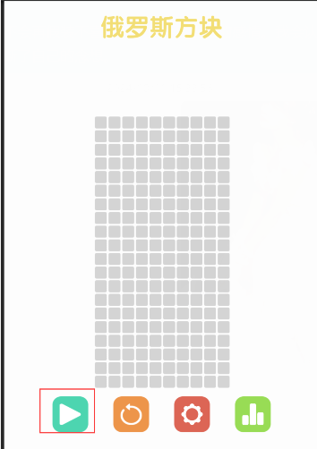  
给这个绿色按钮添加事件：  
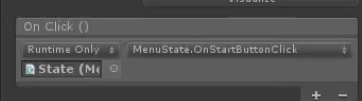  

（2） 在FSMSyestem脚本中添加这一行代码：  
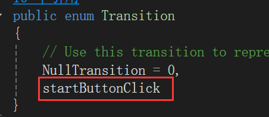  

(3)MenuState脚本：  
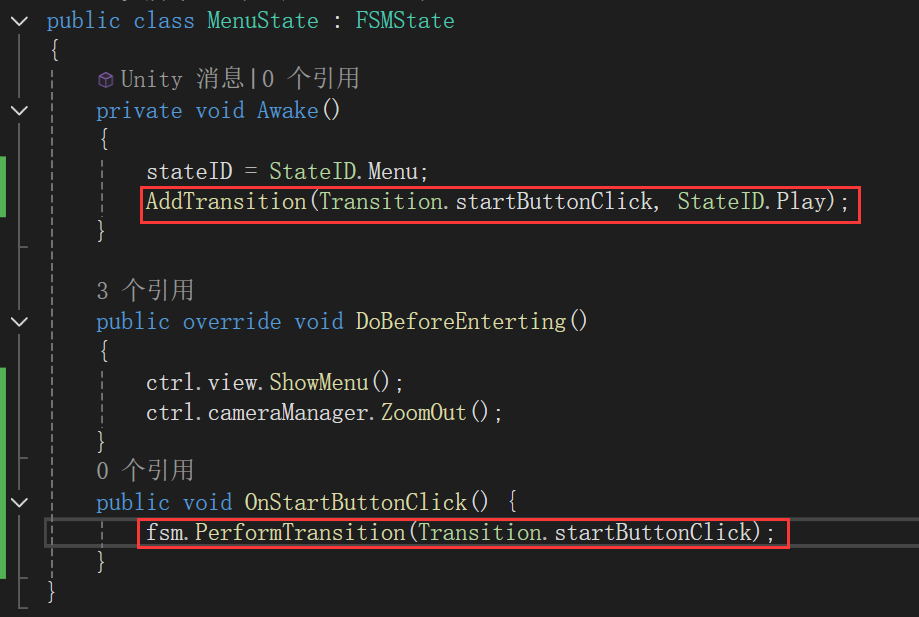  

（4）  
View脚本添加代码  
```C#
    public void HideMenu() {
        logoName.DOAnchorPosY(64.71f, 0.5f)
            .OnComplete(delegate { logoName.gameObject.SetActive(false); });
        //鸦疑问：siki说这样SetActive(false)节省性能，真的么？

        menuUI.DOAnchorPosY(-104.5f, 0.5f)//UI移出画面
            .OnComplete(delegate { menuUI.gameObject.SetActive(false); });
    }
```
MenuState脚本添加代码：  
```C#
    public override void DoBeforeLeaving()
    {
        ctrl.view.HideMenu();
    }
```

#### 20 . 开发游戏运行中的UI的显示和隐藏
playstate我们要显示的就是GameUI，GameUI从上往下显示。

(1)在View脚本添加代码：  
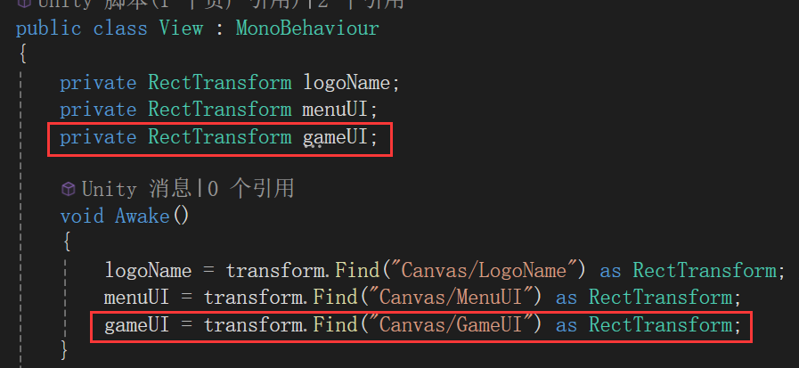  
```C#
    public void ShowGameUI() {
        gameUI.gameObject.SetActive(true);
        gameUI.DOAnchorPosY(-189f,0.5f);
    }
```

PlayState脚本：  
```C#
public class Playstate : FSMState
{
    private void Awake()
    {
        stateID = StateID.Play;
    }

    public override void DoBeforeEnterting()
    {
        ctrl.view.ShowGameUI();
    }
}
```
(2)背景放大：  
在CameraManager脚本添加代码：  
```C#
    //放大
    public void ZoomIn() {
        mainCamera.DOOrthoSize(13.15f,0.5f);
    }
```
在PlayState脚本添加代码：
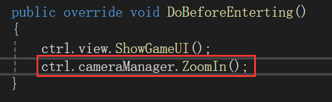  

（3）点击暂停转换到最开始MenuState界面，并且显示重新开始按钮（该按钮一开始不显示），所以restartButton一开始是隐藏的。  
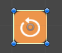  
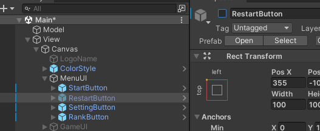  

(4)  
在FSMSystem脚本中添加代码  
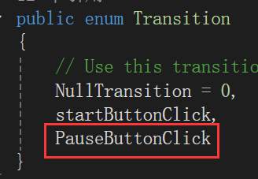  

在PlayState中修改代码：  
```C#
public class Playstate : FSMState
{
    private void Awake()
    {
        stateID = StateID.Play;
        AddTransition(Transition.PauseButtonClick, StateID.Menu);
    }

    public override void DoBeforeEnterting()
    {
        ctrl.view.ShowGameUI();
        ctrl.cameraManager.ZoomIn();
    }

    public override void DoBeforeLeaving()
    {
        ctrl.view.HideGameUI();
    }

    public void OnPauseButtonClick() {
        fsm.PerformTransition(Transition.PauseButtonClick);
    }
}
```

在View脚本添加代码：
```C#
    public void HideGameUI() {
        gameUI.DOAnchorPosY(189f, 0.5f)
            .OnComplete(delegate { gameUI.gameObject.SetActive(false); });
    }
```

（5）点击Pause按钮会显示“重新开始”按钮。  
在View脚本添加代码：  
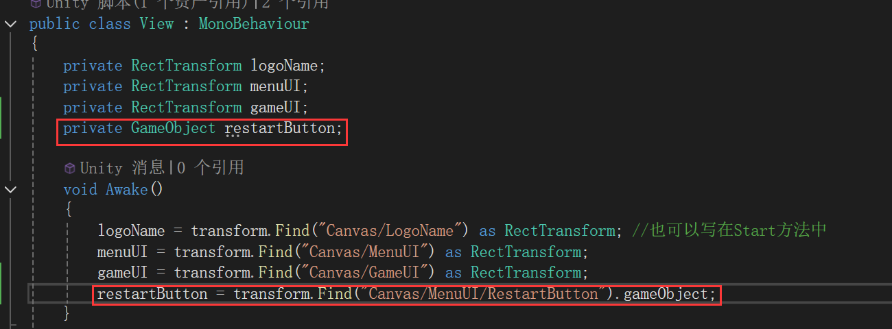  
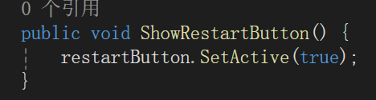  

（6）在PlayState脚本添加代码：  
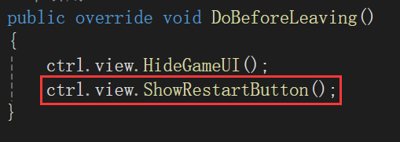  

#### 21 . 控制俄罗斯方块图形的生成
(1)在Ctrl空物体上创建脚本“GameManager.cs”并把脚本放到Ctrl文件夹底下。  

（2）在Ctrl文件夹下新建脚本“Shape.cs”。  
选中这7个prefab，并且点击addcomponent把shape脚本挂上去。  
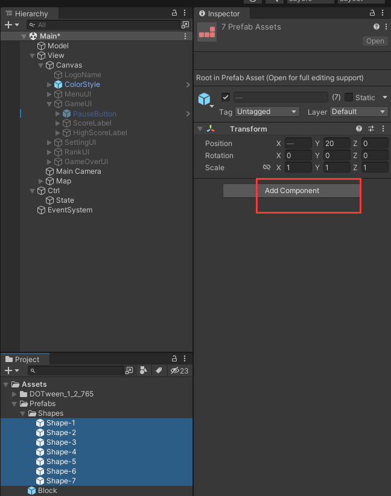  

（3）  
GameManager脚本：  
```C#
public class GameManager : MonoBehaviour
{
    private bool isPause = true; //游戏是否暂停。默认是暂停状态

    public Shape[] shapes;

    public Color[] colors;

    // Start is called before the first frame update
    void Start()
    {
        
    }

    // Update is called once per frame
    void Update()
    {
        if (isPause) return;//如果暂停下面不运行
    }

    void SpawnShape() {
        int index = Random.Range(0, shapes.Length);
        int indexColor = Random.Range(0, colors.Length);

        Shape shape = GameObject.Instantiate(shapes[index]);
        shape.Init(colors[indexColor]);
    }
}
```

Shape脚本：  
```C#
public class Shape : MonoBehaviour
{
    public void Init(Color color)
    {
        
    }
}
```

#### 22 . 完善图形的生成和游戏的暂停
(1)在gameManager脚本中添加代码。  
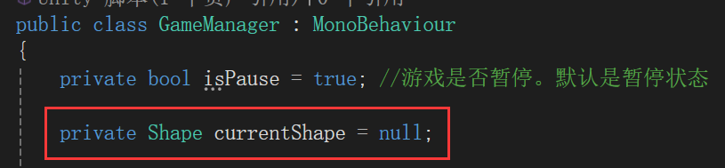  
```C#
    void Update()
    {
        if (isPause) return;//如果暂停下面不运行

        if (currentShape == null) {
            SpawnShape();
            //当currentShape落地之后，我们把currentShape设置为空，
            //这样我们就可以通过是否等于空去判断，当前有没有新的图形正在下落
        }
    }

    void SpawnShape() {
        int index = Random.Range(0, shapes.Length);
        int indexColor = Random.Range(0, colors.Length);

        currentShape = GameObject.Instantiate(shapes[index]);
        currentShape.Init(colors[indexColor]);
    }
```

(2)Shape 脚本：  
```C#
public class Shape : MonoBehaviour
{
    public void Init(Color color)
    {
        foreach (Transform t in transform) {
            if (t.tag == "Block") {
                t.GetComponent<SpriteRenderer>().color = color;
            }
        }
    }
}
```

(3) GameManager里面添加脚本：  
```C#
    public void StartGame() {
        isPause = false;
    }
    public void PauseGame() {
        isPause = true; 
    }
```
在Ctrl脚本里添加代码：  
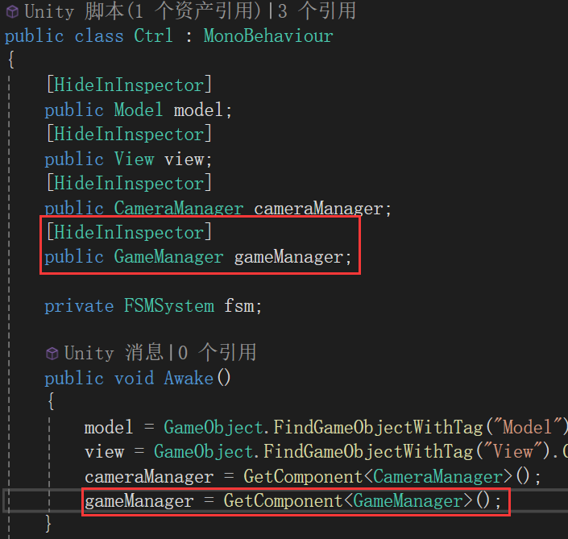  

在PlayState脚本中添加代码：  
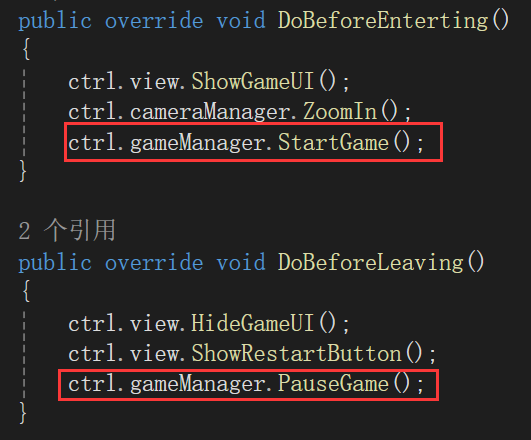  

(4)先把Ctrl层的空物体锁定。  
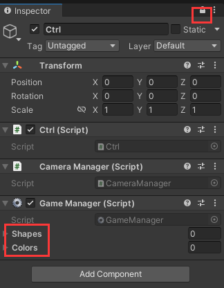  
选中7个形状预制体拖拽到Shapes。  

颜色设置为7，每个颜色去取一下。  
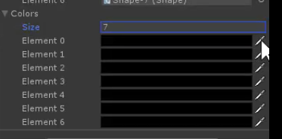  
alpha全都在右边（手动调一下） !!!!!!!一定要调不透明度，默认是透明的。  
下面这一行是Shape的颜色。  
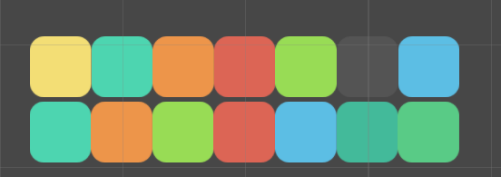  

#### 23 . 控制图形的下落
Shape脚本：  
```C#
public class Shape : MonoBehaviour
{
    private bool isPause = false; //当为true代表该图形触底
    private float timer = 0;
    private float stepTime = 0.8f;

    private void Update()
    {
        if (isPause) return;
        timer += Time.deltaTime;
        if (timer > stepTime) {
            timer = 0;
            Fall();
        }
    }

    public void Init(Color color)
    {
        foreach (Transform t in transform) {
            //这个方法是遍历所有的孩子的，所有的孩子就是t，因为形状的孩子有pivot也有block，我们只改变block的颜色。
            if (t.tag == "Block") {
                t.GetComponent<SpriteRenderer>().color = color;
            }
        }
    }

    public void Fall() { 
        Vector3 pos = transform.position;
        pos.y -= 1;
        transform.position = pos;
    }
}
```
现在是会一直下落的。  

#### 24 . 判断图形所在位置是否可用
（1）在Scripts文件夹下建立Tools文件夹，里面新建Vector3Extension.cs脚本。  
```C#
public static class Vector3Extension 
{
    public static Vector2 Round(this Vector3 v)
    {//this表示扩展哪个类，扩展的是三维向量Round方法。
        int x = Mathf.RoundToInt(v.x);
        int y = Mathf.RoundToInt(v.y);
        return new Vector2(x, y);
    }
}
```

(2)Model脚本：  
```C#
/*
 * 在model层保存数据，当这个格子有图形了，我们就保存它的transform组件，
 * 当这个格子没有的时候就保持为空，如果这个格子存在图形，就不能下落了，如果不存在就可以继续下落。
 * 这就是第一个方格pos为(0,0)的原因。位置和二维数组的索引对应。
 */

public class Model : MonoBehaviour
{
    public const int MAX_ROWS = 23;
    //23是为了判断游戏是否结束使用的。如果下面都填充满了图形，上面三行也有格子无法继续下落，说明就没有多余的空间了
    public const int MAX_COLUMNS = 10;

    private Transform[,] map = new Transform[MAX_ROWS, MAX_COLUMNS];

    public bool IsValidMapPosition(Transform t) {
        foreach (Transform child in t) {
            if(child.tag != "Block")continue;
            Vector2 pos = child.position.Round();
            if(IsInsideMap(pos)==false)return false; //还要判断是否超出边界
            if (map[(int)pos.x, (int)pos.y] != null) return false;
        }
        return true;
    }

    public bool IsInsideMap(Vector2 pos) {
        return pos.x >= 0 && pos.x < MAX_COLUMNS && pos.y >= 0;//y只用管下边界
    }
}
```

#### 25 . 控制图形的下落和叠加
（1）Shape脚本：  
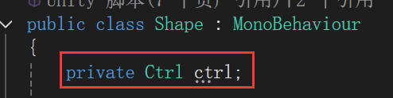  
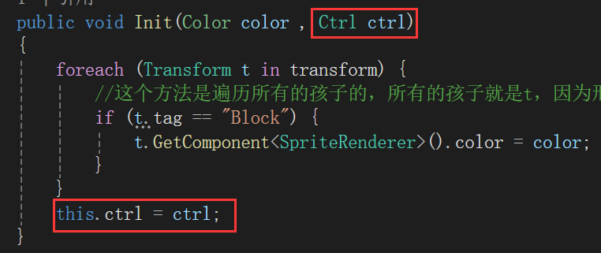  

（2）GameManager脚本：  
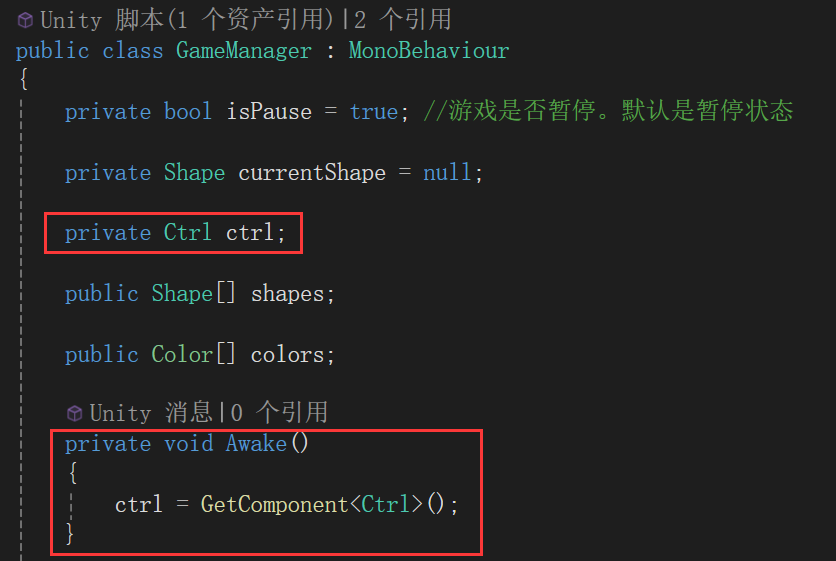  
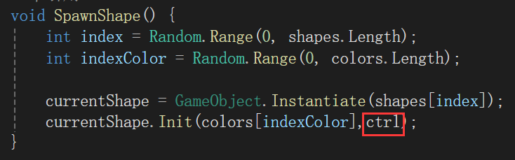  

（3）Shape脚本中：
```C#
    public void Fall() { 
        Vector3 pos = transform.position;
        pos.y -= 1;
        if (ctrl.model.IsValidMapPosition(this.transform) == false)
        {
            isPause = true;
        }
        else {
            transform.position = pos;
        }
    }
```
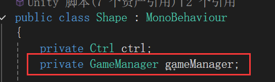  
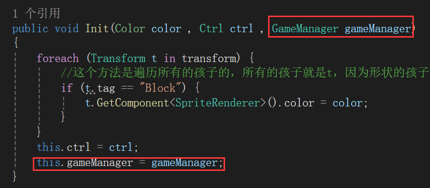  

在GameManager脚本中：  
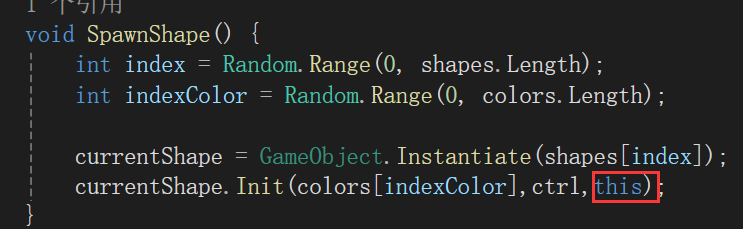  
```C#
    //方块落下来了
    public void FallDown() {
        currentShape = null;
    }
```

Shape脚本：  
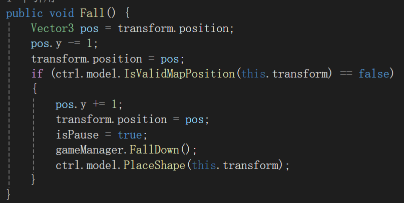  


（4）为了让停止后将形状移动到map里面。  
在Model脚本添加代码：  
```C#
    public void PlaceShape(Transform t) {
        foreach (Transform child in t) {
            if (child.tag != "Block") return;
            Vector2 pos = child.position.Round();
            map[(int)pos.x, (int)pos.y] = child;
        }
    }
```
Shape脚本添加这行代码：  
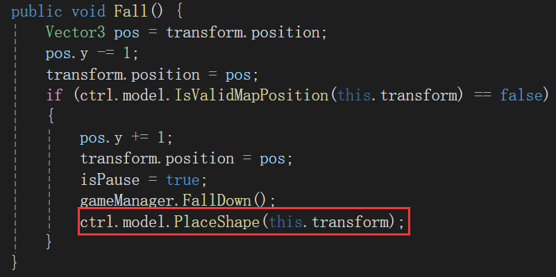  

(5)在暂停时让shape的下落也暂停住。  
在Shape脚本中添加脚本：  
```C#
    public void Pause()
    {
        isPause = true;
    }
    public void Resume() {
        isPause = false;
    }
```

在GameManager中修改脚本：  
```C#
    public void StartGame() {
        isPause = false;
        if (currentShape != null)
            currentShape.Resume();
    }
    public void PauseGame() {
        isPause = true; 
        if(currentShape != null)
            currentShape.Pause();
    }
```

#### 26 . 给游戏添加音效
(1)在Ctrl文件夹创建新的脚本AudioManager.cs，并把它挂到Ctrl空物体上。  

为Ctrl空物体加上AudioSource组件。  

AudioManager脚本：  
```C#
public class AudioManager : MonoBehaviour
{
    public AudioClip cursor;
    public AudioClip drop;

    private AudioSource audioSource;
    private bool isMute = false;

    private void Awake()
    {
        audioSource = GetComponent<AudioSource>();
    }

    public void PlayCursor() {
        PlayAudio(cursor);
    }
    public void PlayDrop() {
        PlayAudio(drop);
    }

    private void PlayAudio(AudioClip clip) {
        if (isMute) return;
        audioSource.clip = clip;
        audioSource.Play();
    }
}
```

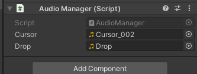  

在Ctrl脚本：  
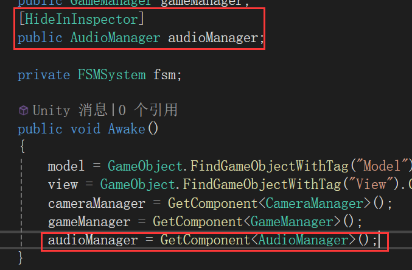  

在MenuState脚本：  
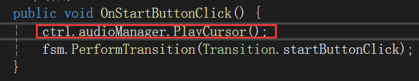  

在PlayState脚本：  
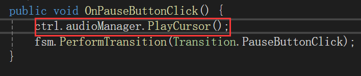  

在Shape脚本：  
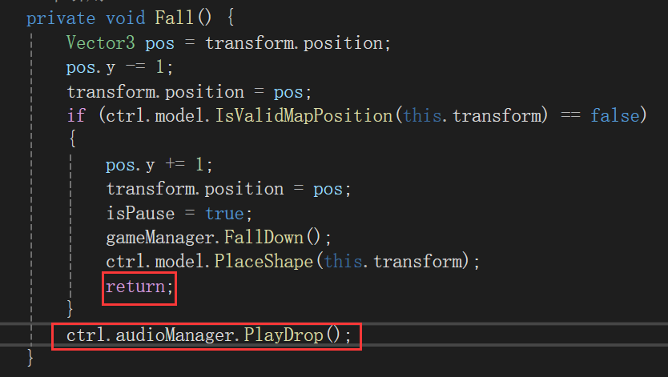  

#### 27 . 控制图形方块的左右移动
(1)Shape脚本  
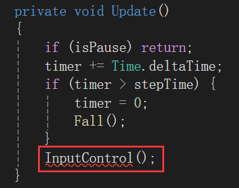  

```C#
    private void InputControl() {
        float h = Input.GetAxisRaw("Horizontal");
        if (h != 0) {
            Vector3 pos = transform.position;
            pos.x += h;
            transform.position = pos;
            if (ctrl.model.IsValidMapPosition(this.transform) == false) {
                pos.x -= h;
                transform.position = pos;
            }
        }
    }
```

(2)添加音效   
AudioManager脚本  
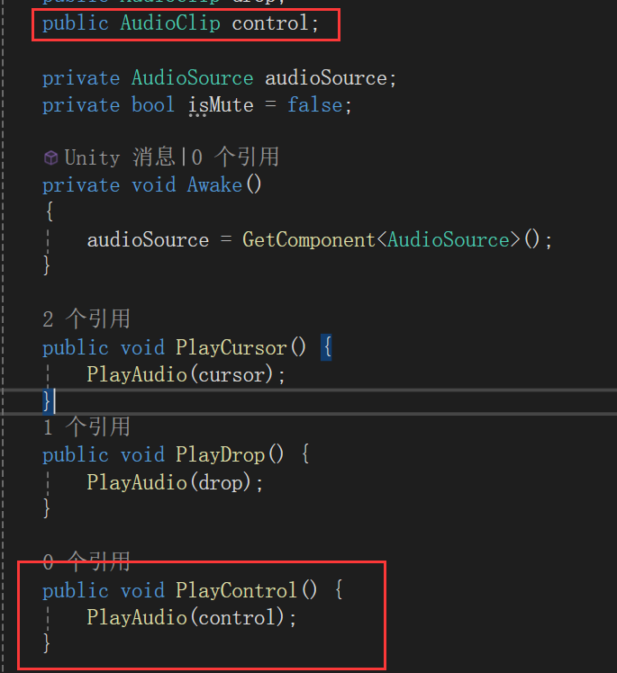  
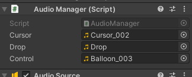  
Shape脚本：  
  

（3）但是我们只需要一格一格的移动，不需要一下移动这么多。  
在Shape代码中：  
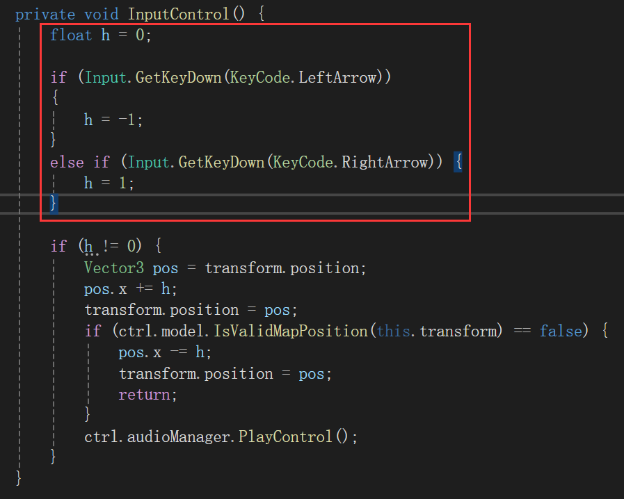  

下面这边改成：  
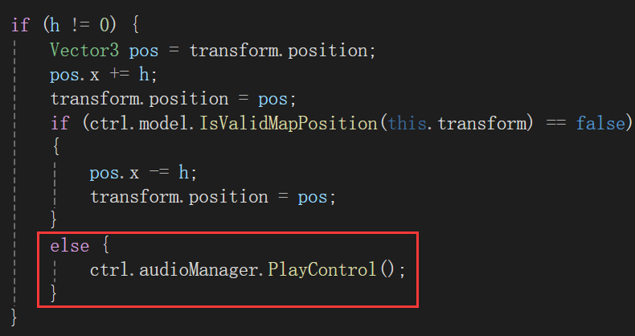  

#### 28 . 控制图形方块的顺时针旋转
Shape脚本：  
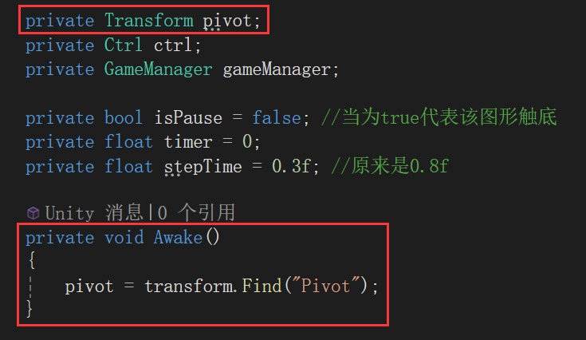  

Shape脚本里InputControl方法添加代码：  
```C#
        if (Input.GetKeyDown(KeyCode.UpArrow)) {
            transform.RotateAround(pivot.position, Vector3.forward, -90);
            if (ctrl.model.IsValidMapPosition(this.transform) == false)
            {
                transform.RotateAround(pivot.position, Vector3.forward, 90); //第二个参数是什么轴
            }
            else {
                ctrl.audioManager.PlayControl();
            }
        }
```

#### 36-控制图形游戏物体的统一管理和多余游戏物体的销毁
（1）  
在Ctrl空物体创建新的空物体叫"BlockHolder"。  

GameManager :   
`blockHolder = transform.Find("BlockHolder");`  

(2)有一个问题：索然Shape下的Block被销毁，但是Shape不会被销毁。  
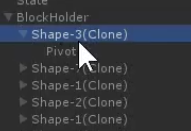  

```C#
        foreach (Transform t in blockHolder) {
            if (t.childCount <= 1) { //Shape的孩子只剩一个pivot时
                Destroy(t.gameObject);
            }
        }
```

#### 37-控制设置界面的显示和音效是否静音的控制
(1)在SettingUI上添加Button组件    
Transition设置为None  
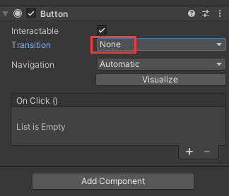  

#### 38-控制记录界面的显示
(1)不能直接在View脚本更新RankUI的数据，因为这样VIEW层和MODEL层就互通了，会显得比较乱。  
所以OnRankButtonClick()函数要写在MenuState脚本里面。  

#### 39-控制游戏的重新开始（课程结束）
（1）在rankUI上添加button组件控制隐藏。  
Transition设置为None  