### Unity Tutorial: Everything about the New Input System (Unity 2021 LTS)
https://www.youtube.com/watch?v=-0Cl54_3lmM

#### 1 . 先看Events
Events的跟做在
TestKouTu项目的：Test2-learnEvent场景  
##### 1.1
The Unity New Input System is relying quite heavily on events so I think it is worth to have a look also at the:    • How to use Events and Unity Events in Unity( https://www.youtube.com/watch?v=AGGmnVIhHvc )  . It is not (heavily) required but definitely will make your life easier. Other than that - I do my best to cover everything in this video.   

Instead of executing code in a loop every certain time (e.g. Monobehaviour的Update()方法), we execute it only when certain event happens.  
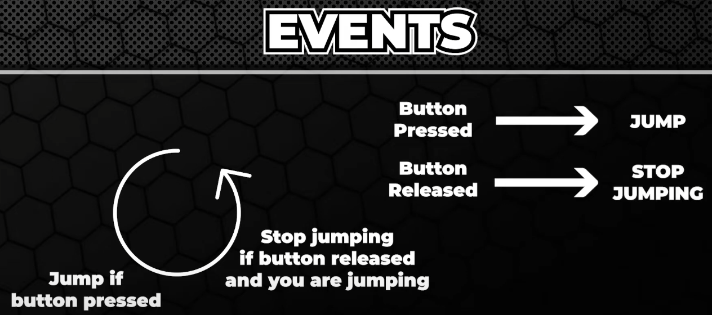  

新建脚本CollisionEvents.cs 和 PlayerInputProvider.cs：  
```C#
using System.Collections;
using System.Collections.Generic;
using UnityEngine.InputSystem;
using UnityEngine;
using UnityEngine.Events;


public class CollisionEvents : MonoBehaviour
{
    [SerializeField] private UnityEvent _onTriggerEnter;

    private void OnTriggerEnter2D(Collider2D other) {
        print("fuck" + other.gameObject.name);
        // we check if the collider2D is actually the player.  
        // we don't want to react to any other collision.  
        // to check that we can try to grab a player specific script like player input provider
        //if we found it, we call the invoke method of the ontriggerEnter Unity event.
        //if the ontriggerEnter is null, we don't want to gwt the null pointer exception, so we add a question mark

        var player = other.GetComponent<PlayerInputProvider>();
        if (player != null) {
            _onTriggerEnter?.Invoke();
        }
    }
}
```
```C#
using System.Collections;
using System.Collections.Generic;
using UnityEngine;

public class PlayerInputProvider : MonoBehaviour
{
    public float moveSpeed = 3.0f;

    // Update is called once per frame
    void Update()
    {
        float h = Input.GetAxis("Horizontal");
        transform.Translate(Vector3.right * h * moveSpeed * Time.deltaTime, Space.World);
    }
}
```
脚本挂法：  
CollisionEvents挂在sword上  
PlayerInputProvider挂在Player上  
逻辑是：当主角运动碰到sword，sword消失，出现敌人。  

Let me explain how it will work.  
Event variables are like bags full of actions, you can easily add and remove items from them. 
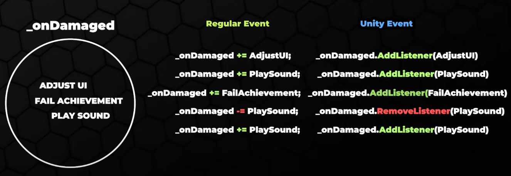  
And once the invoke method is called on the back, all actions one after the other are executed.   
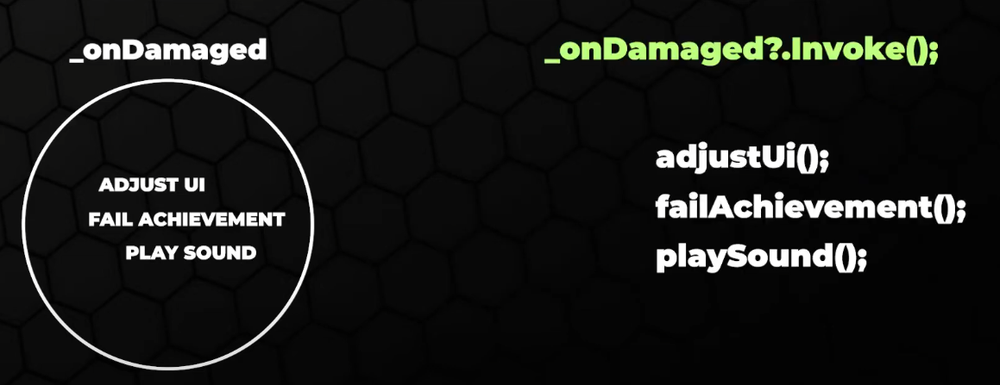  

Normally we add and remove the actions programmatically,   
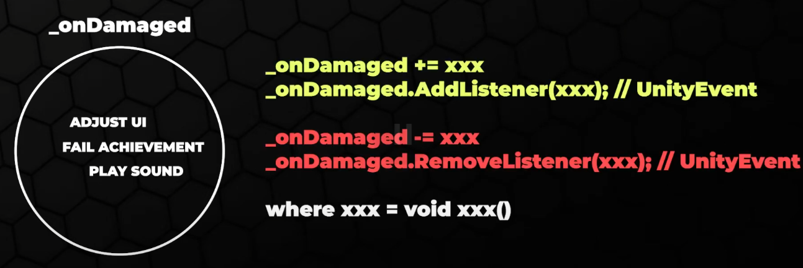  

 but unity events are special, they allow us to add and remove actions directly from the inspector, we can drag and drop the listener and then conveniently select the action. We can not only manipulate the properties of different components, but also execute public methods that are part of the scripts on the object.  

 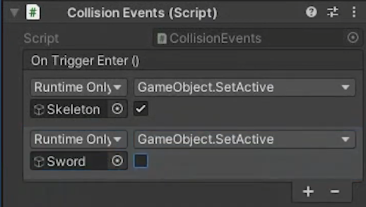  

##### 1.2
Now let's have a look at the regular C sharp events, but before we do that, let me tell you two words about the naming convention.  
In the previous example, it sucked. I used the 'on' event name which is not really the proper way. The name of the event as the name suggests should be the event like:  
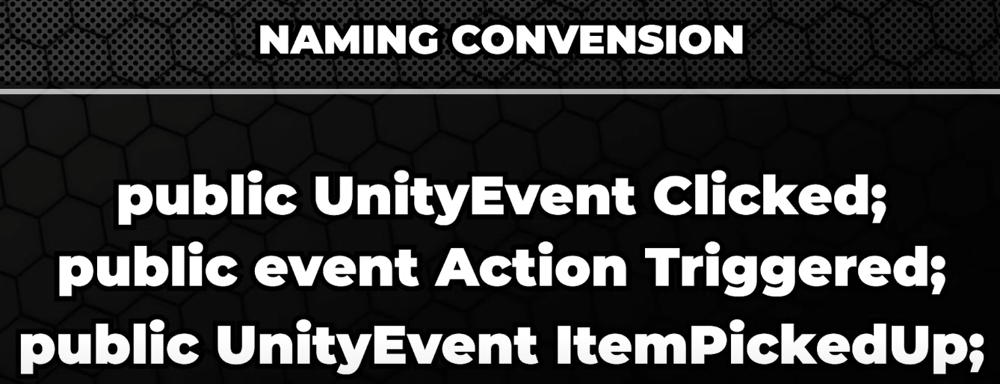  

The method that invokes that event should start with 'on' like:   
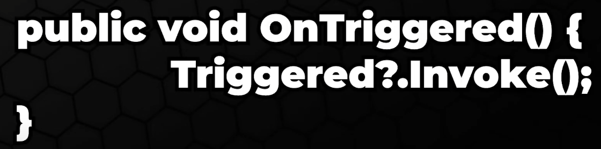  
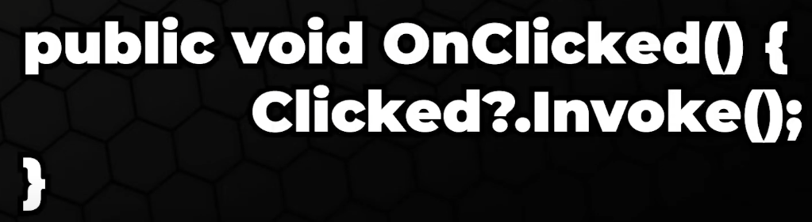  
However sometimes those methods are skipped and the event is invoked directly in another method. 如下：  
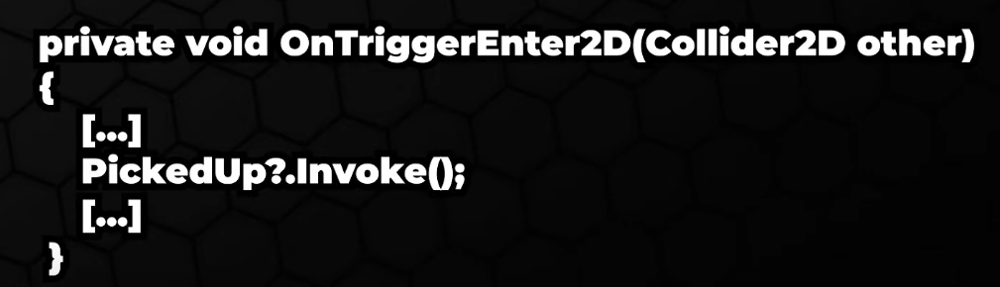  

##### 1.3 按照1.2重新写  
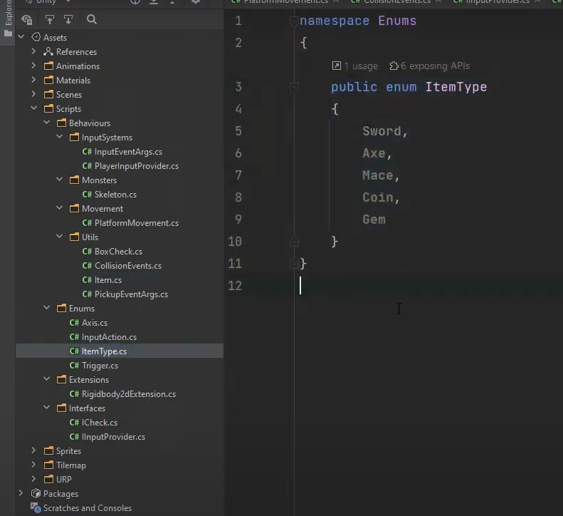  
- 注意上图的文件夹名叫Enums
- namespace的名字也叫Enums  

第一版代码：  
```C#
using System;
using System.Collections;
using System.Collections.Generic;
using UnityEngine;
using UnityEngine.Events;

public class Item : MonoBehaviour
{
    public event Action PickedUp; //Event with no params
    //event -- keyword
    //Action -- type
    // Action that describes the parameters that will passed to an action and the action's return type.
    //now the type called action is the simplest of all, it doesn't provide any parameters and has a void return type.  
    //we invoke it exactly the same way as the unity events.  

    private void OnTriggerEnter2D(Collider2D other)
    {
        var player = other.GetComponent<PlayerInputProvider>();
        if (player)
        {
            PickedUp?.Invoke();
            gameObject.SetActive(false);
        }
    }
}
```

```C#
using System.Collections;
using System.Collections.Generic;
using UnityEngine;

public class Skeleton : MonoBehaviour
{
    private Rigidbody2D _rigidbody;

    private void Start()
    {
        _rigidbody = GetComponent<Rigidbody2D>();
        _rigidbody.gravityScale = 0;

        var items = FindObjectsOfType<Item>();
        // a small side node: this way of grabbing all items in the level is not really ideal
        //using the service locator pattern to do it is better.  
        foreach (var item in items) {
            item.PickedUp += ResetGravityScale;
        }
    }

    private void ResetGravityScale() {
        _rigidbody.gravityScale = 3;
    }
}
```
Enums.cs的代码：  
```C#
namespace Enums {
    public enum ItemType {
        Sword,
        Axe,
        Mace,
        Coin,
        Gem
    }
}
//How we can invoke an event with some parameters
//I created small enums to help categorize items
```

第二版代码：  
```C#
using Enums;
using System;
using System.Collections;
using System.Collections.Generic;
using UnityEngine;
using UnityEngine.Events;

public class Item : MonoBehaviour
{
    public event Action<ItemType> PickedUp;
    //Let's use it as a type for new serialized verval in the item script
    //because sometimes we may have different actions for different items
    [SerializeField] private ItemType itemType;

    private void OnTriggerEnter2D(Collider2D other)
    {
        var player = other.GetComponent<PlayerInputProvider>();
        if (player)
        {
            PickedUp?.Invoke(itemType);
            gameObject.SetActive(false);
        }
    }
}
```

第三个版本代码，这种情况下用EventHandler比用Action更好。  
```C#
using Enums;
using System;
using System.Collections;
using System.Collections.Generic;
using UnityEngine;
using UnityEngine.Events;
using Behaviour.Utils;

public class Item : MonoBehaviour
{
    public event EventHandler<PickupEventArgs> PickedUp;
    //Let's use it as a type for new serialized verval in the item script
    //because sometimes we may have different actions for different items
    [SerializeField] private ItemType _itemType;

    private void OnTriggerEnter2D(Collider2D other)
    {
        var player = other.GetComponent<PlayerInputProvider>();
        if (player)
        {
            PickedUp?.Invoke(this, new PickupEventArgs { ItemType = _itemType });
            gameObject.SetActive(false);
        }
    }
}

```

```C#
using Behaviour.Utils;
using System.Collections;
using System.Collections.Generic;
using UnityEngine;

public class Skeleton : MonoBehaviour
{
    private Rigidbody2D _rigidbody;

    private void Start()
    {
        _rigidbody = GetComponent<Rigidbody2D>();
        _rigidbody.gravityScale = 0;

        var items = FindObjectsOfType<Item>();
        // a small side node: this way of grabbing all items in the level is not really ideal
        //using the service locator pattern to do it is better.  
        foreach (var item in items) {
            item.PickedUp += ResetGravityScale;
        }
    }

    private void ResetGravityScale(object sender, PickupEventArgs args) {
        if (args.ItemType == Enums.ItemType.Sword) {
            _rigidbody.gravityScale = 3;
        }
    }
}

```
PickupEventArgs.cs的代码：  
```C#
using Enums;

namespace Behaviour.Utils {
    public class PickupEventArgs {
        public ItemType ItemType;
    }
}

// It works even without it
```

脚本挂法：  
Item.cs挂在sword上   
Item.cs挂在axe上  
PlayerInputProvider.cs挂在Player上   
Skeleton.cs挂在Enemy上  

逻辑：  
玩家碰到axe敌人不会掉下来，玩家碰到sword敌人会掉下来。  
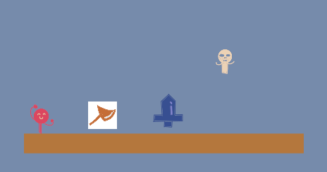  

注意：  
axe的这里要选择Axe  
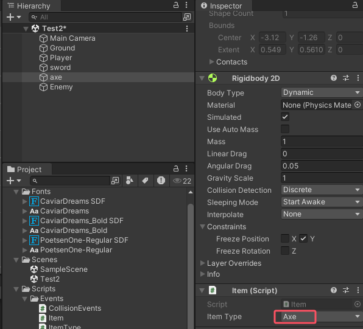  

【注意！】**看到时间轴的06:28就没往后看了。**  

#### 2 . 正式开始学Input System  
##### 2.1 装Package
先装Package：  
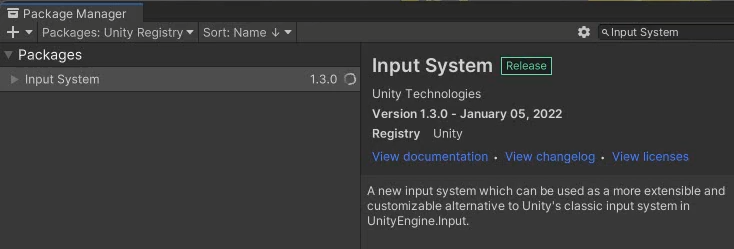  
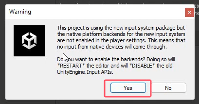  
这样会导致老的inputSystem用不了，只能用新的。  
如果你想换回老的inputSystem:  
可以在Edit中点击Project Settings：  
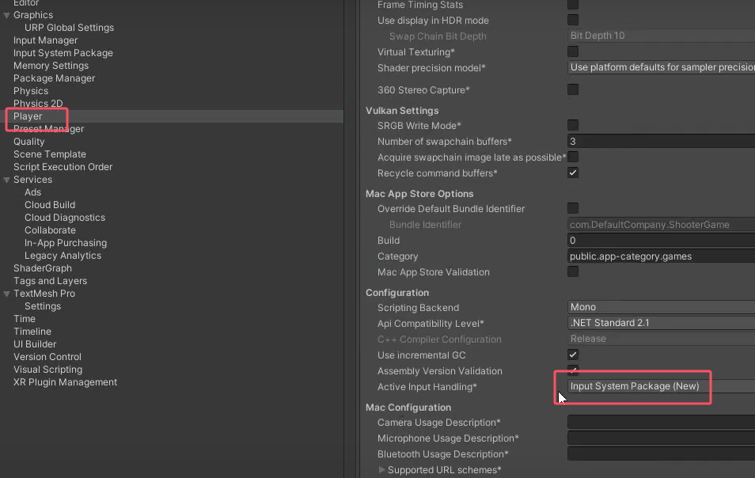  
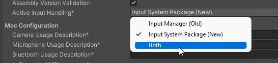  

##### 2.2 编辑InputActions内部
(1) 在Assets文件夹中右键：  
Create --> Input Actions  
重命名：GameInputActions  
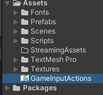  
This file is basically what will store all the information about our mapping. So everything related to input will be there.   
The information like what keys we use for walking, or what keys do we use jumping and so on.  
In general just type of stuff that we always find in the input manager.  

(2) 双击：GameInputActions 打开  

（3）点击这里，新创建一个action map  
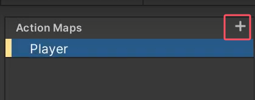  

再创建一个：  
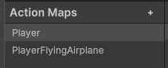  

写入action:  
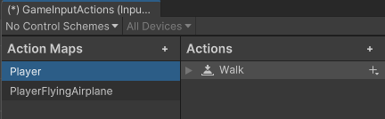  
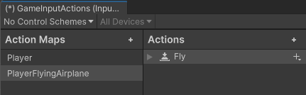  

选中PlayerFlyingAirplane，再按键盘中的delete键可以把这个action map删除掉。  

The interesting part about new input system is that you can assign multiple bindings to one action.  

比如选中Player的Jump Action：  
的binding：  
点击Listen按钮，  
再点击键盘中的space按键。  
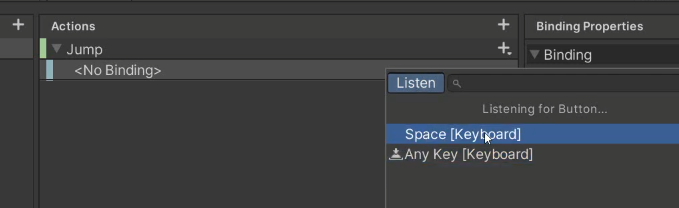  

可以添加多个binding：  
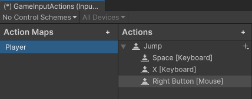  

（4）Action Type有三种：  
  
Value和pass through are used rather for continuous input, so things like movement.  

(5)Control type  
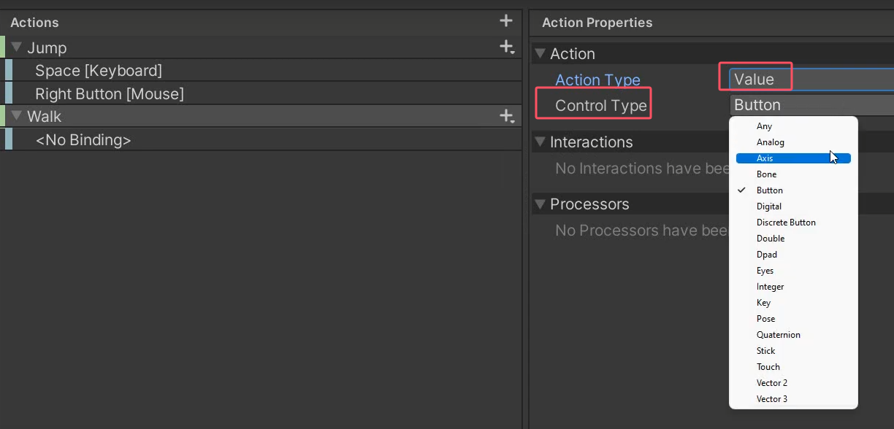  
The control type is basically a return type that will be given to us when we try to access this particular action in code.  
But a button is a great example, because on one hand, we would expect boolean values.  
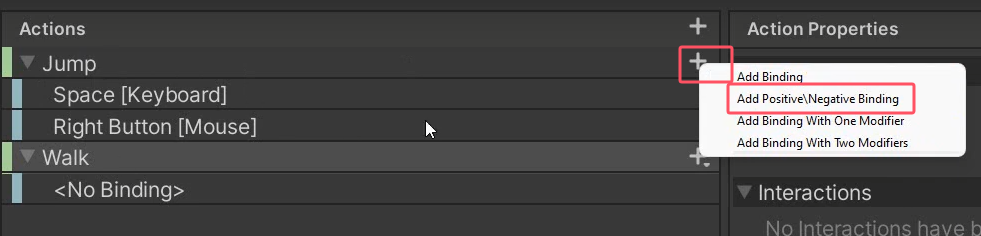  
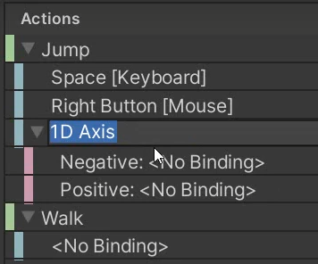  
This will create like one dimensional axis. Like horizontal axis or a vertical axis that we know from the old input manager.  
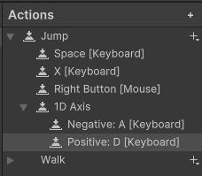  
What would happen then basically when we click on the binding itself not on the actual keys, we can see different valus.  
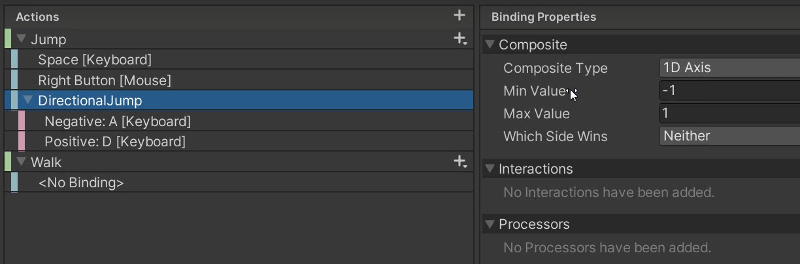  
按A会得到-1。  
按D会得到1 。

（6）  
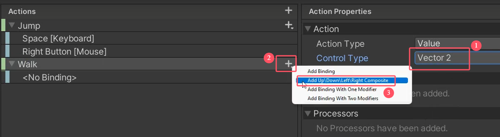  

双击2d vector 重命名为WASD  
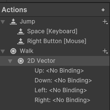  
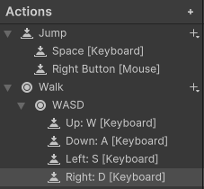  
加上arrows的binding：  
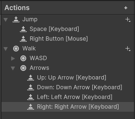  

This allow us to discuss the differences between the value and pass-through types. Basically for the value action type, whichever input is stronger, this one will be taken into consideration. So e.g. if you have a gamepad and you have two sticks, and you will move one a little bit to the left and then the other one completely to the right. The character will start obviously moving to the left a little bit because you used the left moved the first stick. But as soon as you move the other one to the right to the very end, the character will start moving right.  

When the action type is pass through, the behaviour is different.  What happens then, the most recent input is taken into consideration. For a gamepad this might be a little bit problematic, bacause gamepads are analog, the values constantly change, so there is like a flickering of values. If you moved left stick and the other right stick, you know you will just have a one huge mess of values.  
For example for the keys on the keyboard this would be perfectle fine, because basically the one that was pretty suppressed later would be the one taken into consideration.  

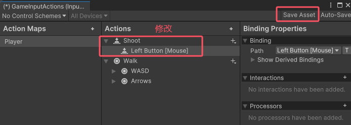  

##### 2.3
(1)  
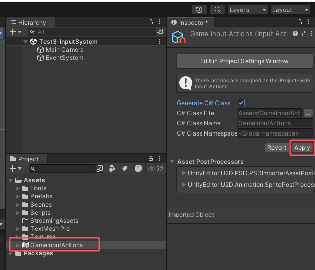  

【注意！】**看到时间轴的14：47就没往后看了。因为有up以前项目的代码**    
可能需要看：    
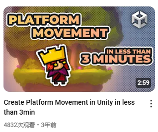  
国王君一系列关于跳跃的视频。   

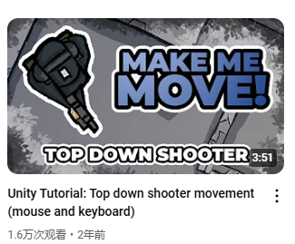  
射击相关的一系列视频。  