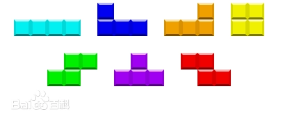
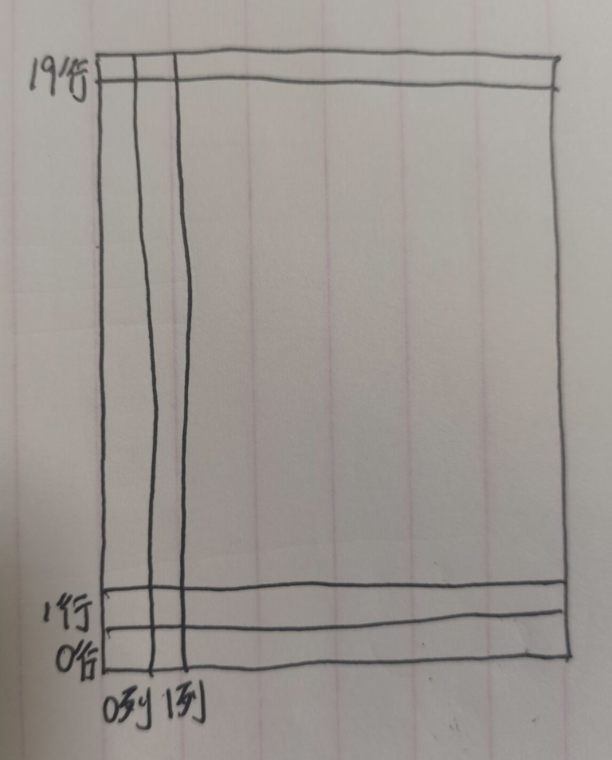
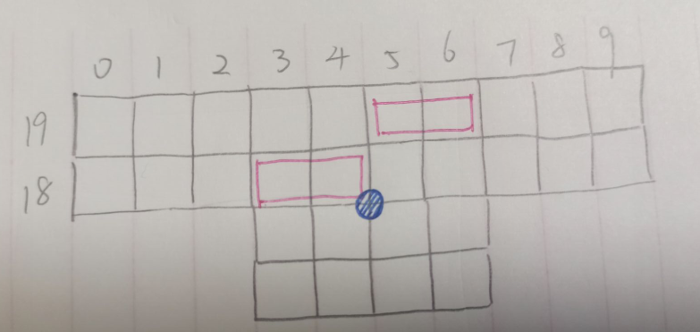
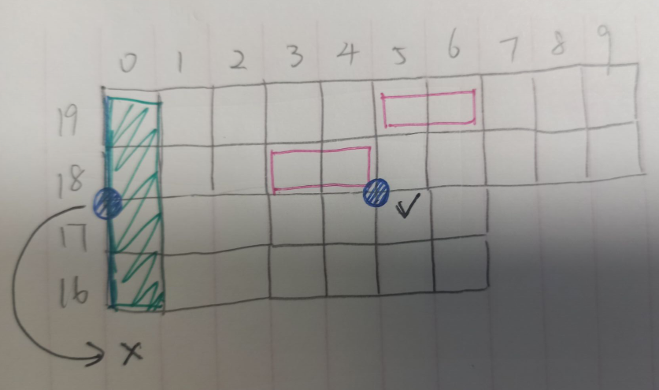
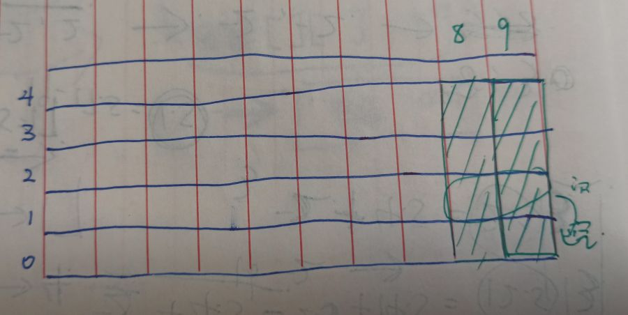
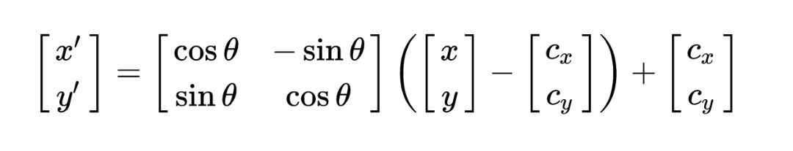
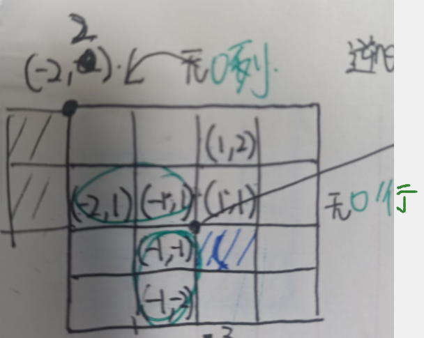
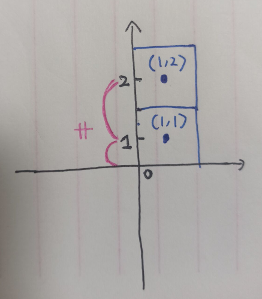
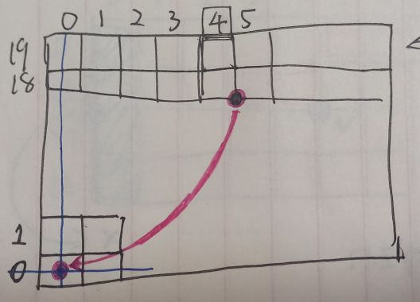

### TetrisDemo思路整理
主要逻辑都在：PartsGeneration类中。  

首先生成一个FourThing。因为俄罗斯方块每一个图形都是由4个方块组成，且基础图形都是在两行内（未旋转）完成。如图所示：
  

然后这个生成的FourThing往下落，落到最底面的下界时停下来。停下来之时，将FourThing里面的转移到一个列表叫parts。
list parts[20,10] 装满会有20行10列。
`parts[1]`代表第一行有哪些方块，这样如果一行满了，就可以直接清除这一整行了。

转移完成后，生成新的FourThing。  
怎么生成捏？  
首先这是第几行第几列对应画面上的坐标：  
  
由于字母图形默认的排列都在两行内完成，所以可以写死生成的位置我写在了Distribution的类里面。
  
比如上图是S图形的位置。  
蓝色的点为旋转中心。  
每个字母图形旋转中心初始的位置都相同，这个旋转中心类似FourThing是一个单独的变量。旋转中心随着FourThing的左右运动和向下运动而发生变化。   
旋转后的图形都是围绕着蓝色旋转中心的4x4范围中，逆时针旋转。  
旋转中心这样设置有一个好处那就是：  
  
例如字母I图形在边界旋转时，如果旋转中心在错误的位置就会导致它旋转出去。    
当然这只是我在偷懒，试想字母O的图形是无法绕着自己的中心点旋转的。  

这个第二个FourThing继续往下落，快接触到上一个FourThing的最高点时，停住。  
这里涉及一个公式：  
当：  
每一个fourThing的行标 - 1 <= 这个方块所在列的小山峰最高点的行标时候：  
它该停下来了。  
p.s.这就是为什么最最开始highest数组的10列都设为-1。  
因为0 - 1 = -1  

接下来就是转移和生成新的FourThing。  
转移的时候把遍历当前列最高点设置为该行。设置之前比较一下是不是比old值高，因为图形可能同在一列，遍历FourThing的时候后遍历那个低的点。  

当一行满了将那一行消除之后，需要把它上面的所有方块往下移动一格。  
我们移动时，要从最靠近消除的那一行开始移动，即从下往上依次向下移动。  
如图：  
  
假设0行已满，并且已经将它消除了（0行空），此时把1行可以往0行挪动，这时1行空，2行可以进入……  
假如一开始就移动的是3行往2行，那么2行就会出现两个8列两个9列，造成bug。  

【遇到的困难：】  
1 . 旋转    
旋转流程：    
（1）把图形各点平移，令旋转中心平移至原点  
（2）乘以旋转坐标  
（3）再平移至原来的旋转中心  

  
相当于 设最初的点为a,b, 设经过第一步平移后的点为x,y。旋转后的为X,Y。   
x = a - 旋转中心的x  
y = b - 旋转中心的y  

X = xcos90 - ysin90  
Y = ycos90 + xsin90

因为cos90 = 0, sin90 = 1;  
所以X = -y, Y = x。

最后平移回原来的旋转中心：  
x' = X + 旋转中心的x  
y' = Y + 旋转中心的y   

之前的逻辑非常乱：
```C#
    private void Rotate(List<OneSquarePart> fourThing, RelateDir midPointOfFourThing) {
        int cunLie = midPointOfFourThing.lie;
        int cunHang = midPointOfFourThing.hang;

        for (int i = 0; i < 4; i++) {
            int hang = fourThing[i].relateDir.hang;
            int lie = fourThing[i].relateDir.lie;

            int x = lie - (cunLie + 0.5f) > 0 ? Mathf.CeilToInt(lie - (cunLie + 0.5f)) : Mathf.FloorToInt(lie - (cunLie + 0.5f));
            int y = hang - (cunHang + 0.5f) > 0 ? Mathf.CeilToInt(hang - (cunHang + 0.5f)) : Mathf.FloorToInt(hang - (cunHang + 0.5f));
            //上面首先将旋转中心移到虚拟坐标

            int temp = x;
            x = -y;
            y = temp;
            //上面完成：在虚拟坐标转后

            lie = x >0 ? x + cunLie : x+cunLie + 1;
            hang = y >0 ? y + cunHang : y + cunHang + 1;
            //上面完成：返回原坐标

            fourThing[i].relateDir.hang = hang;
            fourThing[i].relateDir.lie = lie;
        }
    }
```
上面的代码虽然能跑的（瞎写的），但是我逻辑出现误区是：  
在令旋转中心平移至原点这一步：  
坐标出错：  
  
  
按照上面那种坐标的话1和2之间的距离不等。  

上面那种错误的转法思路：  
原始坐标（18行,3）（18行，4）旋转中心（17.5，4.5）   
（1）旋转中心平移至原点后  
(18,3)->(-2,1)  
(18,4)->(-1,1)  
(2)旋转后  
(18,3)->(-2,1)->(-1,-2)  
(18,4)->(-1,1)->(-1,-1)  
(3)移动回去  
(18,3)->(-2,1)->(-1,-2)->(16,4)  
(18,4)->(-1,1)->(-1,-1)->(17,4)  


改后：
```C#
    private void Rotate(List<OneSquarePart> fourThing, RelateDir midPointOfFourThing) {
        int cunLie = midPointOfFourThing.lie;
        int cunHang = midPointOfFourThing.hang;
        int[,] fourThingTmp = new int[4, 2];

        bool panduan = true;

        for (int i = 0; i < 4; i++) {
            int hang = fourThing[i].relateDir.hang;
            int lie = fourThing[i].relateDir.lie;

            float x = lie - (cunLie + 0.5f);
            float y = hang - (cunHang + 0.5f); 
            //上面首先将旋转中心移到虚拟坐标

            float temp = x;
            x = -y;
            y = temp;
            //上面完成：在虚拟坐标转后

            lie = (int)(x + (cunLie + 0.5f));
            hang = (int)(y + (cunHang + 0.5f));
            //上面完成：返回原坐标

            fourThingTmp[i,0] = hang;
            fourThingTmp[i,1] = lie;

            if (lie < 0 || lie > 9) { panduan = false; /*边界*/ break; }
            else if (hang < 0 || hang > 19) { panduan = false; /*边界*/ break; } //这两句话要写在上面，因为hasObject[hang,lie]会导致indexOutOfRange
            else if (partsGenerationIns.hasObject[hang,lie]) { panduan = false; break; } //需要的，比如O图形旋转中心在左侧的时候
        }

        if (panduan == true)
        {
            for (int i = 0; i < 4; i++)
            {
                fourThing[i].relateDir.hang = fourThingTmp[i, 0];
                fourThing[i].relateDir.lie = fourThingTmp[i, 1];
            }
        }
    }
```
  

"在虚拟坐标转"这一步不涉及浮点数运算，soooooo没问题。  

2 . 深浅复制
```C#
public enum Alphabet {I,L,O,S,Z,T}
public class Distribution 
{
    public static Alphabet whichLetter = 0;

    public static readonly RelateDir[,] LetterDistribution = new RelateDir[6, 4] {
        //I
        {new RelateDir(19,3), new RelateDir(19,4),new RelateDir(19,5),new RelateDir(19,6)}, 
        //L
        {new RelateDir(19,3), new RelateDir(18,3),new RelateDir(18,4),new RelateDir(18,5)},
        //O
        {new RelateDir(19,4), new RelateDir(18,4),new RelateDir(18,5),new RelateDir(19,5)},
        //S
        {new RelateDir(19,5), new RelateDir(19,6),new RelateDir(18,3),new RelateDir(18,4)},
        //Z
        {new RelateDir(19,3), new RelateDir(19,4),new RelateDir(18,5),new RelateDir(18,6)},
        //T
        {new RelateDir(18,3), new RelateDir(18,4),new RelateDir(18,5),new RelateDir(19,4)},
    };
}
```
在调用它的时候：  
这样子不会出错：    
```C#
int hang= Distribution.LetterDistribution[(int)letter, i].hang; //字母其中一个方块在第几行
int lie = Distribution.LetterDistribution[(int)letter, i].lie;//字母其中一个方块在第几列
RelateDir relateDir = new RelateDir(hang,lie);//值传递避免深浅拷贝问题
```

这样子会出错：//我忘了我之前是不是这么写的了，回头再试试  
```C#
RelateDir relateDir = new RelateDir();
relateDir.hang = Distribution.LetterDistribution[(int)letter, i].hang;
relateDir.lie = Distribution.LetterDistribution[(int)letter, i].lie;
```
在下方对relateDir赋值给其他变量：
```C#
OneSquarePart part = new OneSquarePart(o, decimalPos, relateDir);
fourThing.Add(part);
```
然后这个fourThing在移动，就修改了Distribution.LetterDistribution里的值。