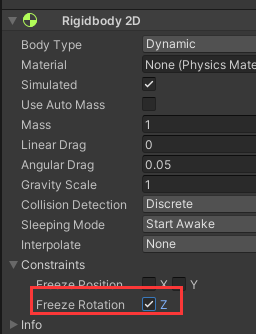

###  Unity3D 带你写一个简单好用的FSM
BV1uu4y1Z7wx  

#### 1 . 编写代码
编写FSMController和IState两个脚本   
[FSMController.cs](./FSMController.cs)  
[IState.cs](./IState.cs)
#### 2 . 导入
（1）导入github里的Anim文件夹   
  

（2）往3D项目里导入2D package  
  

（3）建一个2D的square，拉长它，并为它添加box collider 2d。作为底面。    
  

（4）建一个2D的square，改名Player，把这张图拽过来。并为其添加capsule collider 2d，rigidbody2D。  
  

（5）为Player添加Animator组件，把这个animator controller拽过去。  
  

(6) 为Player添加FSM controler脚本并且修改默认state。  
  

#### 3 . 继续编写脚本
（1）在Assets文件夹底下创建States文件夹，并且再底下新建IdleState脚本。  

但是我们发现，我们创建的state没法访问我们的状态机，难以与monobehaviour产生交互，所以我们在接口中定义machine属性，在AbstractState中给出实现。   
  

接着我们在FSMController中在状态初始化的时候，为每个状态绑定状态机。  
  

（2）接着我们再创建一个RunState。  

（3）为了控制角色移动我们创建Params脚本

（4）//接下来我们需要状态切换，我们定义脚本PlayerInput，我们首先获取状态机组件。
//如果水平轴的偏移量非常小，我们就当它没有按下

（5）为Player添加rigidbody2d组件，锁住z轴旋转  
  
为Player添加PlayerInput脚本。

#### 4 . 鸦鸦阅读代码 
  
  
AbstaractState是基类，里面嘛也没写。里面有属性Machine，所以IdleState和RunState能访问FSMContoller里的animator和rigidbody2D。

因为FSMController是monobehaviour，所以Update函数和FixedUpdate函数不用其他地方调用直接会运行的。

FSMController里的Enter函数和Exit函数在PlayerInput调用。  
PlayerInput（Enter）--> FSMController（Enter）-->IdleState（Enter）

FSMController里虽然调用了AbstractState的OnDestroy函数，但是其实IdleState和RunState里没有实现，而且其他地方没有调用FSMController里的OnDestroy，感觉在这个项目里没啥用。