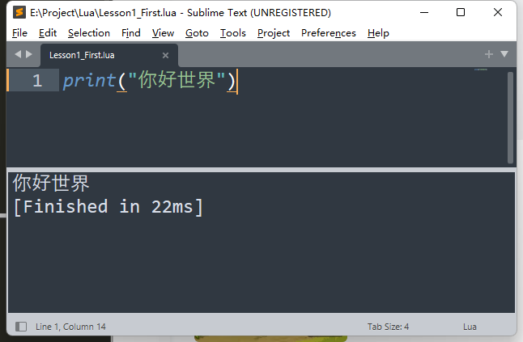

### unity_lua_唐老狮（上）
#### 1 . 环境搭建以及第一个Lua程序
（1）luaforwindows  
https://github.com/rjpcomputing/luaforwindows  
  
  
下载在c盘默认就好。    
  

(2) 怎么看你安装成功。  
cmd中：  
  
输入lua  

（3）IDE的选择  
  
  

下载sublimetext。  
这个一定要勾选：  
  

(4) 代码  
lua里结尾分号可以省略。  
按住ctrl+b就运行了：  
  
//Lesson1_First
```lua
--单行注释 print打印函数
--lua语句 可以省略分号
print("你好世界")
print("唐老狮欢迎你")

--[[
第一种
多行注释
]]

--[[
第二种
多行注释
]]--

--[[
第三种
多行注释
--]]
```

(5)总结：  
  

#### 2 . 变量
（1）  
  
把lua文件夹打开。  
  
就会变成这样子的操作界面。  

(2) Lesson2_Variable.lua  
```lua
print("************变量*************")
-- lua当中的简单变量类型：
-- nil number string boolean（今天学的）。
-- lua中所有的变量声明，都不需要声明变量类型，它会自动判断类型，
-- 类似C# 里面的var。
-- lua中的一个变量，可以随便赋值——自动识别类型。

-- 通过type函数我们可以得到变量的类型，type函数返回值是string。

-- lua中使用没有声明过的变量，不会报错，默认值是nil
print(b)

-- nil 有点类似 C#中的null
print("************nil*************")
a = nil
print(a)
print(type(a)) --所以nil是一个变量类型
print(type(type(a))) --type返回值是一个什么类型
-- number 所有的数值都是number
print("************number*************")
a = 1
print(a)
print(type(a))
a = 1.2
print(a)
print(type(a))

print("************string*************")
a = "我是逆蝶"
print(a)
print(type(a))
--字符串的声明，使用单引号或者双引号包裹
--lua里没有char
a = '逆风飞翔的蝶'
print(a)
print(type(a))

print("************boolean*************")
a = true
print(a)
a = true
print(a)
print(type(a))
-- 复杂数据类型：
-- 函数 function
-- 表 table
-- 数据结构 userdata
-- 协同程序 thread（线程）
```
【输出】：  
```
************变量*************
nil
************nil*************
nil
nil
string
************number*************
1
number
1.2
number
************string*************
我是逆蝶
string
逆风飞翔的蝶
string
************boolean*************
true
true
boolean
[Finished in 24ms]
```

(3)总结：  
面试题：lua中有8种变量类型。  
  

#### 3 . 字符串操作
（1）代码：  
```lua
print("************字符串*************")
str = "双引号字符串"
str2 = '单引号字符串'

-- 获取字符串的长度
print("************字符串长度*************")
s = "aBcdEfG字符串"
-- 一个汉字占3个长度
-- 英文字符占1个长度
print(#s)

print("************字符串多行打印*************")
-- lua中也是支持转义字符的
print("123\n123")

s = [[我是
逆碟
]]
print(s)

print("************字符串拼接*************")
-- 字符串拼接通过符号 ..
print("123"..456)
s1 = "111"
s2 = 222
print(s1 .. s2)

print(string.format("我是逆碟，我今年%d岁了", 18))
-- %d : 与数字拼接
-- %a : 与任何字符拼接
-- %s : 与字符配对
-- ......

print("************别的类型转字符串*************")
a = true
print(a)
print(tostring(a))

print("************字符串提供的公共方法*************")
str = "abCdefgCd"
--小写转大写的方法
--调用string.upper(str)不会改变原字符串str的，会返回一个新的字符串
print(string.upper(str))
--大写转小写
print(string.lower(str))
--翻转字符串
print(string.reverse(str))
--字符串索引查找
--下面代码的输出是3	5 : lua里可以有多返回值（3是起始位置，5是结束位置）
--lua里的索引都是从1开始的
print(string.find(str,"Cde"))
--截取字符串
--函数重载
print(string.sub(str,3))
print(string.sub(str,3,4))
--字符串重复
print(string.rep(str,2))
--字符串修改
-- 输出：ab**efg**	2 //中的2代表修改了两次
print(string.gsub(str,"Cd","**"))

--字符转ASCII码
a = string.byte("Lua",1)
print(a)
--ASCII码转字符
print(string.char(a))
```
【输出】：
```
************字符串*************
************字符串长度*************
16
************字符串多行打印*************
123
123
我是
逆碟

************字符串拼接*************
123456
111222
我是逆碟，我今年18岁了
************别的类型转字符串*************
true
true
************字符串提供的公共方法*************
ABCDEFGCD
abcdefgcd
dCgfedCba
3	5
CdefgCd
Cd
abCdefgCdabCdefgCd
ab**efg**	2
76
L
[Finished in 24ms]
```

（2）总结：  
  

#### 4 . 运算符
(1)   
代码：  
```lua
print("************运算符*************")
print("************算数运算符*************")
-- + - * / % ^
-- 没有自增自减 ++ --
-- 没有复合运算符 += -= /= *= %=
-- 字符串里面如果是数值，转number能转成功，能和数字进行算术 ,
-- e.g."123.4" + 1 = 124.4 。
print("加法运算" .. 1 + 2)
a = 1
b = 2
print(a + b)
print("123.4" + 1)

print("减法运算" .. 1 - 2)
print("123.4" - 1)

print("乘法运算" .. 1 * 2)
print("123.4" * 2)

print("除法运算" .. 1 / 2)
print("123.4" / 2)

print("取余运算" .. 1 % 2)
print("123.4" % 2)

-- c#中^符号表示异或
-- lua中^符号表示幂运算
print("幂运算" .. 2 ^ 5)
print("10" ^ 2)

print("************条件运算符*************")
-- > < >= <= == ~=
print(3>1)
print(3<1)
print(3>=1)
print(3<=1)
print(3==1)
-- 不等于是 ~=
print(3~=1)

print("************逻辑运算符*************")
-- c#: &&  ||  !     "短路"
--lua:and  or  not   and的话：第一个操作是false，第二个操作不会被执行
print(true and false)
print(true and true)
print(false and true)

print(true or false)
print(false or false)

print(not true)

print(true and print("123"))

print("************位运算符*************")
-- c# : & |
-- lua: 不支持位运算符 需要我们自己实现

print("************三目运算符*************")
-- c#    ? :
-- lua: 不支持三目运算符
```
【输出】：  
```
************运算符*************
************算数运算符*************
加法运算3
3
124.4
减法运算-1
122.4
乘法运算2
246.8
除法运算0.5
61.7
取余运算1
1.4
幂运算32
100
************条件运算符*************
true
false
true
false
false
true
************逻辑运算符*************
false
true
false
true
false
false
123
nil
************位运算符*************
************三目运算符*************
[Finished in 29ms]
```

(2) 总结：  
  

#### 5 . 条件分支语句
（1）  
代码：  
```lua
print("************条件分支语句*************")
a = 9
-- if 条件 then......end
-- 单分支
if a > 5 then
	print("123")
end

--双分支
-- if 条件 then......else......end
if a < 5 then
	print("123")
else
	print("321")
end

--多分支
-- if 条件 then ....elseif 条件 then....elseif 条件 then....else....end
if a < 5 then
	print("1234")
-- lua中 elseif一定是连着写，否则报错
elseif a == 6 then
	print("6")
elseif a == 7 then
	print("7")
elseif a == 8 then
	print("8")
elseif a == 9 then
	print("9")
else
	print("other")
end

if a >= 3 and a <= 9 then
	print("3到9之间")
end

-- lua中没有switch语句，需要自己实现
```
【输出】：  
```
************条件分支语句*************
123
321
9
3到9之间
[Finished in 25ms]
```
(2)总结：  
  

#### 6 . 循环
(1)代码  
```lua
print("************循环语句*************")
print("************while语句*************")
num = 0
-- while 条件 do ... end
while num < 5 do 
	print(num)
	num = num+1
end

print("************do while语句*************")
num = 0
-- repeat ... until 条件 （注意：条件是结束条件）
repeat
	print(num)
	num = num + 1
until num > 5 --满足条件跳出，结束条件

print("************for语句*************")
for i = 2, 5 do --默认递增，i会默认+1
	print(i)
end

for i = 1, 5, 2 do --如果要自定义增量，直接逗号后面写
	print(i)
end

for i = 5, 1, -1 do --如果要自定义增量，直接逗号后面写
	print(i)
end
```

```
************循环语句*************
************while语句*************
0
1
2
3
4
************do while语句*************
0
1
2
3
4
5
************for语句*************
2
3
4
5
1
3
5
5
4
3
2
1
[Finished in 25ms]
```
(2)总结：  
  

#### 7 . 函数【重点】（变长，嵌套闭包，多返回值）
(1) 代码  
//Lesson7_Function.lua
```lua
print("************函数*************")
--function 函数名()
--end

--a = function()
--end
print("************无参数无返回值*************")
function F1()
	print("F1函数")
end
F1()

--有点类似 C#中的 委托和事件
F2 = function()
	print("F2函数")
end
F2()

print("************有参数*************")
function F3(a)
	print(a)
end
F3(1)
F3("123")
F3(true)
--如果你传入的参数和函数参数个数不匹配
--不会报错 只会补空nil或者丢弃
F3()
F3(1,2,3)

print("************有返回值*************")
function F4(a)
	return a, "123",true
end
--多返回值时，在前面声明多个变量来接取即可
--如果变量不够，不影响，值接取对应位置的返回值
--如果变量多了，不影响，直接赋nil
temp, temp2, temp3, temp4 = F4("1")
print(temp)
print(temp2)
print(temp3)
print(temp4)

print("************函数的类型*************")
--函数类型就是function
F5 = function()
	print("123")
end
print(type(F5))

print("************函数的重载*************")
--函数名相同，参数类型不同或者参数个数不同
--lua中，函数不支持重载
--默认调用最后一个声明的函数
function F6()
	print("唐老狮帅帅的")
end

function F6(str)
	--print("唐老狮"..str)--这样打F6()会报错
	print(str)
end

F6() --str = nil

print("************变长参数*************")
function F7(...)
	--变长参数使用，用一个表存起来，再用
	arg = {...}
	for i = 1, #arg do
		print(arg[i])
	end
end
F7(1,"123",true,4,5,6)

print("************函数嵌套*************")
function F8()
	return function()
		print(123)
	end
end
f9 = F8()
f9()

--闭包
function F9(x)
	--改变传入参数的声明周期
	return function(y)
		return x + y
	end
end

f10 = F9(10) --10传入x
print(f10(5)) --5传入y
```
【输出】  
```
************函数*************
************无参数无返回值*************
F1函数
F2函数
************有参数*************
1
123
true
nil
1
************有返回值*************
1
123
true
nil
************函数的类型*************
function
************函数的重载*************
nil
************变长参数*************
1
123
true
4
5
6
************函数嵌套*************
123
15
[Finished in 22ms]
```
（2）总结：  
  

#### 8 . table表实现数组【重点】
其实lua里面根本不存在数组，二维数组这种说法。它里面只有表，只是我们用表的形式给它体现出数组和二维数组的特征而已。  
(1)代码：  
```lua
print("************复杂数据类型 table*************")
--所有的复杂类型都是table（表）
print("************数组*************")
a = {1,2,3,4,"123",true,nil}
--lua中，索引从1开始
print(a[1])
print(a[5])
print(a[6])
print(a[7])
--#是通用的获取长度的关键字
--在打印长度的时候，空被忽略
--如果表中（数组中）某一位变成nil，会影响#获取的长度
print(#a)

print("************数组的遍历*************")
for i = 1, #a do
	print(a[i])
end

print("************二维数组*************")
a = {{1,2,3},{4,5,6}}
print(a[1][1])

print("************二维数组的遍历*************")
for i = 1, #a do
	b = a[i]
	for j = 1, #b do
		print(b[j])
	end
end

print("************复杂数据类型 table*************")
--所有的复杂类型都是table（表）
print("************数组*************")
a = {1,2,3,4,"123",true,nil}
--lua中，索引从1开始
print(a[1])
print(a[5])
print(a[6])
print(a[7])
--#是通用的获取长度的关键字
--在打印长度的时候，空被忽略
--如果表中（数组中）某一位变成nil，会影响#获取的长度
print(#a)

print("************数组的遍历*************")
for i = 1, #a do
	print(a[i])
end

print("************二维数组*************")
a = {{1,2,3},{4,5,6}}
print(a[1][1])

print("************二维数组的遍历*************")
for i = 1, #a do
	b = a[i]
	for j = 1, #b do
		print(b[j])
	end
end

print("************自定义索引*************")
aa = {[0] = 1, 2, 3, [-1] = 4, 5}
print(aa[0])
print(aa[-1])
print(aa[1])
print(#aa) --输出：3
print("-------------------------------")
aa = {[1] = 1, [2] = 2,[5] = 4,[6] = 5,}
print(#aa) --输出：2
--空两个格子或以上就不行了
print("-------------------------------")
aa = {[1] = 1, [2] = 2,[4] = 4,[6] = 5,}
print(#aa) --输出：6
for i = 1, #aa do
	print(aa[i])
end
```
【输出】：  
```
************复杂数据类型 table*************
************数组*************
1
123
true
nil
6
************数组的遍历*************
1
2
3
4
123
true
************二维数组*************
1
************二维数组的遍历*************
1
2
3
4
5
6
************自定义索引*************
1
4
2
3
-------------------------------
2
-------------------------------
6
1
2
nil
4
nil
5
[Finished in 22ms]
```
(2)总结：  
  

#### 9 . 迭代器遍历【重点】（ipairs和pairs区别）
(1)代码：  
```lua
print("************迭代器遍历*************")
--迭代器遍历，主要是用来遍历表的
--#得到长度，其实并不准确，一般不要用#来遍历表
a = {[0] = 1, 2, [-1]=3, 4, 5, [5] = 6}

print("************ipairs迭代器遍历*************")
--ipairs
--ipairs遍历：还是从1开始往后遍历的，小于等于0的值得不到
--只能找到连续索引的键，如果中间断续了，它也无法遍历出后面的内容
for i,k in ipairs(a) do
	print("ipairs遍历键值"..i.."_"..k)
end

print("************ipairs迭代器遍历键*************")
for i in ipairs(a) do
	print("ipairs遍历键"..i)
end

print("************pairs迭代器遍历*************")
--它能够把所有的键都找到，通过键可以得到值
for i,k in pairs(a) do
	print("ipairs遍历键值"..i.."_"..k)
end

print("************pairs迭代器遍历键*************")
for i in pairs(a) do
	print("ipairs遍历键"..i)
end
```
【输出】：  
```
************迭代器遍历*************
************ipairs迭代器遍历*************
ipairs遍历键值1_2
ipairs遍历键值2_4
ipairs遍历键值3_5
************ipairs迭代器遍历键*************
ipairs遍历键1
ipairs遍历键2
ipairs遍历键3
************pairs迭代器遍历*************
ipairs遍历键值1_2
ipairs遍历键值2_4
ipairs遍历键值3_5
ipairs遍历键值0_1
ipairs遍历键值-1_3
ipairs遍历键值5_6
************pairs迭代器遍历键*************
ipairs遍历键1
ipairs遍历键2
ipairs遍历键3
ipairs遍历键0
ipairs遍历键-1
ipairs遍历键5
[Finished in 22ms]
```
(2)总结：  
  

(3)面试题：  
lua中ipairs和pairs的区别

#### 10 . table表实现字典
（1）分三个主要部分：  
【1】table表实现字典  
【2】table表实现类【重点】（点和冒号的区别, self）  
【3】table表的公共操作（插入，移除，排序，拼接）  

lua代码是从上到下依次执行的    
（2）代码
```lua
print("************复杂数据类型——表2*************")
print("************字典*************")
print("************字典的申明*************")
--字典是有键值对构成
a = {["name"] = "唐老湿",["age"] = 14, ["1"] = 5}
--访问单个变量，用中括号填键来访问
print(a["name"])
print(a["age"])
print(a["1"])
--还可以类似.成员变量的形式得到值
print(a.name)
print(a.age)
--虽然可以通过.成员变量的形式得到值，但是不能是数字
--不能是a.1，要是：
print(a["1"])
--修改
a["name"] = "TLS"
print(a["name"])
print(a.name)
--新增
a["sex"] = false
print(a["sex"])
print(a.sex)
--删除
a["sex"] = nil
print(a["sex"])
print(a.sex)

print("************字典的遍历*************")
--如果要模拟字典，遍历一定用pairs
for k,v in pairs(a) do
	--可以传多个参数，一样可以打印出来
	print(k,v)
end

for k in pairs(a) do
	print(k)
	print(a[k])
end

for _,v in pairs(a) do
	print(_, v)
end

print("************类和结构体*************")
--lua中是默认没有面向对象的，需要我们自己来实现
--成员变量，成员函数...
Student = {
	--年龄
	age = 1,
	--性别
	sex = true,
	--成长函数
	Up = function()
		--这样写这个age和表中的age没有任何关系，它是一个全局变量
		--print(age)
		--想要在表内部函数中调用表本身的属性或者方法
		--一定要指定是谁的，所以要使用表名.属性 或 表名.方法
		print(Student.age)
		print("我成长了")
	end,
	--学习函数
	Learn = function(t)
		--第二种 能够在函数内部调用自己属性或者方法的方法
		--把自己作为一个参数传进来在内部访问
		print(t.sex)
		print("好好学习，天天向上")
	end
}
--lua中  .和冒号的区别
Student.Learn(Student)
--冒号调用方法：会默认把调用者作为第一个参数传入方法中
Student:Learn()

--申明表过后，在表外去申明表有的变量和方法
Student.name = "唐老狮"
Student.Speak = function()
	print("说话")
end
--函数的第三种申明方式
function Student.Speak2()
	print("说话2")
end

function Student:Speak2()
	--lua中有一个关键字self表示默认传入的第一个参数
	print(self.name.."说话2")
end

--C#要是使用类实例化对象new，静态直接点
--lua中类的表现，更像是一个类中有很多静态变量和函数
print(Student.age)
print(Student.name)
Student.Up()
Student.Speak()
Student:Speak2() --等价于Student.Speak2(Student)
Student.Speak2(Student)

print("************表的公共操作*************")
--表中table提供的一些公共方法的讲解

t1 = { {age = 1, name = "123"}, {age = 2, name = "345"} }
t2 = {name = "唐老狮" , sex = true}

print("************插入*************")
--插入
print(#t1)
table.insert(t1,t2)
print(#t1)
print(t1[1])
print(t1[2])
print(t1[3])
print(t1[3].sex)

print("************移除*************")
--删除指定元素
--remove方法，传表进去，会移除最后一个索引内容
table.remove(t1)
print(#t1)
print(t1[1].name)
print(t1[2].name)
print(t1[3])

--remove方法，传两个参数，第一个参数是要移除内容的表
--第二个参数，是要移除内容的索引
table.remove(t1, 1)
print(t1[1].name)
print(#t1)

print("************排序*************")
t2 = {5,2,7,9,5}
--传入要排序的表，默认降序排列
table.sort(t2)
for _,v in pairs(t2) do
	print(v)
end

print("************降序*************")
--传入两个参数，第一个是用于排序的表
--第二个是排序规则函数
table.sort(t2, function(a,b)
	if a > b then
		return true
	end
end)
for _,v in pairs(t2) do
	print(v)
end

print("************拼接*************")
tb = {"123", "456", "789", "10101"}
--连接函数，用于拼接表中元素，返回值是一个字符串
str = table.concat(tb, ",")
print(str)
```

【输出】：  
```
************复杂数据类型——表2*************
************字典*************
************字典的申明*************
唐老湿
14
5
唐老湿
14
5
TLS
TLS
false
false
nil
nil
************字典的遍历*************
1	5
age	14
name	TLS
1
5
age
14
name
TLS
1	5
age	14
name	TLS
************类和结构体*************
true
好好学习，天天向上
true
好好学习，天天向上
1
唐老狮
1
我成长了
说话
唐老狮说话2
唐老狮说话2
************表的公共操作*************
************插入*************
2
3
table: 00D29528
table: 00D29550
table: 00D29708
true
************移除*************
2
123
345
nil
345
1
************排序*************
2
5
5
7
9
************降序*************
9
7
5
5
2
************拼接*************
123,456,789,10101
[Finished in 22ms]
```

（3）总结：  
  

  

  
