### unity_lua_唐老狮_下
#### 11 - 多脚本执行【重点】（require, package, _G）
（1）代码：  
//Lesson11_Rquire.lua
```lua
print("************多脚本执行*************")
print("************全局变量和本地变量*************")
--全局变量
a = 1
b = "123"

for i = 1,2 do
	c = "唐老狮" --不加local申明的变量都认为是全局的
end
print(c)

--本地（局部）变量的关键字local
for i = 1,2 do
	local d = "唐老狮"
	print("循环中的d"..d)
end
print(d) --输出nil

fun = function()
	local tt = "123123123"
end
fun()
print(tt)
local tt2 = "555"
print(tt2)

print("************多脚本执行*************")
--关键字 require("脚本名")  require('脚本名')
require("Test")
print(testA)
print(testLocalA)

print("************脚本卸载*************")
--如果是require加载执行的脚本，加载一次过后不会再被执行
require("Test")
--package.loaded["脚本名"]
--返回值是boolean 意思是 该脚本是否被执行
print(package.loaded["Test"])
--卸载已经执行过的脚本
package.loaded["Test"] = nil
print(package.loaded["Test"])

--require 执行一个脚本时 可以在脚本最后返回一个外部希望获取的内容
local testLA = require("Test")
print(testLA)

print("************大G表*************")
--_G表是一个总表（table）他将我们申明的所有全局的变量都存储在其中
for k,v in pairs(_G) do
	print(k,v)
end
--本地变量，加了local的变量时不会存到大_G表中
```

//Test.lua
```lua
print("Test测试")
testA = "123"
local testLocalA = "456"

return testLocalA
```

（2）总结：  
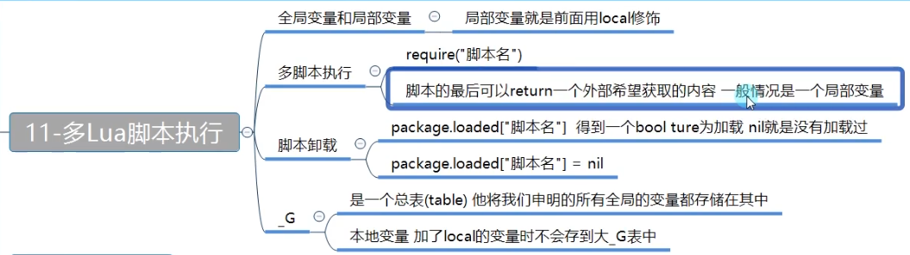  

#### 12 - 特殊用法【重点】（多变量赋值，三目运算符）
//Lesson12_Special.lua
（1）代码  
```lua
print("************特殊用法*************")
print("************多变量赋值*************")
a,b,c = 1,2,"123"
print(a)
print(b)
print(c)
--多变量赋值，如果后面的值不够，会自动补空
a,b,c = 1,2
print(a)
print(b)
print(c) --nil

a,b,c = 1,2,3,4,5,6
print(a)
print(b)
print(c)

print("************多返回值*************")
function Test()
	return 10,20,30,40
end
--多返回值时，你用几个变量接，就有几个值
--如果少了，就少接几个，如果多了，就自动补空。
a,b,c = Test()
print(a)
print(b)
print(c)

a,b,c,d,e = Test()
print(a)
print(b)
print(c)
print(d)
print(e) --nil

print("************and or*************")
--逻辑与 逻辑或
-- and or 他们不仅可以连接boolean，任何东西都可以用来连接
--在lua中只有nil和false才认为是假
--"短路"——对于and来说，有假则假。对于or来说，有真则真
--所以，他们只需要判断第一个是否满足，就会停止计算了。
print(1 and 2) --2
print(0 and 1) --1
print(nil and 1) --nil
print(false and 2) --false
print(true and 3) --3

print(true or 1) --true
print(false or 1) --1
print(nil or 2) --2

--lua不支持三目运算符
x = 1
y = 2
-- ? :
local res = (x > y) and x or y
print(res)

--x = 3, y =2
--(x>y) and x ——> x
-- x or y ——> x

--x = 1, y =2
--(x>y) and x ——> (x>y)
-- (x>y) or y ——> y
```
【输出】：  
```
************特殊用法*************
************多变量赋值*************
1
2
123
1
2
nil
1
2
3
************多返回值*************
10
20
30
10
20
30
40
nil
************and or*************
2
1
nil
false
3
true
1
2
2
[Finished in 21ms]
```
(2)总结：  
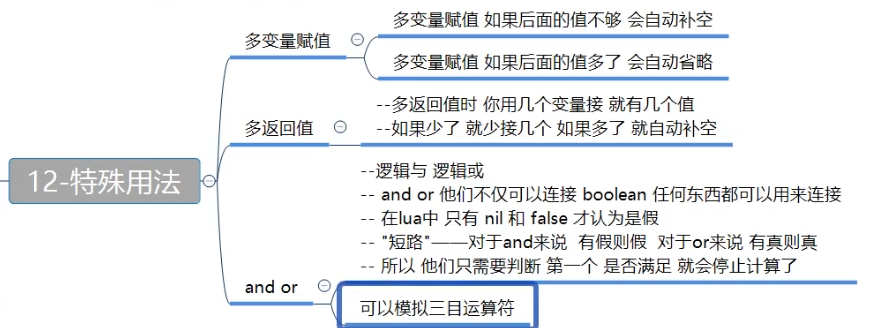  

#### 13 . 协同程序
（1）代码：  
```lua
print("************协同程序*************")


print("************协程的创建*************")
--第一种方式，常用方式
--coroutine.create()
fun = function()
	print(123)
end
co = coroutine.create(fun)
--协程的本质是一个线程对象
print(co)
print(type(co))

--第二种方式
--coroutine.wrap()
co2 = coroutine.wrap(fun)
print(co2)
print(type(co2))

print("************协程的运行*************")
--第一种方式，对应的是通过create创建的协程
coroutine.resume(co)
--第二种方式，对应的是通过wrap创建的协程
co2()

print("************协程的运行*************")
fun2 = function()
	local i = 1
	while true do
		print(i)
		i = i + 1
		--协程的挂起函数
		print(coroutine.status(co3))
		print(coroutine.running())
		coroutine.yield(i) --coroutine.yield()的话下面的tempI返回nil
	end
end

co3 = coroutine.create(fun2)
--默认第一个返回值是“协程是否启动成功”
--yield里面的返回值
isOk, tempI = coroutine.resume(co3)
print(isOk, tempI)
isOk, tempI = coroutine.resume(co3)
print(isOk, tempI)
isOk, tempI = coroutine.resume(co3)
print(isOk, tempI)

co4 = coroutine.wrap(fun2)
--这种方式的协程调用，也可以有返回值，只是没有默认第一个返回值了
print("返回值"..co4())
print("返回值"..co4())
print("返回值"..co4())

print("************协程的状态*************")
--coroutine.status(协程对象)
--dead 结束
--suspended 暂停
--running 进行中
print(coroutine.status(co3))
print(coroutine.status(co))

--这个函数可以得到当前正在运行的协程的线程号
print(coroutine.running())
```
【输出】：  
```
************协同程序*************
************协程的创建*************
thread: 00C1D438
thread
function: 00C17540
function
************协程的运行*************
123
123
************协程的运行*************
1
running
thread: 00C18320
true	2
2
running
thread: 00C18320
true	3
3
running
thread: 00C18320
true	4
1
suspended
thread: 00C18498
返回值2
2
suspended
thread: 00C18498
返回值3
3
suspended
thread: 00C18498
返回值4
************协程的状态*************
suspended
dead
nil
[Finished in 20ms]
```
（2）总结：  
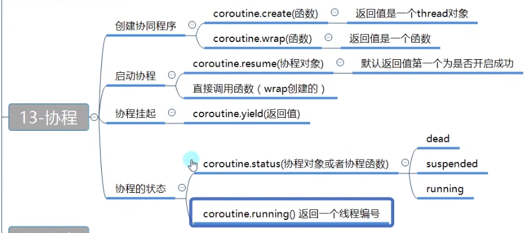  

#### 14 . 元表【重点】(__index, tostring, newindex)
（1）这两个对象的元表一致，才能准确调用比较相关的重载方法。
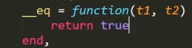  
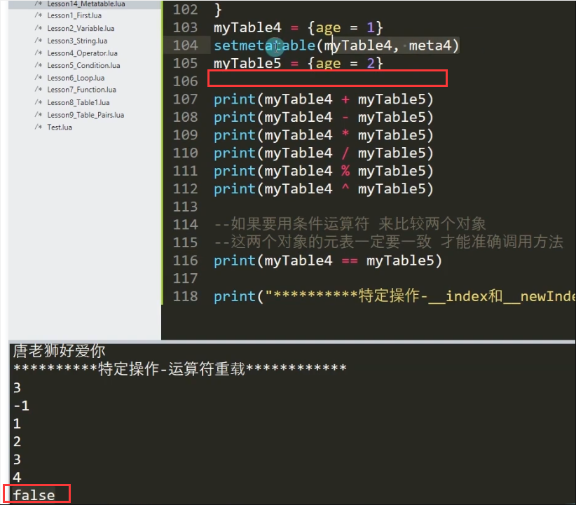  
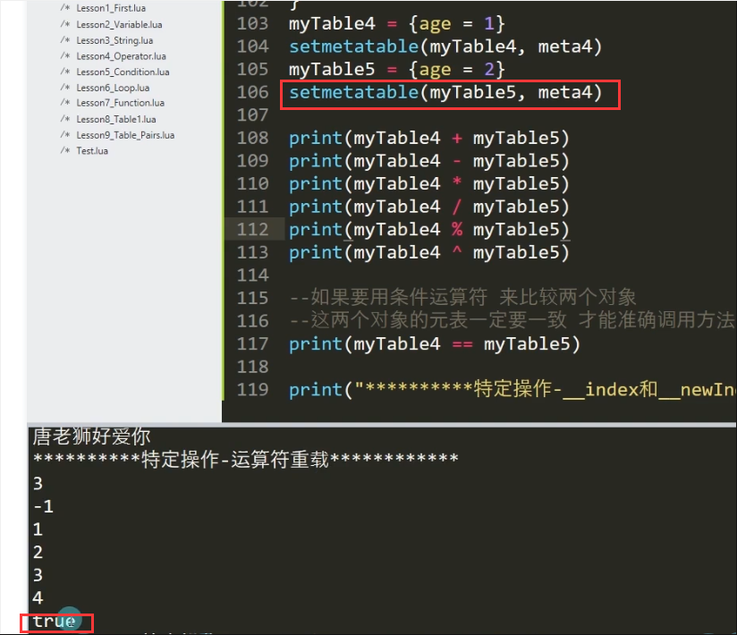  

（2）`__index`当子表中找不到某一个属性时会到元表中的`__index`指定的表去找索引。  
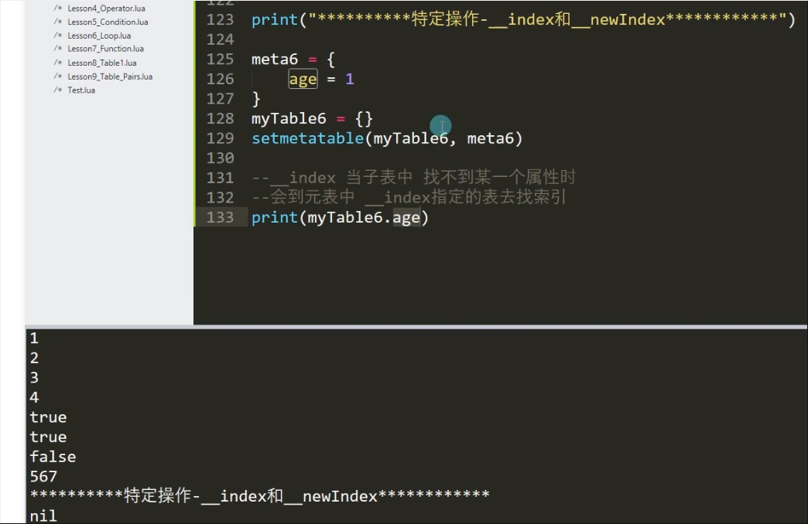  
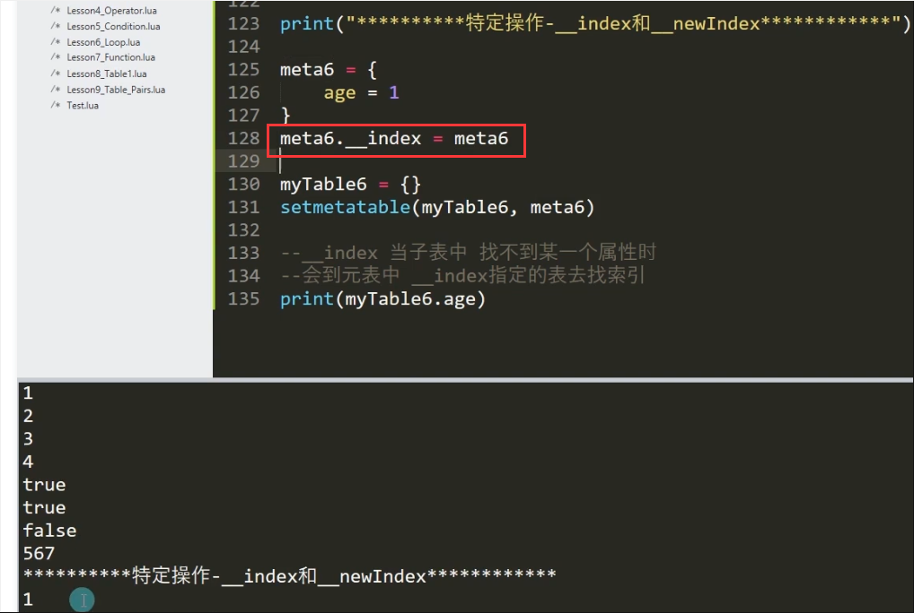  
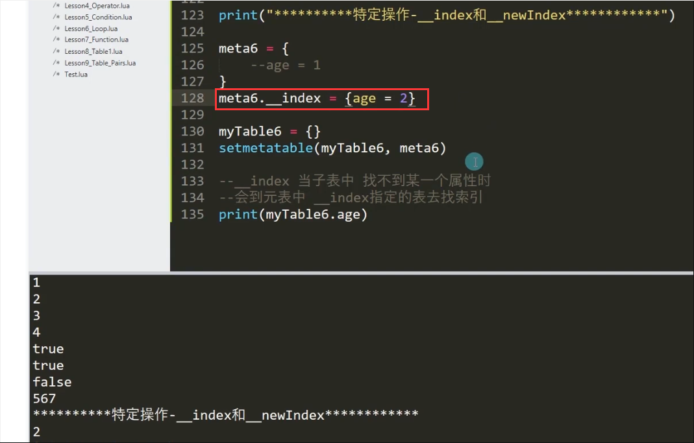  
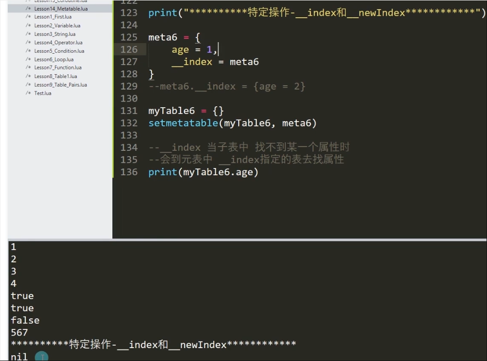  

（3）newIndex当赋值时，如果赋值一个不存在的索引。那么会把这个值赋值到newindex所指的表中，不会修改自己。  
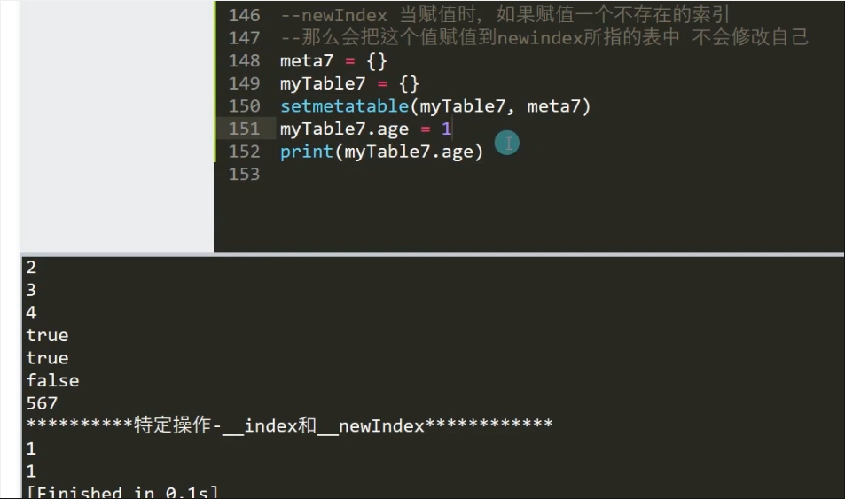  
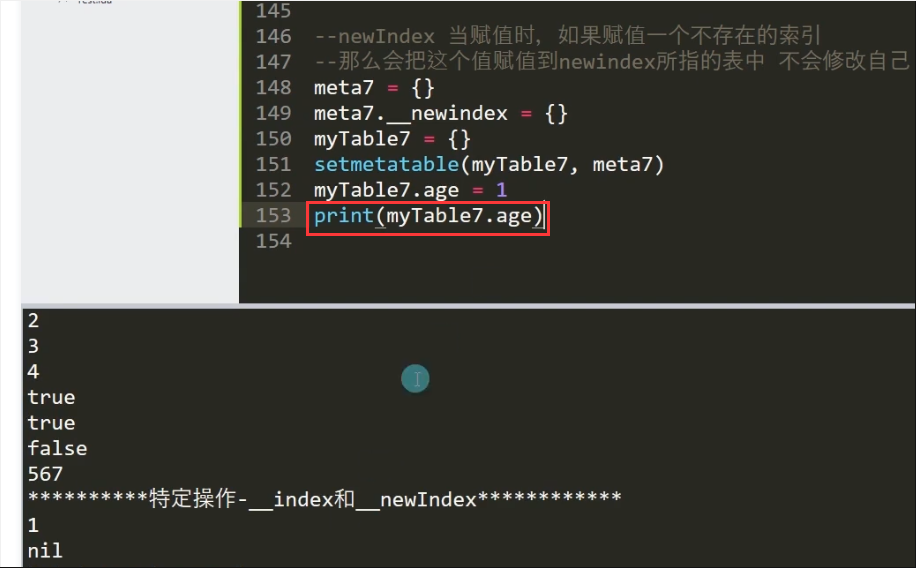  
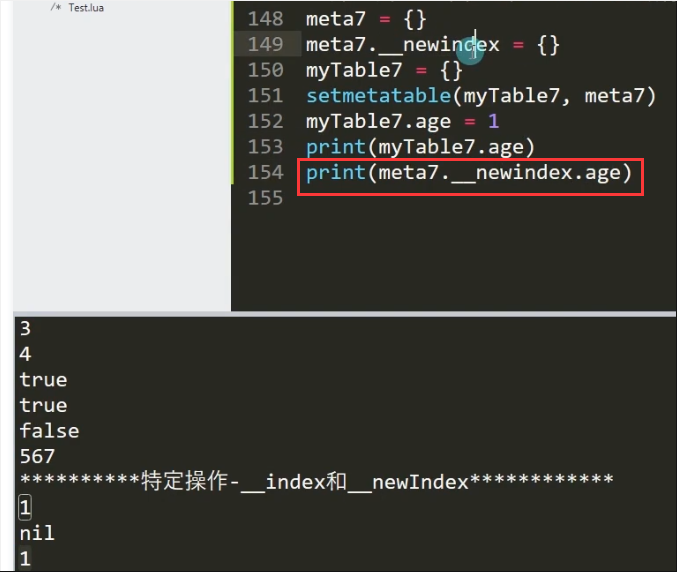  

（4）代码：  
//Lesson14-Metatable.lua
```lua
print("************元表*************")
print("************元表概念*************")
--任何表变量都可以作为另一个表变量的元素
--任何表变量都可以有自己的元表（爸爸）
--当我们子表中进行一些特定操作时
--会执行元表中的内容
print("************设置元表*************")
meta = {}
myTable = {}
--设置元表函数
--第一个参数 子表
--第二个参数 元表（爸爸）
setmetatable(myTable, meta)

print("************特定操作*************")
print("************特定操作-__tostring*************")
meta2 = {
	--当子表要被当做字符串使用时，会默认调用这个元表中的tostring方法
	__tostring = function()
		return "唐老狮"
	end
}
myTable2 = {}
--设置元表函数
--第一个参数 子表
--第二个参数 元表（爸爸）
setmetatable(myTable2, meta2)
print(myTable2)

print("************特定操作-__call*************")
meta3 = {
	--当子表要被当做字符串使用时，会默认调用这个元表中的tostring方法
	__tostring = function(t)
		return t.name
	end,
	--当子表被当做一个函数来使用时，会默认调用这个__call中的内容
	--当希望传参数时，一定要记住：默认第一个参数时调用者自己
	__call = function(a,b)
		print(a)
		print(b)
		print("唐老狮好爱你")
	end
}
myTable3 = {
	name = "唐老狮2"
}

setmetatable(myTable3, meta3)
print(myTable3)
--把子表当做函数使用，就会调用元表的__call方法
myTable3(1)

print("************特定操作-运算符重载*************")
--运算符重载在lua中用的不太多，多的是__tostring和__call
meta4 = {
	--相当于运算符重载，当子表使用+运算符时，会调用该方法
	--运算符+
	__add = function(t1, t2)
		return t1.age + t2.age
	end,
	--运算符-
	__sub = function(t1, t2)
		return t1.age - t2.age
	end,
	--运算符*	
	__mul = function(t1, t2)
		return t1.age * t2.age
	end,
	--运算符/	
	__div = function(t1, t2)
		return t1.age / t2.age
	end,
	--运算符%	
	__mod = function(t1, t2)
		return t1.age % t2.age
	end,
	--运算符^	
	__pow = function(t1, t2)
		return t1.age ^ t2.age
	end,
	--运算符==	
	__eq = function(t1, t2)
		return true
	end,
	--运算符<	
	__lt = function(t1, t2)
		return true
	end,
	--运算符<=	
	__le = function(t1, t2)
		return false
	end,
	--运算符..	
	__concat = function(t1, t2)
		return ""
	end
}

myTable4 = {age = 1}
setmetatable(myTable4, meta4)
myTable5 = {age = 2}
setmetatable(myTable5, meta4)

print(myTable4 + myTable5)
print(myTable4 - myTable5)
print(myTable4 * myTable5)
print(myTable4 / myTable5)
print(myTable4 % myTable5)
print(myTable4 ^ myTable5)

--如果要用条件运算符来比较两个对象
--这两个对象的元表一定要一致才能准确调用方法
print(myTable4 == myTable5)
print(myTable4 < myTable5)
print(myTable4 <= myTable5)

print(myTable4 .. myTable5)

print("************特定操作-__index和__newIndex*************")

metaFather = {
	age = 1
}
metaFather._index = metaFather

meta6 = {}
--__index的赋值，写在表外面来初始化
meta6.__index = meta6
--meta6.__index = {age = 2}

myTable6 = {}
setmetatable(meta6, meta6Father)
setmetatable(myTable6, meta6)
--得到元表的方法
print(getmetatable(myTable6))

--__index当子表中找不到某一个属性时
--会到元表中__index指定的表去属性
print(myTable6.age)
--rawget 当我们使用它时，它会找自己身上有没有这个变量，不管元表
--myTable6.age = 1
print(rawget(myTable6,"age"))

--newIndex当赋值时，如果赋值一个不存在的索引
--那么会把这个值赋值到newIndex所指的表中，不会修改自己
meta7 = {}
meta7.__newindex = {}
myTable7 = {}
setmetatable(myTable7, meta7)
myTable7.age = 1

--rawset 该方法，会忽略newindex的设置，只会该自己的变量
rawset(myTable7, "age" ,2)

print(myTable7.age)
print(meta7.__newindex.age)
```

【输出】：  
```
************元表*************
************元表概念*************
************设置元表*************
************特定操作*************
************特定操作-__tostring*************
唐老狮
************特定操作-__call*************
唐老狮2
唐老狮2
1
唐老狮好爱你
************特定操作-运算符重载*************
3
-1
2
0.5
1
1
true
true
false

************特定操作-__index和__newIndex*************
table: 01081BD8
nil
nil
2
1
[Finished in 21ms]
```
（5）总结：  
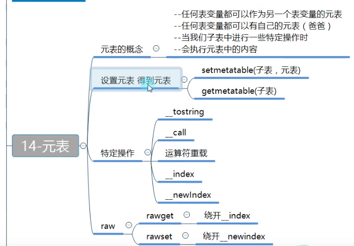  

#### 15 . Lua面向对象
lua面向对象之封装【重点】  
lua面向对象之继承【重点】  
lua面向对象之多态【重点】  
lua面向对象总结【重点】  

(3)总结：  
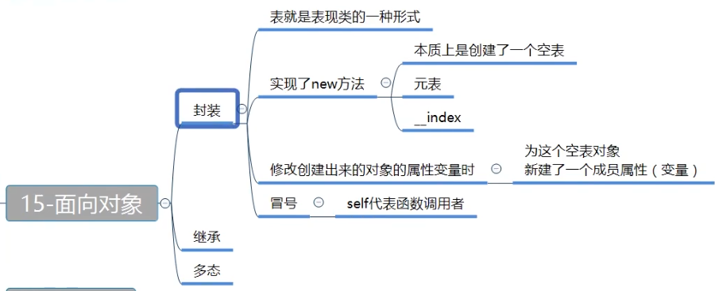  
