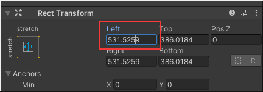
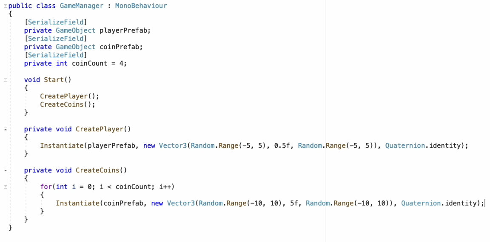
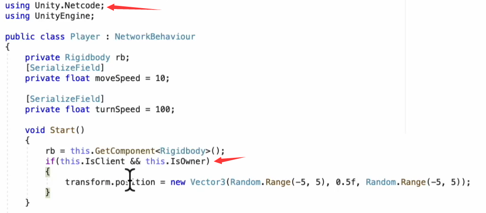
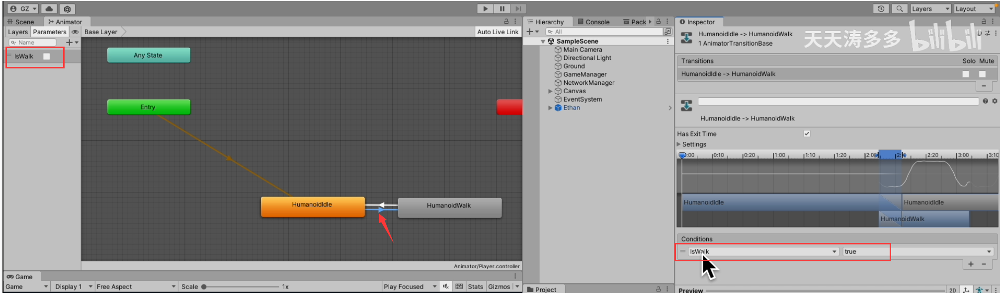

# unity散笔记（一）
## 一 . UI anchor
可以看这个链接(谷歌搜unity ui ancho就有r)：
https://docs.unity3d.com/Packages/com.unity.ugui@1.0/manual/UIBasicLayout.html  
网址里一些关键内容的提取（读英语太费劲）：   
1 .  
  
这个图标在2021版本的unity的这里：  
  
2 .  
Rect Transform是UI独有的。  
3 .   
anchor就是4个三角形组成的小花花。   
作用：  
保证子物体的长方形的四个顶点，到小花花的距离的连线是不变的。  
  
比如A到B点的连线。  
不管怎么扩大缩小父物体（那个最外面的白色框框），子物体AB两点连线都是不变的。

4 .  
（1）什么都不按【只会移动anchor到黄点位置】：   
  
 (2)按shift【移动anchor，同时移动pivot到蓝色的点的位置】  
   
 同理可以把内圈想成是子物体，外圈想成是父物体。pivot（即子物体旋转中心）移动到图上对应的蓝点位置（与上图比多出的蓝点）。  
（3）按alt【移动anchor，同时把子物体或移动或拉伸到指定位置】  
  

5 .   
(1)当anchor小花花是集中在一起的时候，显示的字段为 Pos X、Pos Y、Width 和 Height。Pos X 和 Pos Y 值表示pivot和anchor的相对位置。  
注：改变POS的话anchor是不变的。子物体的pivot一般都在子物体中心【没改过的话】。所以可以计算子物体的pivot相对anchor移动了多少。  
（2）当anchor三角形分开的时候，字段变为 Left、Right、Top 和 Bottom。  
选中这个Left，  
  
会看到这一段距离是这个left的值  
  
（3）当anchor不是全都分的时候  
  
  
为了保证蓝线的距离是一定的，需要绿色的虚线是一定的，竖着的绿线表示红色方块的height不变，横向的绿线表示一直保持横线这么长的距离。  
  

## 二 . Raycast
1 . 
默认Button中包含了一个Image组件和一个Text组件，只要其中一个勾选Raycast Target，那么这个Button就可以响应鼠标事件。

UGUI的鼠标事件是通过射线检测实现的。当点击鼠标时，Unity会遍历当前勾选了Raycast Target的所有组件，找到最上层的组件来作为当前点击的响应点。所以场景中勾选Raycast Target的组件太多的话，就会降低游戏运行效率。

然而Unity在创建Image、RawImage、Text等基本组件时是会默认勾选Raycast Target选项的，如果到了项目后期，逐个组件检查是非常麻烦的。因此可以重写创建方法，在创建时不勾选Raycast Target选项。这样就可以避免UI中出现无用的勾选了Raycast Target组件

2 . Quite simply, if selected (check box is checked), the UI element will block the raycast (i.e. your mouse click). If you don’t have it checked, then your mouse will not work on that button, **and the next thing below/behind it will catch the raycast**.

The point is to remove the mouse-clickability from UI elements (like maybe a name tag) that don’t need to be clickable (raycast target=false).

Likewise, if you have a UI element covering half the screen (like a window or something), you probably don’t want to click things behind it so (raycast target=true)

No performance impact either way.

3 . 
这个网址没看太懂  
网址：https://discussions.unity.com/t/understand-how-raycast-target-works-on-ui-elements/189152  
的OP认为当取消勾选raycast target的UI后面有一个3D物体时，鼠标点击事件会到3D物体上但是事实好像并非如此。  
- You can however use both raycasters at once, Graphics and Physics, and use EventSystem events only.
- I have found that multiple raycasters can steal a click from each other.

## 三.When to use [SerializeField] and why?

1 . [Serializefield] is just use for showing a private variable’s value on Inspector. You can easily change the value like public variable. But None can access this value from another script or places.

虽然上面说了NONE。But you can with the Reflection API. For 99% of uses cases if you are using reflection to get private members your approach is **flawed**.

2 . Serialization is the process of taking an object in ram (classes, fields, etc…) and making a disk representation of it which can be recreated at any point in the future. When you apply the SerializeField attribute to a field, it tells the unity engine to save/restore it’s state to/from disk. You mostly use serialization for the editor, and especially when building your own editor windows and inspectors.

For most games (especially simple ones) PlayerPrefs is sufficient for saving state to disk. 

## 四 . Unity EventSystem入门  
https://blog.csdn.net/qq_58870988/article/details/138547296  
讲了手柄，按钮触发间隔，EventTrigger（触发事件），2D3D的raycast。

## 五 . Run In Background
到达步骤：  
- 选择File -> Build Settings。  
- 在Player Settings中，找到Resolution and Presentation部分。

**Run In Background（后台运行）**：
- Run In Background属性用于控制当应用程序失去焦点时，Unity是否继续运行。  
- 如果勾选了此选项，游戏在失去焦点后仍然会继续运行，例如当我们切换到其他应用程序或桌面时。  
- 如果未勾选此选项，则游戏会在失去焦点时暂停运行，这在某些情况下可能是期望的行为，以节省资源和性能。  

## 六 . Time.deltaTime
  
  

## 七 . forge networking
(1)server里面的物体动，client里面的物体随着动。  
  
  
（2）Remote Procedure Call
RPC is all about receivers. 所以会出现一个问题：当HOST连入并且方块已经移动3格后，CLIENT再连入，会发现CLIENT里面的方块没有移动。  
  
  
里面的一条评论： Basically for everything you want on the server. player shooting, player movement. everything which you dont want something locally. Locally the data can be hacked. for example you are caluclating the score locally. dont do that. do that on the server and then show the final result.  
（3）Remote Procedure Call Arguments  
  
  
  
  

## 八 . B站的netcode课
（BV1RY411B7pf）  
1 . 网络同步讨论  
  
  
创建副本：  
有四个同学在寝室中玩游戏，其中一个同学的电脑作为主要的服务器，其他三位同学将会连接到这个同学电脑上进行游戏的娱乐，游戏的过程中，承担主要角色的游戏的同学会把电脑上的信息传回到游戏公司的主服务器上，因为是要先到某个同学电脑上，所以可能会有作弊现象。  
  
很多人请求一个服务器压力大。分布式减轻压力，分布在不同的地点，为就近的人提供服务。比如：我在成都，我朋友在纽约玩同一款游戏，就可以我访问杭州的服务器，我朋友访问纽约的服务器，纽约和杭州的服务器之间游戏公司去维护一个专线的连接。  

2 . P2项目准备-主角创建 
（1）window->general->lighting->environment  
环境光的天空盒去了。  
（2）键盘上下控制前后移动，键盘左右控制旋转  
  
  

3 . 金币创建  
（1）Player勾选is trigger，Coin不用勾选  
  
（2）为了防止player穿过地板掉下去两种解决办法：  
【1】取消gravity 【2】Constraints锁定Position,勾选表示锁定  
  
（3）在Player的脚本里  
  
(4)专门的empty gameobject上挂脚本  
  
instantiate是生成，金币从5f的高度掉到地板上。  
将四元数设置为Quaternion.identity实际会将其欧拉旋转设为（0,0,0）或无旋转。

4 . 按钮启动-server-client-host  
（1）networkManger中这两者的区别在于：  
两者【UnityTransport】【UnetTransport】:   
  
  
UNet是以前的方案  
  
因为我们是本地开发，联网是连接的本地的另外一个用户，没有跨越局域网，也没有连接到互联网上。  
（2）创建几个按钮  
四个按钮的含义。
比如我们在组织足球比赛，需要有一个主办方，主办方提供场地供运动员参加“Start server”。每一支参加的球队就是“client”，上场就是“start client”，HOST就既是主办方也是一支参赛球队（又有server的功能，又有client的功能）。   
   
代码写在“GameManager”脚本里。  
  
  
  
在“GameManager”脚本里加三个回调函数。  
  
我们要监听是否有其他足球队上场，可以使用NetworkManager的各种回调方法。  
第一个函数会在另一只足球队上场时进行激活。每一个加入场上的足球队全局id是唯一的。  
第三个函数通知服务器已经准备好。  

5 . parrelSync  
  
clone里面的Assets文件夹是链接/快捷方式，链接到我们原来的工程中的Assets。

6 . 主角transform同步  
（1）在player的gameObject身上挂NetworkObject组件  
  
（2）把player的prefab拽到NetworkManager（游戏物体）的这里  
  
此时创建角色不由我们完成，由NetworkManager完成。  
所以把gameManager脚本的这里注释掉。  
  
（3）为了让client和host的player主角不生成在同一个地方，Player脚本这里加上一句  
  
后运行发现，两边场景的位置不太一样。  
host产生两个随机位置:  
   
client产生两个随机位置:   
   
所以player一共四个随机位置。  
  
Player继承自NetworkBehaviour。注意！Client和Host在isClient的判断下都是true。isOwner判断这个Player是不是自己这边产生的。  
（4）  
那么现在：  
【1】start Host， Host_Player生成  
【2】start Client， Host_Player 和 Client_Player生成且Host_Player的位置对。  
【3】返回看Host中，多出来的Client_Player的位置不对（和Client中不一致）。  
另一个问题：  
用前后左右控制的时候Host_Player 和 Client_Player都会同时同向移动。  
（5）为了解决这两个问题  
  
  
如果是本平台生成的则把那两个数据发送出去，如果不是本平台生成的则接收那两个数据。  
（6）但是这样会有报错，为了解决这个报错要   
  

  

7 . 不同主角外表区分   
（1）用UI区分，先把UI的text的位置调对。  
  
  
  
（2）在Payer脚本里添加这些，使得数字显示对应ID。  
当MonoBehaviour组件创建的时候，首先执行awake，start等等这一系列的生命周期的回调函数。现在这个组件修改成NetworkBehaviour（网络组件），在网络组件被创建的时候，它其实还会去调用这个OnNetworkSpawn()。这个方法能获取关于网络的一系列的信息。    
  
也可以在Start()里获取OwnerClientId。  
【补充】   
这里用的是if(this.IsServer){}方式。  
其实还可以用之前那种比较麻烦的方式：  
【1】if(this.IsClient && this.IsOwner){}  
【2】`[ServerRpc]`  
e.g.改变player的pos和rot  

【补充++】  
【1】文档中说OwnerClientId：  
Gets the ClientId of the owner of this **NetworkObject**  
【2】https://docs-multiplayer.unity3d.com/netcode/current/basics/ownership/  
中说IsServer or !IsServer is the traditional client-server method of checking whether the current context **has authority**, and is only available in client-server topologies  
【3】https://blog.csdn.net/a924282761/article/details/134330692?spm=1001.2014.3001.5502
中说：  
Player脚本将在每个构建中为每个玩家执行。因此，如果连接了4个玩家，那么在主机构建中将有4个Player脚本，只有其中一个将IsOwner设置为true。在第二个玩家构建中，仍将有4个Player脚本，并且再次只有一个（不同的一个）将IsOwner设置为true。    
【4】【鸦鸦的理解，有极大概率错误】判断if(this.IsServer){}可能是因为，先有server然后server会：  
When a client starts a distributed authority session it spawns its player, locks the local player's permissions so that no other client can take ownership, and then spawns some NetworkObjects.   
生成不同的Client给权利，可以在这个时候看生成的client的id。  

（3）区别颜色   
通过修改这个东东  
  
  
  
  

8 . 金币位置同步  
（1）这里放网络里需要同步的其他东西，我没放啊，只是告诉你位置  
  
（2）为coin的prefab添加networkObject  
  
（3）拽过来  
  
（4）我们玩家加入游戏之后，会看见场景和场景上的物体已经加载出来。所以金币的创建应该由服务器实现。  
在gameManager脚本：  
  
可以观察到在host主场景里有金币，client场景里没有金币。  
把这里的代码修改一下：  
  
两边场景都有金币且金币位置统一。  
（5）为了使主角能够推着金币走，验证金币位置改变时两边场景是否同步，需要首先把player的Box Collider的is Trigger选项关了。  
此时测试发现client场景中金币的位置并没有发生改变。    
解决方法：对coin这种非主角的游戏物体，有一种更简易的方法。为了使不同场景之间位置同步，可以为其添加NetworkTransform的组件。我们的Netcode方案就会自动为**添加**上这个组件的物体进行位置同步。  
  
勾选的则为要同步的信息  
（6）可以看到client场景发生穿模现象，host场景里没有发生穿模现象。  
出现穿模现象原因：对于物理的碰撞运算，我们的netcode方案物理碰撞是在server端进行运算的，客户端再去做数据同步，网络传输会有延迟。  
为了解决这样的问题，可以给coin**添加**：Network Rigidbody的组件。 

9 . 金币消失状态同步  
（1）把Player的is trigger重新勾选上。  
（2）  
  
上面这个方法单机游戏可以，网络游戏就要考虑是谁碰到的这个金币呀。  
  
(3)在Coin上挂Coin脚本。  
  

代码：如果是服务器端撞到金币，直接设置，如果是客户端撞到金币，通过RPC通知服务器。

客户端如何根据这个值的变化来调整我们的coin是否显示。在netcode里面为networkvariable提供了监听的方法OnValueChanged。  
  
`networkIsActive.OnValueChanged += //...`这句话是不是放`this.gameObject.SetActive(networkIsActive.Value);`前面后面都可以。

在Player脚本里修改：  
  
（4）这时候出现报错：  
  
意思是只有金币的拥有者才能invoke serverRpc。由代码可以看出金币是由server端生成的，不是client端。所以client场景进行触碰金币操作会报错。  
为了解决这个问题在Coin脚本添加：  
  
这个 RequireOwnership = false 可以允许非server端向server发起rpc请求了。  
金币是由服务器创建，对每个场景来说都是平等的。  
弹幕：不好意思，来自NGO 1.7.1版本，这个地方的物体隐藏是自动同步的，不需要给Coin挂载脚本  

10 . ClientRPC点到点通知  
如果两个游戏玩家发生了相互作用，应该怎么办？  
怎么获取 谁碰了我 的这个 “谁”。  
这个信息传递是点对点，不用像金币一样广播给整个场景里面的所有玩家。  

Netcode提供了一种由服务器调用客户端方法的一种机制。  
例子：Player A 碰到 Player B的时候，Player A会向我们的服务器发送一个消息，所谓发送消息就是由PlayerA调用一个server RPC。通过server RPC来通知服务器“我现在已经撞到了一个角色对象”。服务器在受到这个消息以后再去调用一个客户端的client RPC用这样的方法来告诉指定的client端B：你被A给撞到了。  
  
  
这段代码的（!IsOwner）那里有点不太懂，鸦鸦猜测是不是NotifyPlayerMeetClientRpc执行者不是owner。  

过程鸦鸦猜测：UpdatePlayerMeetServerRpc先通知服务器，NotifyPlayerMeetClientRpc服务器通知client。

```C#
void UpdatePlayerMeetServerRpc(ulong from, ulong to)
//from填当前playerA的OwnerID，To填被撞的PlayerB的OwnerID。 
void NotifyPlayerMeetClientRpc(ulong from，clientRpcParams p)
//通知PlayerB
```

11 . 人物动画导入  
（1）下载unity的标准资源包  
  
一个模型两个动画  
  
**模型的rig选择这个**  
  
（2）  
【1】给模型Ethan建立prefab  
【2】创建Animator文件夹，文件夹之下创建AnimatorController改名Player  
  
【3】编辑该AnimatorController  
  
把iddle和walk拽上去，再右键添加trasition.  
【4】添加变量，以及变量为true或false对应哪个transition。  
  
  
【5】把这个animator拖拽过来。  
  

(3)把player有的组件脚本给Ethan哥给挂上去。还有UI显示id也整上。rigidbody的constraint限制一下让它不往下掉。is trigger勾上。  
得给Ethan哥多添加一个这个renderer组件。     
clone的editor里NetworkManager这里也要检查是不是也修改了：  
  
（吐槽：突然发现应该先把原始的editor保存了，再打开clone的（汗）上面那一步就不用检查了（汗））  

  
还有这个apply root motion要取消勾选   
  

(4) 修改player脚本。  
逻辑：当负责移动的键盘获取到的值非0则表示人物在移动，这时更新动画。  
  
  
  

（5）这时发现人物会漂浮，是因为instantiate生成时的y轴是0.5f。  

（6）这两个transition的has exit time都要取消勾选。  
  
（7）运行发现两个场景动画不同步。

12 . NetworkVariable同步动画  
Player脚本  
当用户需要状态改变的时候，通知服务器，服务器通知其他客户端。  
  
  
  

13 . NetworkAnimator同步动画   
NetworkVariable那样做很繁琐，netcode方案为我们提供NetworkAnimator。  
（1）添加NetworkAnimator  
  
(2)animator参数这里删了isWalk（bool），添加一个新的参数Walk（trigger）。  
 
  
  
（3）Player脚本   
  
  
  

14 . 使用ClientNetworkTransform同步主角位置  
我们只需要考虑玩家自己角色的控制，而不需要考虑其他玩家角色的控制。  
新建脚本clientNetworkTransform挂在Ethan上。  
  
再注销掉用到这两个参数的地方：  
  

## 九 . 另一个Netcode课
BV1g8411o713  
标题《Unity利用NetCode实现网络游戏（七）——概念和框架初步讲解》   
1 . 
  
  
所有存在于网络的物体都要有NetworkObject。  
2 . 数据传输里有远程调用，远程调用分ServerRpc和ClientRpc。  
  
ServerRpc: 客户端调用，服务器执行。  
  
ClientRpc: 服务器调用，客户端执行。ClientRpc发给每一个客户端。如果是Host主机的话还会发给自己。  
  
  
传参只能传值类型，不支持引用类型。  
3 .序列化  
序列化我们平时也会用到，e.g.（1）比如我们把变量公开在Inspector面板中的时候也是一种序列化。（2）有时候我们会读取json配置文件，json也是一种序列化。  
序列化在NGO(networkgameobject)中就是为了传输数据，它针对C#和Unity的基本类型已经准备了内置的序列化，让我们不用再手动序列化。针对C#，这里的基本的类型它都已经序列化过了，针对Unity的类型也都基本序列化过了。
  
4 . 结构体  
  
