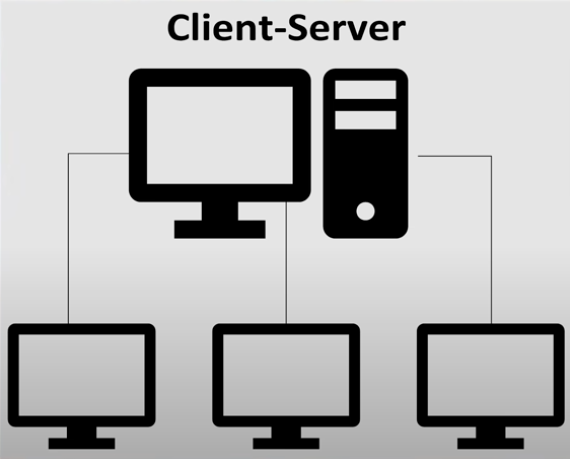
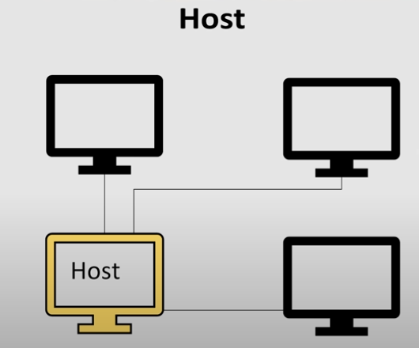
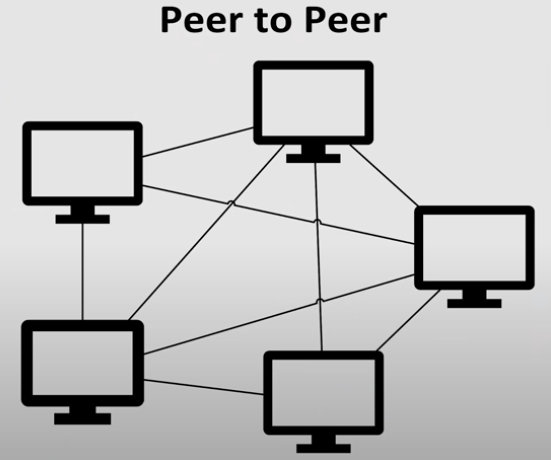
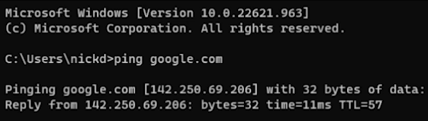
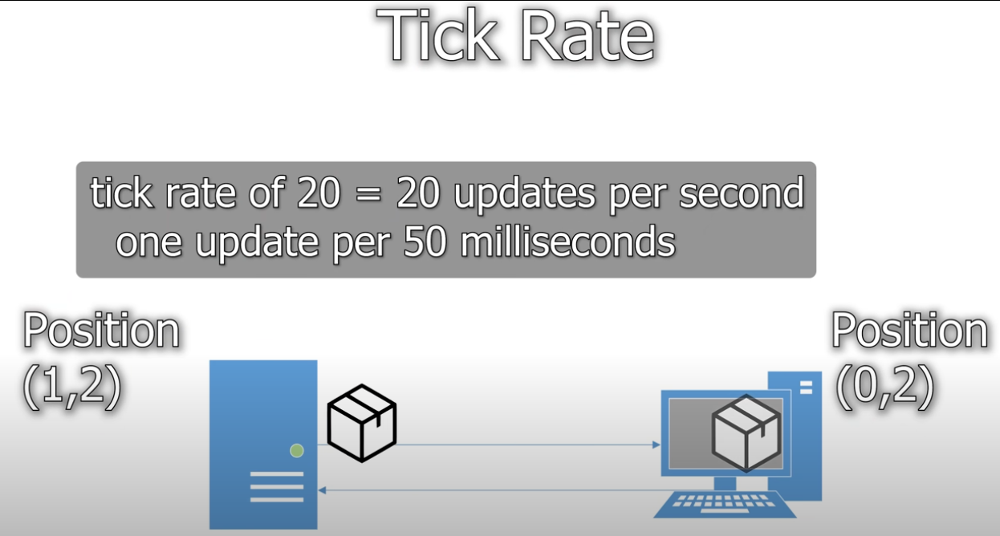
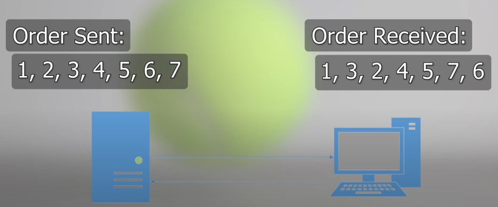
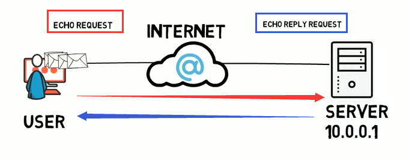
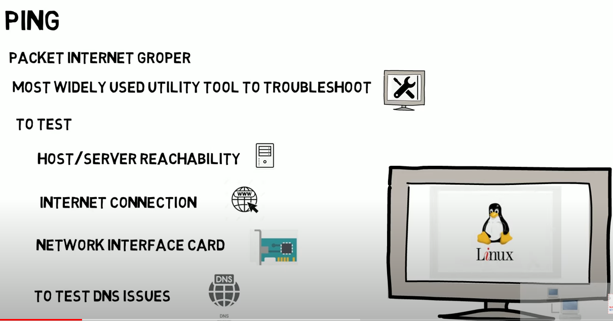
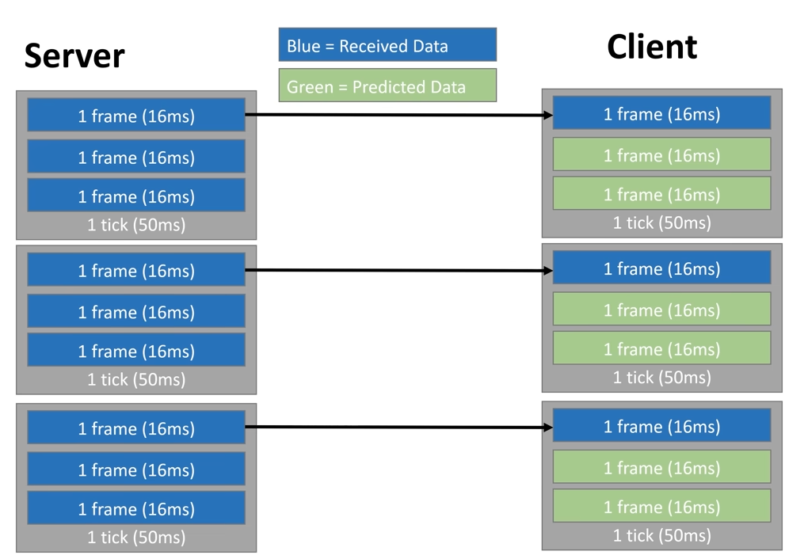

# unity散笔记（二）
## 一 . multiplayer games
https://www.youtube.com/watch?v=KBBJqPL5-eU
### 1 . 多人游戏的不同种类  
我们可以把任意多人游戏划分成two broad catergories：(1)offline games（2）online games.  
(1)offline games通常指在在一台电脑上玩，（while online games require multiple computers to talk together.）。该游戏可以划分屏幕分给不同玩家。  
（2）You can split up online modes into a couple of categories based on how the computer manages communication between players.  
【1】The simplest and most common form of online game is a **server client model**.  
There's usually a single server that **hosts** the game, and all the players connect to it directly.  
   
This is common for games like in competitive shooters such as Overwatch or Call of Duty, and it's usually required if there needs to be some server authentication.  
【2】Another model very similar to **server client model** is a **host model**, but it's when one of the clients also acts as a server for the other players. This is very common for games that don't need that kind of dedicated server（专用服务器） infrastructure and many indie games or co-op games that want to have multiplayer such as Stardew Valley often use this.  
  
【3】The last main type is **peer to peer networking**.  
  
This is where every client in the system also acts as a server and responds with shared communication between all clients. Famously, Age of Empaires use this model to manage communication and game state between lots of clients simultaneously and minimizing the impact of one player with a particularly bad connection. This used to be the common mode for many games, but has fallen out of favor as more streamlined methodologies for server, client and cloud computing have become more popular.  
一些对P2P的补充:  
https://www.youtube.com/watch?v=EFzFHrzIiz8  
的2:03关于泄露IP地址  
Wouldn't it be wonderful if we could have just peer-to-peer connections. But there's one big issue with this and that is that the players knows each other's IP addresses. If you remember when Dany released his game crap game, he was using steam's peer-to-peer networking solution and with that some big streamers got their IP addresses leaked which is a bad thing. So what did they do to resolve that, if changed from steam's peer-to-peer solution to their relay solution which doesn't let players connect to each other instead they do it through a relay. That is what I(the video poster) have been doing. I am not gonna use steam relay solution. I have built my own entire architecture for hosting relay servers.  

 

（这一段与上面无关）Asynchronous gameplay includes games such as Diablo's marketplace, where players can place items up for sale or purchase items without needing to both be online at the same time. A chess game where players don't need to communicate in real time as it also follows this asynchronous model.   
### 2 . Internet and LAN Communication  
let's look at how they can be implemnted on computers.   
A little secret: Whenever computers talk to each other over the Internet or to a computer right next to them. They use the same protocol to communicate with each other.   

If you've been playing games for a while, you might be familiar with a LAN party or a local area network. This is when people would meet up at the same house and connect their computers together, in order to play a game online, in order to reduce the communication delay that would normally happen if they were playing over the Internet. This is very popular with internet speeds weren't as fast as they are now.   

Although as I mentioned earlier, the protocols for LAN communication or communication over the Internet are the same. The two main (transport layer) protocols that computers use to communicate with each other are called TCP and UDP.  
- Note: TCP and UDP are Transport Layer network protocols, there are other layers in the networking communication stack, just calling them the main protocols for brevity. 

These stand for transmission communication protocol and user datagram protocol respectively.
At a high level, TCP sends data slowly but ensures that it always arrives in the correct order with a bit of overhead.
On the other hand, UDP sends data quickly but doesn't have the same guarantees of correctness or order when being received by the other user.

Both protocols have their own uses, especially in games. Games sometimes use TCP for establishing connections, communicating user information.  
While UDP is much more useful for communicating fast updating data such as the state of objects in the game.   
So for computers to communicate, they need to open a socket using one of these protocols.
TCP or UDP.  
A socket allows for your computer to send data to another computer using an address, protocol and port.

The way that computers can address each other is fairly similar to how you send mail to other people. You need their address or in computer's case, internet protocol address, IP address. In addition to an IP address, there are also hostnames which can use a DNS to resolve a hostname to an IP address instead of having to use the actual IP data.  
You can resolve the [IP Address] of any hostname by using the ping command on most computers. Hostnames are often useful for fixed services as well as authentication.  
Think of why it's easier to type google.com into your web browser instead of putting that long string of numbers of an IP address into the browser.  
  

In addition to an address, the socket also needs a port to open communication, an IP address or hostname point to an entire network. While a port can only be associated with one computer in that network. Think of it like the IP address as the street address and the port is the apartment number for the address. There can be lots of apartments in the same building, but giving an apartment number helps specify who you're sending the letter to. There can also be lots of computers in the same network, but each port can only be associated with one individual computer.  
### 3 . Synchronizing Game State
Now, as one last little complexity here, you might wonder if all computers in the same network have the same IP. How do they send messages to each other? That is a differentiation between a local area network. As mentioned earlier in LAN and a wide area network or WAN. Your router just complex working an algorithm called network address translation, NAT for short, to convert your WAN address to your local address, which is why your computer might have two addresses, a local address for within in the network, an external address for communicating with devices outside the network.  

let's move on to the interesting part. Game design. The easiest abstraction for thinking about games and synchronization over the Internet
is to convert your game into **a game state**. In the context of a game, state is the information associated with the current game to be able to communicate it from one computer to another. For a simple example, let's look at a game of chess. You can serialize the whole game board into a sequence of pieces and what position they are in. **Serialization** is the process of converting data to a string of bytes or numbers that can be sent from one computer to another or written to disk. This also extends to more complex data such as 3D position or velocity data for synchronizing a physics simulation between two computers as part of a game.    
Although chess is a simple example that only needs to be updated every time a player makes a move or rejoins a game. More complex games have real time data such as physics objects need a faster update rate and have more parts to consider.  

The concept of a tick rate defines how often the game is updated between computers playing a game together. This means that if you want to simulate an object moving across a screen on the server that has a tick rate of 20 then 20 times per second or every 50 milliseconds, the server will send an update to the client. Then, whenever the client receives an update from the server, they simply need to update the game state accordingly. 
  
This kind of synchronization also extends to more complex things such as player input. A player may want to send the sequence of their inputs to the servers at the server can replay those inputs and verify that the player position is accurate and updated. As a simple example, we can look back to the game of chess and say that when a player makes a move, they tell the server what piece they want to move and from what position and to what position. Then the server simply needs to verify that that move is legal and update the game state accordingly and send the result to both players.
### 4 . State Buffer for Out OF Order Commands
Now, while this might work for an asynchronous game model such as chess, this might not extend as cleanly to something like a moving, bouncing ball on the screen at a varying tick rate. This is because most of the time will be using UDP model for this kind of communication. The reason that UDP models preferred for real time communication is because it's much faster than TCP and has much less overhead. However, UDP does not guarantee the order in which packets will arrive. So given this constraint, if you were to simply update the client state based on every message from the server sent, that object might start suddenly jittering back and forth as the inputs don't always get received in the same order that they're sent.  
  
To get around this problem, a common solution is to use a buffer. This same buffer model is used for streaming videos as well. Whether you're watching a video on YouTube or Netflix, you might see that small buffer space. This space represents the data that has been received but not displayed to the user yet. It's useful to save a buffer, so if communication is briefly interrupted, the video doesn't pause or get corrupted.  
This kind of buffer or delay model is usually accounted for by checking the ping and communication time between the client in the server and then creating a buffer of that many ticks. So if the ping between the client and server is 100 milliseconds, you might create a buffer of 200 milliseconds. And with a 20-tick rate, this would be about four ticks at 50 milliseconds per tick. Then when the client replays messages instead of instantly updating the state, we write to the buffer. Then when we're replaying this buffer, even if the data has been received out of order, we can correct for this by adjusting based on the information in the buffer and that we have for the position of the object. This results in much smoother movement and is usually a standard feature in most multiplayer frameworks. Or if it's not a standard feature, it's fairly straightforward to implement once you know the buffer designed for the game.

【鸦补充】关于ping  
要弄清两种语境：  
（1）(higher/lower) ping time (2)ping command  
(1)ping time是指用ping command测量两台计算机沟通时间  
网络游戏速度通常会有这个概念  
ping, is a method of measuring latency or the time it takes to send and receive a packet of data between two devices such as computers on a network. A simple analogy would be to pretend that the two computers are two people Dick and Jane. Ping would be the ammount of time it takes Dick to say something to Jane and receive a respond. The lower the ping time or latency between Dick and Jane, the more effective they can communicate.  
  
（2）ping command  
ping是一种程序，有以下功能：  
  
ping command可以这样写：  
【1】后面跟IP address  
ping a server in our local area network. Open up a command prompt and then we would type the word ping along with the IP address of the server and then press 'enter'.  
e.g.   
`C:\Users\Admin> ping 192.168.1.5`  
Then the ping utility will send out 4 data packets to the IP address of the server, then our computer will wait for a response. Then the server will send the data packets back to us as a reply and these replies are called echo reply requests and these replies inform you about what's happening with the server we pinged.  
【2】a loopback test(后面可跟IP可跟localhost字符串)  
`C:\Users\Admin> ping 127.0.0.1`  
or  
`C:\Users\Admin> ping localhost`  
【3】后面可跟domain names  
the ping command can also be used to test DNS name resolution issues. In a nutshell, DNS is what resolves domain names to IP addresses. 
e.g.
`C:\Users\Admin> ping yahoo.com`  
【朋友补充】http tcp ip icmp mac 每个层都有对应排查的命令的：curl telnet ip ping arp。  
这些命令有一部分windows没有，比如arp。
win10自带curl。ping, ip, telnet, traceroute一直都有。  
服务器主要是linux，现在还在用Windows server的公司不用去了  
### 5 . Client-Side Prediction
Now that we have our buffer for our object moving across the screen, we solve a problem. We assume that this ball is being controlled by the server using a server authoritative model. The client won't update the ball position and will wait for a message for the server. However, if there is a communication error, we make a hole second or so without receiving a message from the server and this ball would suddenly freeze for the client. Since the ball would probably have a predictable motion and path determined by gravity and its environment,we can make a good guess at where the ball should be since. Although, since the ball is controlled using a server authoritative model, we don't actually move it at all. Client side prediction design helps account for this kind of situation. In addition to sending the ball's current position to the client, we can also send the ball's current velocity to the client. This way, if the client misses some data from the server, we can use the previous velocity to guess where the ball would have been. Whenever data is restored from the server, we can operate the predicted data with the server as actual data. Client side prediction is also handy for making even smoother animations. In the perfect scenario where no messages are lost from the server, the ball may move on the server at 60 frames per second, making a smooth image. But on the client we only get updates for the object at tick rate or 20 times per second. Even though our movement is no longer jittery, it's still slower than it is on the server.  
  
 In the intervening frames, we can apply client side prediction on the client to animate where the ball would have been in the intervening frames. This may not be necessary for every single object, but especially where the object's motion is predictable, it can lead to a much smoother experience. Additionally, client side predictions can be extended to more than just physics objects. Earlier we mentioned synchronizing player input between client and server. Most of the time you can assume of players walking forward. They'll continue to walk forward in that situation. If a client misses an update from the server about another player's position. The client can use that player's previous input to move the player how they were moving earlier. This is not a perfect solution and will depend on the game. Also, if we get a prediction wrong, we'll have an unstable condition and we may see the player move back and forth quickly as that position is synchronized in the server state to the client's predicted state. This is sometimes called rubber banding as it looks like the object is being snapped forward and backward quickly.
### 6 . Remote Procedure Call
Sometimes other states for a game may need to be synchronized, but only sent infrequently. An example of this might be a chat log. You don't need to update the chat log at 20 times per second. You only need to update it when a player sends a message. Since we want to make sure that the messages are sent correctly, we can use what's called a remote procedure call or RPC for short. An RPC allows for a client to invoke a method on the server, such as adding a message to the chat log or opening a door. The RPC can also be made back to the client, such as sending current state of the data to the game.  
### 7 . Client Authorative Control
There's one last concept we need to cover. If we were to only use the server authoritative control and client side prediction, there would still be one glaring flaw in our game's design. If you want a client to move their own player, they need to wait for their command to be sent to the server and then sent the client back for the confirmation. This may be all right for something simple like opening a door, but it would be a horrible trying to move your player.

 Imagine hitting the jump button, then needing to wait for the buffer time of 200 milliseconds to pass before your player actually jumps. To get around this problem. We can change the player object to use a client authoritative model. 
 
 Under this model, any changes that a player makes to an object that they own happens immediately and then they send that state to the server. The server simply needs to relay that resulting state to the other client. This way we have no lag on our players actions but can still synchronize the state of other players. This results in each client having a somewhat de-synchronized state as I move forward on my screen, but this might take a couple hundred milliseconds or so for your computer to receive that input and move the player on your screen. This leads to each player seeing a slightly different version of all the positions between the clients, and this de-synchronization can be resolved with a state buffer and rollback, but that will be left for a future topic.
 
  Overwatch's developers gave a great talk on how to implement this through an entity component system at GDC if you're interested in learning more. For most games, a small de-sync between clients is no big issue. However, for competitive games, that extra 100 milliseconds of delay could be the difference between who shot first. Sometimes the server will have to decide who went to fight games like Overwatch or Call of Duty. Use a system called favor the shooter, which is if the player hit you on their screen, the server will usually let that hit go through. Therefore, you may have experienced a frustrating situation where you just ran behind a corner but still got hooked by Roadhog or shot in the back.  

  These concepts of client or server authority, client side prediction and RPC have given you the basic building blocks to make any multiplayer game. All of these design patterns are implemented by default in most networking frames.