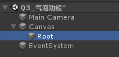
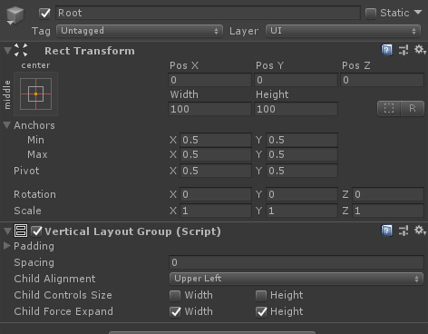
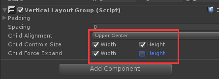
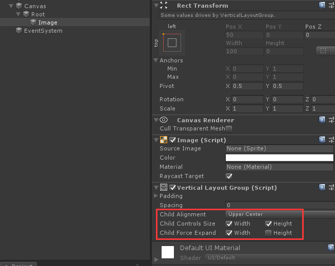
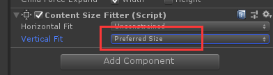
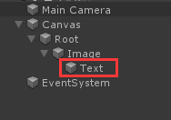
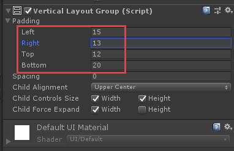

### Unity散笔记03
#### 1 . Serialized Field Vs Public properties
title:Serialized Field Vs Public properties | Unity Game Dev Tutorial（YTvideo）    

(1)Serialized fields purely expose a property in the inspector where a public property that property not only through the inspector but to all the classes, this kind of violates the encapsulation model of object orientated programming.  
(2)
```C#
//如果是用public的话
//游戏物体Player上挂脚本Player.cs。
public class PlayerScript : MonoBehaviour{
	public string playesName;
}
//游戏物体PlayersHat上挂脚本PlayersHatcs。
public class PlayerScript : MonoBehaviour{
	PlayerScript playerScript;

	void Start(){
	playerScript = GetComponent<PlayerScript>();
	playerScript.playersName//其他脚本可以访问playersName。
 }
}
```
(3)官方“字段（Field）”文档说not recommended  
https://learn.microsoft.com/zh-cn/dotnet/csharp/programming-guide/classes-and-structs/fields
```C#
    // public field (Generally not recommended).
    public string? Day;
```
(4)auto property  
if you do want to use a public stream, this is a lot more acceptable.  
```C#
public class PlayerScript : MonoBehaviour{
	public string playesName{get; set;}
}
```

#### 2 . 气泡功能
（1）在Canvas下新建空物体作为根节点：  
  

（2）在根节点下添加vertical layout group。
  
这样点选：  
  

(3) root下新建image作为背景添加vertical layout group控件。  
  

（4）给root添加content size fitter组件  
  

（5）在Image底下新建Text  
  
（6）通过Root调节Image的大小，
通过Image的下图的组件调整文字到背景边框的距离。  
  
