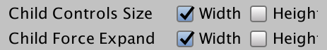
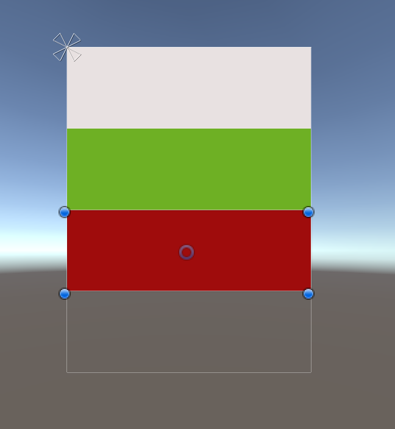
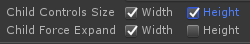
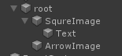
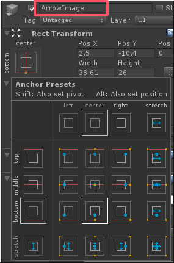
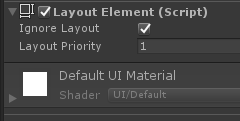

### unity UI策划笔记  
#### 1. LayoutElement  
参考的是这个网页：  
https://blog.csdn.net/weixin_45532761/article/details/129936137  

优先级: Min >Preferred >Flexible

的含义是：  
如果 Min Width < Preferred Width  
取Preferred Width。  
如果 Min Width > Preferred Width   
取Min Width。  
因为要先保证Min Width被满足。  

#### 2 . Layout Group里的
Child Control Size 和   
Child Force Expand的用法解释：  
https://www.hallgrimgames.com/blog/2018/10/16/unity-layout-groups-explained    

（1）    

Child Force Expand：是否要强制子布局元素扩展以填充额外的可用空间

父物体的vertical layout group勾选这些：  
  
子物体呈现这样的效果：  
  

勾选Controls Size Height 而不勾选Force Expand Height会导致高度=0。  
  
因为勾选controls size height会使默认值为0，因此一旦只让它控制，我们的图像就会消失。  

为了在只勾选：  
√ Child Controls Size Width   
√ Child Controls Size Height  
√ Child Force Expand Width  
这三个的情况下怎么让图片显示出来？  
可以为三个子物体添加“Layout Element” Component以重写那个默认的0值。  

（2）Flexible Height控制的是权重值。假如一个设置为1，一个设置为2。  
那么它们的大小比例是1：2 。  

当一个子物体又勾选了preferred heights，又勾选了flexible height。  
那它实际的值等于preferred heights的值 + 在剩下的划分中所占得的比率的值。  

#### 3 . 测试题第三题的正确解法：  
  
arrow image的pivot设在这里  
  
并且加入Layout Element组件勾选这个：  
  
ignore layout，把它移动到合适的位置。  