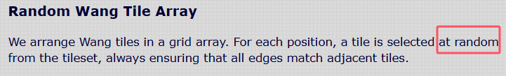
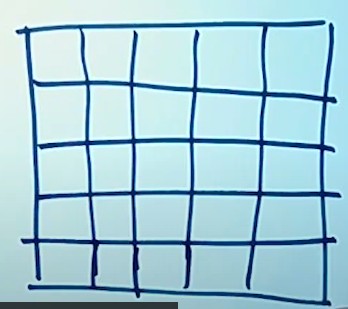

### 自动图块笔记

#### 1 . 问题来源
在做dual-grid system 的笔记时遇到一个问题：  
什么是15-piece tiles，  
什么是47-piece tiles。  于是去问期喵，期喵让我研究一下“自动图块”。

于是上知乎搜“自动图块”，搜到这篇回答：  
https://www.zhihu.com/question/61025506/answer/2354396555  
这个回答提到了：  
Marching squares算法。  
（鸦感觉这个算法起到的是怎么把一片区域围起来的作用，和15，47两个数字怎么来的没啥关系）。  

于是我又看了这个视频：  
  
https://www.youtube.com/watch?v=QXeCCvGgHhk&list=LL&index=16

里面提到了这个工具：Tiled  
https://doc.mapeditor.org/en/stable/manual/terrain/  
的这里提到了这个网址：  
  
https://web.archive.org/web/20220712091710/http://cr31.co.uk/stagecast/wang/blob.html  
所以下面正式开始介绍。  

#### 2 . 解释15和47数字来源介绍
为了理解15和47两个数字，主要看这几部分就够了：  
  

##### 2.1 Wang tiles重点
（1）Tiles have a 'fixed orientation', they are never rotated or reflected (turned over).  
  
由红圈可以看出不会旋转。  
（2）  
  
其实也不是完全at random的，肯定是有一定规律的。     
看这种情况：  
   
就不是边与边连接部分颜色相同。  

##### (2.2) 2-edge tiles 重点
主要看边的，  
一个正方形有4条边，分别染上不同的颜色。  
e.g.  
0000

0001

0010  
0011

0100    
0101   
0110   
0111  

1000  
1001  
1010  
1011  
1100  
1101  
1110  
1111  

1代表黄色0代表蓝色

##### (2.3) 2-corner Wang Tiles
(1)Wang tilesets are usually edge tilesets. But we can also create a Wang tileset by considering the tile corners.   
一个正方形有4个角，每个角都有2种颜色。2^4是16种可能性。  
  

（2）
It may seem that matching corners will produce similar results as matching edges, but this is not so. An edge only affects one adjacent tile, while matching a corner affects three adjacent tiles.  
  

【注意】上文说的是`a corner affects`，  
类似编号3和15这种方块，是好几个corner。  

##### (2.4) Blob Tileset
(1) A Blob tileset is a 47 tile subset of a 2-edge 2-corner Wang tileset.    

**2-edge + 2-corner Wang Tiles**


With two different types of edge and two different types of corner, we have 2^8 or 256 different tiles in a complete tileset.  

Generally though 256 tiles is too many to produce and use. However, there is an interesting subset of 47 tiles, known as **'Blob' tiles**.

Here is the Blob tileset. Below each tile, all possible 90 degree rotations (clockwise) are shown. Each is 4x the previous index, (mod 255).  
【注意在这里用到了旋转】  

  
  

#### 3 . Marching Squares
其他没读的好的参考资料：  
https://catlikecoding.com/unity/tutorials/marching-squares/  
https://urbanspr1nter.github.io/marchingsquares/  

笔记时参考这个视频记录的：  
https://www.youtube.com/watch?v=0ZONMNUKTfU&list=LL&index=18  

（1）
if I take my processing window and divide it into a two-dimensional grid, we could think of each cell of this grid as having a number.   
  
That's how we visualize two-dimensional Perlin noise.  

But in order to make marching squares happen, I need to put a little twist on this.    
I don't actually want to think of the center of each one of these as having a number. I want to think of these spots here, where each square has four corners. And each of those four corners represents a number.  
   
processing代码：  
```java
float[][] field;
int rez = 10;
int cols, rows;

void setup(){
  size(600, 400);
  cols = width / rez;
  rows = height / rez;
  
  field = new float[cols][rows];
  for(int i = 0; i < cols; i++){
    for(int j = 0; j < rows; j++){
      field[i][j] = random(1);
    }
  }
}

void draw(){
  background(0);
  for(int i = 0; i < cols; i++){
    for(int j = 0; j < rows; j++){
      stroke(field[i][j]*255);
      strokeWeight(4);
      point(i * rez, j * rez);
    }
  }
}
```
  

（2）so the idea of marching squares is, what would be some algorithm to find contours and patterns in this array of numbers?  
So to demonstrate how this works, I think it would be actually easier for me to consider each one of these numerical values as just a zero or a one.  
```java
int[][] field;
int rez = 20;
int cols, rows;

void setup(){
  size(600, 400);
  cols = width / rez;
  rows = height / rez;
  
  field = new int[cols][rows];
  for(int i = 0; i < cols; i++){
    for(int j = 0; j < rows; j++){
      field[i][j] = floor(random(2));
    }
  }
}

void draw(){
  background(127);
  for(int i = 0; i < cols; i++){
    for(int j = 0; j < rows; j++){
      stroke(field[i][j]*255);
      strokeWeight(rez*0.4);
      point(i * rez, j * rez);
    }
  }
}
```
  

（3）The idea here is that, whichever ones are on or off, I want to seperate the ones that are on from the ones that are off.    
  

  

  
  

（4）  
the midpoint between the corners. Because that's what gonna connect the line.   
  
把这四个点分别叫a, b, c, d。  
一个像素的宽度是rez。  
左上为第一个点，右上为第二个点  
左下为第三个点，右下为第四个点。   
然后顺时针遍历。  
0001就是：  
0 0  
0 1  

代码：  
```java
int[][] field;
int rez = 20;
int cols, rows;

void setup(){
  size(600, 400);
  cols = 1 + width / rez;
  rows = 1 + height / rez;
  
  field = new int[cols][rows];
  for(int i = 0; i < cols; i++){
    for(int j = 0; j < rows; j++){
      field[i][j] = floor(random(2));
    }
  }
}

void draw(){
  background(127);
  for(int i = 0; i < cols; i++){
    for(int j = 0; j < rows; j++){
      //cols-1和rows-1是因为final column doesn't have any neighbors to the right
      stroke(field[i][j]*255);
      strokeWeight(rez*0.4);
      point(i * rez, j * rez);
    }
  }
  
  for(int i = 0; i < cols - 1; i++){
    for(int j = 0; j < rows - 1; j++){
      //cols-1和rows-1是因为final column doesn't have any neighbors to the right
      float x = i * rez;
      float y = j * rez;
      PVector a = new PVector(x + rez*0.5, y);
      PVector b = new PVector(x + rez, y + rez * 0.5);
      PVector c = new PVector(x + rez*0.5, y + rez);
      PVector d = new PVector(x, y + rez*0.5);
      
      strokeWeight(1);
      
      int state = getState(field[i][j], field[i+1][j], field[i+1][j+1], field[i][j+1]);
      //顺时针方向遍历4个corner哦
      switch (state) {
        case 1:
          line(c, d);
          break;
        case 2:
          line(b, c);
          break;
        case 3:
          line(b, d);
          break;
        case 4:
          line(a, b);
          break;
        case 5:
          line(a, d);
          line(b, c);
          break;
        case 6:
          line(a, c);
          break;
        case 7:
          line(a, d);
          break;
        case 8:
          line(a, d);
          break;
        case 9:
          line(a, c);
          break;
        case 10:
          line(a, b);
          line(c, d);
          break;
        case 11:
          line(a, b);
          break;
        case 12:
          line(b, d);
          break;
        case 13:
          line(b, c);
          break;
        case 14:
          line(c, d);
          break;
      }
    }
  }
   
}
void line(PVector v1, PVector v2){
  line(v1.x, v1.y, v2.x, v2.y);
}

int getState(int p1, int p2, int p3, int p4){
    //输入是二进制的数值，输出是10进制的数字
    //将grid四个corner的数字放到input中
    return p1*8 + p2*4 + p3*2 + p4*1;   
}
```
  

#### 4 . 返回blob那个网页
  
这一块应该讲怎么生成随机地形的。  
方法1说的是：  
当一条边（无论上下左右）为0，它的两个corner都为0。  
但是这样生成的tile有一个问题：  
不能拼斜边，已知点的每个大方块会被划分成3x3的小方块。  
当点击这两个点时：   
  
由于左边的样子不能封边，会生成右边的样子：  
  

但如果中间有过渡的方块，就可以生成封边的连通域：  
  
