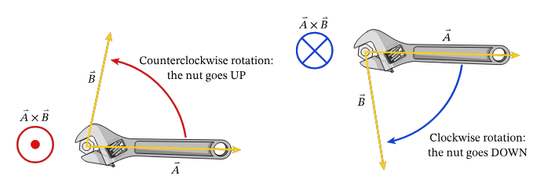
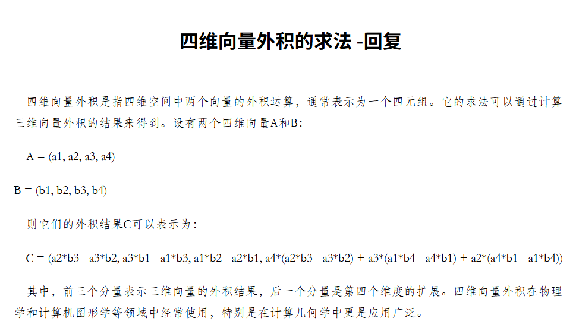

## cross_product  
### 1 . 与deepseek关于偶然性的争论  
【未解决】   
【该对话在deepseek中被保留】   
鸦问：  
“叉积的大小可以解释为以 a 和 b 为边的平行四边形的正区域。“是巧合中等于平行四边形的面积还是有什么蕴含的数学道理？  
deepseek：  
叉积的大小与平行四边形面积的关系是经过严谨数学设计的必然结果，旨在将几何属性与代数运算紧密结合，而非偶然的巧合。  

  
`上截图来源deepseek` 

【鸦say：deepseek的言论是说这种 名为“叉积”的运算是被特意设计出来的。且特意设计成平行四边形面积。还提到二维叉积。它认为行列式和这个面积有关。   

### 2 . 点积和叉积的历史  
（1）What's behind dot product and cross product?   
https://math.stackexchange.com/questions/2266356/whats-behind-dot-product-and-cross-product  
  
提到洛伦兹力  

(2)Origin of the dot and cross product?  
https://math.stackexchange.com/questions/62318/origin-of-the-dot-and-cross-product   

### 3 . 叉积只在三维么？  

该网址：  
https://betterexplained.com/articles/cross-product/  

提到：  
  

一些讨论：  
（1）https://math.stackexchange.com/questions/185991/is-the-vector-cross-product-only-defined-for-3d  

（2）https://math.stackexchange.com/questions/706011/why-is-cross-product-only-defined-in-3-and-7-dimensions   

以上讨论知识提到四元数。  

### 4 . 扭矩  
https://www.nagwa.com/en/explainers/616184792816/  
  

### 5 . 需补充知识： 
（1）行列式  
（2）四元数   

### 6 . 对线代sup L8 4.的思考

想用叉积证明两个四维平面斜度一样。  

deepseek提到Bivector  双向量。  

百度到这个公式：  
  

这个公式的来源可能和这个有关：  
  


用代码验算：  
```C++
#include<bits/stdc++.h>
using namespace std;

double a1, a2, a3, a4;
double b1, b2, b3, b4;

void jisuan()
{
    cout<<a2*b3 - a3*b2<<" ";
    cout<<a3*b1 - a1*b3<<" ";
    cout<<a1*b2 - a2*b1<<" ";
    cout<<a4*(a2*b3-a3*b2) + a3*(a1*b4-a4*b1) + a2*(a4*b1 - a1*b4)<<" ";
    cout<<endl;
}

int main()
{
    double C;

    double a[5] = {-2,1,0,0}, b[5] = {2,0,-2,1};
    double aa[5] = {-4, 2, 0, 0}, bb[5] = {4,0,-4,2};


    a1 = a[0];
    b1 = b[0];
    a2 = a[1];
    b2 = b[1];
    a3 = a[2];
    b3 = b[2];
    a4 = a[3];
    b4 = b[3];

    jisuan();

    a1 = aa[0];
    b1 = bb[0];
    a2 = aa[1];
    b2 = bb[1];
    a3 = aa[2];
    b3 = bb[2];
    a4 = aa[3];
    b4 = bb[3];
    jisuan();
}
```

但是生成向量并不重合：  
  

可能并不能用这种方法证明四维平面的倾斜度吧。  