## dot product
### 一. 点乘概括来讲

1 . 在网页：https://amirazmi.net/dot-products-in-games-and-their-use-cases/  
中提到：  
(1)magnitudes & directions  

The dot product as **Allen Chou**, a gameplay programmer at Naughty Dog sums it up really well by saying, “The dot product is a simple yet extremely useful mathematical tool. It encodes the relationship between two vectors’ **magnitudes** and **directions** into a single value.”  
【p.s. Allen Chou大佬的博客也不错】  

(2)只能向量乘向量么？  
we can only take the dot product of vectors! We can not take dot products of points! It does not mean anything!  

【鸦补充：这句话其实不太严谨，SAT碰撞算法中运用了向量去点乘点】  

2 . 在网页： https://betterexplained.com/articles/vector-calculus-understanding-the-dot-product/  
中提到：  
（1）energy比喻法  
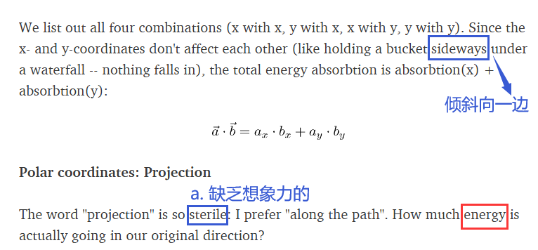  

3 . 这个reddit网页汇聚了很多点乘的应用，以及他们推荐的教程。  
https://www.reddit.com/r/learnmath/comments/8jbtcw/what_does_the_dot_product_tell_you/   

4 . 乐乐书上的几点补充  
（1）任何两个矢量的点积**a·b**等同于**b**在**a**方向上的投影值，再乘以**a**的长度。  
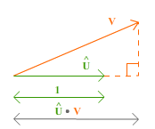  

(2)一个矢量和本身进行点积的结果，是该矢量的模的平方。    
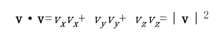  
means：如果只是比较两个矢量的长度大小，直接使用点积结果，不用使用模的计算公式去开平方，节省性能。  

5 . 这个网页：  
https://gamedev.stackexchange.com/questions/89831/how-do-i-interpret-the-dot-product-of-non-normalized-vectors  
提到：  
This is helpful for rewriting a vector from one coordinate system in terms of a different basis, or for removing/reflecting the component of a vector that's parallel to a particular direction while keeping the perpendicular component intact. (eg. zeroing the component of a velocity that would take an object through a barrier, but allowing it to slide along that barrier, or rebounding it away)  

联想到：在斜坡滑动（slope slide）  

发现常提到的碰撞检测有：AABB，和SAT  

联想到 五 . Collide and Slide算法  

### 二. Starting with SAT  
SAT网址1：https://programmerart.weebly.com/separating-axis-theorem.html    
SAT网址2：https://dyn4j.org/2010/01/sat/  

godot项目代码是follow的网址1写的，网址里面的代码在这里有点小错误。  
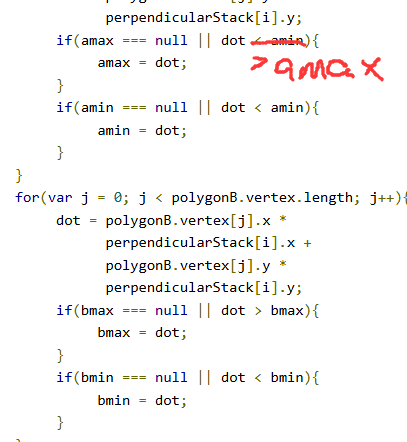  

网址1中的坐标系如下图：  
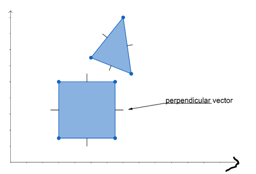  
godot的Custom drawing in 2D的坐标系如下图：  
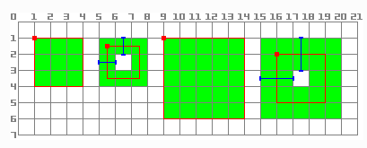  

可以看到两者视觉上原点位置不同，那么需要修改网址1的代码转一下坐标系么？
答案是不需要，因为数学逻辑里是一样的，虽然表现的视觉不一样。  

为了搞清楚为什么SAT算法中：点·向量的数学含义，做了一下小小的考古。  

### 三.考古点乘  
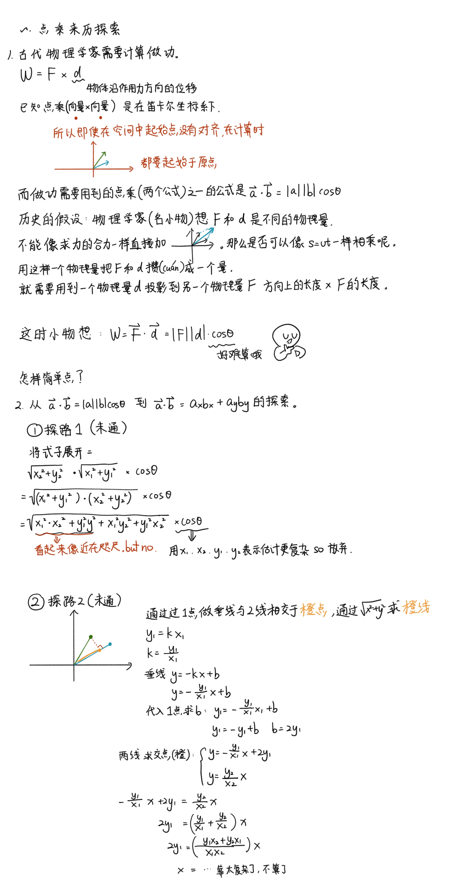  

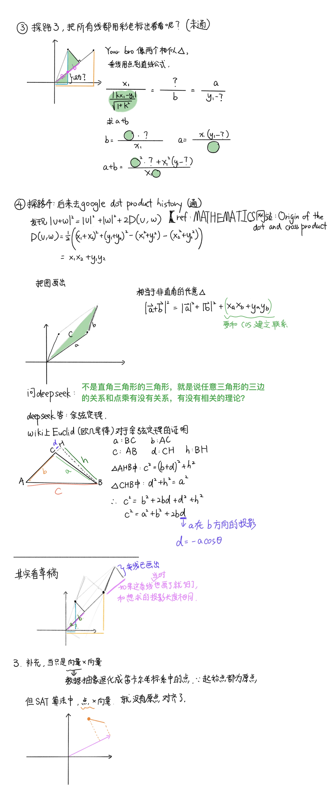  

里面的ref是：https://math.stackexchange.com/questions/62318/origin-of-the-dot-and-cross-product

小彭老师评价：x是叉乘吧，·是点乘。  
鸦回复：我瞎写的，不太严谨。  

接着小彭老师分享了他的思路。但是我想说这种思路和乐乐书上一样，都是已知x乘x+y乘y这个公式去寻找和模长模长cos的关系。但是历史发展来说，你一开始是不知道x乘x+y乘y的。  
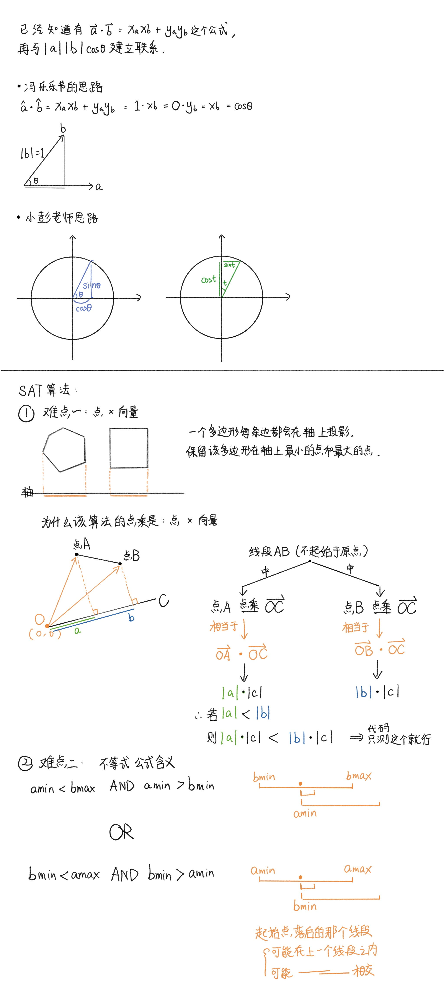  

### 四 . AABB碰撞检测
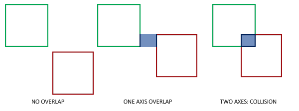  
ref: learnOpenGL  
多边形的边界，x轴是否重合，y轴是否重合。都是true则是碰撞。  

https://kishimotostudios.com/articles/aabb_collision/  
这个网站是互动教学该算法：  
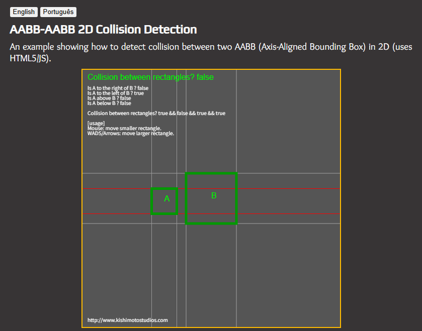  
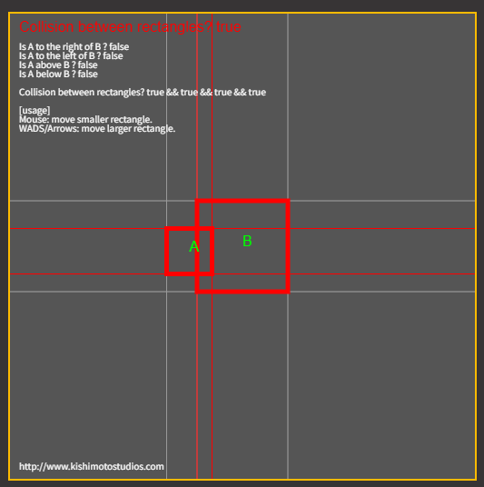  
左上角有检测true false。  

圆和圆之间的碰撞检测：  
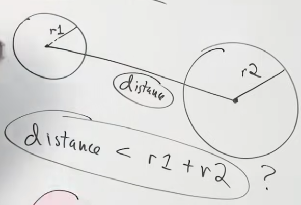  

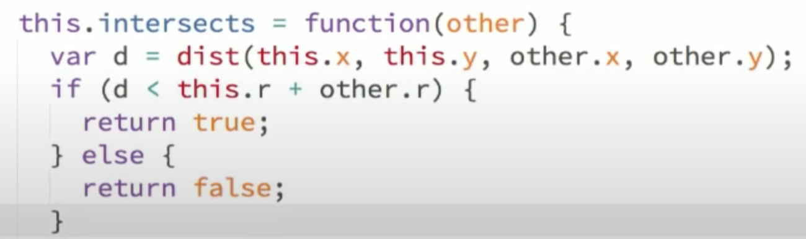  

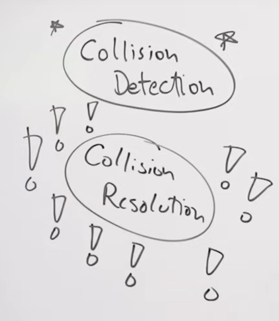  
collision detection 也叫 collision response

### 五 . Collide and Slide算法    
由 一.5 引出。  
视频tutorial：https://www.youtube.com/watch?v=YR6Q7dUz2uk&t=105s
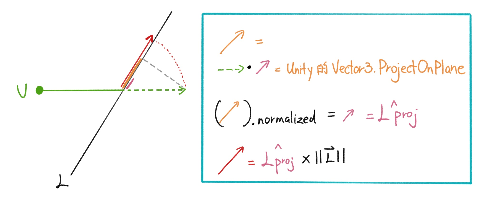  
蓝框代码如下：  
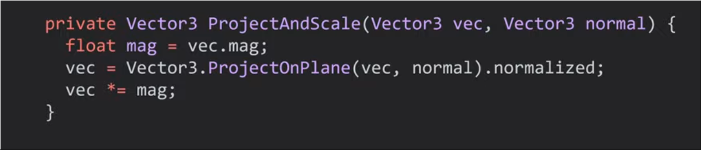  
 
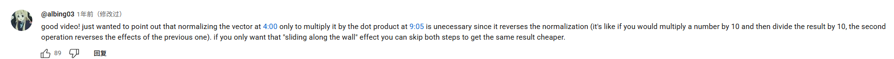  

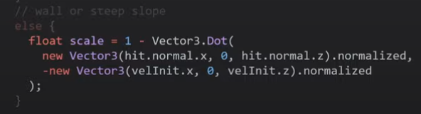  
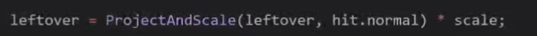   
【！！！待研究！！！】   
感觉这条评论有问题，我回头再看看。  
他的意思是projectandscale函数里包含了先normalize再mag，然后scale变量里面也包含了normalize，重复了。  
但是我感觉两个normalize不是一个意思。  

顺便scale = 1 - 那一坨  
的含义是：  
那一坨是 相当于单位矢量x单位矢量是 cos的值。  
当角色冲墙壁的时候cos值 = 1。
scale = 1-1 = 0。此时角色冲不进墙里。
沿着墙壁的时候：  
那一坨 = 0 （直角）  
scale = 1-0 = 1  
角色移动速度 = 原速度。  

联想到khan academy的这节课，其实好像没啥关系哈哈哈哈哈。  
https://www.youtube.com/watch?v=27vT-NWuw0M&list=LL&index=20  
《投影简介》中的  
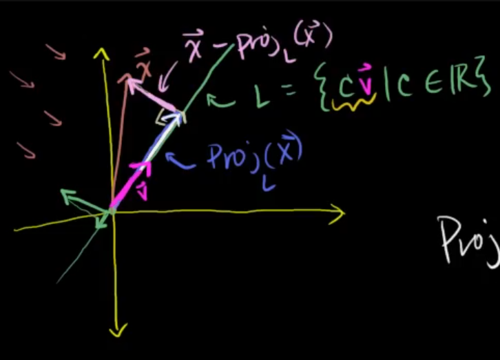  
浅粉色通过x向量减投影获得：  
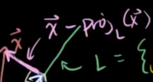  
或者直接求其垂直向量-->即颠倒x,y位置，再取x的负  
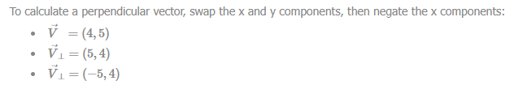  
ref: SAT网址1  