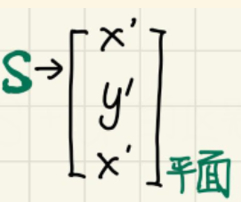
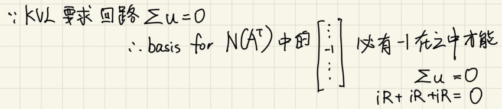
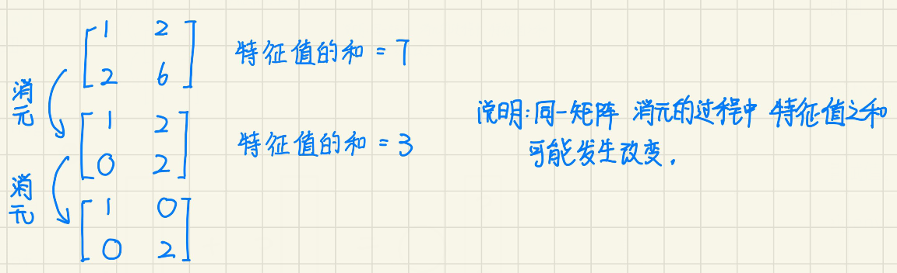

## 线代视频课日志
### L1 The Geometry of linear equations（方程组的集合解释）

1 . 线性角度【Column Picture】看矩阵和向量相乘其实是：  
建立 维度数字与代数方程相同的 向量。  
e.g.有三个代数方程就建立(x,y,z)的三维向量。  
结果向量其实是：  
每一个维度是原来在同一行的代数方程。把它们相加形成结果。因为一个三维向量能包含3个信息：3个代数方程中的一部分（e.g.col1,col2）或全体(结果向量)。  
【包含鸦瞎造的数学词】：  
（1）结果向量：AX = b中的b  

2 . 一个方程：  
ax+by+cz = d  
是个平面。  
a,b,c这些系数决定平面的倾斜的那个率。  
三维空间可以由无数个这个 倾斜角度的平面构成，像千层面一样。d决定是在哪一层面。  

3（新） . 如果有4个未知数。不论系数如何，都撑满整个三维空间。  
三个未知数的无限大的面只是三维空间的一部分。  
ax+by+cz+dw = f  

4 . 还有就是视角问题。  
一条直线在某个视角下就是一个点。  
一个平面在某个视角下就是一个面。  
所以四维的方体可以投影到三维，再投影到二维。  

5 . 去调查四维方体是因为：  
【线代补充】笔记中L1：7.  
尝试思考 -x +2y -z +1 = w  
w = 0 和 w = 1。分别为四维空间中平行的两个体的之中的面。  
我想知道这两个体在三维空间什么位置（？）和大小。  

6 . 矩阵一行一行的是有多少个方程。  
矩阵一竖一竖的是有几个未知数。  

### L2 Elimination with matrices 矩阵消元  
1 . 老鸦暴论：如果竖着能消减一列，横着也能消减一行。  

2 . 这个  
 
上面那张图应该是小写的a和b   
矩阵矩阵相乘：  
实际上还是相当于：  
点代入方程。  

3 . 平扫动画是由线性角度“关于矩阵乘法是怎么来的”（ref:supL2:3.）发现的规律。  
因为ROW OPERATION也是几行“啪”地合成一行，所以和这个也有关系。  

### L3 Matrix operations and inverses 矩阵乘法和逆
1 . 矩阵乘法遇到看不懂的方法直接用代数角度去看。  
矩阵A x 矩阵B看不懂   
在矩阵和矩阵后面再加个向量：  
A x (B x v)  
这样实际算一遍。  

2 . 矩阵乘法的列方法和行方法原理都是一样的。  

在【线性补充note】中只分析了列方法。  
行方法的step1也是从线性角度看问题。只不过要转一下矩阵和向量的位置。  
step2换成【videoL2】中的行变换ROW OPERATION。  

3 .   
  

4 . 俺感觉：奇异矩阵必不可逆（暴言）  

5（新） . 矩阵分块乘法  
  
怎么用代码实现：
我的想法是，粉色标注这俩用临时变量存起来：  
  
网上查到的代码实现：  
https://www.cnblogs.com/wujianming-110117/p/18449868  
  
```C++
for (int m = 0; m < M; m += Mtile)                //在M维上迭代
    for (int n = 0; n < N; n += Ntile)            //在N维上迭代
        for (int k = 0; k < K; ++k)
            for (int i = 0; i < Mtile; ++i)       // 计算一个图块 
                for (int j = 0; j < Ntile; ++j) {
                    int row = m + i;
                    int col = n + j;
                    C[row][col] += A[row][k] * B[k][col];
                }
```
这行代码：  
```
C[row][col] += A[row][k] * B[k][col];
```
实际的操作是：  
  
的：  
  
所以要： 
``` 
for (int k = 0; k < K; ++k)  
```  

对于C矩阵中的每一个元素`C[row][col]`的计算，要循环k次。  
e.g.下面的例子循环了4次：  
  

6 . 奇异：列可消or行可消   
    不可逆：无法变为上三角。（可解x,y,z值是多少）  

### L4 Factorization into A=LU A的LU分解  
1 . (1)分别转置两个矩阵，以相反顺序相乘。  
　（2）  
逆的那个括号里面AB的位置也要换一下。  
区分着看（1）和（2）  

2 . 一个矩阵（方阵）和该方阵的转置 透明度降低重叠起来 **沿斜对角线对称**。  
3 . L是从E，来的，搞清楚为啥E是下三角，就知L。  
4 . 如果只是消一列的话，消元矩阵前后顺序无所谓。  
E1 = E51 E41 E31 E21 = E41 E21 E51 E31  
5 . 遇到不理解的概念比如这一课的：  
“为啥L比E更好”的【线代补充.note】分析，我们不仅可以用代数方程角度，还可以用"平扫动画"的“操作”来看。  

平扫动画 感觉就是 row operation。  

从代数方程角度看“为啥L比E更好”，因为E是：高的信息量被代入到矮的信息量所以危险。  

6 .  
  
  


### L5 Transposes, Permutations, Space R^n 转置、置换、向量空间  
1（新） . 在videoL5的23:36  
  
原文：  
```
Let's see, I guess I should do algebra first.  
（首先还是进行代数运算）
Algebra means what can I do to these vectors? I can add them.  
（也就是说，我可以对它们，两两相加。）  
e.g. （3,2）加上（0,0）得到（3,2）  
```
由上部分的原文反思到，我之前爱称“代数角度”最好改为“代数方程角度”，因为“代数角度”这个词太泛指了，有可能是“代数运算”啊。  

还有就是“角度”这件事，在做矩阵旋转研究时发现，如果 点 的旋转在“极坐标的角度”下比“笛卡尔坐标的角度”下好处理，规律也更明晰。某个角度可以便捷地处理不同的事情，把这些事情可归纳到这个角度下。  

2 . row exchanges 和 row operation的区别。 

3 . 验证是对称矩阵的两个方法。  
法1：  
  
法2：permutation  
  

4 . 向量空间要满足，向量两两相加，数乘，取线性组合仍在其中。 

5 . 原点很重要，能称为“空间”必须有原点。单个一个零向量是子空间。  

6 . 笛卡尔坐标和矩阵的坐标相似，探究元素a12和a21为什么对称，可以从两个角度（1）笛卡尔坐标角度，用点与点距离 （2）极坐标：旋转矩阵把对称轴转成竖直，然后镜像对称，再把对称轴转回原来的45度去。  

7 . 极坐标是只在圆线的范围跑。  

8 . 如果从极坐标（0，1）位置旋转β角，是右边的图形的感觉。且要记住只有OP为1。  
  

在记旋转矩阵公式的时候要明晰这一点。（OA-RQ, AQ+PR）只在α+β角时成立。

从极坐标（0，1）位置旋转β角**不能**按成（OA, AQ）来看。 

### L6 Column Space and Nullspace 列空间和零空间
1 . two requirements:  
  

2 . 观看角度来说：linear equations（线性方程组）视角 == linear combination（线性组合）视角。  

3 . How big is that column space?  
  
两个角度来解答：  
（1）线性组合角度：两根有用的四维向量组成四维空间中的2维平面。  
（2）代数方程角度：任意选两行能解出两大块值。但不能解出所有未知的4个分量。  

4（新） . 只要是子空间，除了原点，其他比如直线和平面之类的都要是无限的含义。  

5 . 竖着几列有用，横着几行有用。  

6 . 找列空间和零空间形状的意义：A中有几根有用的竖向量。  

7 . 找null space让b=0，是因为为了让横向看的代数方程所代表的形状的交点或交线或...必过原点。  

### L7 Solving AX = 0: Pivot Variables, Special Solutions AX=0:主变量、特解  
1 . 相关的--dependent  
    不相关的--independent / not dependent  

2 . Ax=0 消元算法 虽然改变了column space。但是再怎么变动代入X后仍为0。  

3 . free variables = variables总数 - pivot的个数（有效列的数量）  
free variables的数量决定null space的形状。 

4 . free variables选取原则： （1）两个式子都有的肯定要选（2）其他的虽然可以任意选，但是该算法规定越靠右边越free。  

5 . free 为什么要取类似y=1 w=0。这种形式，其实其他数字也可以，只要保证两组不成倍数，因为倍数就平行了。选y=1 w=0这种是为了方便偷系数。  

6 . pivot variables跟column space有关，free variables跟null space有关。  

### L8 Solving Ax=b: Row Reduced Form R Ax=b：可解性及解的结构  
1 . 秩=能求出几块解。  
2 . “列之间的线性组合产生0列” means 有没用的列。  
“row operation产生0行” means 有没用的行。  

3 . 当 秩 < m 时，有0行，0行的作用是让该行的b不要瞎取。  

4 . r与m的大小关系决定是否有0行，当0行的b取值不好会出现 0 solutions。    

r与n的关系决定是否有free parts，free parts 决定 零空间 是否 有多个值。 如果有多个值就会出现 无穷 的值。  

5 . x complete solution = x particular ( means:set all free variables to zero, is a vector) + x null space  

### L9 Independence, Basis, and Dimension ：线性相关性、基、维数
1 . 
- 矩阵的 “秩”。 

- 向量空间/向量组（a bunch of vectors）的：  
（1）线性无关 : 零空间只有零向量  
（2）spanning ：taking all linear bombs and put them in a space  
（3）being a basis 【2条性质：independent 和 spanning】  
（4）维数   

矩阵 和 向量空间 在上文中的位置不能调换。  

2 . ref:log L2：1.    
『老鸦暴论：如果竖着能消减一列，横着也能消减一行。』  
是错误的，因为这句话只有在方阵才成立。  
比较严谨的版本：  
『 有效行 = 有效列 』  

3 . 三个 二维竖着的向量 都不用看，必定线性相关。  
因为 n = 3 > r = 2。====》n > r    

4 . spanning要求应该只有：每根竖向量的维度相同。    

5 . 注意区分单根向量的维度（我编的词），和向量空间的维数。  

6 . rank = nums of pivots = 有效行 = 有效列 = dim of C(A) = basis的根数    

7 . 当一组向量 span 一个space的时候，这个space应是包含这些向量的空间中最小的一个。  

8 . 行变换不改变零空间。  
零空间 与 “能否消列有关” 与 “independent/dependent” 有关。  

能消列的话，零空间更大。  

9 . Ax = 0 的 解 是 空间。  
Ax = b 的解 不是空间。 可从公式：  
  
看出。第一个向量也就是x particular前面没有系数。只能是一个固定的值。  

10（新） . 从“有无唯一解”的视角下：  
n>r ，m = r(胖子) ： 无法  
m>r ，n = r（高个）：有法  

从“解可以是一个平面，不一定非得唯一”的视角下：  
n>r ，m = r(胖子) ： 有法    
m>r ，n = r（高个）：无法（当0不等于b3-b2-b1(某种矩阵)）     

  

### L10 The Four Fundamental Subspaces：四个基本子空间  
1 . 行变换改变不了行空间，但改变了列空间。  

对列空间不变的是：要有解b属于C（A）  
  

所以求 行空间 的 基可以直接用rref去看。  
而因为列空间变化，求列空间的基需要先知道rank是多少，然后再去没行变换过的原来的A矩阵去找rank数量的向量组成基。  

video笔记上写的是 列空间的基为 pivot cols，但其实其他cols也行。  

2 . 由identity matrix分裂的向量组叫 标准基。它没什么特别的。  

3 .   
  
**左零空间有好多组基，然后每组基包含一个或多个向量**，一个或多个取决于m-r。  

4 . 列空间和行空间 对 b 都是 约束作用。  

Ax=b 求行空间 、列空间的**basis**，只关注A，不关注x和b。  

5 . nullspace：寻找能拼出 zero column（b的位置）的组合。   
left nullspace：寻找能拼出 zero row（b的位置）的组合。   

6 . 一条轴有- 0 +  

### L11 Matrix Spaces; Rank 1; Small World Graphs：矩阵空间、秩1矩阵和小世界图
1 .   
  

退化后：
前者相当于三维空间的两个面，取其中一个面就不能取第二个面里的（除相交）  
后者相当于：线性组合。所以布满整个三维空间。  

退化的时候：  
  
的平面可以按照：子空间生成去想。  
（1）列空间：列向量的线性组合  
  
后面两根向量线性组合生成平面。  

（2）零空间：对x的值有约束：  
矩阵 [1,1,1,1] 的零空间的约束是：x1+x2+x3+x4 = 0   
那么：  
  
的约束为x3 = 0。  
  
的约束为x1 == x3。  

2 .   
  
dim(S+U)相当于游戏引擎的维度。  
是相交处的大小。  

3 . A（rank == 1）= 列向量 x 行向量。  

4 .   
  
为什么思考这个问题不能把矩阵退化到向量？因为你没法表示向量的秩。  

5 . 由一个零点形成的零维子空间的基是：空集。  
参考基的两个properties之一的independent要求零空间只有0向量。但是当矩阵是[0]时，零空间可以取任意值。  

### L12 Graphs, Networks, Incidence Matrices 图和网络
1 . 说一个电路网络中的结点（node）的电流没有意义。  
鸦认为应该说该结点电流信息    
e.g.（1）该点流入电流    
或（2）该点流出电流  
或（3）该点电流总和=0   

2 . 外接电源的话，注意外接电源的连线信息和节点信息没有算在原来的矩阵里面。   

3 .   
KCL：保证这里是0  
  

KVL：保证左零空间简易找法有正有负。  
  

4 . 不管是用何种方式求x向量，必须知道其中一点的电势（接地）。  

5 . 电用水类比：  
英文可以翻译成：(1)Electricity Water Analogy   
（2）  

参考资料：https://www.mathsisfun.com/physics/electricity-water-analogy.html  
电流：水流速  
电势：重力势能  
电阻大：管道细  
Ax = e矩阵中的A矩阵所含信息只有管道是怎么连接的。  

这个网页https://www.reddit.com/r/AskEngineers/comments/13xgjyv/how_accurate_is_the_water_analogy_to_explain/  
提到：水类比只适合一部分情况，复杂情况不要用水类比。  
  


6 . 回路和线性相关性有关。  
因为：  
  
回路回路，回去才能形成回路。  
rank = nodes - 1  

7 . 暴论：加上电压源，感觉矩阵内的结点，连线的电势，电势差会发生变化。
### L13 Quiz1 Review 复习一
1 . 可逆矩阵的行空间和列空间是铺满整个游戏引擎。    
两个可逆矩阵相加得的矩阵是身在游戏引擎里，因为得的结果可能不是可逆的。  

注意区分“向量空间”和“矩阵空间”。前者是在够“向量空间”的概念，后者是在够“矩阵空间”的概念。     

2 . 行变换不改变行空间和零空间。  

3 . 有rref形式，怎么看出零空间的基？    

4 . 求x particular的时候把free variable都设成0。  

5 . 如果矩阵A和矩阵B的四个子空间相同，那m,n,r都一样。  

6 . 【注意】xspecial（对应零空间）和xparticular在视频课字幕都被翻译成“特解”。  

7 .   
一个可逆的方阵C乘以另一个矩阵D。  
B = CD  
矩阵B的零空间和矩阵D零空间一样。  

8 . Ax=0 求x_special时的free part相反数的运用（ref:videoL7.7）：  
  


### L14 Orthogonal Vectors and Subspaces 正交向量和正交子空间

1 . 距离公式：向量坐标和向量长度的关系。  
向量可归纳为起点是原点，所以才可以用这个公式。   

2 . 零向量和任何向量都正交。  

3 . Subspace S is orthogonal to Subspace T.   
means: every vector in S is orthogonal to every vector in T.  
补充：两者相交于零向量。  

4 . 三维空间中，地板和黑板这两个子空间不正交，因为它们有相交的非零向量。  
  

5 . 名词：orthogonal **complements** in R^n （n维空间里面的正交**补**）  
  

6 . 当m>n高个函数，b中有噪声时。  
  
我们把三个方程每个取一定比率混合两次（未知数个数）。变成两份新的制品。再去求解。  

7 . 结合第一节课“列图像”  
  

8 . 三角形的【余弦定理（更普世）/勾股定理（直角）】  可以推出==》【点积公式x1x2+y1y2】    

### L15 Projections onto Subspaces 投影
1 .    
- 当一个参数是数字scaler的时候，位置可以随便变动。   
  下面的例子a是单个向量。   
  
- 向量或矩阵作为一个式子的参数，位置不能随意改变。  

2 .   
一维：  
  

高维：  
  
  

求x时a是一维向量的可以直接除过去，高维矩阵需要求逆。  

3 .   
  

4 .   
  

5 .    
可逆方阵才能求逆。 
如果A是可逆nxn方阵，它的列空间是整个R^n，投影矩阵是单位阵。    

6 .   
  

7 . 一行乘一列是一个数。一列乘一行是一个矩阵。  

8 . 为什么要把b向量投影到列空间，这样right-handside才能在列空间里面。  

9 . 知道直线y = ax+b   我们要求系数a和b。   

10 .  
  

### L16 Projection Matrices and Least Squares 投影矩阵和最小二乘

1 . 列空间任意向量形式为Ax  

2 . “长度的平方比较容易求。”   
乐乐书上的解释：很多情况下我们只想要比较两个矢量的长度大小，因此可以直接使用点积的结果，不需要进行开平方的操作来得到真正的模。   

3 . e^2 = e1^2 + e2^2 + e3^3  
联想勾股定理，虽然勾股定理是2维的。    

4 . 草药想法是通过A^T (b - Axhat) = 0 从而限制A^T e = 0中的e，使得e距离最小。  
当b = Ct + D时，甚至不用C,D特别大。b大很多的话都会超级噪声。  
1x + 3y = 10000000   

5 . 二维直线坐标中的最优直线 ≠ p向量。因为坐标轴不同。  

6 . 英语单词：   
- fitting straight lines - 拟合一条直线   
- linear regression - 线性回归分析  
- least squares - 最小二乘
- outliers - 离群量

7 .   

8 . 最优直线那张图 描绘的是每个分量的关系。  
C（A）⊥ N(A^T) 那张图描绘的是整根向量的关系。    

9 .   
  
  
### L17 Orthogonal Matrices and Gram-Schmidt 正交矩阵和正交化法
1 .   
  
othogonal matrix：  
  
 
2 .   
  

球坐标系(r,θ,φ)与直角坐标系(x,y,z)的转换关系: 
x=rsinθcosφ.  
y=rsinθsinφ.  
z=rcosθ.    

3 . 有两种说法描述矩阵Q要区分开：    
  

4 . Graham-Schmidt方法将一般的independent矩阵转换为orthogonal matrix。   
  
A = a  
  
  

5 . 2x2 othogonal matrix满足的两个条件  
  
（1）单条向量长度为1。  
（2）两条向量内积为0。  

6 .   
【弹幕：这其实就是求余弦分量，从几何上想是给你一个单位向量作为方向，求b在这个方向上的分量】
  

### L18 Properties of Determinants 行列式及性质
1 . 二维向量 叉积 二维向量 = 2x2矩阵的行列式。  

2 . 2x2矩阵的行列式包含的信息：（1）面积 （2）正负符号  

3 . 三角矩阵转置对角线乘积不变。  

4 . 消元过程仅用下方的行（要变的本行）减去上方的行的倍数。要变的本行是在消元矩阵里是1。所以L对角线全是1。  

5 . 当且仅当A，则B。 A和B互为充分必要条件。  

6 . 行列式每一行的线性性。如果其余行保持不变。  

7 . 主元为0，会产生0行，所以行列式特征值=0。  

8 .   

9 . 行列式10条性质   
  

### L19 Determinant Formulas and Cofactors 行列式公式及代数余子式

1 . 为什么规定每一行每一列只保留一个非零元素？  
我们分解是按一行一行线性分解。所以一行只有一个元素。当两行重列就会有1条全0竖向量：  
x 0 0  
x 0 0  
0 x 0  

2 .   
  
而ref：videoL19.5提到的是用i+j。  
i+j 奇数 为 负号。 偶数为正号。   

3 .    
nxn矩阵能分解成n^n项，其中不为0的有用的项有n！个。  

4 . tri-diagonal matrix —— 三对角线矩阵。  

5 .    
  
perm = permutation   

6 .   
  


### L20 Cramer's Rule, Inverse Matrix, and Volume 行列式应用：克拉默法则、逆矩阵、体积  
  
1 .   
AA^(-1) = I  
AC^T = (det A)I   
  
Ax = b  
x = A^(-1)b = (1/det A) C^T b 

B1是C^T b 的一个分量 = A with col1 replaces by righthandside b  
  
这两种替换原理都相同，都是替换红色横线标出的位置。  

2 .   
平行六面体体积 = 底面积 x 高

3 . Cramer's Rule 虽然漂亮，但是不实用。  

4 . abs（det A）= 箱子的体积。   
箱子通过行向量还是列向量定义都无所谓。因为行列式转置，它的值不变。 

行列式的符号告诉我们箱子是右手系还是左手系。  

5 . 平行四边形面积 底乘高 会涉及根号运算。e.g.求底的长度。所以用det求。  

联想到：求一根线的长度会涉及开根号，所以可以用内积。   

6 . Q ( orthogonal matrix ) 是一个unit cube which rotated in space.   

### L21 Eigenvalues and Eigenvectors 特征值和特征向量
【这课开始没有研究的很细， time limit】

1 . Ax = λx  
I allow lambda to be negative or zero.   

2 . 已知λ，求特征向量。   
寻找零空间，给自由向量赋值。   

There's a whole line of eigenvectors, and I just want a basis. 你可以任意选一个，但要选的合理。  

3 . A+B的特征值 != A的特征值 + B的特征值  
AB的特征值 != A的特征值 * B的特征值  

4 .   
  

5 .   
平行的含义：  
  


【未解决问题】：  
1 . 对称矩阵，反对称矩阵，两个都沾点矩阵，为什么会出现特征值的区别？尤其是反对称矩阵又沾复数。  

2 . 退化矩阵为什么只有一个方向上的特征向量？  