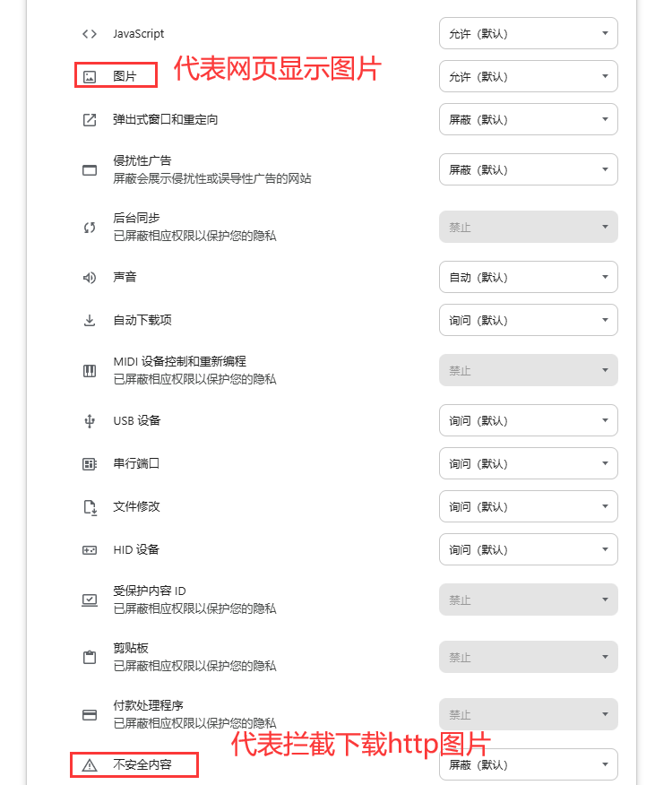
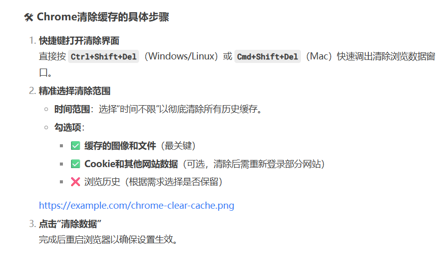

2024/06/06
#### 1. 设置插件markdown image的图片本地存放地址。
由插件的中文文档得知：
markdown-image.local.path  
图片本地存放路径，支持相对路径，相对于所粘贴的 Markdown 文件。/ 表示打开的文件夹根目录。若路径不存在，将会自动创建。  
在设置里输入：markdown-image.local.path  

因为上级目录是【../】
同级目录是【./】

而markdown image插件有时默认保存在【../images】你需要自己在设置里调整成【./images】

#### 2. vscode 编辑器打字内部的字体大小设置
设定里输入  
editor.fontsize  
并修改：editor:font size  
能全局修改。  
从设置那里一步步点的只能修改单个文件。

#### 3. 修改md preview enhanced 的font size
issue: Cannot change the font size in the preview #434
midvok commented on Nov 27, 2020
How to change the font size or scale exclusively in the markdown preview? The preview looks too large compared to UI and editor fonts.
I tried "markdown.preview.fontSize": 10, but it doesn't do anything and I didn't find any other settings.

midvok commented on Nov 30, 2020
I didn't look enough! Eventually, I've found I can adjust the preview completely using the style.less. Not only for the font size, but also implement cool CSS stuff like header section numbering, etc.
I got the info here https://shd101wyy.github.io/markdown-preview-enhanced/#/customize-css

Just a side question. When done with customizing the style.less, is it possible to bake it as a custom css theme and use it for the Settings option "markdown-preview-enhanced.previewTheme"?

---
上面那个人提到的地址，
里面的To customize CSS for your markdown file, press cmd-shift-p and then run the Markdown Preview Enhanced: Customize CSS (Global) or Markdown Preview Enhanced: Customize CSS (Workspace) command.
这句话的意思是：在vscode的界面下按下【ctrl+shift+p】在搜索框中输入【Markdown Preview Enhanced: Customize CSS (Global)】，在调整style.less
下面这一段是原版被我注释掉了，复制的网站里给的例子。
```
/* //original code from before , this comment wrote by yaya
.markdown-preview.markdown-preview {
  // modify your style here
  // eg: background-color: blue;
}
*/
```

#### 4. 修改一般 md preview的font size
设置里搜: markdown.preview.fontSize 

#### 5. word里的表格
右键单元格在搜索框里搜“平均”可以平均单元格尺寸。
要插入excel表格【插入-》对象】才可以实现二次修改可以用excel的功能，
而不是直接复制粘贴excel里的表格。 

#### 6. How to rename an existing Visual Studio project?
《How to rename an existing Visual Studio project?》  
Step 1.
Create a backup of your project.

Step 2.
Rename the root folder to new name.

Step 3.
Open the solution file in Visual Studio.

Step 4.
Update the name of the Solution & Project file via VS.

Step 5. 
Update the Assembly and Default Namespace Name.

Project==>xxx properties  
Apllication==>Assembly name（改）、Default namespace（改）  
点击【Assembly Information】Title（改）、Product（改）  

Step 6.
Update Assembly Information ( Title & Product Names).

Step 7.
Update namespace name in program.cs file.

Step 8.
Rename the project sub-folder to new name.

Step 9. 
Open the Solution file in Visual Studio.

Step 10. 
Remove and then add the project file in the solution explorer.

Visual Studio 2015 Enterprise edition used for the video purpose.

《Renaming Project Folders & Solution Files in Visual Studio》  
把文件夹里和项目有关（非solution）的都改名字。
不要改bin或obj文件夹里的内容。然后把obj文件夹里老旧名字的文件删了。  

然后重新打开visual studio重新导入项目。  

#### 7 . visual studio编码
https://blog.csdn.net/weixin_45136016/article/details/142122625

### 8 . b站动态图片http重定向https  
1 .   
PC端b站动态【查看大图】【复制图片地址】是导向http  
会被chrome拦截  
  

浏览器左上角：  
  
  
但是允许【不安全内容】会不太安全。
所以最好是重定向。  

deepseek说的htst重定向到https的步骤：  
  
  

2 . 又遇到问题：  
修改hsts之后，必须复制图片地址把地址输到浏览器地址框才会转成https。如果直接点击查看大图跳出的图的框然后右键保存图片还是访问的http。这个修改chrome里的什么可以更好解决么？  

deepseek解答：
```
这个问题的核心在于：网页代码中直接硬编码了HTTP链接，导致即使设置了HSTS，右键保存时浏览器仍然优先使用原始HTTP地址。以下是系统解决方案：

✅ 方案2：深度HSTS配置
访问 chrome://net-internals/#hsts

添加域名：hdslb.com（不是子域名）

务必勾选：

☑️ Include subdomains

☑️ Force HTTPS

清除缓存后测试
```
  

问题：  
hdslb.com是b站主站的网址么？  

deepseek解答：  
  

实验：发现hdslb.com加入hsts并不能解决问题。

