## solips老师色彩课
网址：BV1Ui421Y7i8  

思维导图：  
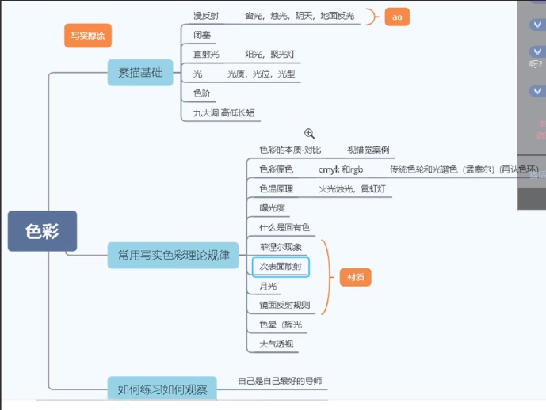  

### 一 . 素描基础  
1 .   
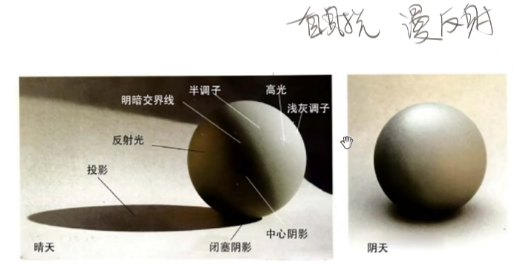  

  
卫星看月球无明暗交界线后反光。  
为什么明暗交界线信息量最丰富，它可以把表面的材质，表面的凹凸起伏大程度的表现出来。

阴天光不是平行光，是从四面八方反射过来的。大概有一个朝向，它的明暗交界线非常柔和。  
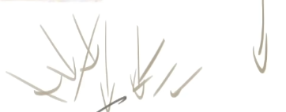  

  
闭塞就是物体相距较近形成的一个夹角。然后慢慢扩散出去。
它是因为光从外面，经过无数道反射，然后消散在这个夹缝中。  
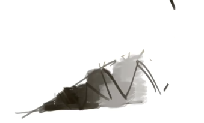  
形成一个光进不去的极黑的夹角。这也就是AO（环境光遮蔽）。  

漫反射：  
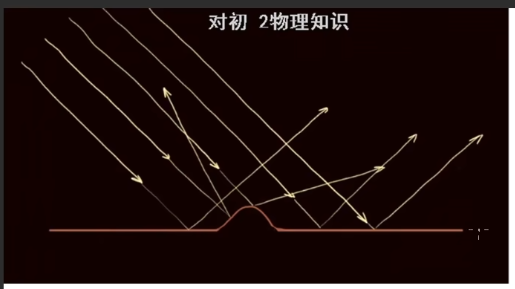  
  
阴天光的核心就是闭塞，漫反射，柔光，弱调子
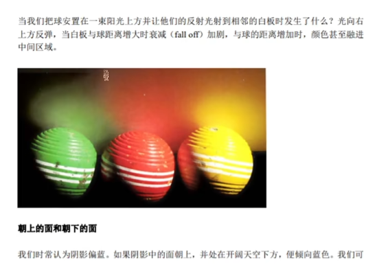  

太阳本来是直射光，打到云上就被散射了，变成漫反射了。然后打到这个人身上，打到这个人身上，又是因为漫反射的特征它才可以进到这种无规律的夹角中，才会导致各种各样夹角出现这种特征。  

线的本质之一是闭塞。  
线承载的功能有的时候是轮廓。  
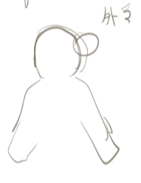  
e.g.人的外轮廓    

2 .   
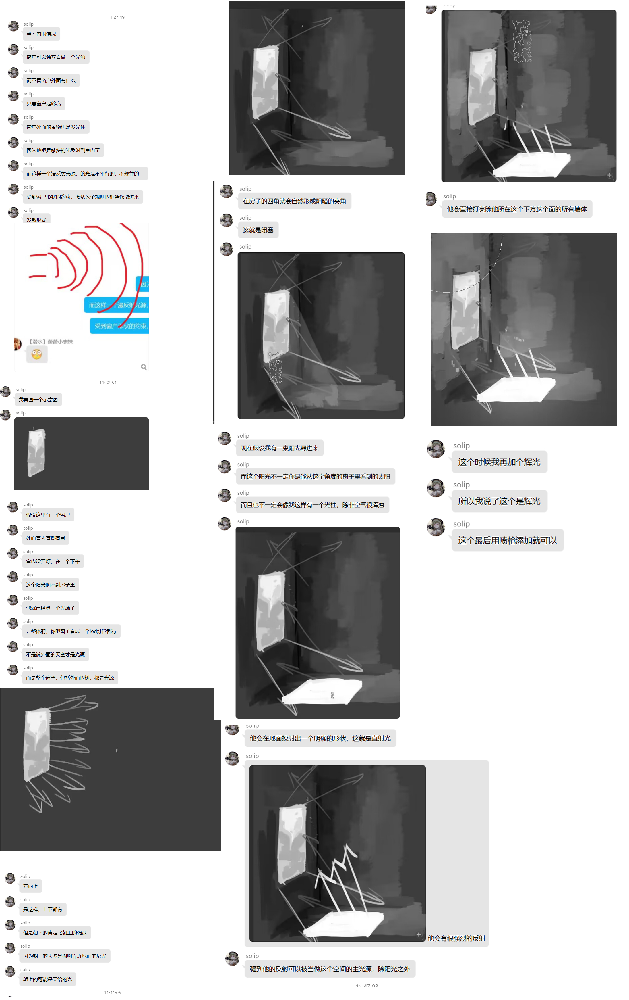  

3 .   
  
左边没有开AO，右边开了。  

4 . 色阶
用两到三个色阶去练习素描。  
先二分   
  
然后锁定不透明度，细化。   
  

5 . 高低长短调  
高调子就是：整个画面平均值，明度平均值比较亮是高调子。  
低调子不是说画面中不能有特别亮的颜色。只是说平均值哈。  

长调子：它的画面的明暗起伏变化比较大，波动比较大。比如说可以找到明度为10的颜色，明度为100的颜色，跨度比较大。  
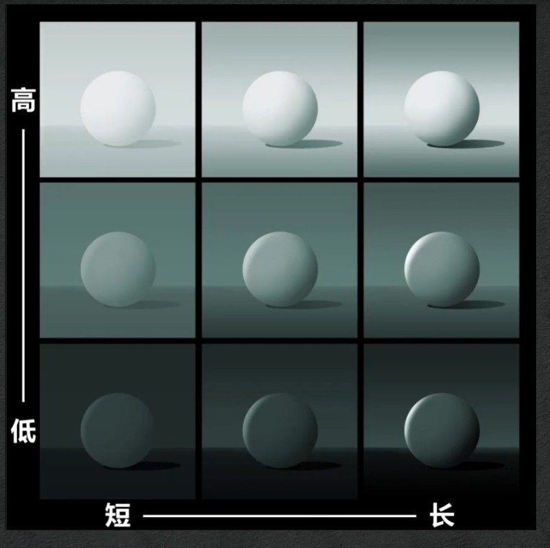  
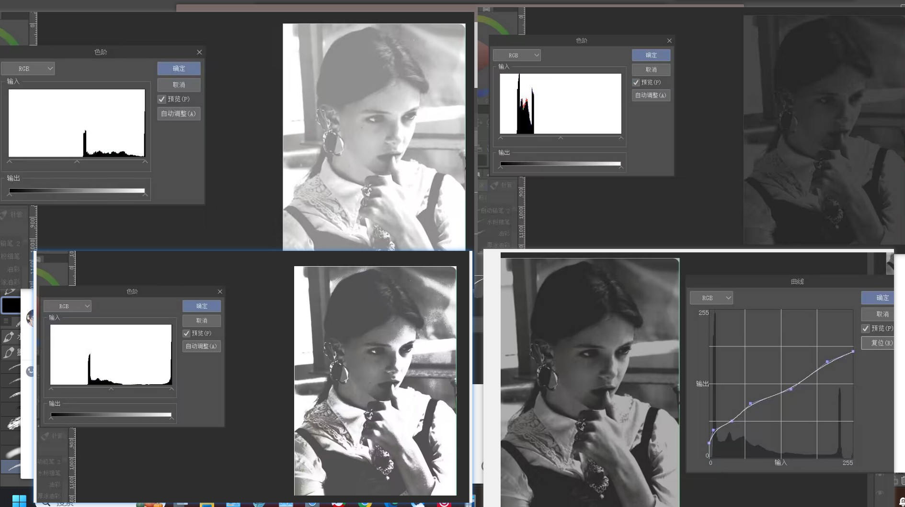  
上图四个象限分别为：  
高短 | 低短  
_________  
高长 | 中短  

索师喜欢画低短调。  

### 二 . 颜色
1 . 色彩的本质是对比，不存在绝对色感。  
  

2 . CMYK 与 RGB  
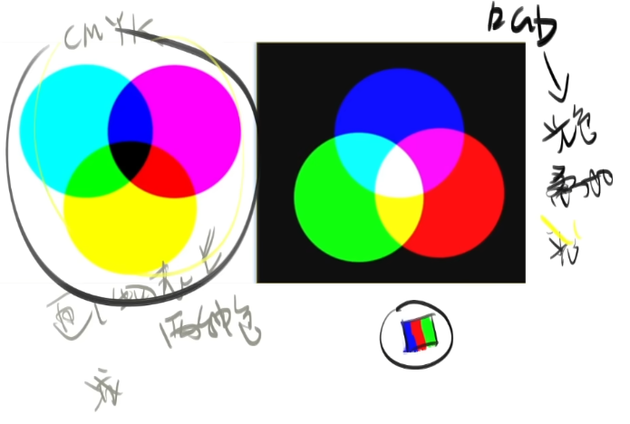  

3 . 色轮  
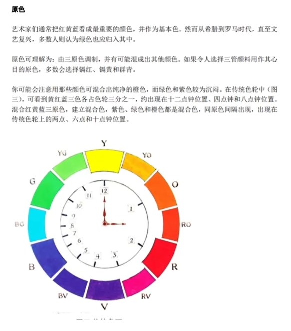  
上为传统色轮，下为光学色轮：  
  

4 .  
鸦想查的资料：  
人眼看一种颜色，看一个地方，如果不动的话，久了之后，它从一个视锥细胞对一种颜色的敏感度就会降低，你越看这个艳色，越看越不艳，越看越灰，灰到一定程度后，你再看别的地方，它就会形成它的补色。

就是说你的视锥细胞在你无意之间，把那些艳的颜色中加入它的对比，它的互补色导致它变灰了。  
  
比如说你看后面一个红色横幅，看了10分钟，突然你转到旁边的白墙，你发现这个墙上竟然有青色的影子。==>视锥细胞造成。  
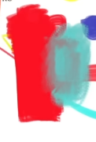  
这两个颜色1:1混合是 50%中性灰。  

5 .孟赛尔色彩空间  
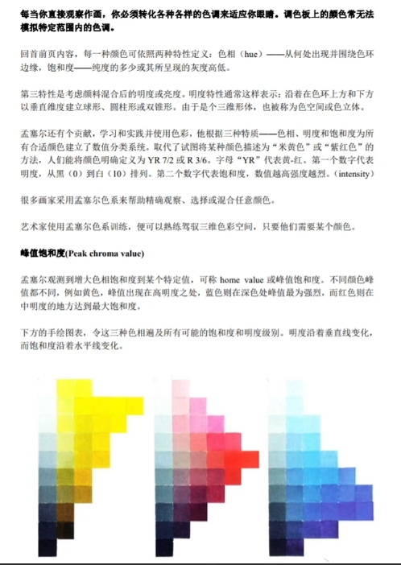    
百分百黄色在人眼中相当于 同一行最左边的白色方块那么白。  
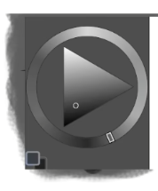  
  
黄-》最亮  
红-》中  
蓝-》最暗  

应用：  
肤色藏色。   
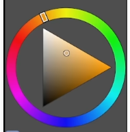  
  
红色选稍微亮一点明度。  
  

6 . 正确画色彩方式，你要同时兼顾这三个数据（色相，明度，饱和度）的变化。只要涉及到明度的变化，色相和饱和度一起变。  

（1）如果只拉明度：  
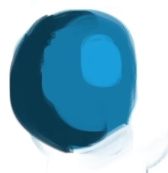  
（2）如果色相有变化：  
  

  
一个球，亮部往黄色走。  

7 . 怎么让高光显得更亮。  
  
加它的对面的颜色：  
青色：  
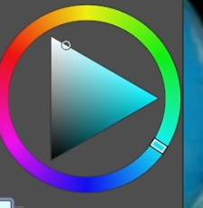  
(鸦疑问：why？)   

8 . 
1:54:50 后的都没怎么记笔记，因为看不懂啊。  
线性减淡全部是光效图层。  
9 . 
菲涅尔    
次表面反射  

2:05:05我 要努力看懂  
  

为啥当L为73%的时候，S是100%，但是取色圆圈在三角形边长中心。    

镜面反射  
材质  

步骤：  
固有色  
