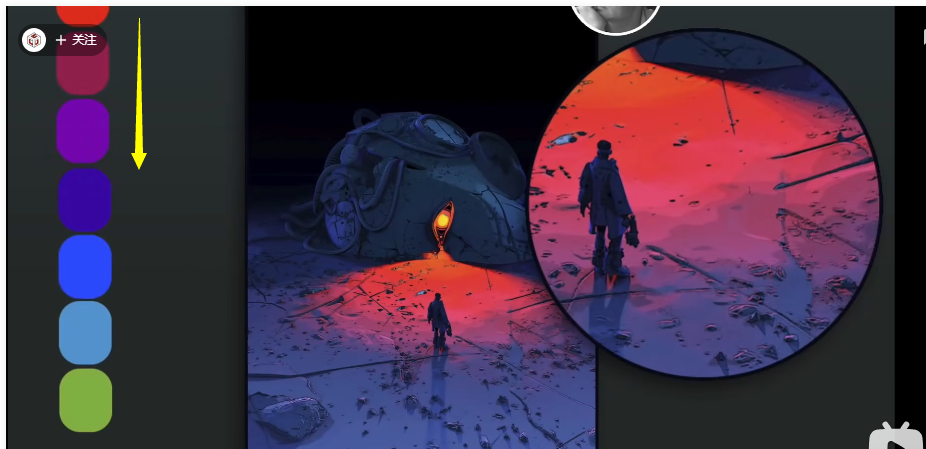

### 画画_色彩_暗面选色

  

【鸦对该视频的笔记】：  
视频地址：BV1CN4y1L7Uw  
注：翻译有些不准的地方我用英文原文代替。  
一 .  
1 . 疑问的提出：  
明暗交界线处添加一个非常跳跃的颜色。在现实世界中，这种光影是怎么产生的？  

二 .  
2 . light falloff（光照衰减）

基础知识：光源产生的光不会无限延伸，它的亮度会在一段距离内逐渐减弱。The distance range of the falloff changes depending on how strong the light source is.  

光线衰减的轨迹更趋近于正态分布曲线：  
  
  

3 . 【饱和度】  
光源距离决定了光的色彩会如何变化

color does not falloff like this:  
  
应该是这样：  
  
也就是说：随着明度的下降，色彩的饱和度逐渐增加。  

4 . 【色相】  
BUT！There is another dimension to it!
在衰减过程中，色相也会跟着变化。随着明度的下降，the hue moves away from yellow.  
  
  

例子：
back in both examples, we can see the lights' colors starts yellowish, and then slide into orange and red insinc with the value(明度) decrease.  
  

如果光源是红色呢？
  
The light will completely die away before Pac-Man(吃豆人) reach the end of the color wheel（色轮）。当吃豆人吃到紫色，根据反平方定律光没了，进入阴影区域。

5 . 实际练习：  
  
  
小球的衰减必须与地面保持一致。  
  
上面那张图是：  
  
黄到紫色（鸦猜：估计是光强度比较大，所以走的色轮比较多。）

下面那张图是：  
  

6 . 更多例子：  
  

三 .太阳光的例子  
7 . 在相同的垂直面上的光都发生了衰减。  
  
日落的时候，太阳下降到地平线以下，当它下降到一部分被遮住的时候  
  
阳光照射的强度就会被降低，进入类似的衰减模式。

四 . 解答问题一  
8 . 
All that is lights falloff executed in a very compress（压缩） space
  
  

五.  
视频作者做了一个示例他家后院影子，有些解释我没听懂e.g.“暖色的阳光会反射到阴影中去”。可以二刷这部分。  