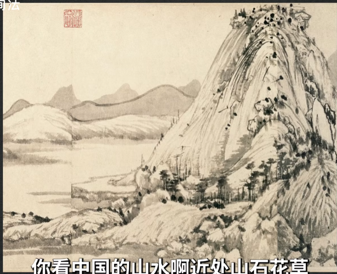
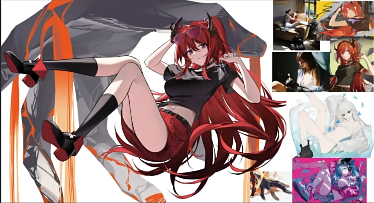

## 层次感
### 一 . 视频1【手绘教程】画画太平，可能是缺乏空间感？#东馆日常#328
  
#### 0 . 
别人总说画面平没有空间感，这个问题我们叫“纵深感”。  
视频总结了8种方法，随便挑出一两种用一下，画面纵深立竿见影。  

#### 0.5.  
首先测一下自己画面纵深，把自己的画缩小看，在屏幕上缩到一张银行卡大小，左右翻转，上下翻转。这样能看出空间就是有纵深感。   
  
正面参考Craig Mullins的画：  
  

#### 1 . 方法1：灰度法  
（1）  
  
前中后分别是：暗亮灰。  
需要中间主体自带光源。追光正打画面。  
传统的卡牌插画大部分都属于这种。  
  

（2）前中后分别是：暗灰亮   
  
这种是以天光为主的户外场景。主打阴天和夜晚。被视为户外真实感的画面首选。  
  

（3）前中后分别是：亮灰暗 
  
这种主要多用于近处是主光源的夜晚。做临场感的首选。  

#### 2 . 方法2：冷暖法
暖色放前面冷色放后面  
  
这样处理最符合人的视觉感受，毕竟人变温动物喜欢亲近温暖的东西。   
  
反过来也可以。  

#### 3 . 方法3：透视法
  
近大远小，透视法不是简单地把后面东西缩小，而且不光是用来画地面桌子，要学会用各种不经意的方式，强化这种线条和透视。  

#### 4 . 方法4：虚实法
类似于摄影中的大光圈景深。进实远虚。  

#### 5 . 方法5：立体法
近处立体而远处平面。    
  
你把画面中的主体物用各种光线来回招呼。总之把立体感打出来。越强越好，然后到了背景勾个形上点冷灰色完事。  
见1(2)第一张橙色的图。  
**【注意】：这种方法不要和虚实法一同使用。**  
  
如果背景处理的平面了就要留一个清晰的边缘。  

#### 6 . 方法6：繁简法  
近处复杂远处简单。多用于以线条为主的画面。  
  
  
  

#### 7 . 方法7：分割法  
层与层之间加上一些分割的介质：e.g.雾气，烟尘，光线，魔法。  
就是毫无理由的用喷枪在层与层之间扫一笔，就一笔。  
  
可以和前6种任意搭配，是点缀之用。  
#### 8 . 方法8：以无法为有法  

### 二 . 视频2 
  
原图：  
  
层次不足。原图中头发只有两层。  
  
问题：层次做了，糊在一起不够明快。  
解决：我们需要让前面更加像一块整体。无论我们后面再怎么刻画，都要保证前面的内容是在大的调子里面，不要让它去跳。  
  

你现在只有红和黑，我们需要一个更亮的层次，在亮面里面。  
  
黑色的角在红色头发上，优先表达黑色和红色之间的层次，再去表达光影。
黑角：渐变 + 高光   
   
信息量：原图少耳朵。  
技巧：暗面瞳孔的颜色不会显得那么白，可以用饱和度低就会像白色。  
  

改后最终：  
  
