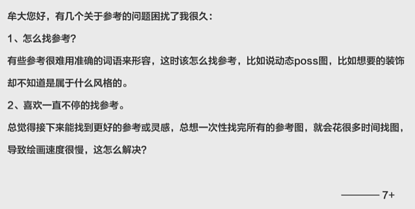
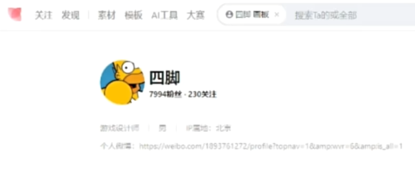
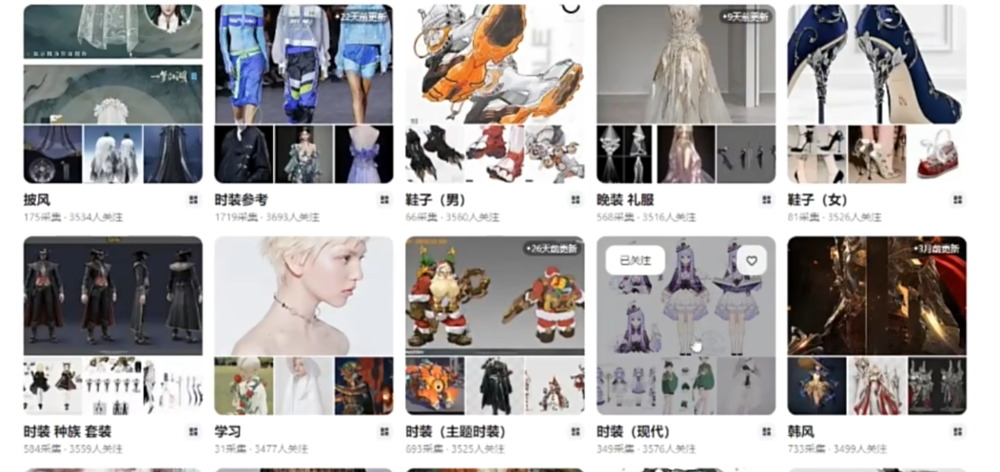

### 怎么找参考
#### 一 . 视频一：你用多长时间找参考图？ 
  
做一个商业美术设计，按照行业标准，按照一个角色的设计需要花5-6天的时间，在前期找参考的时间至少要花上两个整天。  

对你找的这些参考去进行分类，一边找参考，一边去确定你的设计策略。不是说傻看，那个好看存下来，存完就忘了。  

你在每一张图决定把它存下来的这个过程当中。第一是要对它进行分拣，另外要想策略，这张图你要用它什么，用它哪部分。  

正确的做法：你从最开始想要做这个设计的时候，就要集中地把想要找的参考全部找完。  

例子（花瓣）：  
  
  
看分类  