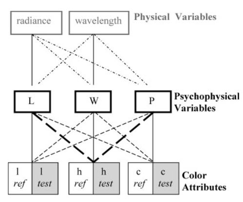
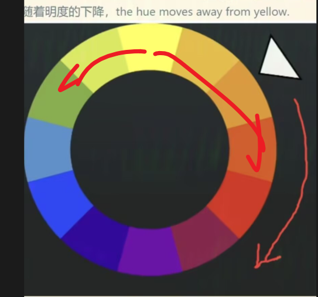
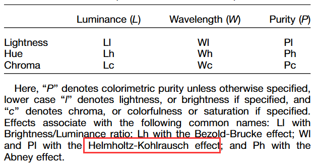
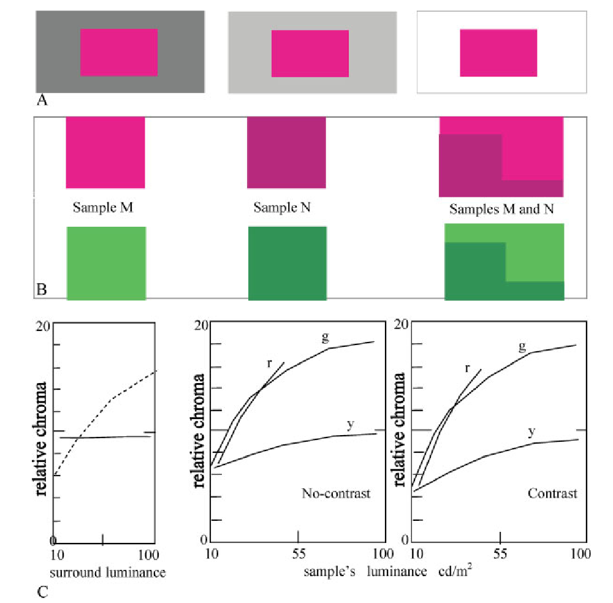
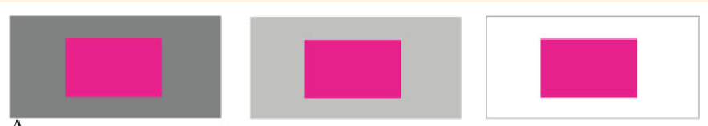
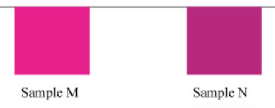

### Effects of Luminance, Wavelength and
Purity on the Color Attributes:
Brief Review with New Data and
Perspectives

1 . Object color stimuli are characterized by three *psychophysical dimensions (luminance, dominant wavelength,
and purity), whose corresponding color attributes are
lightness/brightness, hue, and chroma/colorfulness.  
三个**心理**物理维度（和物理术语辐射量等区分开） 对应 三种颜色属性:  
luminance--brightness/lightness -- 亮度  
dominant wavelength--hue  
purity--chroma/colorfulness--纯度，饱和度  

2 .  
Each psychophysical dimension (luminance, dom-
inant wavelength, purity, as L, W, P) and each color attrib-
ute (lightness, hue, chroma, as l, h, c, for object colors) are
connected by a line. The nine lines indicate the nine possi-
ble effects of single dimensions on single attributes, shown
as adjacent reference and test samples. Sample pairs may
be viewed singly (the no-contrast mode) or simultaneously
(the contrast mode).  
机翻：  
每个心理物理维度（亮度、主波长、纯度，如 L、W、P）和每个颜色属性（亮度、色调、色度，如对象颜色的 l、h、c）通过一条线连接。九条线表示单一维度对单一属性的九种可能的影响，显示为相邻的参考和测试样本。可以单独查看样本对（无对比模式）或同时查看（对比模式）。   

颜色属性：l、h、c基于孟塞尔（Munsell）实体

  
 Heavy dashed lines P-h and L-h indi-
cate the **well-known** Abney and Bezold-Brucke effects.

P-h ：纯度（饱和度）的变化对色相的影响
L-h ：明度的变化对色相的影响

- Bezold-Brucke effects 就是光衰减远离黄色那个视频。  
光强减弱（明度降低）远离黄色。
- Abney effects 这里解释一下，就是：  
Abney 效应的图示。当白色添加到红色时，它会略微向洋红色移动;绿色偏青色，蓝色偏紫色。  
将白色添加到蓝色中，我们看到它使颜色从光谱上移到较小波长的光上并变成紫色。将白色添加到橙色中，它似乎会向较长的波长向下移动并变为微红色。
（https://gizmodo.com/the-mysterious-abney-effect-twists-colors-899395926）
  
也就是说饱和度降低，远离黄色。-->鸦推理：饱和度增加，靠近黄色（推理1）

鸦想：  
光强减弱（明度降低）远离黄色。  
光强减弱（明度降低）饱和度增加【与推理1矛盾】  

所以：主要应用的还是上面这两条。  
Abney 效应不知应用在哪里哈哈哈哈哈。  

3 .  
 物理或心理物理维度（例如波长）的变化通常会影响所有三种颜色属性的外观，除非一个维度（或一个属性）保持不变。  

4 .Helmholtz-Kohlrausch effect
  
Pl是饱和度对亮度的影响（懒得查了，以后再说吧哈哈哈）  

5 . 这段不看，我只是马克  
将以一种或两种时间模式（对比度或无对比度）以及一种或多种视角研究所有九种基本效应，以及其他六种常见但更复杂的效应：WPl（波长和纯度对亮度的影响，即Helmholtz-Kohlrausch 效应）、LPh（亮度和纯度对色调的影响，即 Bezold-Brucke 和 Abney 效应的组合）、Lhc（亮度对色调和纯度的影响） chroma，即色度）、Llhc（亮度对 3 维颜色的影响）、Wh [阴影]（光源波长对色调的影响）和 Kh（光源色温 K 对色调的影响）。

6 .  
Luminance Effect on Hue（心理亮度对色相属性的影响）【重头戏】  
即那个光衰减远离黄色的视频的原理。  

Luminance has a large influence on hue.   
亮度对色调影响很大。

7 . 心理亮度对饱和度属性的影响  
（草，我没太看懂。  
The Lc effect is illustrated in Figs. 5A and B. Readers
may observe the effects for themselves. The effects for
subject RP are graphed in Fig. 5C, and agree generally
with definitions of chroma. Chroma of a given sample is
constant when surround luminance increases, though col-
orfulness (dashed line, in left panel) rises. If the sample’s
luminance is increased while the surround luminance is
held constant the chroma increases in the no-contrast
mode (center panel, C). The slope increases slightly for
LcC (the contrast mode, in right panel) because the
chroma of the darker sample (N in B) is reduced while
that of the lighter sample M is hardly affected. The effect
on the darker sample is explained 18,19 by the induced
complementary color (or after image) of the adjacent
lighter sample, which overlays the darker sample and
shifts its color towards neutral. There is less induction
from the darker desaturated sample so the effect on the
lighter sample is trivial. In summary, the luminance effect
LcC is similar to but slightly greater than the effect LcN

机翻：  
Lc 效应如图 1 和 2 所示。 5A和B。读者可以自己观察效果。对受试者 RP 的影响如图 5C 所示，并且与色度的定义大体一致。当周围亮度增加时，给定样本的色度保持不变，但色彩（左图中的虚线）会增加。如果样本的亮度增加，而周围亮度保持恒定，则无对比度模式下的色度会增加（中心图，C）。 Lc（右图中的对比度模式）的斜率略有增加，因为较暗样本（B 中的 N）的色度降低，而较亮样本 M 的色度几乎不受影响。对较暗样本的影响可以通过相邻较亮样本的感应互补色（或后像）来解释，该互补色覆盖较暗样本并将其颜色转向中性。较暗的去饱和样品的感应较小，因此对较浅的样品的影响微不足道。综上所述，亮度效果LcC与效果LcN相似但略大于效果LcN。

  

解释：  
由上图可以看出：  
  
周围环境的亮度增加的情况下，里面的粉色物体（电脑数值没变）的色度似乎增加。（鸦吐槽：我怎么感觉没增加呢）  

  
如果样本的亮度增加，而周围亮度保持恒定，则无对比度模式下的色度会增加

草看不懂啊！！！  
但是这个似乎没有说光源本身的颜色。  