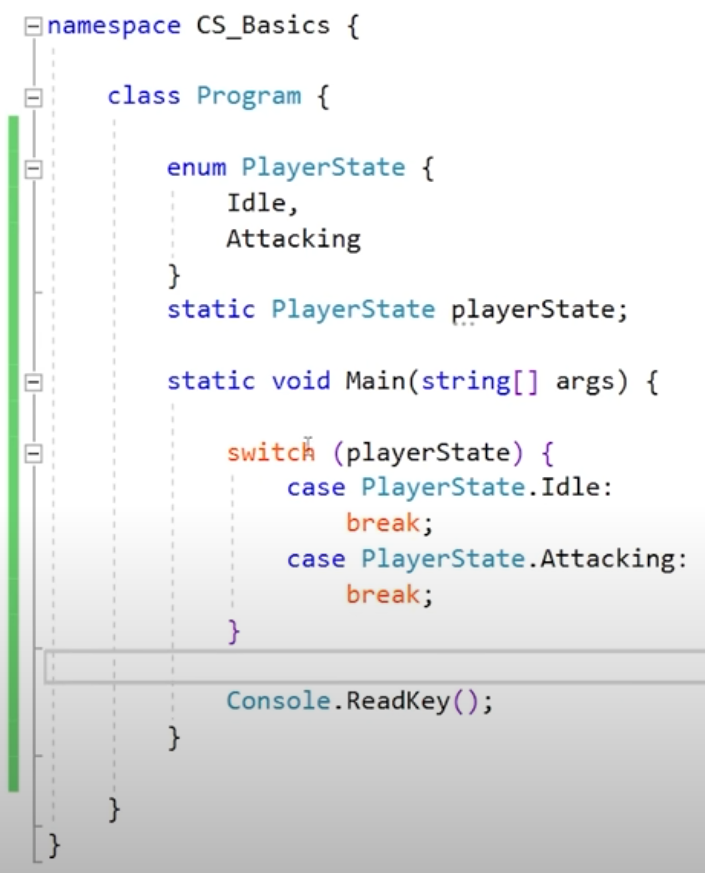
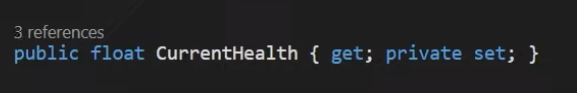
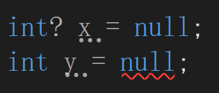
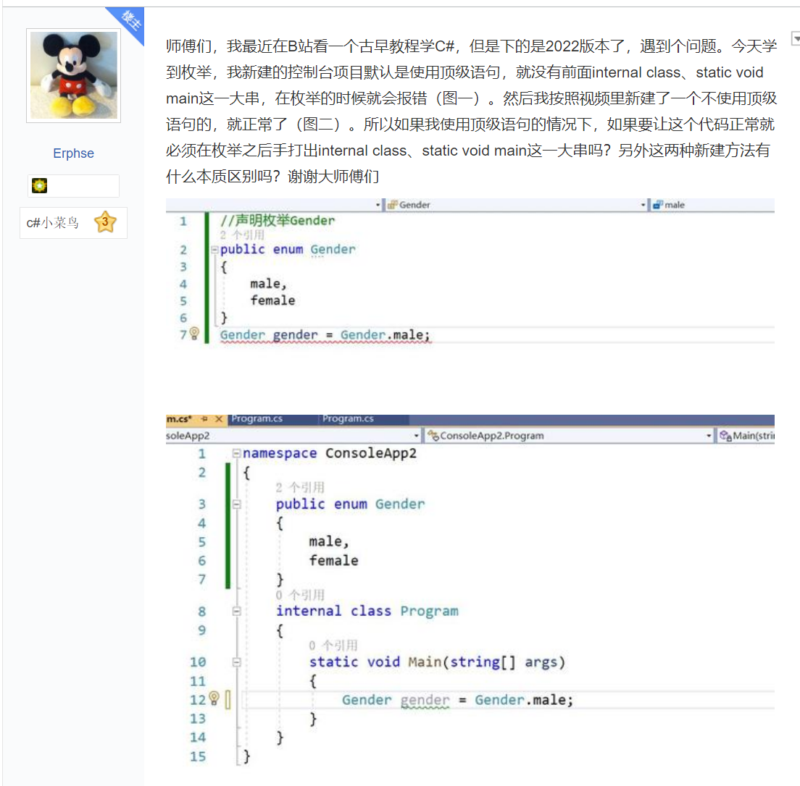
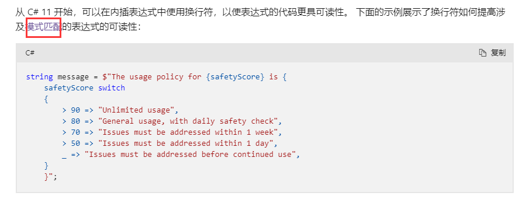

### 1 . enum和switch-case
For example: enums are extremely useful for doing a simple switch on a bunch of specific states  
  

### 2 . lambda表达式
BV1va41177YE  
（1）为什么要学lambda表达式：  
作用一：看懂源码和项目  
作用二：节省大量的语句，匿名函数的使用  
作用三：配合LinQ具有强大的过滤功能  
（2） 
```C#
var AddNumbers = (a,b) => a+b; //直接用var不行的，这样写会报错
public static int AddNumbers(int a, int b) => a + b;
//可以写成这个，这段代码，要放在class里main外面。
//最上面这个式子可以看成下面这段代码：
public int AddNumbers(int a, int b){
    return a+b;
}
```
（3）常见的三种匿名函数委托的一个写法：  
```C#
Func<int, int, bool> testForEquality = (x, y) => x == y;

Action<int,int,bool>testForEqualit = (x,y,true)=>Debug.log("");//单写x,y，log报错

Predicate<string> isUpper = s => s.Equals(s.ToUpper());
```
（4）callback回调函数  
```C#
myButton.onClick.AddListener(() => {
    print("I just pressed a button!");
});
```
(5)作用三：配合LinQ具有强大的过滤功能   
where是LinQ的一个方法  
```C++
List<int> ll = new List<int> { 4, 2, 9, 4, 3, 6 };

foreach (var number in ll) {
    if (number > 3) {
        Console.WriteLine(number);
    }
}
//下面的方法等同于上面的方法
var lls = ll.Where(n => n > 3);
foreach (var num in lls)
{
    Console.WriteLine(num);
}
```
（6）其他例子
```C#
int[] numbers = { 5, 4, 1, 3, 9, 8, 6, 7, 2, 0 };
int howManyOddNums = numbers.Count(n => n % 2 == 1);

List<int> oddNumbers = numbers.Where(n => n % 2 == 1).ToList();

Console.WriteLine("have odds: " + howManyOddNums + "ge. " + "\n they are :");

foreach (var num in oddNumbers) {
    Console.WriteLine(num);
}
```

### 3 . ToList();
上文的“2 .”中也有tolist的用法   

在C#的编程中，数组和List集合是比较常用的两个集合类，有时候因为业务需要，需要将**数组集合转换为List集合**，此时就可以使用C#中的Linq的扩展方法ToList方法来实现，只需要简单的一条语句即可将数组对象转换为List集合对象。ToList方法所在的命名空间为System.Linq里面。

例如下面有个字符串类型string的数组集合strArr，需要将之转换为List<string>类型的字符串List集合，可使用下列语句：
```C#
string[] strArr = new string[3] { "1", "2", "3" };

List<string> strList = strArr.ToList();
```

### 4 . is运算符（C#参考）
（1）声明模式  
借助声明模式，还可声明新的局部变量。 当声明模式与表达式匹配时，将为该变量分配转换后的表达式结果。  
```C#
object greeting = "Hello, World!";
if (greeting is string message)
{
    Console.WriteLine(message.ToLower());  // output: hello, world!
}
```
(2)类型模式  
检查表达式的运行时类型是否与给定类型兼容  
```C#
int i = 27;
object iBoxed = i;
Console.WriteLine(iBoxed is int);  // output: True
Console.WriteLine(iBoxed is long);  // output: False
```

### 5 . switch 表达式 - 使用 switch 关键字的模式匹配表达式
Case guard  
```C#
public readonly struct Point {
    public Point(int x, int y) => (X, Y) = (x, y);

    public int X { get; }
    public int Y { get; }
}

static Point Transform(Point point) => point switch
{
    { X: 0, Y: 0 } => new Point(0, 0),
    { X: var x, Y: var y } when ((x == 6) && (y == 6)) => new Point(11, 11),
    { X: > 1, Y: > 2 } => new Point(10, 10),
    _ => new Point(5, 5),
};
```

### 6 . nameof表达式（C#）
（1）get set
The meaning of **Encapsulation**, is to make sure that "sensitive" data is hidden from users. To achieve this, you must:

declare fields/variables as private
provide public get and set methods, through properties, to access and update the value of a private field

Fields can be made read-only (if you only use the get method), or write-only (if you only use the set method)
```C#
class Person
{
  private string name; // field

  public string Name   // property
  {
    get { return name; }   // get method
    set { name = value; }  // set method
  }
}
```
还可以这么写代码：  
  


### 7 . 类型后面有问号表示可以为空值
  

### 8 . 顶级语句
  
回答：  
简单理解，那些顶级语句会被自动包到Main() 方法中， 你不可以在一个方法里定义一个class，所以你写的那个是不可以的, 也没有解决办法（当然可以把类定义写到别的文件里）
总之，在使用顶级语句的时候， 你就是在写Main方法中的语句， 就这样。  

### 9 . 字段（Field）属性（Property）
（1）字段是类型的成员,旧称“成员变量”  
（2）field和Property的区别：
Should I use public properties and private fields or public fields for data?   
（3）Auto-Implemented Properties    
When you declare a property as shown in the following example（指{get;set;}）, the compiler creates a private, anonymous backing field that can only be accessed through the property's get and set accessors.   
（4）属性可以看作是对字段的包装器，通常由 get 和 set 访问器组成。  

### 10 . 关于 C# 中的变量的初始化问题浅谈
https://www.runoob.com/w3cnote/csharp-init-variable.html  

大多数现代编译器把没有初始化标记为警告，但C#编译器把它当作错误来看待。
- 变量是类或结构中的字段，如果没有显式初始化，创建这些变量时，其值就默认是 0(类和结构在后面讨论),false或null，具体视类型而定。不过，好的编程实践是始终显式初始化字段。
- 方法的局部变量必须在代码中显式初始化，之后才能在语句中使用它们的值。

### 11 . switch后可以跟float且可以判断大小  
（1）搜c# $跳入
https://learn.microsoft.com/zh-cn/dotnet/csharp/language-reference/tokens/interpolated  
（2）点击这里
  
可以学到这种表示方法：  
```C#
float  a = 1.2f;
switch (a) {
    case >1.1f and <3.0f: 
        Console.WriteLine("fuck");
        break;
}
```

### 12 . string可以+char
```C#
string s = "fuckyoubitch";
char c = 'e';
char c2 = 's';
s = s + c + c2;
Console.WriteLine(s);
```