### 88 C#教程-一切的祖宗object类  
#### 1 . 问题的提出
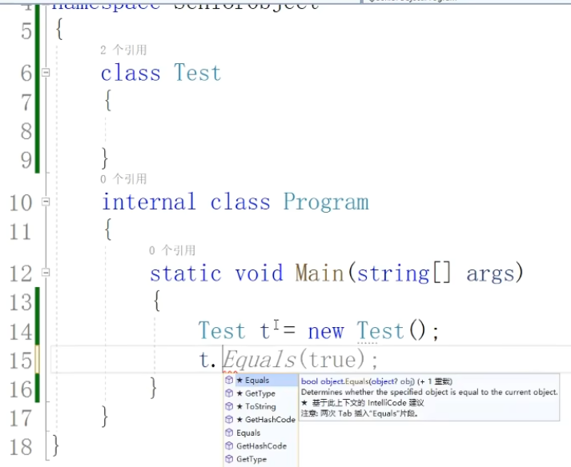  
为什么Test类里面没有任何东西却能调用这些方法呢？  
答：因为它继承自object类。  
#### 2 . stirng ToString();
(1) .   
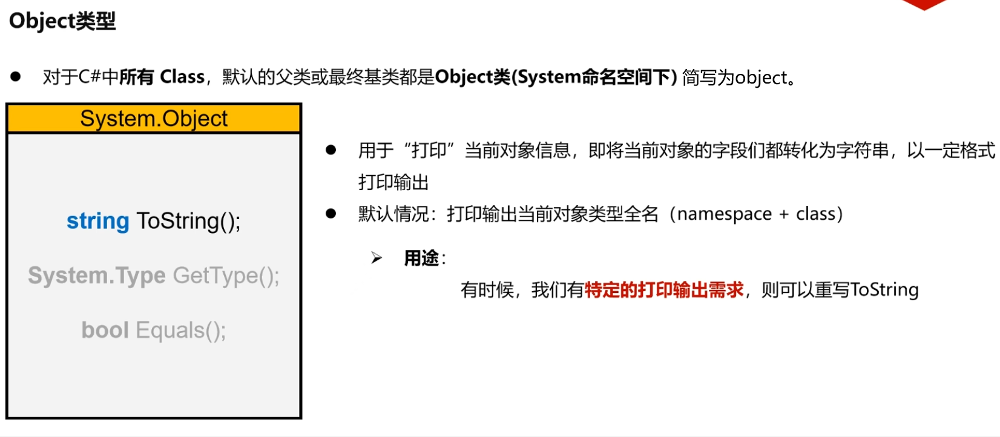  
Object类是微软程序员编写。  
int GetHashCode();由于它牵扯到了一些哈希算法，所以暂时不去了解它。  
(2) .  
```C#
namespace SeniorObject
{
    class Student {
        public int Id { get; set; }
        public string Name { get; set; }
        public int Age { get; set; }
    }

    internal class Program
    {
        static void Main(string[] args)
        {
            Student s = new Student();
            s.Name = "张三";
            s.Age = 18;
            s.Id = 1;

            Console.WriteLine(s.ToString());
        }
    }
}
```
输出：  
```
SeniorObject.Student
```

(3)  
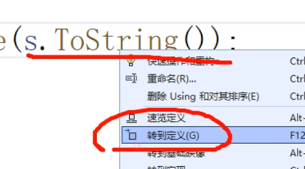  
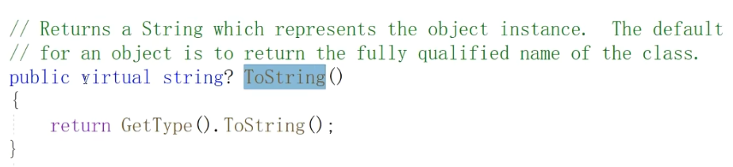  
转到定义可以看到是ToString()是virtual的方法。也就是说它可以被它的子类所重写。  
重写方法可以快捷键：ctrl + .  
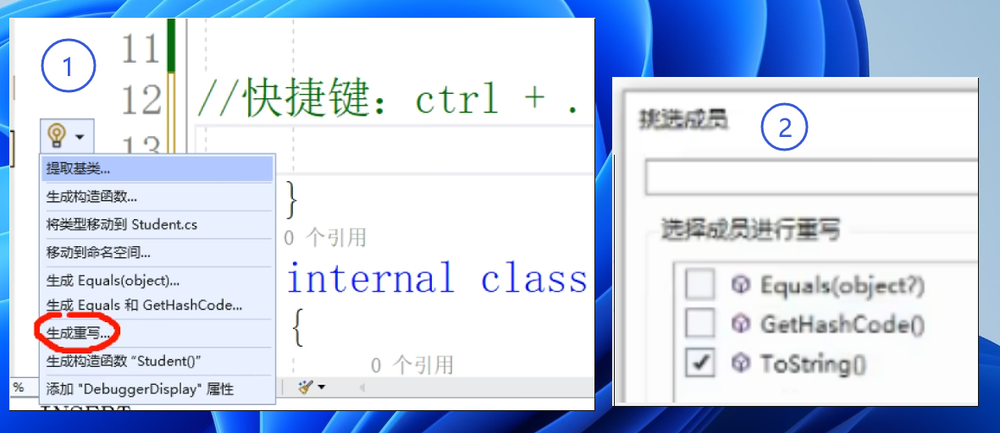  
```C#
using System.Diagnostics;
using System.Security.Cryptography.X509Certificates;

namespace SeniorObject
{
    class Student
    {
        public int Id { get; set; }
        public string Name { get; set; }
        public int Age { get; set; }

        //快捷键：ctrl+.（英文输入法）
        //用途：Debug的时候打印对象信息
        public override string? ToString()
        {
            string result = "";
            result += $"学号: { Id }\n";
            result += $"年龄：{Age}\n";
            result += $"名字：{Name}\n";
            return result;
        }
    }

    internal class Program
    {
        static void Main(string[] args)
        {
            Student s = new Student();
            s.Name = "张三";
            s.Age = 18;
            s.Id = 1;

            Console.WriteLine(s.ToString());
        }
    }
}
```
输出：  
```
学号: 1
年龄：18
名字：张三
```

#### 3 . System.Type  
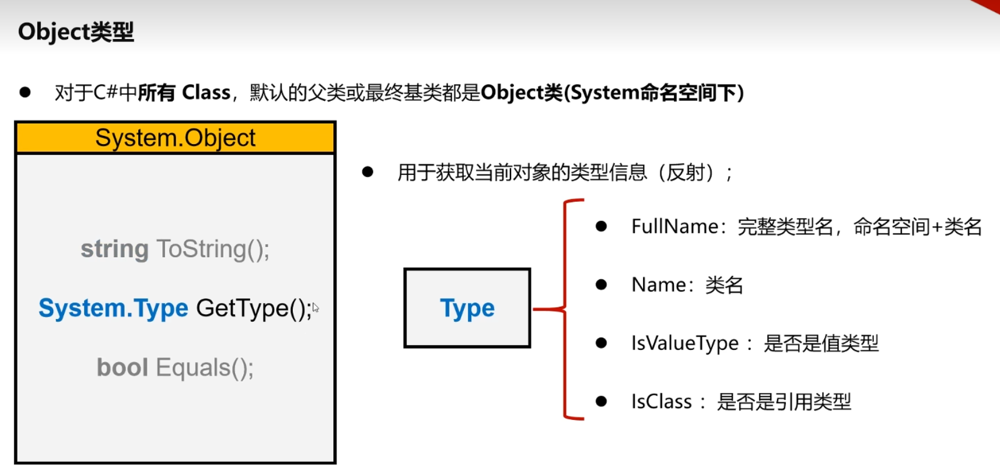  
System.Type是C#已经为我们编写好的class,通过GetType();这样的方法会为我们返回一个Type类型的对象。通常会用于反射的技术当中。  
```C#
using System.Diagnostics;
using System.Security.Cryptography.X509Certificates;

namespace SeniorObject
{
    class Student
    {
        //...节省空间不显示...
    }

    internal class Program
    {
        static void Main(string[] args)
        {
            Student s = new Student();

            //获取类型信息
            ShowType(s);

        }

        static public void ShowType(object o) { 
            Type type = o.GetType();
            Console.WriteLine(type.FullName);
            Console.WriteLine(type.Name);
            Console.WriteLine(type.IsValueType);//是不是值类型
            Console.WriteLine(type.IsClass);//是不是引用类型
        }
    }
}
```
输出：  
```
SeniorObject.Student
Student
False
True
```

#### 4 . bool Equals();
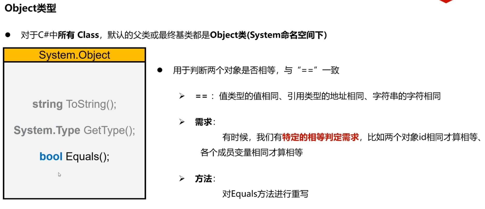  
```C#
static void Main(string[] args)
{
    Student s0 = new Student();
    s0.Name = "张三";
    s0.Age = 18;
    s0.Id = 1;

    Student s1 = new Student();
    s1.Name = "张三";
    s1.Age = 18;
    s1.Id = 1;

    Console.WriteLine(s0.Equals(s1));//output: False
    //因为引用类型比较地址
}
```
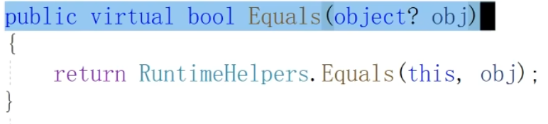  
转到定义Equals()是virtual方法，子类可重写。  

as运算符：将obj对象转化为Student对象。  
如果可以转化为Student类型的对象，则other没问题。  
如果不能转化为Student类型的对象，就会给到other一个null。  

```C#
using System.Diagnostics;
using System.Security.Cryptography.X509Certificates;

namespace SeniorObject
{
    class Student
    {
        public int Id { get; set; }
        public string Name { get; set; }
        public int Age { get; set; }

        public override bool Equals(object? obj)
        {
            //1 尝试将obj转化为Student类型对象
            Student other = obj as Student;
            //2 如果转化不成功，二者不具备可比性
            if(other == null)return false; 
            //3 如果转化成功，则二者参数一一对比
            return Id == other.Id && Name == other.Name && Age == other.Age;
        }
    }

    internal class Program
    {
        static void Main(string[] args)
        {
            Student s0 = new Student();
            s0.Name = "张三";
            s0.Age = 18;
            s0.Id = 1;

            Student s1 = new Student();
            s1.Name = "张三";
            s1.Age = 18;
            s1.Id = 1;

            Console.WriteLine(s0.Equals(s1));//output: True
        }
    }
}
```

#### 5 . 重要概念：装箱与拆箱
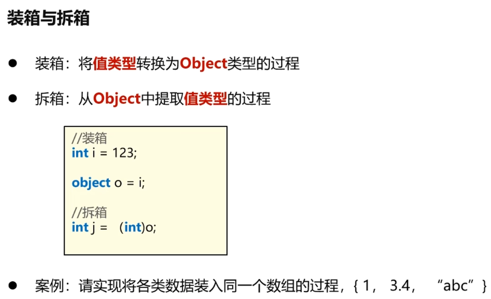  
```C#
using System.Diagnostics;
using System.Security.Cryptography.X509Certificates;

namespace SeniorObject
{

    class Cat { }

    internal class Program
    {
        static void Main(string[] args)
        {
            //--------------装箱和拆箱---------------
            int i = 123;
            object o = i; //装箱：将数字i装入对象o当中

            int j = (int)o; //拆箱：将数字123从对象o当中取出来，给到变量j

            //请编写一个数组，{1, 2.5, "abc", cat}
            //重点1 装箱&拆箱
            //重点2 object作为基类
            Cat cat = new Cat();
            //对于1跟2.5这种值类型，都进行了装箱操作
            //1装入obj0当中，放到了objs数组的0号位
            //2.5装入obj1当中，放到了objs数组的1号位
            //"abc"是引用类型，string类型的对象放到object类型的数组中是一个继承关系，因为string的祖宗是object
            //cat是引用类型，是Cat类的对象。
            //前两者是装箱过程，后两者是子类转换成父类对象的过程
            object[] objs = { 1, 2.5, "abc", cat };
        }
    }
}
```
#### 6 . 装箱与拆箱的内存原理

这一部分的时间轴（42:16~44:50）

假设这些代码都是发生在main方法中，先把main方法压进栈，  
首先int i = 123;  
i是放在栈内存上的一个变量。123这个数字也被放在了栈内存上。  
object的o是一个对象，它一定是一个引用类型。按照原来的引用类型我们需要new一个object，把它放到堆内存里面，但是由于现在它直接等于i，所以new这个步骤被省略了，它是自动执行的。相当于在堆内存中直接搞出一块内存，这一块内存是一块object类型的内存，把123这个数字放到了这块内存当中，被包装成一个object类型的对象。这块内存一定有它的地址，把地址给到栈内存object类型的对象。  
随后int j = (int)o;  
它会把堆内存所蕴含的123的数字拷贝一份，拷贝到j当中。  
所以这是一个双向拷贝的过程。在装箱的时候，是从栈内存把i里面的123拷贝到object所在的堆内存。在拆箱的时候把堆内存object里面的内容拷贝出来给到栈内存j。  

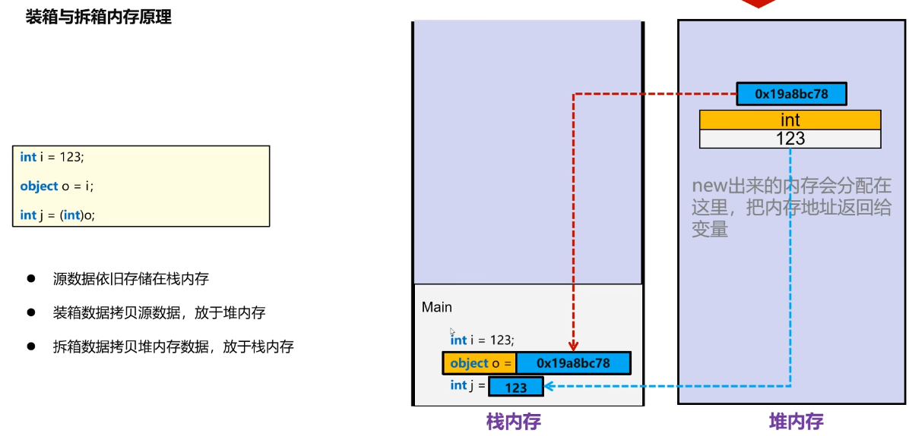  

- 图中源数据是i

#### 7 . 装箱与拆箱的作用
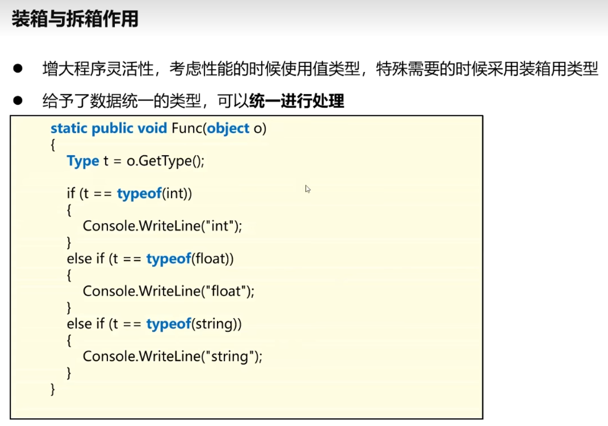  
虽然object类型和值类型之间可以随时转换，但是转换需要时间成本的。其次，我们把数字装入object当中，拆箱拆出来的时候都是很耗费时间的，所以需要特殊的需求的时候再考虑装箱。

如果不是编写大型框架，用不上装箱拆箱。

#### 8 . 鸦鸦整理本节课完整代码：
```C#
using System.Diagnostics;
using System.Security.Cryptography.X509Certificates;

namespace SeniorObject
{
    class Student
    {
        public int Id { get; set; }
        public string Name { get; set; }
        public int Age { get; set; }

        //快捷键：ctrl+.（英文输入法）
        //用途：Debug的时候打印对象信息
        public override string? ToString()
        {
            string result = "";
            result += $"学号:{Id}\n";
            result += $"年龄：{Age}\n";
            result += $"名字：{Name}\n";
            return result;
        }

        public string? Old_ToString()
        {

            return base.ToString();
        }

        public override bool Equals(object? obj)
        {
            //1 尝试将obj转化为Student类型对象
            Student other = obj as Student;
            //2 如果转化不成功，二者不具备可比性
            if (other == null) return false;
            //3 如果转化成功，则二者参数一一对比
            return Id == other.Id && Name == other.Name && Age == other.Age;
        }

        public bool Old_Equals(object? obj)
        {
            return base.Equals(obj);
        }
    }
    class Cat { }

    internal class Program
    {
        static void Main(string[] args)
        {
            Student s0 = new Student();
            s0.Name = "张三";
            s0.Age = 18;
            s0.Id = 1;

            Student s1 = new Student();
            s1.Name = "张三";
            s1.Age = 18;
            s1.Id = 1;

            Console.Write("原始ToString:");
            Console.WriteLine(s0.Old_ToString());
            Console.Write("override后的ToString:");
            Console.WriteLine(s0.ToString());
            ShowType(s0);
            Console.Write("\n原始equal:");
            Console.WriteLine(s0.Old_Equals(s1));//output: False。因为引用类型比较地址
            Console.Write("override后的equal:");
            Console.WriteLine(s0.Equals(s1));//output:True


            //--------------装箱和拆箱---------------
            int i = 123;
            object o = i; //装箱：将数字i装入对象o当中

            int j = (int)o; //拆箱：将数字123从对象o当中取出来，给到变量j

            //请编写一个数组，{1, 2.5, "abc", cat}
            //重点1 装箱&拆箱
            //重点2 object作为基类
            Cat cat = new Cat();
            //对于1跟2.5这种值类型，都进行了装箱操作
            //1装入obj0当中，放到了objs数组的0号位
            //2.5装入obj1当中，放到了objs数组的1号位
            //"abc"是引用类型，string类型的对象放到object类型的数组中是一个继承关系，因为string的祖宗是object
            //cat是引用类型，是Cat类的对象。
            //前两者是装箱过程，后两者是子类转换成父类对象的过程
            object[] objs = { 1, 2.5, "abc", cat };

        }

        static public void ShowType(object o)
        {
            Type type = o.GetType();
            Console.WriteLine($"type.FullName: {type.FullName}");
            Console.WriteLine($"type.Name: {type.Name}");
            Console.WriteLine($"是不是值类型：{type.IsValueType}");//是不是值类型
            Console.WriteLine($"是不是引用类型：{type.IsClass}");//是不是引用类型
        }

    }
}
```
输出：
```
原始ToString:SeniorObject.Student
override后的ToString:学号:1
年龄：18
名字：张三

type.FullName: SeniorObject.Student
type.Name: Student
是不是值类型：False
是不是引用类型：True

原始equal:False
override后的equal:True
```