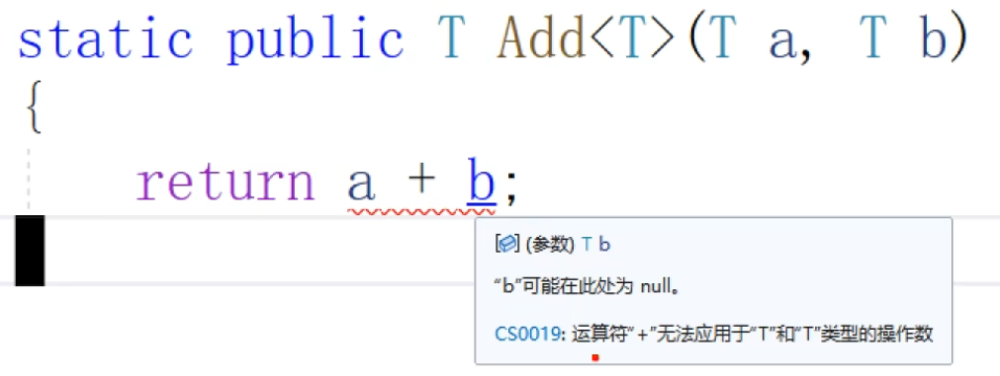

### 89 C#教程-泛型
#### 1 . 泛型修饰类
  
```C#
/*
 * 泛型
 * 概念：使用占位符T来代表某种类型，编译期间决定其具体类型
 *
 * 格式：class MyGeneric<T>
 * 使用：MyGeneric<int> mg = new MyGeneric<int>();
 * 
 * 原理：编译器在编译的时候，(先复制一份模板)，会使用特化的类型代替类型占位符（e.g.MyT变为int）,生成具体的class代码（e.g.把标题的<int>删了）
 */

namespace SeniorGeneric
{
    //T是类型占位符，表示还没决定具体是什么类型，先把这个位置占着
    //占位符不一定非得用T，也可以用其他字符或者名字
    class Store<MyT> {
        private MyT[] arr = new MyT[100];

        public void Put(MyT value, int index) {
            arr[index] = value;
        }
    }

    // new Store<int>();的原理【不删也可以通过编译】
    class Store
    {
        private int[] arr = new int[100];

        public void Put(int value, int index)
        {
            arr[index] = value;
        }
    }


    internal class Program
    {
        static void Main(string[] args)
        {
            //对泛型类Store的特化，特化为int类型的类
            Store<int> store = new Store<int>();
        }
    }
}
```
#### 2 . 泛型修饰方法
  
ref修饰符（reference修饰符）：代表传a和b进来传的是这两个东西的引用。如果在main方法调用Swap，传进m和n的话，a是m的别名，b是n的别名。实参会同时被修改。【课程方法篇章有讲】

通过“dynamic”将类型校验推迟到运行时。因为我们在编译期间会出现这样的语法错误（a和b不一定能相加）。dynamic不在编译期间验证。运行时如果不能相加再报错。

为什么那段代码有错：  
  
  
报错是因为有可能是两个cat相加。   
正确做法：   
```C#
namespace SeniorGeneric
{
    class Cat { }

    internal class Program
    {
        //1 交换两个变量的值
        public static void Swap<T>(ref T a, ref T b)
        {
            T tmp = a;
            a = b;
            b = tmp;
        }

        //2 求两个变量的加和
        public static T Add<T>(T a, T b)
        {
            dynamic da = a;
            dynamic db = b;
            return da + db;
        }


        static void Main(string[] args)
        {
            //泛型方法的使用
            int m = 10, n = 20;
            Swap<int>(ref m, ref n);

            Console.WriteLine(Add<int>(1, 2));
            Console.WriteLine(Add<float>(3.4f, 5.5f));

            //Cat c0 = new Cat();
            //Cat c1 = new Cat();
            //Add<Cat>(c0, c1);
        }
    }
}
```
输出：  
```
3
8.9
```
如果让
```C#
Cat c0 = new Cat();
Cat c1 = new Cat();
Add<Cat>(c0, c1);
```
这三行运行，会出现报错：  
  

【鸦鸦补充：】可以再Cat类里重载运算符。就能编译通过了。  
```C#
    class Cat { 
        public static Cat operator +(Cat c1, Cat c2)
        {
            return c1;
        }
    }
```
#### 3 . 泛型细节
  
##### （1）可多种占位符
```C#
    //因为只有一个类型占位符T，导致Arr0与Arr1必然是同一种数据类型
    class StoreDouble<T> {
        public T[] Arr0 { get; set; }
        public T[] Arr1 { get; set; }
    }
```
这样改就行
```C#

namespace SeniorGeneric
{
    //如果只有一个类型占位符T，导致Arr0与Arr1必然是同一种数据类型
    class StoreDouble<T,U> {
        public T[] Arr0 { get; set; }
        public U[] Arr1 { get; set; }
    }

    internal class Program
    {
        static void Main(string[] args)
        {
            //泛型可以同时提供多种数据类型的占位符
            //T = int ，U = float
            StoreDouble<int,float> storeDouble = new StoreDouble<int,float>();
        }
    }
}
```
##### （2）泛型类可以被继承。  
泛型的继承有两种方法：   
第一种方法将父类进行特化，然后继承。  
含义是将Person类拷贝一份，将int放入T。最后把标题<int>给干掉。  
（1）拷贝  
  
（2）替换  
  
（3）删除  
  

第二种方法：  
一时半会决定不了选择什么类型，继承一个泛型的Person。
假如按第二种方法Teacher<int>();了，与此同时它的父类Person也会被特化了。  
即：在特化子类的时候将父类特化。  

```C#
namespace SeniorGeneric
{
    class Person<T> {
        public T Id { get; set; }
    }

    //继承的方法1 将父类进行特化，然后继承
    class Teacher : Person<int> { }

    //方法2 无法在Class Student子类声明的时候决定父类的泛型类型
    class Teacher<B> : Person<B> { } //这里的B也可以写成T，无所谓的哈

    //结合【多种数据类型】和【继承】两个知识点
    //Teacher<int, float>
    //内涵：int Id; float Data;
    class Teacher<T,U>:Person<T> { 
        public U Data { get; set; }
    }

    internal class Program
    {
        static void Main(string[] args)
        {
            //泛型的继承
            Teacher teacher0 = new Teacher();
            Teacher<int> teacher1 = new Teacher<int>();
            Teacher<int, float>teacher2 = new Teacher<int, float>();

        }
    }
}
```

#### 4 . 鸦鸦整理所有的代码
```C#
/*
 * 泛型
 * 概念：使用占位符T来代表某种类型，编译期间决定其具体类型
 *
 * 格式：class MyGeneric<T>
 * 使用：MyGeneric<int> mg = new MyGeneric<int>();
 * 
 * 原理：编译器在编译的时候，(先复制一份模板)，会使用特化的类型代替类型占位符（e.g.MyT变为int）,生成具体的class代码（e.g.把标题的<int>删了）
 */

namespace SeniorGeneric
{
    //1 . 泛型修饰类
    //T是类型占位符，表示还没决定具体是什么类型，先把这个位置占着
    //占位符不一定非得用T，也可以用其他字符或者名字
    class Store<MyT>
    {
        private MyT[] arr = new MyT[100];

        public void Put(MyT value, int index)
        {
            arr[index] = value;
        }
    }

    // new Store<int>();原理【不删也可以通过编译】
    class Store
    {
        private int[] arr = new int[100];

        public void Put(int value, int index)
        {
            arr[index] = value;
        }
    }

    //展示为什么泛型中用到+运算符要用dynamic，删掉则Add<Cat>(c0, c1);无法通过
    class Cat
    {
        public static Cat operator +(Cat c1, Cat c2)
        {
            return c1;
        }
    }

    //3.(1)多种占位符
    //如果只有一个类型占位符T，导致Arr0与Arr1必然是同一种数据类型
    class StoreDouble<T, U>
    {
        public T[] Arr0 { get; set; }
        public U[] Arr1 { get; set; }
    }

    //3.(2)展示泛型继承的方法
    class Person<T>
    {
        public T Id { get; set; }
    }

    //继承的方法1 将父类进行特化，然后继承
    class Teacher : Person<int> { }

    //方法2 无法在Class Student子类声明的时候决定父类的泛型类型
    class Teacher<B> : Person<B> { } //这里的B也可以写成T，无所谓的哈

    //结合【多种数据类型】和【继承】两个知识点
    //Teacher<int, float>
    //内涵：int Id; float Data;
    class Teacher<T, U> : Person<T>
    {
        public U Data { get; set; }
    }


    internal class Program
    {
        //2.泛型修饰方法（1） 交换两个变量的值
        public static void Swap<T>(ref T a, ref T b)
        {
            T tmp = a;
            a = b;
            b = tmp;
        }

        //2.泛型修饰方法（2） 求两个变量的加和
        public static T Add<T>(T a, T b)
        {
            dynamic da = a;
            dynamic db = b;
            return da + db;
        }


        static void Main(string[] args)
        {
            //1 . 对泛型类Store的特化，特化为int类型的类
            Store<int> store = new Store<int>();

            //2 . 泛型方法的使用
            int m = 10, n = 20;
            Swap<int>(ref m, ref n);

            Console.WriteLine($"Add<int>(1, 2)：{Add<int>(1, 2)}");
            Console.WriteLine($"Add<float>(3.4f, 5.5f)：{Add<float>(3.4f, 5.5f)}");
            //Cat c0 = new Cat();
            //Cat c1 = new Cat();
            //Add<Cat>(c0, c1);

            //3.(1).泛型可以同时提供多种数据类型的占位符
            //T = int ，U = float
            StoreDouble<int, float> storeDouble = new StoreDouble<int, float>();

            //3.(2).泛型的继承
            Teacher teacher0 = new Teacher();
            Teacher<int> teacher1 = new Teacher<int>();
            Teacher<int, float> teacher2 = new Teacher<int, float>();

        }
    }
}
```