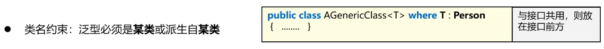

### 90 C#教程-泛型约束
  
  
如果我们要求一个class一定得实现某一个方法的时候，就要用interface。如果有一个class继承IHello这个接口，他就必须要去实现一个Hello(); 的方法。  

where T : IHello  
表示T这个类型必须继承自IHello接口  

【where T :】后面的这一块就称之为泛型的约束。 

#### 1 . 泛型约束定义
  
关键词 class  
class在C#中代表引用类型。 
  
#### 2 . 引用类型约束、值类型约束
```C#
/*
 * 泛型约束
 * 
 * 1 . class ：泛型T必须是引用类型
 * 2 . struct：泛型T必须是值类型
 */

namespace SeniorGenericConstraint
{
    //1 . class: 引用类型
    class MyGenericClassForClass<T> where T : class { }
    
    //2 . struct：值类型
    class MyGenericClassForValueType<T> where T : struct { }

    internal class Program
    {
        static void Main(string[] args)
        {
            // 1. class 表示引用类型约束，int是值类型，所以不行
            //MyGenericClassForClass<int> m0 = new MyGenericClassForClass<int>();
            MyGenericClassForClass<string> m0 = new MyGenericClassForClass<string>();

            // 2 . struct表示值类型约束，string是引用类型，所以不行
            //MyGenericClassForValueType<string> m1 = new MyGenericClassForValueType<string> { };
            MyGenericClassForValueType<float> m1 = new MyGenericClassForValueType<float> { };
        }
    }
}
```
#### 3 . new 约束
  
new约束：对T的要求：首先肯定是一个类   
（1）  
```C#
/*
 * 泛型约束
 * 
 * 1 . class ：泛型T必须是引用类型
 * 2 . struct：泛型T必须是值类型
 * 3 . new()：（1）泛型T必须是包含一个无参构造方法的类。（2）如果同时又其他约束，new()必须放在最后
 */

namespace SeniorGenericConstraint
{
    //3 . new()：当前的T，必须包含无参构造方法
    class TestForNew { }
    class MyGenericClassForNew<T> where T : new() { }

    internal class Program
    {
        static void Main(string[] args)
        {
            // 3 . new()表示T必须包含无参构造方法
            MyGenericClassForNew<TestForNew> m2 = new MyGenericClassForNew<TestForNew>();
        }
    }
}
```
上面那段代码由于没有给TestForNew编写构造方法，系统自动生成无参构造方法。  

---
（2）  
  
上面那段代码：当手动添加一个带有参数的构造方法，系统就不会为这个类自动生成无参构造方法。  

（3）这样加上无参构造函数就对了。如果同时又其他约束，new()必须放在最后    
```C#
/*
 * 泛型约束
 * 
 * 1 . class ：泛型T必须是引用类型
 * 2 . struct：泛型T必须是值类型
 * 3 . new()：（1）泛型T必须是包含一个无参构造方法的类。（2）如果同时又其他约束，new()必须放在最后
 */

namespace SeniorGenericConstraint
{
    //3 . new()：当前的T，必须包含无参构造方法
    class TestForNew {
        public TestForNew() { }
        public TestForNew(int a) { }
    }
    class MyGenericClassForNew<T> where T : class,new() { }

    internal class Program
    {
        static void Main(string[] args)
        {
            // 3 . new()表示T必须包含无参构造方法
            MyGenericClassForNew<TestForNew> m2 = new MyGenericClassForNew<TestForNew>();
        }
    }
}
```
#### 4 . 类名约束
  

以前在讲接口时讲过：接口是可以多继承的。但是类A只能有一个父类。  
e.g. A：B, Ia, Ib, Ic  
其中B是父类，Ia, Ib, Ic是接口。  
这个规则在【类名约束】的时候同样适用。   
```C#
/*
 * 泛型约束
 * 
 * 4 . 类名（Person）：泛型T要么就是Person类型，要么是Person的子类/孙子类
 */

namespace SeniorGenericConstraint
{
    //4 . 类名约束：T是本类或者其子类/孙子类
    class Person { }
    class Teacher:Person { }
    class EnglishTeacher:Teacher { }
    class MyGenericClassForClassName<T> where T:Person { }

    internal class Program
    {
        static void Main(string[] args)
        {
            // 4 . 类名约束：表示T必须是当前类或者其子类
            MyGenericClassForClassName<Person> m3_0 = new MyGenericClassForClassName<Person>();
            MyGenericClassForClassName<Teacher> m3_1 = new MyGenericClassForClassName<Teacher>();
            MyGenericClassForClassName<EnglishTeacher> m3_2 = new MyGenericClassForClassName<EnglishTeacher>();
        }
    }
}
```
#### 5 . 接口约束
  
它的意思是说：特化当前这个类的T必须能够实现IOne,ITwo,IThree这三个接口。  
可以和类名约束组合使用。  
```C#
/*
 * 泛型约束
 * 
 * 5 . 接口约束：泛型T必须实现一个或多个接口
 */

namespace SeniorGenericConstraint
{
    //5 . 接口约束：泛型T必须实现一个或多个接口 //可以和类名约束组合使用
    interface IFireable {
        void Fire();
    }
    interface IRunnable { 
        void Run();
    }
    class Machine { }

    class Tank : Machine, IFireable, IRunnable {
        public void Fire() { }
        public void Run() { }
    }

    class  MyGenericClassForInterface<T> where T: Machine, IFireable, IRunnable
    {
        
    }
    internal class Program
    {
        static void Main(string[] args)
        {
            //5 . 接口约束：泛型T必须实现一个或多个接口
            MyGenericClassForInterface<Tank> m4 = new MyGenericClassForInterface<Tank>();
        }
    }
}
```
#### 6 . 多泛型约束
  
```C#
/*
 * 泛型约束
 * 
 * 6 . 多占位符约束：使用where关键字对多个占位符进行各自约束
 */

namespace SeniorGenericConstraint
{
    class TestForNew
    {
        public TestForNew() { }
        public TestForNew(int a) { }
    }
    ///////////////////////////////////
    interface IFireable
    {
        void Fire();
    }
    interface IRunnable
    {
        void Run();
    }
    class Machine { }

    class Tank : Machine, IFireable, IRunnable
    {
        public void Fire() { }
        public void Run() { }
    }

    //6. 多类型占位符约束
    //T：是一个引用类型，且是有无参构造函数的类。
    //B：必须实现IFireable, IRunnable两个接口
    class MyGenericClassForMulti<T, B> where T : class, new() where B : IFireable, IRunnable { }

    internal class Program
    {
        static void Main(string[] args)
        {
            //6. 多类型占位符约束
            MyGenericClassForMulti<TestForNew,  Tank> m5 = new MyGenericClassForMulti<TestForNew, Tank> { };
        }
    }
}
```
#### 7 . 泛型约束与继承
  

#### 8 . 这节课所有的代码放一块
```C#
/*
 * 泛型约束
 * 
 * 1 . class ：泛型T必须是引用类型
 * 2 . struct：泛型T必须是值类型
 * 3 . new()：（1）泛型T必须是包含一个无参构造方法的类。（2）如果同时又其他约束，new()必须放在最后
 * 4 . 类名（Person）：泛型T要么就是Person类型，要么是Person的子类/孙子类
 * 5 . 接口约束：泛型T必须实现一个或多个接口
 * 6 . 多占位符约束：使用where关键字对多个占位符进行各自约束
 */

namespace SeniorGenericConstraint
{
    //1 . class: 引用类型
    class MyGenericClassForClass<T> where T : class { }

    //2 . struct：值类型
    class MyGenericClassForValueType<T> where T : struct { }

    //3 . new()：当前的T，必须包含无参构造方法
    class TestForNew
    {
        public TestForNew() { }
        public TestForNew(int a) { }
    }
    class MyGenericClassForNew<T> where T : class, new() { }

    //4 . 类名约束：T是本类或者其子类/孙子类
    class Person { }
    class Teacher : Person { }
    class EnglishTeacher : Teacher { }
    class MyGenericClassForClassName<T> where T : Person { }

    //5 . 接口约束：泛型T必须实现一个或多个接口
    interface IFireable
    {
        void Fire();
    }
    interface IRunnable
    {
        void Run();
    }
    class Machine { }

    class Tank : Machine, IFireable, IRunnable
    {
        public void Fire() { }
        public void Run() { }
    }

    class MyGenericClassForInterface<T> where T : Machine, IFireable, IRunnable
    {

    }

    //6. 多类型占位符约束
    //T：是一个引用类型，且是有无参构造函数的类。
    //B：必须实现IFireable, IRunnable两个接口
    class MyGenericClassForMulti<T, B> where T : class, new() where B : IFireable, IRunnable { }

    internal class Program
    {
        static void Main(string[] args)
        {
            // 1. class 表示引用类型约束，int是值类型，所以不行
            //MyGenericClassForClass<int> m0 = new MyGenericClassForClass<int>();
            MyGenericClassForClass<string> m0 = new MyGenericClassForClass<string>();

            // 2 . struct表示值类型约束，string是引用类型，所以不行
            //MyGenericClassForValueType<string> m1 = new MyGenericClassForValueType<string> { };
            MyGenericClassForValueType<float> m1 = new MyGenericClassForValueType<float> { };

            // 3 . new()表示T必须包含无参构造方法
            MyGenericClassForNew<TestForNew> m2 = new MyGenericClassForNew<TestForNew>();

            // 4 . 类名约束：表示T必须是当前类或者其子类
            MyGenericClassForClassName<Person> m3_0 = new MyGenericClassForClassName<Person>();
            MyGenericClassForClassName<Teacher> m3_1 = new MyGenericClassForClassName<Teacher>();
            MyGenericClassForClassName<EnglishTeacher> m3_2 = new MyGenericClassForClassName<EnglishTeacher>();

            //5 . 接口约束：泛型T必须实现一个或多个接口
            MyGenericClassForInterface<Tank> m4 = new MyGenericClassForInterface<Tank>();

            //6. 多类型占位符约束
            MyGenericClassForMulti<TestForNew, Tank> m5 = new MyGenericClassForMulti<TestForNew, Tank> { };
        }
    }
}
```