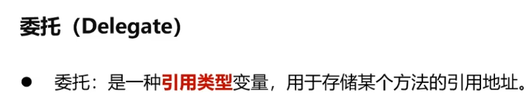
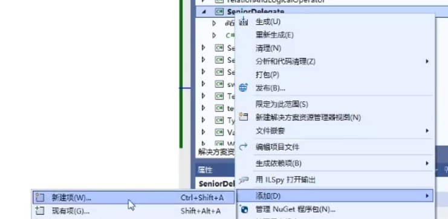

### 91 C#教程-委托
#### 1 . 委托的概念
（1）  
  
  
咱么学过哪些引用类型了？  
数组，string，各种class new出来的对象是引用类型。  

以前的引用类型都放在栈内存上。里面存着堆内存里一块内存的地址。 
以前的方法是放在“内存代码区”，当我们双击一个程序，会将它的IL代码加载到内存代码区，一行一行向下执行。里面的方法有它存储的内存地址，把这个地址存储在栈上的某个变量里面。这个变量就叫做delegate。  

  
（2）同一种签名的方法关注【返回值】【参数列表】  
public delegate int Calculate(int x, int y);//声明类型  

e.g. class Dog{////} //是自己定义的数据类型  

public delegate int Calculate(int x, int y);  
也是定义了数据类型。这个数据类型的名字叫Calculate。这个数据类型代表了一种方法。  

咱们的方法有各式各样的样子。  
有的方法长：  
void test(){}  
有的方法长这样：  
int add(x,y){}  
bool check(){}  

首先每个方法的名字各不相同。但区别两个方法的时候，不光是看名字的。因为有的方法之间名字相同，但是他们的参数列表不同，这个叫重载。

我们继续看这三个方法。首先返回值是特色之一，参数列表也是特色之一。它们的名字我们反而不关心了。

void tt(){}  
void test(){} 可以看成同一种签名的方法/一种类型的方法。
什么叫方法的签名：关注【返回值】【参数列表】，即方法的输入和输出。

public delegate int Calculate(int x, int y); //把这一类的方法称之为Calculate方法。
这句话的意思是：我要声明一种委托/代理，这种委托叫Calculate  

（3）既然说Calculate是一种类型，而且是一种引用类型，它必然需要去引用某些东西。或者说它要存储一些东西的地址。  

Calculate cal0 = new Calculate(Add);  
Calculate是一种数据类型，我们可以用它来声明变量，因为这种变量是一种引用类型，我们可以把它new出来。new出来一个Calculate类型的委托对象。这个委托对象代表的是Add方法。所以Add方法的地址存到cal0这样一个变量里面。  
  

所以cal0存Add方法内存地址，  
cal1存Multiply方法内存地址。  
我们也可以这样讲：  
cal0代表Add方法，cal1代表Multiply方法。  

（4）两种调用方法：  
  

（5）代码  
委托的声明最好放在class内部  
```C#
/*
 * 委托
 * 概念：是一种引用类型变量，存储某一个方法的内存地址
 */
namespace SeniorDelegate
{
    internal class Program
    {
        //声明了一种数据类型（委托类型）叫做Calculate，代表的是某一类方法
        //输入：int，int   输出：int
        public delegate int Calculate(int x, int y);
        static void Main(string[] args)
        {
            //直接调用Add方法
            //int sum = Add(1, 2);

            Calculate cal0 = new Calculate(Add);
            Calculate cal1 = new Calculate(Multiply);

            int sum = cal0.Invoke(1, 2);
            Console.WriteLine(sum);

            int mul = cal1(1, 2);
            Console.WriteLine(mul);
            Console.Read();//暂停画面
        }

        static public int Add(int x, int y) {
            return x + y;
        }

        static public int Multiply(int x, int y)
        {
            return x * y;
        }
    }
}
```
#### 2 . 委托存在的意义
  
什么叫“某个任务执行完毕后”:  
首先我们一天从上到下开始做事情：早上起来煮个面吃。  
煮的过程当中我不能傻站着等你煮熟，我就先去听歌/看电视。   
此时这个面煮好了，煮好了之后它发过来一条信息告诉我面煮好了。   
OK，我就开始吃面了。   

就这个例子来看，“吃面”这件事是回调方法。   
面正在煮，我正在干其他事情，面煮熟了，一个通知过来，直接调用了我吃面这个方法。  
看你是不是一个任务完成了（面煮好了）之后调用的方法。  
  
另一个例子：  
我们打游戏的时候经常上来就遇到这样的画面，上面有很多的按钮，你点击按钮的话，会有不同的事情发生。  
这个【点击】就是一个事件。  
点击一个按钮之后会发生一个事情。  

所以按钮的class可以设计成这个样子。--》 class StartButton  
  
怎么解决这个问题  

让OnClick = null;因为咱们的委托都是一些委托对象，其实是一些引用类型，这里还没有让OnClick代表哪个方法所以让它先等于null。  
这个Click()方法用来模拟外界去点击这个按钮，Button类所受到的消息。一旦外界点击之后，它直接回调用OnClick();这样的委托。让这个委托去执行它所包含的函数方法。要先判断if(OnClick()!= null)才会执行。  
```C#
namespace SeniorDelegate
{
    //1 场面上所有的按钮，都是当前Button类实例化的对象
    //2 每个按钮被点击后，发生的事情都不一样
    //3 每个按钮被点击后，发生的事情由外界决定
    class Button {
        //1 声明一个点击消息响应的方法类型签名（委托）
        public delegate void OnClickDelegate();

        //2 声明一个OnClickDelegate类型的委托
        public OnClickDelegate onClick = null;

        //3 在点击事件触发后，调用onClick委托储存的方法
        public void Click() {
            Console.WriteLine("按钮被点击了");
            if(onClick!=null) onClick();
        }
    }
    internal class Program
    {
        public delegate int Calculate(int x, int y);
        static void Main(string[] args)
        {
            Button gameStartButton = new Button();
            gameStartButton.onClick = new Button.OnClickDelegate(OnGameStart);
            gameStartButton.Click();

            Button friendButton = new Button();
            friendButton.onClick = new Button.OnClickDelegate(OnFriend);
            friendButton.Click();
        }

        //点击了游戏开始按钮而触发的方法
        static public void OnGameStart() {
            Console.WriteLine("游戏开始");
        }

        static public void OnFriend() {
            Console.WriteLine("分享给好友");
        } 
    }
}
```
输出：
```
按钮被点击了
游戏开始
按钮被点击了
分享给好友
```

OnGameStart()；OnFriend()；现在都是Program这个类的静态方法。  
所以我们实验另一种：  
  
右键==》添加==》新建项  
添加一个叫GameController.cs的类用以控制游戏各式各样流程的类。  
【GameController.cs代码见下】
```C#
using System;
using System.Collections.Generic;
using System.Linq;
using System.Text;
using System.Threading.Tasks;

namespace SeniorDelegate
{
    internal class GameController
    {
        public string name = "";
        //public GameController() { }
        //游戏开始方法
        public void OnGameStart() {
            Console.WriteLine(name+"游戏开始");
        }
        //分享给朋友
        public void OnFriend()
        {
            Console.WriteLine(name+"分享给好友");
        }
    }
}
```
【Program.cs代码见下】
```C#
namespace SeniorDelegate
{
    //1 场面上所有的按钮，都是当前Button类实例化的对象
    //2 每个按钮被点击后，发生的事情都不一样
    //3 每个按钮被点击后，发生的事情由外界决定
    class Button
    {
        //1 声明一个点击消息响应的方法类型签名（委托）
        public delegate void OnClickDelegate();

        //2 声明一个OnClickDelegate类型的委托
        public OnClickDelegate onClick = null;

        //3 在点击事件触发后，调用onClick委托储存的方法
        public void Click()
        {
            Console.WriteLine("按钮被点击了");
            if (onClick != null) onClick();
        }
    }
    internal class Program
    {
        //声明了一种数据类型（委托类型）叫做Calculate，代表的是某一类方法
        //输入：int，int   输出：int
        public delegate int Calculate(int x, int y);
        static void Main(string[] args)
        {
            GameController gameController0 = new GameController();
            gameController0.name = "gc0";
            GameController gameController1 = new GameController();
            gameController1.name = "gc1";


            Button gameStartButton = new Button();
            gameStartButton.onClick = new Button.OnClickDelegate(gameController0.OnGameStart);//括号里也可填写OnGameStart（底下的静态方法）
            gameStartButton.Click();

            Button friendButton = new Button();
            friendButton.onClick = new Button.OnClickDelegate(gameController1.OnFriend);//括号里也可填写OnFriend（底下的静态方法）
            friendButton.Click();

        }
        //点击了游戏开始按钮而触发的方法
        static public void OnGameStart()
        {
            Console.WriteLine("游戏开始");
        }

        static public void OnFriend()
        {
            Console.WriteLine("分享给好友");
        }
    }
}
```
总结：我们的onClick这样一个委托又能指向一些静态方法，
又能指向某一个对象里面的某一个方法，能够区别开用的是哪一个对象的哪一个方法。  
#### 3 . 委托存在的意义二次思索
  
此时如果把StartButton这样一个class ctrl+c然后跑到另一个工程里面ctrl+v。  
另外那个工程是从零开始开发，它没有Game和GameMap类。这个StartButton依赖于Game依赖于GameMap，耦合度太深了。  
  
代码实操，可以把Button类直接给其他项目用：  
新建一个项目叫TestButton  
  
  
```C#
namespace TestButton
{
    internal class Program
    {
        static void Main(string[] args)
        {
            MyButton.Button button = new MyButton.Button();
            button.onClick = new MyButton.Button.OnClickDelegate(OnNoodleOK);
            button.Click();
        }

        static public void OnNoodleOK() {
            Console.WriteLine("Noodle ok");
        }
    }
}
```