### 92 C#教程-委托的多播
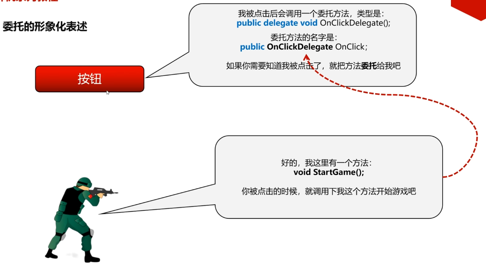  
#### 1. 委托的多播
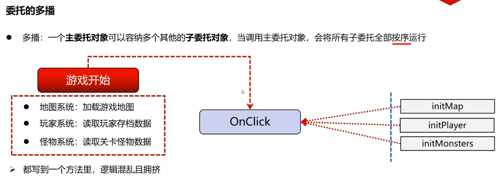  
如果在一个游戏当中，你点击【游戏开始按钮】之后，
其实游戏里面很多class都会被运行起来。比如说地图对象会去加载地图数据，玩家系统需要去读取玩家存档数据，怪物系统读取当前关卡怪物数据。
这些系统，都会随着你一点游戏开始，而进行一系列的初始化。
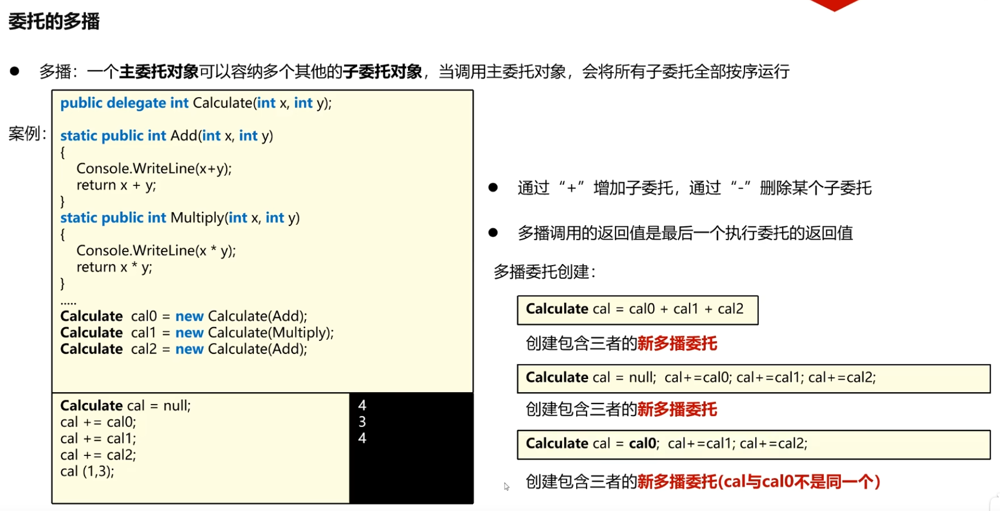  
```C#
Calculate cal = null;
cal += calO;
cal += cal1;
cal += cal2;
cal (1,3);
```
cla0和cal2都是独立的对象，只不过它们背后所指向的方法，都是指向Add方法。  

含义：我这个cal委托，先把0号委托放到我这个委托里，又将1号委托又放进来，又将2号又放进来了。  
这个+=的符号其实就是添加的意思。它的意思是说像cal这样的委托里面去添加一些子委托。0号1号2号都属于cal的子委托。  

很多同学，会在这个点上感受到疑惑：  
cal这个主委托一开始=null，null就是说当前这个委托对象还没有被分配内存，是一个空的。对一个空对象来说，你竟然直接+=，直接用它来做一些操作了，这样能行么？  
C#有个良好的机制：虽然cal一开始是空，但是在它+=另外一个委托的时候，将0号放入cal当中的这一刻，C#会主动地帮咱们生成一个cal的对象。这个对象在cal+=cal0;这一步生成的。生成之后才将0号放进去。  

(1)  
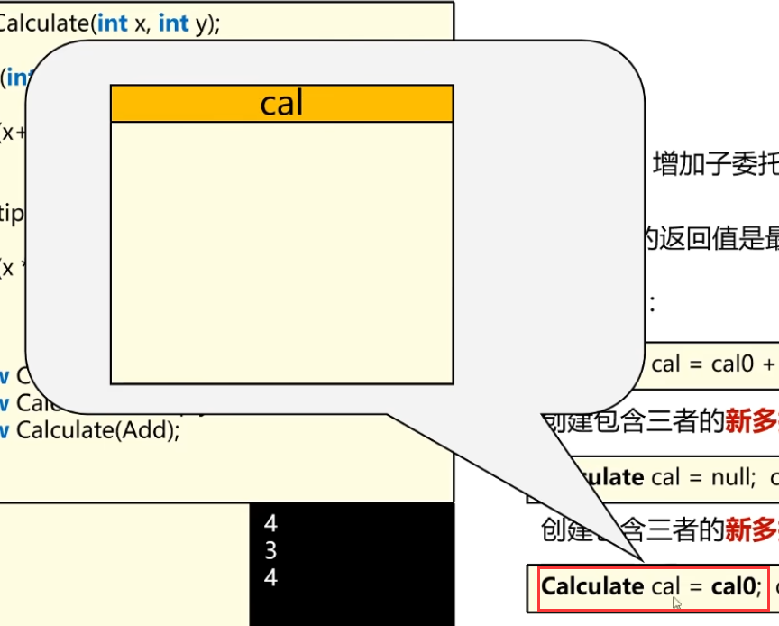   
(2)   
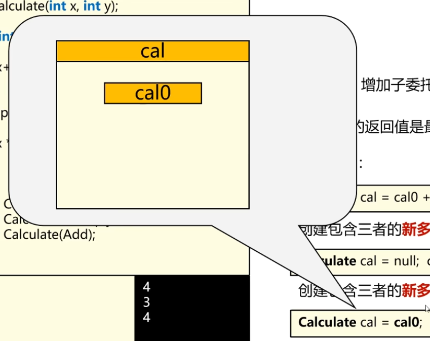  
(3)  
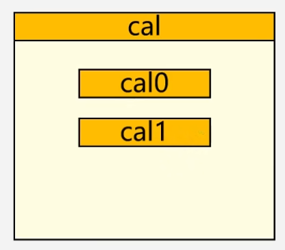  
（4）  
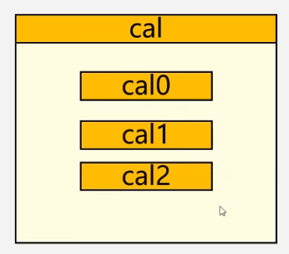  
`Calculate cal = cal0; cal+ =cal1; cal+ =cal2;`  
`Calculate cal = cal0;`==》cal和cal0二者都是引用类型，引用类型的赋值相当于把0号对象的地址给到cal对象。cal和0号是不是应该指向同一个对象？  
C#中委托对象的创建或者对象的相等操作，并不会让二者简单地指向同一个委托对象，并不是简单地将cal0所蕴含的地址给到cal，而是创建新的多播委托。也就是说在`Calculate cal = cal0;`这句话的时候，是这样执行的：
首先创建一个新的委托对象叫cal，和cal0并不是同一个对象。在栈上的对象不会指向同一个堆内存空间。与普通的引用类型互相之间的赋值不太一样。  

这块讲的不太确定，时间轴15:58  
鸦鸦想法：是不是栈里的是对象。之前一节课栈里保存的是内存代码区的地址。和这里有矛盾么？
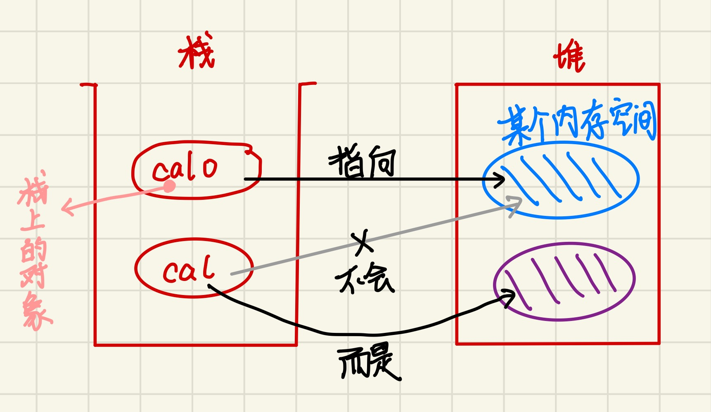  

【代码】：
```C#
/*
 * 委托的多播
 * 含义：存在一个主委托，内涵多个子委托，运行主委托的时候，会将蕴含的子委托依次执行
 */
using System.Linq.Expressions;

namespace SeniorMultiDelegate
{
    internal class Program
    {

        public delegate int CalculateDelegate(int x, int y);

        public static int Add(int x, int y)
        {
            Console.WriteLine("Add:"+(x + y));
            return x + y;
        }

        public static int Multiplay(int x, int y)
        {
            Console.WriteLine("Mul:"+(x * y));
            return x * y;
        }
        static void Main(string[] args)
        {
            CalculateDelegate cal0 = new CalculateDelegate(Add);
            CalculateDelegate cal1 = new CalculateDelegate(Multiplay);
            CalculateDelegate cal2 = new CalculateDelegate(Add);
            List<CalculateDelegate> calList = new List<CalculateDelegate>(3);//想把calOne，calTwo，calThree加进List的里然后访问变量名字

            //1 通过表达式创建多播委托
            CalculateDelegate calOne = cal0 + cal1;
            calOne -= cal0;
            Console.WriteLine(GetVariableName(() => calOne) + " ：");//这个打印的是calOne
            Console.WriteLine(PrintVariableName(calOne) + " ：");//这个打印的是value
            calOne(1,3);

            //2 通过初始化为null，经过加法运算创建多播委托
            CalculateDelegate calTwo = null;
            calTwo += cal0;//cal的创还能就是在这句代码，创建全新的委托对象
            calTwo += cal1;
            Console.WriteLine(PrintVariableName(calTwo) + " ：");
            calTwo(1, 3);

            //3 通过等于某个子委托来创建多播委托
            CalculateDelegate calThree = cal0;//并不是将cal0的内存地址给到了cal，而是创建全新的cal对象
            calThree += cal1;
            Console.WriteLine(PrintVariableName(calThree) + " ：");
            int result = calThree(1, 3);
            Console.WriteLine(result);

            //cal0(Add)  cal1(Multiply)
            //cal = cal0 + cal1;

            //特殊案例
            Console.WriteLine("特殊案例");
            CalculateDelegate mcal0 = cal0 + cal1; //Add + Multiply
            CalculateDelegate mcal1 = cal0 + cal2; //Add + Add
            CalculateDelegate mcal = mcal0 + mcal1;
            mcal(1, 3);
        }

        //在c#中打印变量的名称：https://cloud.tencent.com/developer/information/%E5%9C%A8c%23%E4%B8%AD%E6%89%93%E5%8D%B0%E5%8F%98%E9%87%8F%E7%9A%84%E5%90%8D%E7%A7%B0-album
        static string GetVariableName<T>(Expression<Func<T>> expression)
        {
            var body = expression.Body as MemberExpression;
            return body?.Member.Name;
        }
        static string PrintVariableName<T>(T value)
        {
            var variableName = GetVariableName(() => value);
            return variableName;
        }

    }
}
```

#### 2 . 委托的多播整理
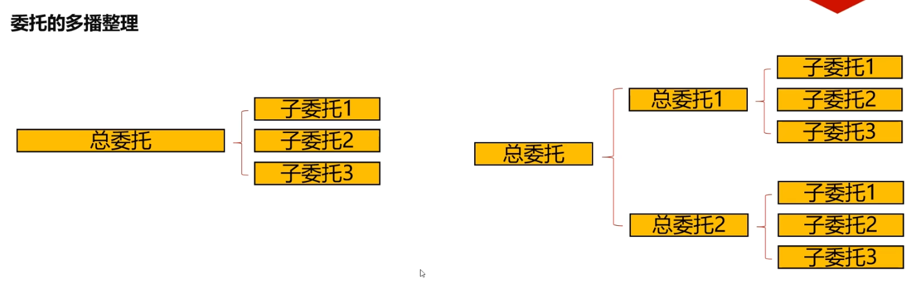  

#### 3 . 委托的多播逐个调用
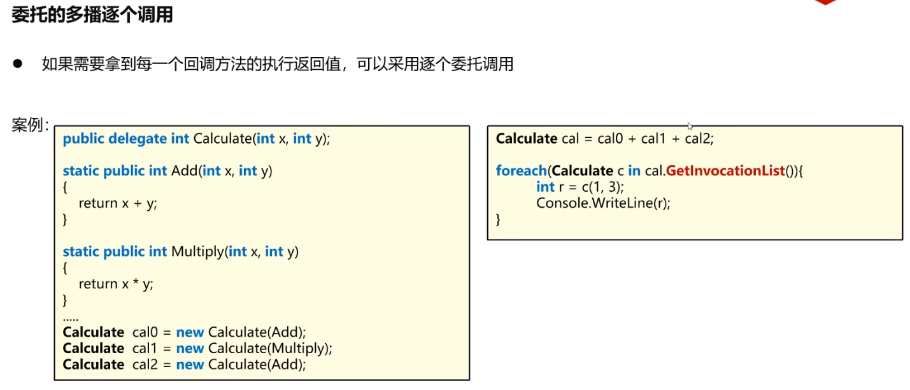  
```C#
/*
 * 委托的多播
 * 含义：存在一个主委托，内涵多个子委托，运行主委托的时候，会将蕴含的子委托依次执行
 */
using System.Linq.Expressions;

namespace SeniorMultiDelegate
{
    internal class Program
    {
        public delegate int CalculateDelegate(int x, int y);

        public static int Add(int x, int y)
        {
            Console.WriteLine("Add:"+(x + y));
            return x + y;
        }

        public static int Multiplay(int x, int y)
        {
            Console.WriteLine("Mul:"+(x * y));
            return x * y;
        }
        static void Main(string[] args)
        {
            CalculateDelegate cal0 = new CalculateDelegate(Add);
            CalculateDelegate cal1 = new CalculateDelegate(Multiplay);
            CalculateDelegate cal2 = new CalculateDelegate(Add);
            List<CalculateDelegate> calList = new List<CalculateDelegate>(3);//想把calOne，calTwo，calThree加进List的里然后访问变量名字

            //1 通过表达式创建多播委托
            CalculateDelegate calOne = cal0 + cal1 + cal2;
            Console.WriteLine(GetVariableName(() => calOne) + " ：");//这个打印的是calOne
            Console.WriteLine(PrintVariableName(calOne) + " ：");//这个打印的是value

            // 1.1 获取总委托里面的子委托构成的数组
            Delegate[] delegates = calOne.GetInvocationList();

            // 1.2 循环遍历每一个子委托并且执行，打印返回值
            for (int i = 0; i < delegates.Length; i++) {
                CalculateDelegate c = (CalculateDelegate)delegates[i];
                int r = c(1, 3);
                Console.WriteLine(r);
            }

            foreach (CalculateDelegate c in delegates){ //也可以foreach (CalculateDelegate c in calOne.GetInvocationList()) { 
                int r = c(1, 3);
                Console.WriteLine(r);
            }

            Console.WriteLine("fuuuuuuuuuuuuuuuuuuuuuuuuuck");

            //2 通过初始化为null，经过加法运算创建多播委托
            CalculateDelegate calTwo = null;
            calTwo += cal0;//cal的创还能就是在这句代码，创建全新的委托对象
            calTwo += cal1;
            calOne -= cal0;
            Console.WriteLine(PrintVariableName(calTwo) + " ：");
            calTwo(1, 3);

            //3 通过等于某个子委托来创建多播委托
            CalculateDelegate calThree = cal0;//并不是将cal0的内存地址给到了cal，而是创建全新的cal对象
            calThree += cal1;
            Console.WriteLine(PrintVariableName(calThree) + " ：");
            int result = calThree(1, 3);
            Console.WriteLine(result);

            //cal0(Add)  cal1(Multiply)
            //cal = cal0 + cal1;

            //特殊案例
            Console.WriteLine("特殊案例");
            CalculateDelegate mcal0 = cal0 + cal1; //Add + Multiply
            CalculateDelegate mcal1 = cal0 + cal2; //Add + Add
            CalculateDelegate mcal = mcal0 + mcal1;
            mcal(1, 3);
        }

        //在c#中打印变量的名称：https://cloud.tencent.com/developer/information/%E5%9C%A8c%23%E4%B8%AD%E6%89%93%E5%8D%B0%E5%8F%98%E9%87%8F%E7%9A%84%E5%90%8D%E7%A7%B0-album
        static string GetVariableName<T>(Expression<Func<T>> expression)
        {
            var body = expression.Body as MemberExpression;
            return body?.Member.Name;
        }
        static string PrintVariableName<T>(T value)
        {
            var variableName = GetVariableName(() => value);
            return variableName;
        }

    }
}
```
右键`GetInvocationList()`转到定义：  
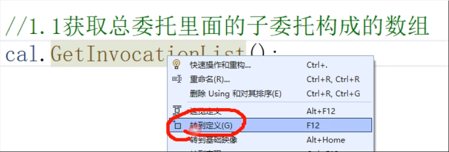  
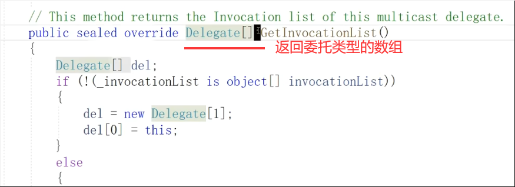  

Delegate代表的是一种通用的委托类型。咱们想执行的委托其实是CalculateDelegate类型的，CalculateDelegate类型是Delegate类型的子类型。  
所以首先要强制类型转换：  
CalculateDelegate c = (CalculateDelegate)delegates[i];
#### 4 . 总结
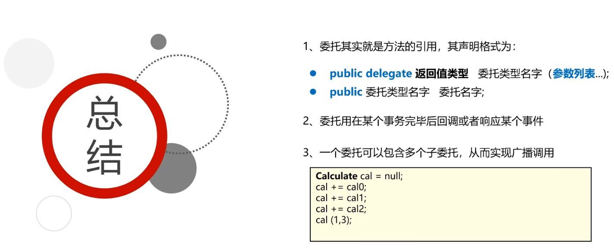  
对总结2.的补充：  
委托用在某个事物执行完毕后的回调，它可以当一个回调方法。或者响应某个事件。比如一个计时器，计时5秒钟，计时器的class里有一个委托，计时器完事之后可以调用这个委托，这个委托会调用它背后那个方法去执行一些事情。