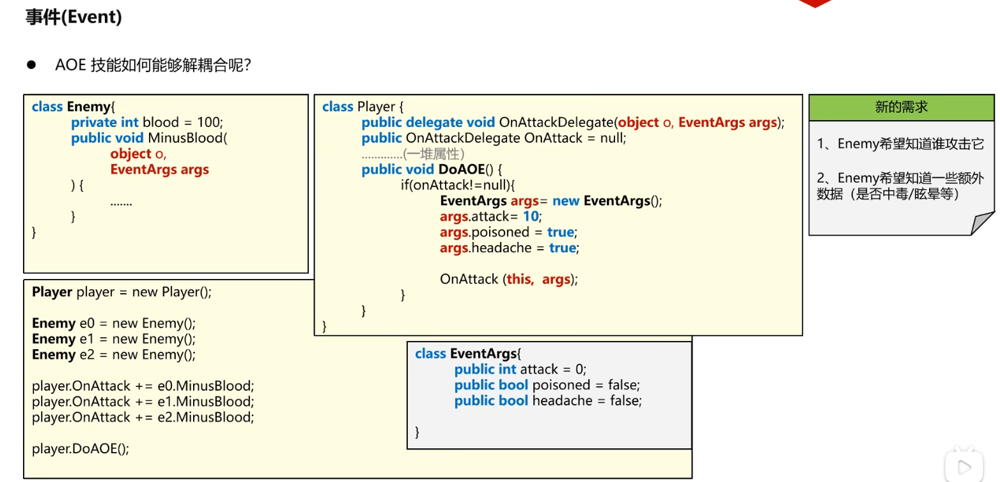

### 93 C#教程-事件Event概念
#### 1 . 解耦合
  
另一个例子：
  
  
Player耦合于Enemy:
如果A改变了，B被迫需要被改变，那B就耦合于A了。

在做项目的时候，咱们可能会使用很多第三方的库，其他的组织比如微软帮我们写好的一堆代码，咱们只需要去new他们里面的对象，调用其中的一些方法就可以实现一些功能。假设咱们使用了A.dll（1.0版本）这个库，去调用了它里面的test()方法，过了半年之后，这个组织又更新了新的版本：A.dll（2.1版本）。你把这个库又下载下来用了，结果你发现它报错了，他说test方法不存在。原因2.1版本把test改成testMe的名字了。但是你的代码还用着test。所以咱们的代码依赖于A.dll的库。

解耦合符合开闭原则：你可以继承Player去写一个功能更加复杂的Player。但你别修改我这个Player。  
对继承与扩展是开放的。  
对修改是关闭的。  
  
【代码】：  
```C#
/*
 * 事件Event
 */
namespace SeniorEvent
{
    //需求：
    // 1 Player Class：能够释放AOE范围攻击技能，让波及到的敌人统一减血10滴
    // 2 Enemy Class：能够对外提供减血的方法函数，供外界调用

    class Enemy {
        private int blood = 100;
        public void MinusBlood(int attack) {
            Console.WriteLine("好疼！我是Enemy！");
            blood -= attack;
        }
    }

    class NPC {
        private int blood;
        public void BeAttacked(int attack) {
            Console.WriteLine("好疼！我是NPC！");
            blood -= attack;
        }
    }

    //使用委托解耦合
    //在player当中声明委托类型，将需要调用的减血方法在Player类外设置给内部的委托
    class Player {
        //声明委托，用来规定减血的方法应该符合怎样的方法签名
        public delegate void OnAttackDelegate(int attack);
        public OnAttackDelegate OnAttack = null;

        public void DoAOE() {
            if (OnAttack != null) { 
                OnAttack(10);
            }
        }
    }

    internal class Program
    {
        static void Main(string[] args)
        {
            Player player = new Player();

            Enemy e0 = new Enemy();
            Enemy e1 = new Enemy();
            Enemy e2 = new Enemy();

            NPC npc = new NPC();

            player.OnAttack += e0.MinusBlood;
            player.OnAttack += e1.MinusBlood;
            player.OnAttack += e2.MinusBlood;
            player.OnAttack += npc.BeAttacked;

            player.DoAOE();
        }
    }
}
```
这里写`OnAttack`其实是一种很好的命名规则。之前讲委托的多播，提到一种东西叫回调方法。

比如说Player这个类发生一些事情，他要去甩一个技能，他需要向外界做出一些通知，所以说这一类的回调方法，我们都叫On什么什么玩意。OnAttack可以翻译成“在我攻击的时候”所调用的方法集合。
OnClick翻译过来就是“在我被点击的时候”所调用的方法集合。

这样的命名规则能让他人清楚知道这是一个委托。  

#### 2 . 被动技能
假如Enemy有被动技能：背刺功能，你攻击Enemy，你也会掉血。  
鸦鸦的版本：（在Enemy里加委托）  
```C#
/*
 * 事件Event
 */
namespace SeniorEvent
{
    //需求：
    // 1 Player Class：能够释放AOE范围攻击技能，让波及到的敌人统一减血10滴
    // 2 Enemy Class：能够对外提供减血的方法函数，供外界调用

    class Enemy {
        private int blood = 100;

        public delegate void BeiCi(int attack);
        public BeiCi OnCi = null;

        public void MinusBlood(int attack) {
            Console.WriteLine("好疼！我是Enemy！");
            blood -= attack;
            if (OnCi != null) {
                OnCi(5);
            }
        }
    }

    class NPC {
        private int blood;
        public void BeAttacked(int attack) {
            Console.WriteLine("好疼！我是NPC！");
            blood -= attack;
        }
    }

    //使用委托解耦合
    //在player当中声明委托类型，将需要调用的减血方法在Player类外设置给内部的委托
    class Player {
        //声明委托，用来规定减血的方法应该符合怎样的方法签名
        public delegate void OnAttackDelegate(int attack);
        public OnAttackDelegate OnAttack = null;

        private int blood;
        public void BeAttacked(int attack)
        {
            Console.WriteLine("好疼！我是主角！");
            blood -= attack;
        }
        public void DoAOE() {
            if (OnAttack != null) { 
                OnAttack(10);
            }
        }
    }

    internal class Program
    {
        static void Main(string[] args)
        {
            Player player = new Player();

            Enemy e0 = new Enemy();
            e0.OnCi += player.BeAttacked;
            Enemy e1 = new Enemy();
            Enemy e2 = new Enemy();

            NPC npc = new NPC();

            player.OnAttack += e0.MinusBlood;
            player.OnAttack += e1.MinusBlood;
            player.OnAttack += e2.MinusBlood;
            player.OnAttack += npc.BeAttacked;

            player.DoAOE();
        }
    }
}
```
输出：  
```
好疼！我是Enemy！
好疼！我是主角！
好疼！我是Enemy！
好疼！我是Enemy！
好疼！我是NPC！
```
想在Enemy类里知道是谁在个攻击我。
老师的处理方法的代码：  
参数列表添加object o。  
Enemy类在这段代码依赖于Player类。
```C#
/*
 * 事件Event
 */
namespace SeniorEvent
{
    //需求：
    // 1 Player Class：能够释放AOE范围攻击技能，让波及到的敌人统一减血10滴
    // 2 Enemy Class：能够对外提供减血的方法函数，供外界调用

    class Enemy
    {
        private int blood = 100;
        public void MinusBlood(object o, int attack)
        {
            Console.WriteLine("好疼！我是Enemy！");
            blood -= attack;

            //我发动被动技能 背刺
            Player p = (Player)o;//因为父类是object类，所以能显式转换
            p.Shout();//Eenemy类在这里依赖于Player类
        }
    }

    class NPC
    {
        private int blood;
        public void BeAttacked(object o, int attack)
        {
            Console.WriteLine("好疼！我是NPC！");
            blood -= attack;
        }
    }

    //使用委托解耦合
    //在player当中声明委托类型，将需要调用的减血方法在Player类外设置给内部的委托
    class Player
    {
        //声明委托，用来规定减血的方法应该符合怎样的方法签名
        public delegate void OnAttackDelegate(object o, int attack);
        public OnAttackDelegate OnAttack = null;

        public void DoAOE()
        {
            if (OnAttack != null)
            {
                OnAttack(this,10);
            }
        }

        public void Shout() {
            Console.WriteLine("玩家很痛");
        }
    }

    internal class Program
    {
        static void Main(string[] args)
        {
            Player player = new Player();

            Enemy e0 = new Enemy();
            Enemy e1 = new Enemy();
            Enemy e2 = new Enemy();

            NPC npc = new NPC();

            player.OnAttack += e0.MinusBlood;
            player.OnAttack += e1.MinusBlood;
            player.OnAttack += e2.MinusBlood;
            player.OnAttack += npc.BeAttacked;

            player.DoAOE();
        }
    }
}
```
#### 3 . Enemy中毒效果
咱们玩家在做AOE群攻的时候，可能不光让Enemy去掉血，有可能还会带毒==》我释放了一个AOE技能，你被我打到了，首先扣10滴血，然后敌人跑了，敌人每隔1s种被毒伤掉1滴血。  
代码方案：委托参数列表添加bool poisoned  
```C#
/*
 * 事件Event
 */
namespace SeniorEvent
{
    //需求：
    // 1 Player Class：能够释放AOE范围攻击技能，让波及到的敌人统一减血10滴
    // 2 Enemy Class：能够对外提供减血的方法函数，供外界调用

    class Enemy
    {
        private int blood = 100;
        public void MinusBlood(object o, int attack,bool poisoned)
        {
            Console.WriteLine("好疼！我是Enemy！");
            blood -= attack;

            //我发动被动技能 背刺
            Player p = (Player)o;//因为父类是object类，所以能显式转换
            p.Shout();//Eenemy类在这里依赖于Player类

            //判断是否中毒
            if (poisoned) {
                Console.WriteLine("Enemy中毒了");
            }
        }
    }

    class NPC
    {
        private int blood;
        public void BeAttacked(object o, int attack, bool poisoned)
        {
            Console.WriteLine("好疼！我是NPC！");
            blood -= attack;
        }
    }

    //使用委托解耦合
    //在player当中声明委托类型，将需要调用的减血方法在Player类外设置给内部的委托
    class Player
    {
        //声明委托，用来规定减血的方法应该符合怎样的方法签名
        public delegate void OnAttackDelegate(object o, int attack, bool poisoned);
        public OnAttackDelegate OnAttack = null;

        public void DoAOE()
        {
            if (OnAttack != null)
            {
                OnAttack(this,10,true);
            }
        }

        public void Shout() {
            Console.WriteLine("玩家很痛");
        }
    }

    internal class Program
    {
        static void Main(string[] args)
        {
            Player player = new Player();

            Enemy e0 = new Enemy();
            Enemy e1 = new Enemy();
            Enemy e2 = new Enemy();

            NPC npc = new NPC();

            player.OnAttack += e0.MinusBlood;
            player.OnAttack += e1.MinusBlood;
            player.OnAttack += e2.MinusBlood;
            player.OnAttack += npc.BeAttacked;

            player.DoAOE();
        }
    }
}
```

#### 4 . 事件参数们来加眩晕效果
你再想想，如果策划又要去增加一个功能了，是否进入眩晕状态，那么委托的参数列表又要增加参数，对应匹配的方法也要去增加参数。有没有什么办法能解决这个问题？  
解决方案：  
建立EventArgs的类，将所有参数装进去，传给delegate参数列表。  
```C#
/*
 * 事件Event
 */
namespace SeniorEvent
{
    //需求：
    // 1 Player Class：能够释放AOE范围攻击技能，让波及到的敌人统一减血10滴
    // 2 Enemy Class：能够对外提供减血的方法函数，供外界调用

    //问题：委托方法，需要携带的参数太多了，参数还会经常变动
    //方法：将所有参数都包含到一个class里面

    class EventArgs //事件参数们
    {
        public int attack = 0;
        public bool poisoned = false;
        public bool headache = false;
    }

    class Enemy
    {
        private int blood = 100;
        public void MinusBlood(object o, EventArgs args)
        {
            Console.WriteLine("好疼！我是Enemy！");
            blood -= args.attack;

            //我发动被动技能 背刺
            Player p = (Player)o;//因为父类是object类，所以能显式转换
            p.Shout();//Eenemy类在这里依赖于Player类

            //判断是否中毒
            if (args.poisoned) {
                Console.WriteLine("Enemy中毒了");
            }

            //判断是否眩晕
            if (args.headache) {
                Console.WriteLine("Enemy眩晕了");
            }
        }
    }

    class NPC
    {
        private int blood;
        public void BeAttacked(object o, EventArgs args)
        {
            Console.WriteLine("好疼！我是NPC！");
            blood -= args.attack;
        }
    }

    //使用委托解耦合
    //在player当中声明委托类型，将需要调用的减血方法在Player类外设置给内部的委托
    class Player
    {
        //声明委托，用来规定减血的方法应该符合怎样的方法签名
        public delegate void OnAttackDelegate(object o, EventArgs args);
        public OnAttackDelegate OnAttack = null;

        public void DoAOE()
        {
            EventArgs args = new EventArgs();
            args.attack = 10;
            args.poisoned = true;
            args.headache = true;

            if (OnAttack != null)
            {
                OnAttack(this, args);
            }
        }

        public void Shout() {
            Console.WriteLine("玩家很痛");
        }
    }

    internal class Program
    {
        static void Main(string[] args)
        {
            Player player = new Player();

            Enemy e0 = new Enemy();
            Enemy e1 = new Enemy();
            Enemy e2 = new Enemy();

            NPC npc = new NPC();

            player.OnAttack += e0.MinusBlood;
            player.OnAttack += e1.MinusBlood;
            player.OnAttack += e2.MinusBlood;
            player.OnAttack += npc.BeAttacked;

            player.DoAOE();
        }
    }
}
```
  
#### 5 . C#内部已经封装好的事件专用委托
刚才讲的事情在干一件什么事：
使用委托多播的功能模拟了一套事件的系统。
C#内部已经封装好的事件专用委托。

在众多的软件系统当中，肯定要用到很多的控件，比如有一个button的按钮，还有一个列表的东西，还有check box用来打钩，在UI界面上有很多这种东西。
很多软件系统里，也有许多这种发消息，发事件，别人来响应的这种操作，换句话说，这种委托定义的类型其实是蛮通用的。

按钮，列表，check box里都有点击被触发的事件，所有的这些事件都需要一个发出者（object o），也需要事件的参数包（EventArgs e）就完全足够了。

   
微软这里的EventArgs类怎么用留到下一节课。  
  

#### 6 . 进一步思考：event关键字
  
在main方法里直接调用player的OnAttack方法你觉得这样是对的么？  
其实是不对的，OnAttack事件里面装了很多别的方法，比如敌人减血的方法，你在类外界直接调用这个委托相当于说player还没有释放技能，你直接让敌人掉血了。  
否则来了个新的程序员直接调OnAttack。玩家跑着跑着周围的敌人都掉血了。
  
上一条说了`不应该被类外界调用，只能由某个操作触发`。但是：
player.OnAttack = onAttack ;

直接调用onAttack（小写的o），相当于间接调用了Player里的OnAttack。在main方法里onAttack.Invoke执行，传进去一些参数，相当于调用了player内部的OnAttack。因为onAttack和player.OnAttack对象指向同一片堆内存的。  

  
没有event关键字，外界可以随意调用OnAttack。但是现在有了event关键字之后，它不仅仅是一个委托了，它是一个事件委托。

【打代码】  
对EventHandler右键转到定义：  
  
所以Enemy的参数列表要填写：(object? sender, EventArgs e)  

对EventArgs右键转到定义：  
好像和版本无关，好像和从哪里右键转到定义有关。  
老师的VS版本：  
  
我的VS版本：  
  

新建项目SeniorEventTest：  
```C#
/*
 * 事件（Event关键字）
 * 1 event修饰的委托，只能够被类内调用执行，类外不可调用执行的
 * 2 event修饰的委托，类外不可直接赋值，只能通过+、-增减其中蕴含的方法
 */
namespace SeniorEventTest
{
    class Player {
        //定义Player内部会被触发的事件委托
        public event EventHandler OnAttackHasEvent = null;
        public EventHandler OnAttackHasNot = null;

        public void DoAOE() {
            if (OnAttackHasEvent != null) {
                OnAttackHasEvent(this, EventArgs.Empty);
            }
        }
    }

    class Enemy {
        public void AttackMe(object? sender, EventArgs e) {
            Console.WriteLine("我被攻击了");
        }
    }

    internal class Program
    {
        static void Main(string[] args)
        {
            Player player = new Player();
            Enemy e = new Enemy();

            player.OnAttackHasEvent += e.AttackMe;
            player.DoAOE();
            //EventHandler h = player.OnAttackHasEvent;//这样是不行的

            
            player.OnAttackHasNot += e.AttackMe;
            //如果有event修饰符的委托，是不能在类外直接调用执行的
            player.OnAttackHasNot(new object(), EventArgs.Empty);
            EventHandler handler = new EventHandler(e.AttackMe);
            player.OnAttackHasNot = handler;
            handler(new object(), EventArgs.Empty);
        }
    }
}
```
#### 7 . 总结：事件中的角色  
  
